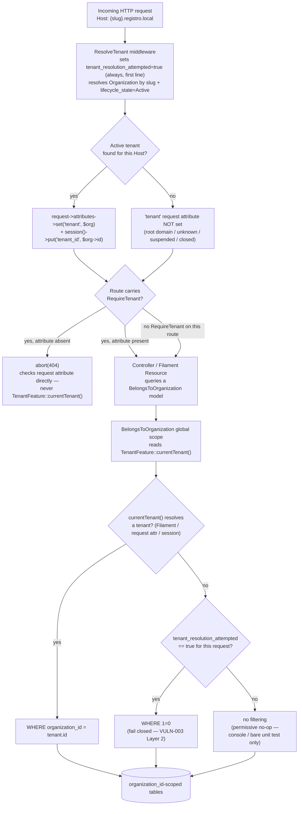

# Multi-Tenant Data Isolation

**Scope:** How `organization_id` scoping is actually enforced end-to-end — the mechanism a
security reviewer or new contributor needs to understand before adding any new tenant-scoped
query.
**Last verified:** 2026-07-23 against `develop` (`app/Http/Middleware/ResolveTenant.php`,
`app/Http/Middleware/RequireTenant.php`, `app/Traits/BelongsToOrganization.php`,
`app/Support/TenantFeature.php`).
**Related:** [VULN-003: Root-Domain Tenant Isolation Bypass](../security/vulnerabilities/VULN-003-root-domain-tenant-bypass.md)
(the full 6-layer incident this mechanism was hardened by),
[Livewire Admin/Platform Tenant Isolation](../security/patterns/livewire-tenant-isolation.md)
(VULN-003 Layer 6), [Panel Isolation](panel-isolation.md), `.claude/rules/middleware.md`

---

## Overview

Registro resolves tenants from the request **subdomain** (`{slug}.registro.local`), not from
Filament's native multi-tenancy — `AdminPanelProvider` never calls `->tenant()`. Every
tenant-owned Eloquent model uses the `BelongsToOrganization` trait, which does two things: it
auto-assigns `organization_id` on create, and it applies a global scope that filters every query
by the resolved tenant. The scope's default answer to "no tenant resolved" has changed over time —
this document describes the **current, fail-closed** behavior, put in place across VULN-003's
6 layers (2026-07-03 to 2026-07-05), not the original permissive design.

## Diagram

Two things this diagram makes explicit that are easy to miss reading the code piecemeal:

- **`RequireTenant` is opt-in per route**, not automatic. A route that only carries
  `ResolveTenant` still reaches the query layer with no tenant attribute — it just falls through
  to the global scope's own fail-closed check instead of 404ing at the middleware layer.
- **The fail-closed branch (`WHERE 1=0`) only fires when `tenant_resolution_attempted` is true**
  — i.e. only for requests that actually passed through `ResolveTenant`. A bare Eloquent call with
  no HTTP request in flight (queued job, Unit test `setUp()`) keeps the original permissive
  no-op, because there is no "wrong" tenant to fail closed against in that context.

## Isolation Layer → Enforcement Mechanism → Code Location

| Isolation Layer | Enforcement Mechanism | Code Location |
|---|---|---|
| Request-level tenant resolution | `ResolveTenant` middleware — subdomain → `Organization::where('slug', ...)->where('lifecycle_state', Active)`, cached 5 min; sets the `tenant_resolution_attempted` marker unconditionally as the first line of `handle()` | `app/Http/Middleware/ResolveTenant.php:34` (marker), `:62-66` (tenant lookup), `:113` (attribute set) |
| Route-level fail-closed gate | `RequireTenant` middleware — `abort_unless($request->attributes->get('tenant') !== null, 404)`; deliberately checks the request attribute directly, never `TenantFeature::currentTenant()` (which has a session-fallback branch — see gotcha below) | `app/Http/Middleware/RequireTenant.php:34` |
| Query-level scoping (primary) | `BelongsToOrganization` global scope — filters every tenant-owned model's query by `organization_id = tenant.id` whenever `TenantFeature::currentTenant()` resolves a tenant | `app/Traits/BelongsToOrganization.php:35-49` |
| Query-level scoping (fail-closed backstop) | Same global scope — when no tenant resolves AND `tenant_resolution_attempted` is `true` for the current request, returns zero rows (`whereRaw('1 = 0')`) instead of no-op filtering | `app/Traits/BelongsToOrganization.php:51-58` |
| Auto-assignment on create | `creating` model hook — fills `organization_id` from `TenantFeature::currentTenant()` when not explicitly set | `app/Traits/BelongsToOrganization.php:25-32` |
| Livewire AJAX replay (admin panel interaction) | `Livewire::addPersistentMiddleware([ResolveTenant::class, RequireTenant::class])` — re-runs both middleware against a checksum-verified cloned request on every `POST /livewire/update` call, since Livewire's shared update route normally bypasses panel middleware entirely | `app/Providers/AppServiceProvider.php:174-179` (`registerLivewireTenantIsolation()`), full mechanism write-up in [livewire-tenant-isolation.md](../security/patterns/livewire-tenant-isolation.md) |
| Console/CLI context | Global scope no-ops entirely (`runningInConsole() && !runningUnitTests()`) — seeders/commands must scope explicitly or use `withoutGlobalScope('organization')` | `app/Traits/BelongsToOrganization.php:36-38` |

## Known gotcha: `TenantFeature::currentTenant()`'s session fallback

`TenantFeature::currentTenant()` (`app/Support/TenantFeature.php:24-57`) resolves the tenant from
three sources, in order: (1) Filament's `filament()->getTenant()`, (2) the `tenant` request
attribute set by `ResolveTenant`, and (3) `session('tenant_id')` — a fallback specifically for
Livewire update requests that historically bypassed `ResolveTenant`.

This third branch is a genuine, documented attack surface, not a theoretical one:
`ResolveTenant` writes `session()->put('tenant_id', $tenant->id)` on **every** successful
subdomain resolution, including for anonymous, unauthenticated visitors, and **before** any
per-tenant authorization check runs. A user who merely browses `orgB.<domain>/` (no login
required) has their session's `tenant_id` silently overwritten to Org B — the next request that
resolves its tenant via this fallback (rather than the request attribute) inherits Org B, right
or wrong.

This is why the fail-closed backstop and `RequireTenant` both deliberately check
`$request->attributes->get('tenant')` directly instead of calling
`TenantFeature::currentTenant()` — the session-fallback branch bypasses both of them by design
(it returns non-null, so the "no tenant" fail-closed path is never even reached). Per
`.claude/rules/middleware.md` and the VULN-003 doc, this exact session-fallback class of bug has
been found and fixed **three separate times** in this codebase (booking/appointments — Layer 3;
cart/checkout/orders — Layer 4; the home route — Layer 5) and remains only partially closed:
`CheckRegistrationEnabled` and `LoginController::authenticated()`'s customer-role redirect are
documented, lower-severity follow-ups in the VULN-003 doc's "Follow-ups" section, still open at
time of writing.

**Rule of thumb going forward:** any code that needs to gate *access* to a route (as opposed to
convenience business-logic scoping deep inside a service) should prefer
`$request->attributes->get('tenant')` over `TenantFeature::currentTenant()`. The latter remains
appropriate for read-only business logic that already runs behind a route guarded by
`RequireTenant` (or Filament's own admin auth), where "which tenant does this request belong to"
is no longer in question.
