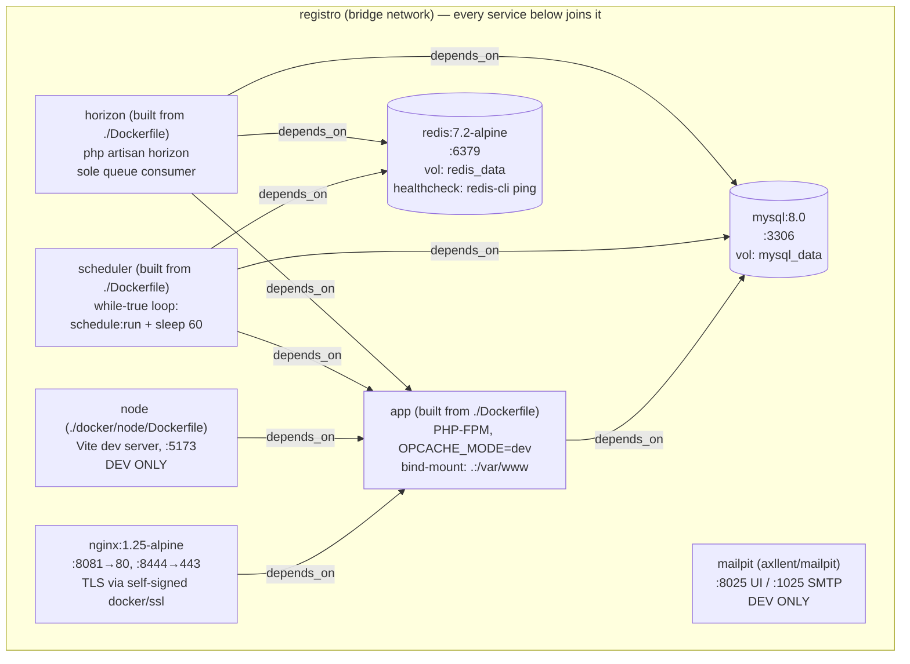
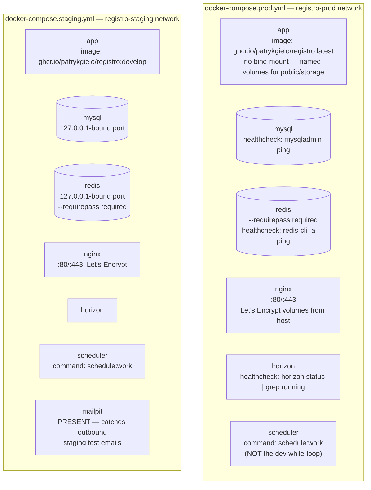

# Infrastructure: Docker Compose Topology

**Scope:** The real Docker Compose service topology across all four environments
(`docker-compose.yml`, `docker-compose.dev.yml`, `docker-compose.staging.yml`,
`docker-compose.prod.yml`) — what runs where, and what actually differs between them.
**Last verified:** 2026-07-23 against `develop` (all four `docker-compose*.yml` files, repo root).
**Related:** [Panel Isolation](panel-isolation.md), [Data Isolation](data-isolation.md),
`.claude/rules/ci-cd-troubleshooting.md` (dual-queue-worker incidents — this doc's service list is
the reference for "what should be running").

---

## Overview

Registro has no orchestrator (no Kubernetes/Swarm) — every environment is a flat
`docker compose` project. There are **four** compose files, not two:

| File | Used for |
|---|---|
| `docker-compose.yml` | Base/quick-start local dev (builds from source, bind-mounts the repo) |
| `docker-compose.dev.yml` | Alternate local dev profile (also builds from source, bind-mounts the repo) |
| `docker-compose.staging.yml` | Hostinger VPS `srv1203357.hstgr.cloud` (pulls `:develop` image tag) |
| `docker-compose.prod.yml` | Production (pulls `:latest` image tag) |

`docker-compose.yml` and `docker-compose.dev.yml` are **not identical** — see
["yml" vs "dev.yml"](#ymlyml-vs-devyml-not-identical) below. Both are local-only; neither is used
in staging/prod. Per `.claude/rules/deployment.md`, there are no automated deploys — staging/prod
compose files are applied manually on their respective hosts.

## Diagram — local/dev topology

Both local files share the same 8 services and the same single bridge network (`registro`). The
diagram below is the shape common to `docker-compose.yml` **and** `docker-compose.dev.yml`;
service-level differences between the two files are called out in the table further down.

`app`'s only declared `depends_on` is `mysql` — Redis reachability for the web request path
(cache/session/queue dispatch) is implicit (same network, no explicit dependency edge). Only
`scheduler` and `horizon` declare an explicit dependency on `redis`.

### `yml` vs `dev.yml` — not identical

A direct read of both files shows real, if narrow, drift:

| Aspect | `docker-compose.yml` | `docker-compose.dev.yml` |
|---|---|---|
| `app` build args | `OPCACHE_MODE: dev` **+ `BROWSER_TESTING: "true"`** (Playwright/Chromium in image) | `OPCACHE_MODE: dev` only |
| `app` env source | Inline `environment:` (`APP_URL`, `DB_HOST=mysql`, `FILESYSTEM_DISK=public`) | `env_file: .env` **+** `environment: DB_HOST=mysql` only — `APP_URL`/`FILESYSTEM_DISK` come from `.env`, not the compose file |
| `app` extra volume | — | `./docker/php/opcache-dev.ini` mounted over `zzz-opcache-dev.ini` |
| `nginx` config mount | Single file: `./docker/nginx/default.conf:/etc/nginx/conf.d/default.conf` | Whole directory: `./docker/nginx:/etc/nginx/conf.d` |
| `node` extra volume | SSL certs mounted read-only (`./docker/ssl:...:ro`) | not mounted |

Everything else (`mysql`, `redis`, `mailpit`, `scheduler`, `horizon`, network name, volume names)
is byte-identical between the two files. In practice `docker-compose.yml` is the one documented in
`CLAUDE.md`'s quick commands and is the file actually in daily use; `docker-compose.dev.yml`
appears to be an earlier/alternate profile that has partially drifted.

## Diagram — what changes in staging/prod

Rather than repeat the full graph, this highlights only the deltas from the local topology above.

Confirmed by reading the files directly (not assumed):

- **`node` is absent from both staging and prod** — Vite HMR has no reason to run outside local
  dev; production/staging serve prebuilt assets from `public/build/` baked into the image.
- **`mailpit` is absent from prod, but present in staging.** This is the one place the plan's
  assumption needed correcting: staging is not a scaled-down prod — it deliberately keeps a mail
  catcher (`MAIL_HOST=mailpit`) so outbound emails during staging QA never reach real inboxes.
  Prod has no mailpit service at all; its `MAIL_HOST` points at real SMTP (`smtp.gmail.com`).
- **`scheduler`'s command differs from local dev.** Local/dev runs a hand-rolled
  `while true; do schedule:run; sleep 60; done` loop. Staging/prod both use Laravel's built-in
  `php artisan schedule:work` instead — functionally similar (Laravel added `schedule:work` as the
  idiomatic replacement for that same polling-loop pattern), but it is a real command difference,
  not a copy-paste of the dev service.
- **Prod/staging bind no source code into the container.** Both `app` services use the prebuilt
  `ghcr.io/patrykgielo/registro` image and only mount *named* volumes for `public/`,
  `storage/app/public`, `storage/app/private`, `storage/framework`, `storage/logs` — there is no
  `.:/var/www` bind mount like local dev has. Deploying code changes requires a new image, not a
  file sync.
- **Staging and prod each have their own bridge network** (`registro-staging` / `registro-prod`),
  isolated from each other and from local's `registro` network — there is no shared infrastructure
  between environments.
- **Only staging/prod declare healthchecks** (`mysqladmin ping`, `redis-cli ping`,
  `horizon:status`, `nc -z 80`) and use `depends_on: { condition: service_healthy }` for `app`. The
  local files use bare `depends_on` (start-order only, no health gating).

## Service → Purpose → Compose file(s)

| Service | Purpose | `yml` | `dev.yml` | `staging.yml` | `prod.yml` |
|---|---|:---:|:---:|:---:|:---:|
| `app` | PHP-FPM application container (Laravel) | ✅ | ✅ | ✅ | ✅ |
| `mysql` | Primary datastore (MySQL 8.0) | ✅ | ✅ | ✅ | ✅ |
| `nginx` | Reverse proxy / TLS termination | ✅ | ✅ | ✅ | ✅ |
| `redis` | Cache, session, and queue broker | ✅ | ✅ | ✅ | ✅ |
| `horizon` | Sole queue worker (see dual-queue-worker incidents in `ci-cd-troubleshooting.md`) | ✅ | ✅ | ✅ | ✅ |
| `scheduler` | Runs Laravel's task scheduler continuously | ✅ | ✅ | ✅ | ✅ |
| `node` | Vite dev server (HMR) | ✅ | ✅ | ❌ | ❌ |
| `mailpit` | SMTP catcher / web UI for outbound mail | ✅ | ✅ | ✅ | ❌ |

If a container is missing in prod and it's `node` or `mailpit`, that is expected — both are
dev/staging-only by design. Any *other* service missing in prod (`horizon`, `scheduler`, `redis`,
`mysql`, `app`, `nginx`) is a real incident, not an environment difference — see
`.claude/rules/ci-cd-troubleshooting.md` for how an orphaned/removed-from-compose container can
still be silently running (or silently absent) independent of what the current YAML says.
