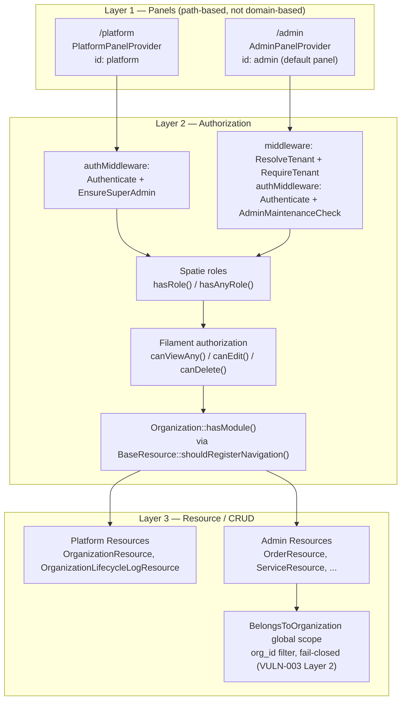

# Panel Isolation: `/platform` vs `/admin`

**Scope:** Filament panel architecture and the authorization boundary between the tenant-less
super-admin panel and the tenant-scoped admin panel.
**Last verified:** 2026-07-23 against `develop` (`app/Providers/Filament/*PanelProvider.php`,
`app/Filament/Resources/BaseResource.php`, `app/Traits/BelongsToOrganization.php`).
**Related:** [VULN-003: Root-Domain Tenant Isolation Bypass](../security/vulnerabilities/VULN-003-root-domain-tenant-bypass.md),
[Orders Security Hardening](../features/orders-security-hardening.md) (EditOrder cross-tenant PII leak),
[Data Isolation](data-isolation.md)

---

## Overview

Registro runs two separate Filament panels, registered as two separate `PanelProvider` classes —
there is no shared panel with native Filament multi-tenancy:

| Panel | Path | Provider | Tenant concept |
|-------|------|----------|-----------------|
| Platform | `/platform` | `App\Providers\Filament\PlatformPanelProvider` | None — super-admin only, manages all tenants |
| Admin | `/admin` | `App\Providers\Filament\AdminPanelProvider` (`->default()`) | Yes — subdomain-resolved (`{slug}.registro.local`) |

Both panels discover Resources from separate namespaces (`App\Filament\Resources` vs
`App\Filament\Platform\Resources`), so a Resource only ever exists in one panel — there is no
risk of the same class being accidentally registered in both.

## Diagram

The diagram intentionally shows **two independent entry paths** converging on the same
authorization primitives (Spatie roles, Filament `can*()` methods) — the panels don't share a
tenant boundary, they share an authorization *vocabulary*. Module-gating (`hasModule()`) only
affects navigation visibility inside `/admin`; on `/platform` `TenantFeature::currentTenant()` is
always `null`, so `BaseResource::shouldRegisterNavigation()` shows every Resource unconditionally
(see table row below).

## Isolation Point → Enforcement Mechanism → Code Location

| Isolation Point | Enforcement Mechanism | Code Location |
|---|---|---|
| Panel routing | Separate `PanelProvider` per panel, path-based (`->path('admin')` / `->path('platform')`) | `app/Providers/Filament/AdminPanelProvider.php:52-53`, `app/Providers/Filament/PlatformPanelProvider.php:30-31` |
| Platform panel access | `EnsureSuperAdmin` in `->authMiddleware()` — `abort(403)` for any user without the `super-admin` role | `app/Providers/Filament/PlatformPanelProvider.php:70-73`, `app/Http/Middleware/EnsureSuperAdmin.php:19-28` |
| Admin panel tenant resolution | `ResolveTenant` + `RequireTenant` registered in the panel's own `->middleware()`, running *before* `->authMiddleware()` — a tenant-less admin request (including `/admin/login` itself) 404s before Filament's own auth logic runs | `app/Providers/Filament/AdminPanelProvider.php:138-139` |
| Admin panel maintenance gate | `AdminMaintenanceCheck` in `->authMiddleware()` — blocks non-super-admin during maintenance mode | `app/Providers/Filament/AdminPanelProvider.php:141-144` |
| Navigation-level module gating (admin only) | `BaseResource::$module` + `shouldRegisterNavigation()` → `Organization::hasModule()`; returns `true` unconditionally when no tenant is resolved (platform panel / CLI) | `app/Filament/Resources/BaseResource.php:15-38`, `app/Models/Organization.php:292-304` |
| Financial/sensitive resource role restriction | Explicit `hasAnyRole()` / `hasRole()` checks on `canViewAny()` / `canCreate()` / `canEdit()` / `canDelete()`, independent of and layered on top of navigation gating | `app/Filament/Resources/OrderResource.php:566-588`, `app/Filament/Platform/Resources/OrganizationResource.php:49-62` |
| Tenant-scoped query filtering (admin resources) | `BelongsToOrganization` global scope, auto-detected per-Resource via `BaseResource::isScopedToTenant()` (checks whether the Resource's model uses the trait) | `app/Traits/BelongsToOrganization.php:34-59`, `app/Filament/Resources/BaseResource.php:48-53` |
| Cross-tenant leak via relationship-loaded fields (NOT covered by the global scope) | Explicit `modifyQueryUsing` scoping on `Select`/relationship form fields — the global scope only filters the Resource's own model, not related models pulled in via `->relationship()` | `app/Filament/Resources/OrderResource.php` (see [orders-security-hardening.md](../features/orders-security-hardening.md) §1) |

## Why this diagram exists

This exact boundary — "which panel/role/tenant is allowed to see or touch which row" — has
already produced two real incidents in this project, both class-level mistakes rather than typos:

1. **[VULN-003](../security/vulnerabilities/VULN-003-root-domain-tenant-bypass.md)** — a staff/
   admin user with valid credentials for *one* tenant could authenticate on the bare root domain
   and browse `/admin/*` with no tenant ever resolved, because `BelongsToOrganization`'s global
   scope silently no-opped (zero filtering) whenever `TenantFeature::currentTenant()` returned
   null — nothing in the panel/middleware layer had ever verified a tenant *was* resolved before
   a tenant-scoped Resource ran its query. Fixed across 6 layers (route-level `RequireTenant`,
   trait-level fail-closed scope, two independent session-fallback gaps in booking/cart, a home-
   route regression, and a Livewire-AJAX-transport gap) — this doc's Layer 2/L2 band reflects the
   *current*, fully-hardened state, not the pre-fix behavior.

2. **EditOrder cross-tenant PII leak** — documented in
   [orders-security-hardening.md](../features/orders-security-hardening.md) (§1, CRITICAL,
   `fix/orders-billing-security`, 2026-06-29). `OrderResource`'s `user_id` Select used
   `->relationship('user', 'email')` with no tenant scoping — an admin of tenant A could see the
   email, PESEL, NIP, and address of any user belonging to tenant B, because
   `BelongsToOrganization`'s global scope filters queries against the model the scope is attached
   to (`Order`), not an unrelated `User::all()` query pulled in via a relationship field. This is
   why the table above lists relationship-field scoping as a **separate** row from the global
   scope — it is a real gap the global scope does not close, and the diagram's "Resource / CRUD"
   layer is the correct place to look for it, not the "Authorization" layer.

Both incidents share the same root lesson: the global `BelongsToOrganization` scope protects the
*primary* query of a tenant-scoped model, but it does not automatically protect every path data
can flow through inside a Resource (relationship fields, raw queries, eager loads of unscoped
models). Anyone adding a new Resource or a new relationship-backed field to an existing one should
treat tenant scoping as something to verify explicitly, not something the base classes guarantee
for free.
