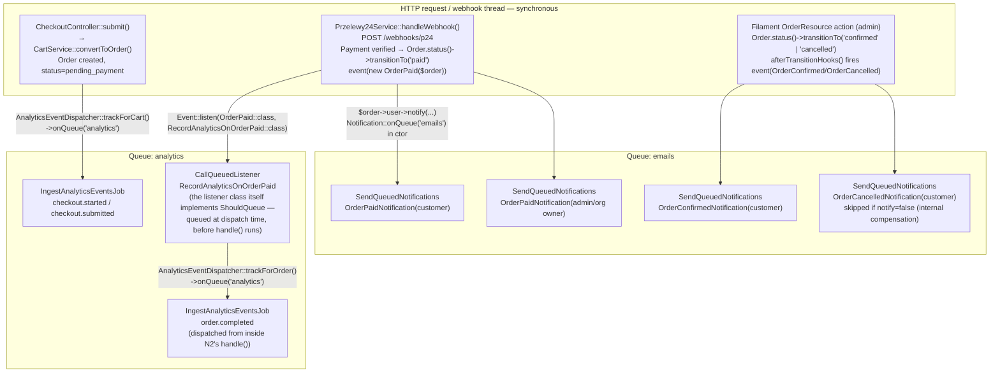

# Request Flow: Checkout & the Sync/Async Boundary

**Scope:** How a real request moves through the app for the two flows that best illustrate this
project's conventions — the checkout controller (thin-controller pattern) and the point where
synchronous HTTP/webhook handling hands off to queued jobs and notifications.
**Last verified:** 2026-07-23 against `develop` (`app/Http/Controllers/CheckoutController.php`,
`app/Services/Cart/CartService.php`, `app/Services/Payment/Przelewy24Service.php`,
`app/StateMachines/OrderStatusStateMachine.php`, `app/Providers/AppServiceProvider.php`,
`app/Services/Analytics/AnalyticsEventDispatcher.php`, `config/horizon.php`).
**Related:** [Data Isolation](data-isolation.md) (`TenantFeature::currentTenant()` used by
`CheckoutController`), [Panel Isolation](panel-isolation.md), `.claude/rules/controllers.md`
(thin-controller convention), [Order Notifications](../features/order-notifications.md),
[Cart/Order System](../features/cart-order-system.md), `.claude/rules/notifications.md`

---

## Overview

Registro's checkout flow is a good case study for the project's "thin controller" convention:
`CheckoutController` never touches the database directly or contains business rules — it
resolves the tenant, delegates to `CartService`/`Przelewy24Service`/`OrderService`, and returns a
view/redirect. All locking, validation, and state transitions live in the services.

The order lifecycle after checkout (`pending_payment → paid → confirmed → ...`) is also the
clearest example in the codebase of the **sync/async boundary**: state transitions themselves
run synchronously (inside an HTTP request or a webhook POST), but every side effect — customer
and admin emails, analytics ingestion — is handed off to a queue (`emails` or `analytics`)
instead of running inline.

## Diagram: Checkout Submit (Thin Controller)

```mermaid
sequenceDiagram
    actor Customer
    participant MW as Middleware<br/>(ResolveTenant, RequireTenant,<br/>SubmitCheckoutRequest validation)
    participant Ctrl as CheckoutController
    participant Cart as CartService
    participant P24Svc as Przelewy24Service
    participant OrderSvc as OrderService
    participant Analytics as AnalyticsEventDispatcher
    participant DB as Database
    participant P24 as Przelewy24 (external gateway)

    Customer->>MW: POST /checkout
    MW->>Ctrl: submit(SubmitCheckoutRequest $request)
    Note over Ctrl: Body is ~5 delegations, no locking/pricing/validation logic itself
    Ctrl->>Ctrl: $org = TenantFeature::currentTenant()<br/>abort_unless($org !== null, 404)
    Ctrl->>Cart: getOrCreateCart($org, auth()-&gt;user())
    Cart->>DB: SELECT ... FOR UPDATE (active cart, org+user scoped)
    DB-->>Cart: Cart

    Ctrl->>Cart: convertToOrder($cart, $checkoutData)
    activate Cart
    Cart->>DB: lockForUpdate() cart row + each Service row (deterministic order)
    Cart->>DB: re-check RentalAvailabilityService::getAvailableQuantity(forUpdate: true)
    Cart->>DB: INSERT Order (status=pending_payment) + OrderItems
    Cart->>DB: UPDATE cart.status = converted
    deactivate Cart
    Cart-->>Ctrl: Order

    Ctrl->>P24Svc: registerTransaction($order)
    P24Svc->>P24: transactions()-&gt;register(sessionId, amount, urlReturn, urlStatus)
    P24-->>P24Svc: gatewayUrl + token
    P24Svc->>DB: UPDATE order (p24_session_id, p24_token, p24_amount)
    P24Svc-->>Ctrl: gatewayUrl

    alt P24 registration throws
        Note over Ctrl: Compensate — order already committed as pending_payment
        Ctrl->>OrderSvc: cancel($order, 'P24 registration failed', notify: false)
        Ctrl->>Cart: reactivate($cart)
        Ctrl-->>Customer: redirect()-&gt;back()-&gt;withErrors(...)
    else success
        Ctrl->>Analytics: trackForCart($cart, 'checkout.submitted')
        Note right of Analytics: dispatches IngestAnalyticsEventsJob<br/>-&gt;onQueue('analytics') — async, see below
        Ctrl-->>Customer: redirect($paymentUrl)
    end
```

`CheckoutController::show()` follows the same shape one step earlier: resolve tenant → delegate
to `CartService::getOrCreateCart()` → assemble a `$profileData`/`$checkoutSettings` array for the
view (read-only projection of `$user`/`SettingsManager`, not business logic) → render. The one
piece of arithmetic in the controller (`$depositTotal = $cart->items->sum(...)`) is a deliberate
exception, documented inline in the controller itself, to avoid summing the same collection twice
between the JS payload and the Blade display block — not a precedent for putting pricing logic in
controllers generally.

## Diagram: Sync/Async Boundary Across the Order Lifecycle



Two mechanically different sync→async handoffs are visible in this diagram, both real and both
worth knowing before adding a new listener or notification:

- **Notification-level queuing (`E1`–`E4`):** the `Event::listen(OrderPaid::class, function (...) {...})`
  closures in `AppServiceProvider` run **synchronously**, inline with the webhook/admin request —
  they're plain closures, not queued listeners. The async handoff happens one level deeper, when
  `->notify()` is called with a notification class that implements `ShouldQueue` (all three
  `Order*Notification` classes set `$this->onQueue('emails')` in their constructor). Laravel
  enqueues a `SendQueuedNotifications` job per notifiable at that point.
- **Listener-level queuing (`N2`):** `RecordAnalyticsOnOrderPaid` implements `ShouldQueue` itself
  (`public string $queue = 'analytics'`), so Laravel queues a `CallQueuedListener` job for it
  **at event-dispatch time** — its `handle()` method never runs inline with the webhook at all.
  Inside that queued `handle()`, it calls `AnalyticsEventDispatcher::trackForOrder()`, which
  dispatches a *second*, independent queued job (`IngestAnalyticsEventsJob`, `N3`) onto the same
  `analytics` queue — a two-hop async chain for a single `OrderPaid` event.

`OrderPaid` itself is dispatched directly from `Przelewy24Service::handleWebhook()` (inside the
DB transaction, after the `paid` transition succeeds), not from
`OrderStatusStateMachine::afterTransitionHooks()` — see the comment on that method. `OrderConfirmed`
and `OrderCancelled`, by contrast, are both fired from `afterTransitionHooks()`, since those
transitions are always admin-triggered (Filament action) rather than payment-gateway-triggered.

## Queues Used By the Checkout/Order Flow

| Queue | Dispatched via | What runs there | Code |
|---|---|---|---|
| `emails` | `Notification::onQueue('emails')` set in each notification's constructor | `OrderPaidNotification` (customer + admin), `OrderConfirmedNotification`, `OrderCancelledNotification` — all deliver through `EmailServiceChannel` → `EmailService::sendFromTemplate()` | `app/Notifications/OrderPaidNotification.php:39`, `OrderConfirmedNotification.php:33`, `OrderCancelledNotification.php:36` |
| `analytics` | `IngestAnalyticsEventsJob::dispatch(...)->onQueue('analytics')` inside `AnalyticsEventDispatcher::trackForCart()`/`trackForOrder()`; `RecordAnalyticsOnOrderPaid::$queue = 'analytics'` | Funnel/behavioral event ingestion — `checkout.started`, `checkout.submitted` (from `CheckoutController`), `order.completed` (from `RecordAnalyticsOnOrderPaid`) | `app/Services/Analytics/AnalyticsEventDispatcher.php:23,36`, `app/Listeners/RecordAnalyticsOnOrderPaid.php:14` |
| `reminders` | not touched by the checkout/order flow — used by `app/Jobs/Reminder/ProcessRemindersJob.php` | out of scope for this doc | — |
| `default` | Horizon's catch-all queue (`config/horizon.php:205`); no checkout/order code path reviewed here targets it explicitly | out of scope for this doc | — |

All four queues run under a single Horizon supervisor (`config/horizon.php`) — there is no
separate `queue:work` process; see the dual-queue-worker incidents in
`.claude/rules/ci-cd-troubleshooting.md` for why that invariant matters operationally.

## Notes

- `CheckoutController::return()` (the P24 return-URL handler) is a plain, unauthenticated-safe
  read: it looks up the `Order` by `p24_session_id` scoped to both `organization_id` and
  `auth()->id()`, and renders a view — no state transition happens there. The actual payment
  confirmation only ever happens via the `handleWebhook()` path above, which is why the return
  page can show a stale/pending status if the webhook hasn't landed yet.
- The compensating-transaction path in the checkout sequence diagram (`CartService::reactivate()`
  after a P24 registration failure) is the only place in this flow where a service method
  deliberately undoes another service method's committed write — see the docblocks on both
  methods for the staleness/race-condition reasoning behind why it's a query-builder `update()`
  rather than `$cart->update()`.
