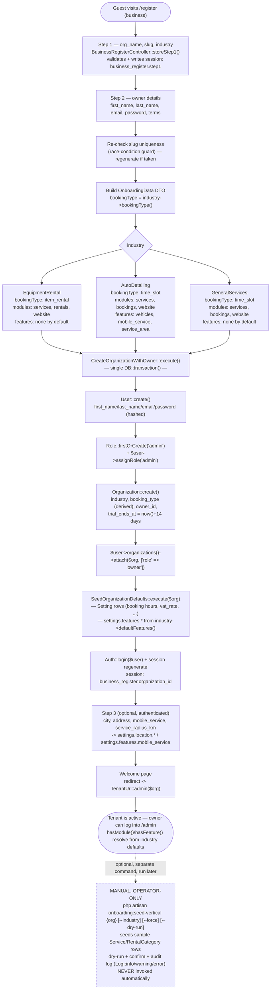

# Tenant Provisioning: Signup → Active Tenant

**Scope:** The real business-registration pipeline — from the public signup form through to an
active, module-gated tenant with an owner account — and where the deliberately-manual vertical
seed step fits (or doesn't) into that pipeline.
**Last verified:** 2026-07-23 against `develop` (`app/Http/Controllers/Auth/BusinessRegisterController.php`,
`app/Actions/Onboarding/CreateOrganizationWithOwner.php`, `app/Actions/Onboarding/SeedOrganizationDefaults.php`,
`app/Enums/Industry.php`, `app/Models/Organization.php:292-305`, `app/Console/Commands/SeedVerticalDataCommand.php`).
**Related:** [Data Isolation](data-isolation.md), [Panel Isolation](panel-isolation.md),
`.claude/rules/onboarding.md`, `.claude/rules/spatie-roles.md`

---

## Overview

Business registration is a 3-step guest/auth flow served by `BusinessRegisterController`, backed
by one transactional Action (`CreateOrganizationWithOwner`) that creates the `User` + `Organization`
in a single `DB::transaction()`. There is no separate "provisioning worker" or async job in this
path — everything through "owner can log into `/admin`" happens synchronously inside one HTTP
request (step 2's `storeStep2()`).

Critically, **provisioning does not load any demo/starter catalogue data.** A brand-new tenant gets
settings defaults and industry-derived feature/module flags, but zero `Service` or
`RentalCategory` rows. Populating a sample catalogue is a separate, manual, operator-run Artisan
command (`onboarding:seed-vertical`) — confirmed by reading both `SeedOrganizationDefaults` (which
only writes `Setting` rows and `settings.features.*` flags) and the command's own docblock
(`"Tylko ręcznie — NIE jest wywoływane automatycznie podczas onboardingu."`).

## Diagram

## What happens automatically vs. what requires `onboarding:seed-vertical`

| Happens automatically at signup (`storeStep2()` → `CreateOrganizationWithOwner`) | Requires manual `onboarding:seed-vertical` |
|---|---|
| `User` created, `admin` role assigned (`Role::firstOrCreate()` guard — see `.claude/rules/spatie-roles.md`) | — |
| `Organization` created with `industry` + derived `booking_type`, 14-day trial | — |
| Owner attached to the org (`organizations` pivot, `role: owner`) | — |
| `Setting` defaults seeded (business hours, `vat_rate`, `registration_enabled`, empty `checkout.inquiry_email`) | — |
| Industry feature flags written (`settings.features.vehicles/mobile_service/service_area`) | — |
| Module *gating* resolves correctly from first request — `Organization::hasModule()` reads `industry->defaultModules()` at call time; nothing needs to be pre-computed or stored | — |
| — | Sample `Service` rows (e.g. 13 rental items for `equipment_rental`, 8 services for `auto_detailing`, 1 placeholder for `general_services`) |
| — | Sample `RentalCategory` rows (equipment_rental only) |
| — | Anything the org's chosen `VerticalSeeder::seed()` implementation writes |

This split is intentional, not an oversight: `SeedOrganizationDefaults` is called unconditionally
inside the signup transaction and only ever touches `Setting` + `settings.features.*` — it never
constructs a `Service` or `RentalCategory`. The vertical seeder is opt-in precisely so a real
business doesn't launch with fake demo products still visible on their public catalogue; an
operator (or, per `.claude/rules/onboarding.md`, potentially the tenant themselves in a future
self-service flow) runs the command deliberately, with `--dry-run` available to preview and a
transactional `--force` purge-and-reseed path for orgs that already have catalogue data.

## Notes on module/feature resolution

`Organization::hasModule($module)` and `hasFeature($feature)` are **not** provisioning-time writes
— they are a 3-level runtime priority chain (`app/Models/Organization.php:292-305`): explicit
`settings.modules.{module}` override → `industry->defaultModules()` → `booking_type`-derived
`MODULE_DEFAULTS` fallback (for orgs with no industry). Because provisioning always sets
`industry`, a freshly-created tenant's module visibility is fully determined the instant
`Organization::create()` returns — there is no separate "apply modules" step to forget.
