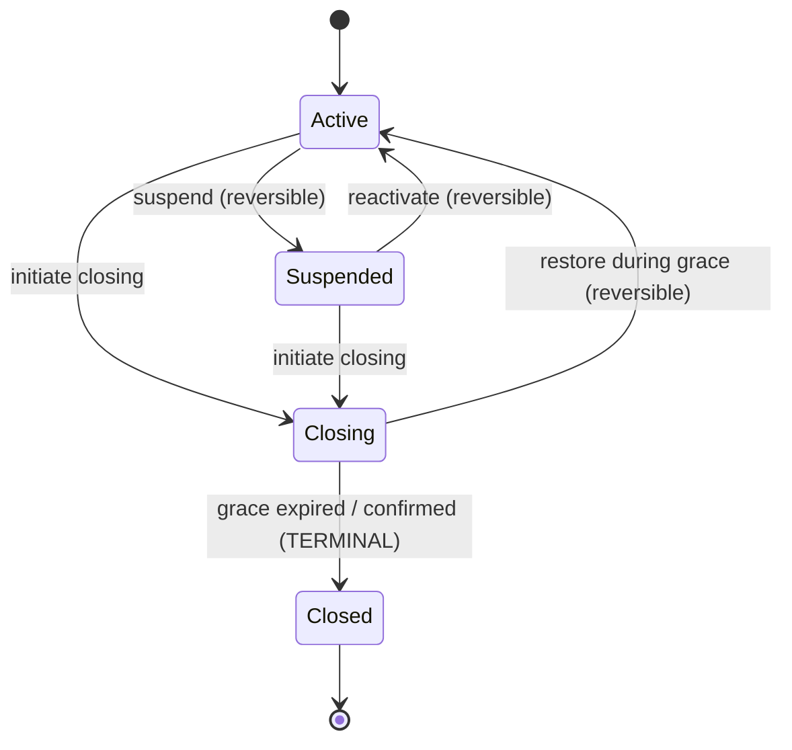

# Tenant Lifecycle — Reference

Single authoritative reference for the entire Tenant Lifecycle workstream (Fazy 5.0–5.3). It replaces the implicit boolean `is_active` with an explicit, state-machine-governed `lifecycle_state` on `Organization`, and adds the offboarding machinery around it: obligation/delete guards, FK backstops, PII anonymization, soft-delete + purge, retention policy, and tenant data export (RODO art. 28(3)(g)).

The migration is additive and non-breaking. `is_active` is now a **fully derived** column, kept in sync from `lifecycle_state` by `OrganizationObserver`.

> **Verification note (2026-06-30):** every claim below was checked against the code on `develop`. Discrepancies found vs the previous version of this doc are listed in [§11](#11-doc-vs-code-corrections).

---

## Table of Contents

1. [Overview & phase status](#1-overview--phase-status)
2. [State machine](#2-state-machine)
3. [Guards & exceptions](#3-guards--exceptions)
4. [FK onDelete policy](#4-fk-ondelete-policy)
5. [PII anonymization](#5-pii-anonymization)
6. [Soft-delete, purge & retention](#6-soft-delete-purge--retention)
7. [Tenant data export](#7-tenant-data-export)
8. [Tenant resolution](#8-tenant-resolution)
9. [Test coverage](#9-test-coverage)
10. [Follow-ups & technical debt](#10-follow-ups--technical-debt)
11. [Doc vs code corrections](#11-doc-vs-code-corrections)

---

## 1. Overview & phase status

`lifecycle_state` is the **authoritative** signal for tenant health. It governs three things: whether the public site is served, whether new bookings/orders may be created, and whether the tenant may be wound down (suspended → closing → closed → purged). Around it sits a guard system that enforces legal retention (Polish tax/civil law) and RODO obligations during offboarding.

| Faza | Scope | Status |
|------|-------|--------|
| 5.0 | Enum + state machine + schema columns + backfill | Done |
| 5.1 | Guards + `OrganizationObserver` (is_active sync, obligation checks, delete guard) + Platform lifecycle actions | Done |
| 5.1-cr | Code-review hardening (`lifecycle_state` out of `$fillable`, `$attributes` default, null-safe `$from`) | Done |
| 5.2 | FK `onDelete` policy (DB backstop) + legal-records guard + `ResolveTenant` switched to `lifecycle_state` | Done |
| 5.3a | `SoftDeletes` on Organization + PII anonymization service + `organizations:purge` + `config/retention.php` | Done |
| 5.3b | Tenant data export (full org copy for owner, RODO art. 28(3)(g)) + cleanup command | Done |
| 5.4a | Graceful offboarding backend — `RentalCancelled` event, `CancelInFlightObligationsJob`, `StartOrganizationOffboarding`, `organizations:finalize-closing`, Filament initiateClosing rewired | Done |
| 5.4b | Business-closed page — Closing/Closed tenant subdomains return HTTP 410 with `errors.business-closed` view instead of silent root redirect | Done |

**Planned / not implemented:**

- **5.4 (legal purge)** — hard-delete of legal records (orders/payments/rentals/tenant_payments) after `legal_records_years` (6) from `closed_at`. Requires dropping the RESTRICT FK before `forceDelete()`. See [§10](#10-follow-ups--technical-debt).
- **5.5 / 5.7** — staff `null`-on-delete double-booking follow-up and DPO open questions (JDG REGON, `order_status_history.properties`, `customer_id` nulling). See [§10](#10-follow-ups--technical-debt).

### `lifecycle_state` at a glance



Verified against `OrganizationLifecycleStateMachine::transitions()` (private method,
`app/StateMachines/OrganizationLifecycleStateMachine.php:16-23`): every transition above is
reversible except `Closing → Closed`, which is a one-way door — `Closed` has no outgoing
transitions at all (`OrganizationLifecycleState::isTerminal()` returns `true` only for it). Note
that `Closing` is reachable directly from `Suspended`, not only from `Active` — a suspended org
does not need to pass back through `Active` before closing. Full per-state semantics
(`allowsPublicSite()`, `allowsNewBookings()`), the transition map, and enforcement points are
detailed in [§2 State machine](#2-state-machine) below — this diagram is a visual index into that
section, not a replacement for it.

---

## Faza 5.4a — Graceful Offboarding (Backend)

### Overview

When a super-admin triggers `initiateClosing` in `/platform`, the system:
1. Cancels all in-flight customer obligations (orders, appointments, rentals) and notifies affected customers.
2. Transitions the org to `Closing` with a 14-day restore window (`closing_grace_days`).
3. Notifies the tenant owner that offboarding has started.
4. After the grace period, automatically finalizes: transitions to `Closed` + sets `purge_after`.

### New domain event — `RentalCancelled`

`app/Events/RentalCancelled.php` — dispatched from `Rental.booted()` updating hook when `status → Cancelled`. Closes the gap where rentals had no cancellation event (orders and appointments already had `OrderCancelled` / `AppointmentCancelled`).

- Listener in `AppServiceProvider::registerEventListeners()` → `RentalCancelledNotification` (ShouldQueue, emails queue)
- `TemplateKey::RENTAL_CANCELLED` — email-only, key `rental-cancelled`
- Template vars: `customer_name`, `service_name`, `start_date`, `end_date`, `reason`, `app_name`

### `CancelInFlightObligationsJob`

`app/Jobs/CancelInFlightObligationsJob.php` — queued on `default` queue. Idempotent (terminal statuses filtered by `whereIn`).

| Entity | Statuses processed | Mechanism |
|--------|--------------------|-----------|
| Orders | `pending_payment`, `paid`, `confirmed`, `in_progress` | `OrderService::cancel()` (fires `OrderCancelled` → notification). Paid orders additionally logged for manual refund. |
| Appointments | `Pending`, `Confirmed` | Direct `$appointment->cancellation_reason = $reason; $appointment->status = Cancelled; $appointment->save()` — fires `AppointmentCancelled` event from observer. |
| Rentals | `Held`, `Pending`, `Confirmed`, `Active` | Direct `$rental->cancellation_reason = $reason; $rental->status = Cancelled; $rental->save()` — fires `RentalCancelled` event from booted() hook. Deposit > 0 additionally logged for manual refund. |

**Note on in_progress orders:** `OrderStatusStateMachine` and `OrderService::cancel()` were extended to allow `in_progress → cancelled` (exceptional path for offboarding only). A `Log::warning` is emitted on every such cancellation.

**Refunds are NOT automated.** Paid orders and rental deposits are flagged via `Log::info` with `order_id` / `rental_id` / `total_amount` / `deposit_amount` for manual processing.

### `StartOrganizationOffboarding`

`app/Actions/Offboarding/StartOrganizationOffboarding.php`

```
execute(Organization):
  1. CancelInFlightObligationsJob::dispatch($org->id, 'Zamknięcie działalności')
  2. $org->forceLifecycleTransition = true; $org->lifecycle_state = Closing; $org->save()
  3. $org->owner->notify(OrganizationOffboardingStartedNotification)  [if owner exists]
  4. Log::info audit
```

`forceLifecycleTransition = true` bypasses the obligation guard in `OrganizationObserver` (auto-reset in `saved()`). The job is dispatched BEFORE the state transition so the obligation counts in the confirmation modal are still accurate.

### `config/retention.php` — `closing_grace_days`

```php
'closing_grace_days' => 14,  // Closing → Closed auto-transition window
```

The tenant owner is informed of this window in `OrganizationOffboardingStartedNotification` (ShouldQueue, emails queue, `uniqueFor` = 3600).

### `organizations:finalize-closing` command

`app/Console/Commands/FinalizeClosingOrganizationsCommand.php`

Signature: `organizations:finalize-closing {--dry-run} {--force}`

Finds: `lifecycle_state = 'closing' AND closing_initiated_at <= now()->subDays($graceDays)`

Per org: dispatches `CancelInFlightObligationsJob` defensively (catches anything the initial job may have missed), then `forceLifecycleTransition=true; lifecycle_state=Closed; save()`. Sets `closed_at` and `purge_after` via observer.

Scheduled: `dailyAt('02:30')` in `routes/console.php`.

### Filament `initiateClosing` action rewired

`app/Filament/Platform/Resources/OrganizationResource.php`

Replaced the blocking `->before()` obligation guard with `->requiresConfirmation()` showing a `->modalDescription()` with live obligation counts (via `TenantObligationService`) and the 14-day grace window. Action now delegates to `StartOrganizationOffboarding::execute($record)` instead of setting `lifecycle_state` directly.

**Schema columns added to `organizations`** (cast in `app/Models/Organization.php:86`):

| Column | Type | Notes |
|--------|------|-------|
| `lifecycle_state` | string(20), indexed, default `'active'` | Cast to `OrganizationLifecycleState`. NOT in `$fillable`. |
| `closing_initiated_at` | timestamp nullable | Set on → Closing, cleared on Closing → Active. |
| `closed_at` | timestamp nullable | Set on → Closed. |
| `purge_after` | timestamp nullable | Set on → Closed (`now() + purge_grace_days`); cleared on Closing → Active. |
| `closure_requested_at` | timestamp nullable | Tenant self-service closure request timestamp. |
| `deleted_at` | timestamp nullable | `SoftDeletes` (migration `2026_06_30_100001`). |

The model declares `protected $attributes = ['lifecycle_state' => 'active']` (`Organization.php:25`) so `getOriginal('lifecycle_state')` is never `null` on a freshly inserted instance — without it, `syncOriginal()` after INSERT copied `null` and crashed `assertTransitionAllowed()` with a `TypeError`.

---

## 2. State machine

`app/StateMachines/OrganizationLifecycleStateMachine.php` — a plain PHP class (not Eloquent-integrated). It validates transitions and throws; **persisting `lifecycle_state` is the caller's responsibility**.

### States — `app/Enums/OrganizationLifecycleState.php`

| Case | Value | `label()` | `allowsPublicSite()` | `allowsNewBookings()` | `isTerminal()` |
|------|-------|-----------|----------------------|-----------------------|----------------|
| `Active` | `active` | Aktywna | true | true | false |
| `Suspended` | `suspended` | Zawieszona | false | false | false |
| `Closing` | `closing` | W trakcie zamknięcia | false | false | false |
| `Closed` | `closed` | Zamknięta | false | false | true |

All three helpers return `true` only for `Active` (`OrganizationLifecycleState.php:28-48`). `Closing` is the grace-period window: in-flight orders/rentals may still be fulfilled, but no new intake and the public catalog is hidden. `Closed` is terminal.

### Transition map — `transitions()` (private, `:16-23`)

```
active     → suspended, closing
suspended  → active, closing
closing    → active, closed
closed     → (terminal — no outgoing transitions)
```

```
Active ──────► Suspended        (suspend)
Active ──────► Closing          (initiate closing)
Suspended ───► Active           (reactivate)
Suspended ───► Closing          (initiate closing)
Closing ─────► Active           (restore during grace — clears closing_initiated_at + purge_after)
Closing ─────► Closed           (grace expired / confirmed — sets closed_at + purge_after)
```

### Public API

- `canTransition($from, $to): bool` — accepts enum or string for either side. An invalid string `$from` throws `\ValueError` (`:30-42`).
- `assertTransitionAllowed($from, $to): void` — throws `InvalidLifecycleTransitionException` on illegal moves (`:51-63`).
- `transitions()` is **private** — probe with `canTransition()`.

### Where it is enforced

The state machine is invoked from a single place: `OrganizationObserver::updating()` (`app/Observers/OrganizationObserver.php:65`), which runs on every `lifecycle_state` change. The observer is registered in `AppServiceProvider::boot()` (`app/Providers/AppServiceProvider.php:90`). All callers (Filament actions, CLI, tests) go through Eloquent `save()` → the observer, so there is no bypass except the explicit transient flags below.

---

## 3. Guards & exceptions

All lifecycle enforcement lives in `OrganizationObserver`. Two transient, non-persisted flags on the model can bypass specific guards; both are auto-reset after the operation so they cannot leak to a reused instance.

### 3.1 Transient model flags (`Organization.php:32,39`)

| Flag | Bypasses | Reset by |
|------|----------|----------|
| `forceLifecycleTransition` | obligation check in `updating()` (Guard 2) | `saved()` — fires after **every** save, incl. no-ops |
| `bypassDeleteGuard` | all of `deleting()` (Guards 2–4) | `deleted()` |

`forceLifecycleTransition` is reset in `saved()` rather than `updated()` on purpose: `updated()` only fires when Eloquent actually writes (dirty model). A no-op `save()` would otherwise leave the flag set for the next save that *does* touch `lifecycle_state`. See `OrganizationObserver.php:106-129`.

### 3.2 `updating()` guards (`:49-104`)

Runs only when `isDirty('lifecycle_state')`. Derives `$from` via a null-safe `match(true)` that falls back to `Active` if `getOriginal()` is `null` (defense-in-depth on top of the `$attributes` default).

1. **Transition validation** — `stateMachine->assertTransitionAllowed($from, $to)` → `InvalidLifecycleTransitionException`.
2. **Obligations** — when `$to ∈ {Closing, Closed}` **and** `! forceLifecycleTransition`: calls `TenantObligationService::activeObligations()` once; if `total > 0` throws `OrganizationHasActiveObligationsException`.
3. **Derived `is_active`** — set to `($to === Active)`.
4. **Timestamps** — `Closing` sets `closing_initiated_at`; `Closed` sets `closed_at` and `purge_after = now() + purge_grace_days` (only if not already set); `Closing → Active` clears both `closing_initiated_at` and `purge_after`.

### 3.3 `deleting()` guards (`:144-191`)

Hard-delete only. Guards in order:

1. `bypassDeleteGuard === true` → **skip all** (return early).
2. `lifecycle_state !== Closed` → `OrganizationNotClosedException`.
3. Active obligations exist (`TenantObligationService`) → `OrganizationHasActiveObligationsException`.
4. **Legal records exist** → `OrganizationHasLegalRecordsException`. Counts orders + payments + rentals + tenant_payments via `withoutGlobalScope('organization')` + explicit `where('organization_id', …)`. Even completed/cancelled records count — they must survive 5–6 years. The DB RESTRICT FK ([§4](#4-fk-ondelete-policy)) is the final backstop when `bypassDeleteGuard` skips this check (purge command path).

> Note: `deleting()` fires on **hard** delete (`forceDelete()`), not on soft-delete. `$org->delete()` is an `UPDATE deleted_at` and does **not** trip the RESTRICT FK. The purge command soft-deletes with `bypassDeleteGuard = true` ([§6](#6-soft-delete-purge--retention)).

### 3.4 Obligation definitions — `app/Services/TenantObligationService.php`

`activeObligations(Organization $org): array{appointments,orders,rentals,total}` and `hasActiveObligations(): bool`. All queries bypass the `BelongsToOrganization` global scope (super-admin context has no bound tenant) and filter explicitly by `organization_id`.

| Domain | "In-flight" statuses (block closure) | Terminal (do NOT block) |
|--------|--------------------------------------|-------------------------|
| Appointments | `pending`, `confirmed` | `cancelled`, `completed` |
| Orders | `pending_payment`, `paid`, `confirmed`, `in_progress` | `completed`, `refunded`, `cancelled` |
| Rentals | `held`, `pending`, `confirmed`, `active` | `returned`, `cancelled`, `expired` |

**Critical:** a `completed` order is a finished transaction and does **not** block closure. Only in-flight obligations do. (`TenantObligationService.php:42-73`.)

### 3.5 Filament Platform actions — `app/Filament/Platform/Resources/OrganizationResource.php`

The `is_active` toggle was replaced by a read-only `Placeholder` (`:89`), a `lifecycle_state` badge column (`:182`) + `SelectFilter` (`:214`), and three row actions. Each has `->authorize(super-admin)` **and** a `->visible()` super-admin check (defense-in-depth on top of `EnsureSuperAdmin` middleware).

| Action | Label | Transition | Obligation check |
|--------|-------|-----------|------------------|
| `suspend` (`:233`) | Zawieś | Active → Suspended | No |
| `reactivate` (`:247`) | Reaktywuj | Suspended/Closing → Active | No |
| `initiateClosing` (`:265`) | Zamknij | Active/Suspended → Closing | Yes — `->before()` checks obligations, halts with a `persistent()` notification on `total > 0`; the `->action()` then sets `forceLifecycleTransition = true` to skip the observer's double-check |

`canViewAny()` and `canDelete()` (`:36,41`) require `super-admin`; `canDelete()` additionally hides the button unless `lifecycle_state === Closed`.

**Delete guards mirror the observer** (so a violation surfaces as a notification, never a 500):
- `EditOrganization::DeleteAction::before()` (`OrganizationResource/Pages/EditOrganization.php:21`) — checks Closed first, then obligations.
- `DeleteBulkAction::before()` (`OrganizationResource.php:306`) — per record: Closed → obligations → **legal records** (orders/payments/rentals/tenant_payments). Builds a `$blocked[]` list and halts if non-empty.

### 3.6 Staff delete guard — `app/Filament/Resources/EmployeeResource.php`

`DeleteAction` + `DeleteBulkAction` are guarded by `hasFutureActiveAppointments(User $staff)` (`:274-291`):
- `TenantFeature::currentTenant() === null` → returns `false` immediately (no cross-tenant leak).
- Requires explicit `where('organization_id', $tenant->id)` — no `->when($tenant, …)` that would silently scan all orgs.
- Blocks only **future** (`appointment_date >= today`) `pending`/`confirmed` appointments. Past/terminal appointments don't block — they are preserved via `staff_id` null-on-delete ([§4](#4-fk-ondelete-policy)).

Testing in isolation: set `$this->app['request']->attributes->set('tenant', $org)` first, or `currentTenant()` returns `null` and the guard short-circuits to `false`.

### 3.7 Exceptions — `app/Exceptions/`

All extend `RuntimeException`.

| Class | Thrown when |
|-------|-------------|
| `InvalidLifecycleTransitionException` | Illegal state transition (state machine). |
| `OrganizationHasActiveObligationsException` | Lifecycle change or delete blocked by in-flight obligations. |
| `OrganizationNotClosedException` | Delete attempted when `lifecycle_state !== Closed`. |
| `OrganizationHasLegalRecordsException` | Delete blocked by outstanding legal records (Art. 74 Ustawy o rachunkowości + Art. 112 VAT). Bypassed by `bypassDeleteGuard`; FK RESTRICT remains the backstop. |

### 3.8 `lifecycle_state` is NOT mass-assignable (F003)

Removed from `$fillable` (`Organization.php:73-84`). `Organization::create(['lifecycle_state' => …])` is a no-op.
- **On create:** set on the instance before `save()` (observer `creating()` picks it up), or use a factory state.
- **On update:** `$org->lifecycle_state = State::Foo; $org->save();`.
- **Factories:** `->inactive()` (Suspended), `->closing()`, `->closed()` (all via `afterMaking`). Default `factory()->create()` = Active.
- `is_active` is likewise not directly settable — only the observer writes it. Billing fields (`subscription_status`, `monthly_fee`, `subscribed_at`, `subscription_expires_at`) are also excluded from `$fillable`.

---

## 4. FK onDelete policy

Migration `database/migrations/2026_06_30_000001_fix_lifecycle_fk_constraints.php` — the DB-level backstop behind the application guards. FK behaviour is **category-driven**, not uniform.

| Category | Tables (`organization_id` unless noted) | onDelete | Rationale |
|----------|------------------------------------------|----------|-----------|
| Legal records | `orders`, `payments`, `tenant_payments`, `rentals` | **restrict** | Must survive org deletion ≥5–6 yrs (Art. 112 VAT / Art. 70 Ordynacja). Last-resort engine-level enforcement behind `OrganizationHasLegalRecordsException` and a soft-delete-first purge. |
| Staff link | `appointments.staff_id` (was NOT NULL cascade) | **nullable + nullOnDelete** | Deleting a staff `User` preserves historical appointments (`staff_id = null`). Aligns with the 5.1 guard that blocks only *future* appointments. Never `restrict` here. |
| Ephemeral | `carts.organization_id`, `statistics_daily_snapshots.organization_id` | cascade (unchanged) | OK to drop with the org. |
| Ephemeral | `analytics_events.organization_id` | nullOnDelete (already, unchanged) | Created cascade in `2026_05_23_162048`, changed to nullOnDelete in `2026_06_15_100001`. |
| Bound child | `payments.order_id` | unchanged | Payment is bound to its order; `organization_id` is the legal backstop. |

**SQLite nuance:** `staff_id` is made nullable only on MySQL (`DB::getDriverName() !== 'sqlite'`, `:74`) because Doctrine `ALTER COLUMN` is unsupported on SQLite. The FK drop/re-add **is** applied on SQLite via Laravel 12's table-rebuild, so the `nullOnDelete` constraint is enforced in tests too; app-level tests cover nullability.

**Rollback (`down()`):** restores legal-record FKs to cascade and `staff_id` to cascade, but **leaves `staff_id` nullable** — restoring NOT NULL would fail if any staff was deleted while the migration was applied (those rows now hold `staff_id = null`). Nullable is a safe superset; re-running `up()` stays safe.

---

## 5. PII anonymization

`app/Services/Lifecycle/OrganizationAnonymizationService.php`. `anonymize(Organization $org): array{orders,appointments,rentals,payments}` wraps four private methods in a single `DB::transaction()`. Returns per-model affected counts.

**Why `DB::table()` (not Eloquent):** the `Order` model has a `booted() updating()` immutable guard protecting `rodo_accepted_ip` and accounting fields. `DB::table()` bypasses Eloquent events entirely, allowing those PII fields to be cleared while leaving the accounting fields untouched. It also avoids loading models for bulk updates.

**Idempotent:** safe to re-run. Email placeholders embed the row id (`anon_{id}@anonymized.local`) so they stay unique per row across repeated runs. Per-row uniqueness requires the `chunkById(500)` loop (orders/appointments/rentals); payments use a single bulk `update`.

**Principle:** anonymize PII of natural persons (RODO art. 5(1)(e), art. 17); preserve accounting data (NIP, REGON for B2B, amounts, dates, order numbers, fiscal timestamps) for the retention window (Art. 112 VAT / Art. 70 Ordynacja). Consent **timestamps** (`rodo_accepted_at`, `terms_accepted_at`) are retained as proof of a legal act; the consent **IP** is PII and cleared.

### Per-model field map

| Model | ANONYMIZED (PII) | PRESERVED (accounting/legal) |
|-------|------------------|------------------------------|
| **Order** (`:85`) | `customer_first_name`→`'Anonimizowane'`, `customer_last_name`→`'Anonimizowane'` (NOT NULL → placeholder), `customer_email`→`anon_{id}@…`, `customer_phone`, `customer_pesel`, `customer_street/building/apartment/city/postal_code`, `signatory_id_number`, `pickup_person_name`, `pickup_person_id_number`, `ip_address`, `rodo_accepted_ip`, `notes`, `company_contact_name`, `deposit_notes`; **if `customer_type='natural_person'`:** `company_regon`, `company_krs` (JDG REGON identifies the person) | `order_number`, `status`, `currency`, `subtotal`, `discount_amount`, `tax_amount`, `total_amount`, `deposit_amount/status/collected_at/returned_at`, `customer_type`, `invoice_*` (company_name/nip/street/postal/city), `rodo_accepted_at`, `terms_accepted_at`, `withdrawal_exclusion_accepted_at`, `p24_*`, `paid_at`, `cancelled_at`, `completed_at`, timestamps; **if `customer_type='business'`:** `company_regon`, `company_krs` (appear on B2B invoice, Art. 106e VAT) |
| **Appointment** (`:149`) | `first_name`→`'Anonimizowane'`, `last_name`→`null`, `email`→`anon_{id}@…`, `phone`, `location_address`, `location_latitude`, `location_longitude`, `location_components`, `location_place_id`, `service_location_type` (mobile-service client location — **critical PII**), `registration_number` (vehicle plate = PII per UODO), `notes`, `cancellation_reason` | `invoice_*`, `service_price_at_booking`, `service_name_at_booking`, `service_duration_at_booking`, `appointment_date`, `start_time`, `end_time`, `status`, `completed_at`, `cancelled_at`, timestamps |
| **Rental** (`:194`) | `first_name`→`'Anonimizowane'`, `last_name`→`null`, `email`→`anon_{id}@…`, `phone`, `notes`, `cancellation_reason` | `invoice_*`, `total_price`, `unit_price_at_booking`, `deposit_amount`, `quantity`, `start_date`, `end_date`, `status`, timestamps |
| **Payment** (`:228`) | `webhook_payload`→`null` (raw P24 JSON blob — may hold buyer name/email/IP) | `p24_session_id`, `p24_order_id`, `amount`, `currency`, `status`, `verified_at`, `order_id`, `organization_id`, timestamps |

The asymmetry per `customer_type` is checked per row inside the chunk loop. Payments are counted/updated only `whereNotNull('webhook_payload')`.

> **`customer_id` is NOT nulled** — orders/appointments/rentals keep their FK to `users`. This is pseudonymization, not full anonymization. See [§10](#10-follow-ups--technical-debt) FU-3.

---

## 6. Soft-delete, purge & retention

### 6.1 SoftDeletes

`Organization use SoftDeletes` (`Organization.php:18`); `deleted_at` added by `2026_06_30_100001_add_soft_deletes_to_organizations.php`.
- `$org->delete()` → `UPDATE deleted_at` (not a hard DELETE) → does **not** trip the RESTRICT FK.
- Normal queries auto-exclude trashed rows; `withTrashed()` retrieves them.
- `$org->forceDelete()` = hard-delete — reserved for Faza 5.4; would trip `deleting()` guards + FK.

### 6.2 `config/retention.php`

All periods centralized with legal basis — no magic numbers. Read via `config('retention.*')`.

| Key | Value | Basis |
|-----|-------|-------|
| `legal_records_years` | 6 | Art. 112 VAT / Art. 70 Ordynacja (invoices/payments; 5 full yrs + margin). |
| `claims_b2c_years` | 6 | KC art. 118 — B2C claim limitation. |
| `claims_b2b_years` | 3 | KC art. 118 — B2B claim limitation. |
| `purge_grace_days` | 30 | Grace window Closed → purge (appeal/reactivate before PII destroyed). |
| `analytics_months` | 13 | GDPR LIA cap (1 yr comparisons + current month). |
| `carts_days` | 7 | Abandoned cart retention. |
| `statistics_days` | 365 | Daily snapshot value horizon. |
| `export_files_days` | 8 | Export ZIP retention (signed-URL TTL 7 d + 1 d margin). |

### 6.3 `organizations:purge` — `app/Console/Commands/PurgeClosedOrganizationsCommand.php`

Signature: `organizations:purge {--dry-run} {--force}`. Follows the mandatory destructive-command pattern (dry-run / confirm gate / audit log / per-org transaction).

**Eligibility:** `lifecycle_state = 'closed' AND purge_after <= now()`. The `SoftDeletes` global scope auto-excludes already-purged (trashed) orgs.

**Per eligible org**, inside `DB::transaction()`, with `catch \Throwable → Log::error + continue` (one failure must not block the cohort):
1. `OrganizationAnonymizationService::anonymize($org)` — its inner `DB::transaction()` nests via SAVEPOINT (safe).
2. Hard-delete ephemeral: `carts` (`withoutGlobalScope`), `analytics_events`, `statistics_daily_snapshots`.
3. Legal records (orders/payments/tenant_payments/rentals) — **left in place**, already anonymized, retained ≥6 yrs.
4. Soft-delete the org: `$org->bypassDeleteGuard = true; $org->delete()`.

**Controls:**
- `--dry-run` — prints counts per org (payments via `whereNotNull('webhook_payload')` to match what actually anonymizes), zero writes.
- Confirm gate — `isInteractive() && !--force → confirm()`.
- Audit — `Log::info(start)`, `Log::warning(before purge, incl. org_ids + interactive flag)`, `Log::info(completed)`.
- Returns `FAILURE` if any org failed; otherwise `SUCCESS`.

### 6.4 Schedule — `routes/console.php`

```php
Schedule::command('organizations:purge --force')->dailyAt('03:00')
    ->withoutOverlapping()->name('organizations:purge')->onOneServer();          // :183

Schedule::command('organizations:cleanup-exports')->dailyAt('04:00')
    ->withoutOverlapping()->name('organizations:cleanup-exports')->onOneServer(); // :191
```

### 6.5 `organizations:cleanup-exports` — `app/Console/Commands/CleanupOrganizationExportsCommand.php`

`{--days=}` (default `config('retention.export_files_days', 8)`). Iterates `Storage::disk('local')->allFiles('exports')` and deletes any whose `lastModified < now()->subDays($days)`. Logs the deleted count. GDPR art. 5(1)(e) — export ZIPs hold full PII and must not accumulate.

---

## 7. Tenant data export

Returns a full copy of an organization's data to its owner on service termination. Legal basis: **RODO art. 28 ust. 3 lit. g** (processor returns data to controller); art. 12 ust. 3 deadline = 1 month. Signed link TTL = **7 days** (art. 25 minimisation; the ZIP holds PESEL/NIP/full customer base, well inside the deadline).

### 7.1 Service — `app/Services/Lifecycle/OrganizationDataExportService.php`

`generate(Organization $org): string` → relative path on disk **`local`** (e.g. `exports/org-1/20260630_120000.zip`).
- `DB::table(...)->where('organization_id', $orgId)->chunk(500)` per dataset (bypasses Eloquent global scopes; every query explicitly org-scoped → no cross-tenant data).
- Streams JSON (array, one row per line) + CSV (UTF-8 BOM, semicolon-delimited) to temp files, then bundles via `ZipArchive`.
- ZIP contents: `manifest.json` + `{dataset}.json` + `{dataset}.csv` for `orders`, `appointments`, `rentals`, `payments`, `tenant_payments`, `settings` (settings = org-specific rows only, `organization_id = $orgId`).
- **CSV formula-injection guard** (`sanitizeCsvValue()`, CWE-1236): data values starting with `= + - @ \t \r` are prefixed with `'` so Excel/LibreOffice treat them as text.
- Temp files unlinked in a `finally` block and on any throw; on failure the partial ZIP is deleted and the exception re-thrown.

**Disk `local` only — never `public`.** Export data contains full customer PII. The path is resolved via `Storage::disk('local')->path()` because the `local` root is `storage/app/private`. The global `FILESYSTEM_DISK=public` rule applies to user-facing uploads, not these private exports.

### 7.2 Route — `routes/web.php:334`

```php
Route::get('/platform/organizations/{organization}/data-export',
    [OrganizationDataExportController::class, 'download'])
    ->name('platform.organization.data-export')
    ->middleware('throttle:10,1440');   // 10 downloads / 24 h
```

No auth middleware — the signed URL is the authorization mechanism (the owner may have no login session). The `/platform/` prefix is excluded from the CMS catch-all `/{slug}` route (which must be last).

### 7.3 Controller — `app/Http/Controllers/Platform/OrganizationDataExportController.php`

`download(Request, Organization): StreamedResponse`. Authorization (either holds):
1. Valid signed URL (`$request->hasValidSignature()`), or
2. Authenticated super-admin (`$user?->hasRole('super-admin')`) — lets platform ops re-download without re-issuing a link.

Otherwise `403`. Defense-in-depth on the `file` query param: must start with `exports/org-{organization->id}/` and contain no `..`, else `403`; missing file → `404`. Streams via `Storage::disk('local')->download()` (no full load into memory).

The `file` param is part of the signature (`URL::temporarySignedRoute(…, ['organization' => id, 'file' => $relativePath])`) — tampering invalidates the signature.

### 7.4 Command — `app/Console/Commands/ExportOrganizationDataCommand.php`

`organizations:export-data {organization}` (ID if `ctype_digit`, else slug).
1. Resolve org; `FAILURE` if not found or `owner === null`.
2. `OrganizationDataExportService::generate($org)` (wrapped in try/catch → `Log::error` + `FAILURE`).
3. `URL::temporarySignedRoute('platform.organization.data-export', now()->addDays(7), ['organization' => id, 'file' => $path])` — **7-day** TTL.
4. `$owner->notify(new OrganizationDataExportReadyNotification($signedUrl, $org->name, $org->id))`.
5. Audit (`Log::info` start/completed with path, owner email, `link_expires_days: 7`); prints the direct URL to stdout for super-admin use, with a warning not to leak it.

### 7.5 Notification — `app/Notifications/OrganizationDataExportReadyNotification.php`

`implements ShouldQueue, ShouldBeUnique`; `onQueue('emails')`; `via = ['mail']`. `uniqueId() = 'data-export:{orgId}'`, `uniqueFor() = 3600` — prevents duplicate emails on retry/re-run. Constructor `(string $downloadUrl, string $organizationName, int $organizationId)`. PL `MailMessage` with `->action('Pobierz dane firmy', $url)`, cites art. 28(3)(g) RODO and the 7-day validity. Sent to `$org->owner`.

### 7.6 Documented refactor debt

`buildDatasetTempFiles()` and `buildSettingsTempFiles()` are near-identical — candidates for a shared `buildTempFilesFromQuery(callable)`.

---

## 8. Tenant resolution

`app/Http/Middleware/ResolveTenant.php` resolves the tenant from subdomain (`{slug}.registro.app`). Root domain → no tenant (marketplace). Unknown/invalid subdomain → redirect to root (fail closed). Slug is regex-validated to block Host-header injection.

**Lifecycle gating (Faza 5.2):** resolution filters on `lifecycle_state = 'active'` (authoritative), **not** `is_active` (`:53-57`):

```php
$tenant = Cache::remember("tenant:slug:{$slug}", 300, fn () =>
    Organization::where('slug', $slug)
        ->where('lifecycle_state', OrganizationLifecycleState::Active->value)
        ->first());
```

- Only `Active` tenants serve the public site; suspended/closing/closed (and soft-deleted) orgs resolve to `null` from the primary cache query.
- `null` results are **not** cached (`Cache::forget`) — a freshly created/activated tenant resolves immediately.
- Cache TTL = 300 s. On any transition to a non-`Active` state, `OrganizationObserver::saved()` calls `Cache::forget("tenant:slug:{$org->slug}")` (`:124-128`), so a suspend/close takes effect without waiting out the TTL. This covers CLI/programmatic transitions, not just Filament actions.
- `is_active` remains a derived column used by the platform panel's `IconColumn` + `TernaryFilter`, and is kept in sync by the observer.

### Business-closed page (Faza 5.4b)

When the primary cache query returns `null`, the middleware performs a **secondary lookup** (not cached) before redirecting to root:

```php
$closedOrg = Organization::withTrashed()
    ->where('slug', $slug)
    ->whereIn('lifecycle_state', ['closing', 'closed'])
    ->first();
```

| Tenant state | Response |
|---|---|
| `Closing` | HTTP 410 — `errors.business-closed` view with org name |
| `Closed` (including soft-deleted) | HTTP 410 — `errors.business-closed` view with org name |
| `Suspended` | Redirect → root (temporary state, not "business closed") |
| Unknown slug | Redirect → root (fail closed) |

**Status 410 Gone** is used for both Closing and Closed: from the visitor's perspective the public site is permanently unavailable, regardless of whether the grace period could theoretically be reversed by a super-admin. A 503 would imply "try again later", which is misleading.

`withTrashed()` is required to catch soft-deleted orgs — the `organizations:purge` command soft-deletes Closed orgs after PII anonymization.

The view `resources/views/errors/business-closed.blade.php` is self-contained (inline CSS, no @vite dependency). It displays the org name and a link back to the platform root.

Resolved tenant is stored in `$request->attributes` and `session('tenant_id')` (so Livewire update requests, which skip this middleware, can still resolve via `TenantFeature::currentTenant()`). Authenticated admin/staff are redirected to root if they don't belong to the resolved tenant.

---

## 8.6 Closure request flow & lifecycle audit log (Faza 5.5 + 5.6)

A tenant **cannot** self-close instantly (in-flight obligations would strand their customers). Instead the settings panel exposes an emailed-request flow; a super-admin then runs the guarded offboarding (§4).

### Tenant side — `app/Filament/Pages/SystemSettings.php`

- New **"Konto"** tab (`accountClosureTab()`, core — not module-gated). Shows how to request closure and the contact address from `SettingsManager::closureRequestEmail()` (setting `account.closure_request_email`, default `kontakt@registro.app`, seeded by `SettingSeeder::seedAccountSettings()`).
- Optional **"Złóż wniosek o zamknięcie"** action → `requestClosure()`. It **only**: flags `organizations.closure_requested_at`, writes a lifecycle-log entry, and notifies super-admins. It **never** changes `lifecycle_state`.
- Guards: returns early (info notification) when state is `Closing`/`Closed`. The duplicate guard is an **atomic conditional write** — `DB::table('organizations')->where('id',…)->whereNull('closure_requested_at')->update([... => now()])` — so two concurrent Livewire requests can't double-fire the log/notification (TOCTOU). Only the request that flips the null timestamp proceeds.
- Action carries `->authorize(hasAnyRole(['admin','super-admin']))` as defense-in-depth on top of the page-level `canAccess()` gate.
- Tenant target is resolved **only** via `TenantFeature::currentTenant()` (Filament tenant → request attribute → session). No org id is ever accepted from request input → no IDOR.

### Super-admin side — `app/Filament/Platform/Resources/OrganizationResource.php`

- `closure_requested_at` surfaced as a sortable badge column + `TernaryFilter` ("Pending Closure Request") + a read-only form placeholder.
- **"Odrzuć wniosek"** (`clearClosureRequest`) action — super-admin only — nulls the flag and logs `closure_request_dismissed`. Its modal warns when the org is already past `Active` (clearing the flag does **not** reverse an in-progress closing; use Reaktywuj for that).

### Durable audit log — `app/Models/OrganizationLifecycleLog.php` + `2026_06_30_200001_create_organization_lifecycle_log_table.php`

Append-only (`const UPDATED_AT = null`, `created_at` only), **unscoped** (no `BelongsToOrganization`), and **intentionally has no FK** on `organization_id` so rows survive org hard-delete/purge — `organization_name` and `actor_label` are **snapshotted** at write time. Explicit `$fillable` (never empty `$guarded`). Single write path: static `OrganizationLifecycleLog::record($org, $event, $actor, $context)`. Events: `provisioned` (CLI creation via `registro:tenant-provision`, actor `null`, `context.source = 'cli'` — see `tenant-stack-provisioning.md`), `closure_requested`, `closure_request_dismissed`, `offboarding_started`, `data_export_queued`, `data_export_downloaded` (+ `closed`/`suspended`/`reactivated` from the state machine). `organization_id` and `actor_id` are indexed. **Read UI added in 5.6b** — see §8.7.

### Notification — `app/Notifications/OrganizationClosureRequestedNotification.php`

`ShouldQueue` on the `emails` queue, sent to `User::role('super-admin')->get()`. **Deliberately NOT `ShouldBeUnique`**: Laravel dispatches one job per notifiable, all sharing a single org-keyed lock, so only the first super-admin would receive the mail (silent fan-out loss). The atomic `closure_requested_at` guard already prevents duplicate requests, so per-job dedup is both unnecessary and harmful here. Mail body carries only requester name/email + org name/slug (proportionate, internal, Art. 6(1)(b)).

---

## 8.7 Last-mile closure (Faza 5.6b)

Three audits (2026-06-30) found the lifecycle backend solid but the last mile incomplete — broken UI promises and silent UX. 5.6b closes them:

- **Offboarding triggers the promised export** — `StartOrganizationOffboarding` now dispatches `ExportOrganizationDataJob` (queue `default`) after the Closing transition commits, and logs `data_export_queued`. The job is the single shared code path: the `organizations:export-data` CLI command calls it via `dispatchSync`. The tenant "Konto" tab promise ("otrzymasz eksport swoich danych") is now actually fulfilled. Owner-null is handled gracefully (export still generated, notification skipped).
- **Suspended state is no longer silent** — `ResolveTenant` adds a `Suspended → 503` branch rendering `errors.business-suspended` (mirror of `business-closed`, "konto tymczasowo zawieszone", `Retry-After: 3600`, 60 s cache so reactivation shows quickly). Previously a Suspended subdomain silently 302-redirected to root, indistinguishable from a nonexistent slug.
- **Audit-log read UI** — `app/Filament/Platform/Resources/OrganizationLifecycleLogResource.php` (+ List/View pages), auto-discovered in the `/platform` panel. **Strictly read-only**: `canCreate/canEdit/canDelete/canDeleteAny` all `false`, empty `bulkActions`, only a `ViewAction`. Super-admin gated (`canViewAny/canView` + panel `EnsureSuperAdmin`). Event labels/colors come from a single `eventLabels()`/`eventColor()` source used by table, infolist, and the `SelectFilter`.
- **`closure_request_email` editable** — new `app/Filament/Platform/Pages/PlatformSettings.php` (`/platform/ustawienia`, super-admin only). Reads/writes the platform-**global** value via `SettingsManager::getGlobal()`/`setGlobal()`. These bypass tenant resolution entirely (see security LC-9) — `set()`/`get()` would mis-scope to a stale session `tenant_id`.
- **Tenant sees their request status** — `accountClosureTab()` now reflects `closure_requested_at`/`lifecycle_state`: a status placeholder ("Wniosek złożony dnia X — oczekuje", "W trakcie zamknięcia", "Konto zamknięte") and the request button is hidden once a request is pending or the org is Closing/Closed. The four tab closures share one memoised `closureOrg()` (private property → Livewire never persists it → fresh per request) instead of re-querying.
- **Export download is audited** — `OrganizationDataExportController` logs every download (`Log::info` + `OrganizationLifecycleLog` `data_export_downloaded`, with `via` = `signed-url` | `super-admin-direct`, actor, IP). Closes the A09 gap where a super-admin could pull full customer PII without a trace. Owner email removed from application logs (id only).

## 9. Test coverage

| Test class | Tests | Covers |
|------------|-------|--------|
| `tests/Unit/StateMachines/OrganizationLifecycleStateMachineTest.php` | 13 | Legal/illegal transitions, string & enum API, `\ValueError` on bad string `$from`. |
| `tests/Unit/Services/TenantObligationServiceTest.php` | 12 | Appointment/order/rental counts, `completed` order excluded, cross-org isolation. |
| `tests/Unit/Enums/OrganizationLifecycleStateTest.php` | 6 | `label()`, `allowsPublicSite/NewBookings`, `isTerminal` per case. |
| `tests/Feature/Organizations/OrganizationLifecycleCastTest.php` | 4 | Enum cast, factory states. |
| `tests/Feature/Organizations/OrganizationObserverTest.php` | 22 | Transitions, obligations, `is_active` sync, timestamps, delete guards (incl. legal records), force/bypass flag reset, cache invalidation. |
| `tests/Feature/Organizations/OrganizationPurgeTest.php` | 16 | PII cleared / accounting preserved per model, business vs natural_person REGON/KRS, payment `webhook_payload`, idempotence, cross-org isolation, `purge_after` set/not-overwritten, soft-delete exclusion + `withTrashed`, command eligibility/skip/dry-run. |
| `tests/Feature/Organizations/OrganizationDataExportTest.php` | 22 | Service ZIP structure/manifest/isolation/path-scoping; route 200/403 (expired, tampered, no-sig, regular user) / 200 (super-admin) / 404 (missing) / 403 (traversal, cross-org); command file+notification, slug, unknown-org; **5.6b**: super-admin-direct + signed-url download each write a `data_export_downloaded` audit row. |
| `tests/Feature/Employee/StaffDeleteGuardTest.php` | 8 | Staff delete guard: past/future, status filters, null-tenant isolation. |
| `tests/Feature/Middleware/ResolveTenantTest.php` | 14 | Active/inactive/unknown tenants, lifecycle_state gating, cache behaviour, Closing/Closed/soft-deleted → 410 business-closed; **5.6b**: Suspended → 503 business-suspended (not root redirect); unknown slug still redirects. |
| `tests/Feature/AccountClosure/ClosureRequestTest.php` | 16 | `requestClosure()` flags/logs/notifies; lifecycle_state unchanged; Closing/duplicate guards via the real method; atomic double-call → exactly one log+notification; staff denied page access; audit log survives `forceDelete`; `closureRequestEmail()` seeded/fallback; append-only (no `updated_at`); offboarding writes `offboarding_started` **+ `data_export_queued`** log; tab status/button visibility per state. |
| `tests/Feature/Offboarding/ExportOrganizationDataJobTest.php` (5.6b) | — | Job generates export, notifies owner, skips notification gracefully when owner null. |
| `tests/Feature/Platform/PlatformSettingsTest.php` (5.6b) | 7 | Super-admin access gate; `setGlobal`/`getGlobal` persist closure email; **writes global row even with a stale session `tenant_id`** (the tenant-bleed regression test). |
| `tests/Feature/Platform/OrganizationLifecycleLogResourceTest.php` (5.6b) | — | Super-admin can list; create/edit/delete disabled. |

**Patterns:** factory states over `create(['lifecycle_state' => …])`; set `lifecycle_state` directly on the model to trigger `updating()`; `Role::firstOrCreate` in `setUp`; SQLite decimal columns return numeric (`500`, not `'500.00'`) so anonymization assertions use `assertEquals()` not `assertSame()`; set `request->attributes['tenant']` before testing tenant-scoped guards.

---

## 10. Follow-ups & technical debt

| ID | Item | Status |
|----|------|--------|
| **5.4** | **Hard-delete legal records** (orders/payments/rentals/tenant_payments) after `legal_records_years` (6) from `closed_at`. Needs `closed_at + 6yr <= now()`, dropping RESTRICT FK before `forceDelete()`. Suggested separate command `organizations:purge-legal-records --after-years=6`. | Planned |
| **5.7** | **Staff null-on-delete** — `appointments.staff_id = null` after staff deletion could enable double-booking of the freed slot. Future-appointment guard mitigates but a full review is deferred. | Open |
| **FU-1 (DPO)** | **JDG REGON/KRS on invoices** — `FIXME(DPO)` in `anonymizeOrders()`. For sole traders (`natural_person` + `invoice_nip`/`invoice_company_name` = trader's name/NIP), retention is kept as a safe default under Art. 112 VAT. DPO must confirm whether retaining JDG `invoice_nip`/`invoice_company_name` past the retention window is proportionate (RODO art. 5(1)(c)). | Needs legal opinion |
| **FU-2 (DPO)** | **`order_status_history.properties`** — JSON column not anonymized (out of 5.3a scope). Staff may log customer details on transitions. Action: audit all writers; if PII found, add `anonymizeOrderStatusHistory()` clearing `properties` (retain `from_status`/`to_status`/`created_at`/`user_id`). | Open |
| **FU-3 (DPO)** | **`customer_id` = pseudonymization** — orders/appointments/rentals keep their `users` FK by design (5.3a). True Art. 17 anonymization would require nulling `customer_id` (column must be made nullable first). Acceptable now because the `users` row is tenant-scoped and not deleted by purge; DPO to confirm sufficiency given the Art. 112 retention basis. | By design / review |
| **FU-4** | **`lazyById` at scale** — `chunkById(500)` is fine for early production. At ~5k+ orders/tenant, switch to `lazyById(500)` and move purge to a dedicated `purge` queue to avoid locking Horizon's default queue. | Deferred |
| **Refactor** | `OrganizationDataExportService::buildDatasetTempFiles` / `buildSettingsTempFiles` near-duplicate → extract `buildTempFilesFromQuery(callable)`. | Cosmetic |

---

## 11. Doc vs code corrections

Differences found between the **previous** version of this doc and the code on `develop` (2026-06-30):

- **Export signed-URL TTL.** Previous doc stated the `organizations:export-data` command and controller issue a **30-day** signed URL. The command actually uses `now()->addDays(7)` (`ExportOrganizationDataCommand.php:71`). The controller docblock still says "valid 30 days" (`OrganizationDataExportController.php:21`) — a **stale code comment**; the real TTL is **7 days**, consistent with `export_files_days = 8` and the notification copy. *(Code comment is wrong; this doc now states 7 days.)*
- **Test counts updated** to current reality: `OrganizationObserverTest` 17 → **22**; `ResolveTenantTest` 7 → **10** (pre-5.4b) → **13** (post-5.4b, adds Closing/Closed/soft-deleted business-closed page tests); `OrganizationDataExportTest` 12 → **20**; `StaffDeleteGuardTest` 7 → **8**. A previously undocumented unit test `tests/Unit/Enums/OrganizationLifecycleStateTest.php` (**6**) was added to the table. `StateMachine` (13) and `TenantObligationService` (12) matched.
- **Test paths.** Several suites live under `tests/Unit/...` (StateMachine, ObligationService, Enum), not `tests/Feature/...` as some prior prose implied. Paths in [§9](#9-test-coverage) are now exact.
- **`saved()` does double duty.** The cache-invalidation responsibility (`Cache::forget` on non-Active transition) lives in `OrganizationObserver::saved()` alongside the `forceLifecycleTransition` reset — previously documented only as a flag-reset hook.
