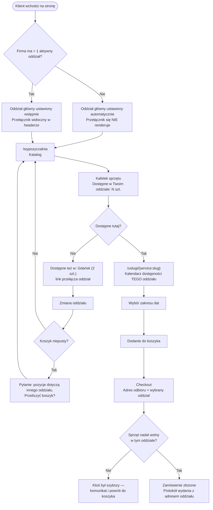

# Podróż klienta — Wybór oddziału

> Zakres wdrożenia i plan kolejnych faz: [`app/docs/features/lokalizacje/`](../features/lokalizacje/README.md).
> Opis dla klienta: [`docs/oferta/wiele-oddzialow.md`](../../../docs/oferta/wiele-oddzialow.md).

**Dla klientów:** jeśli Twoja firma ma kilka oddziałów, klient wybiera oddział raz — jak sklep
w Castoramie — a katalog, dostępność i odbiór dotyczą już tylko tego punktu. Jeśli masz jedną
siedzibę, klient nie zobaczy żadnego wyboru i wszystko wygląda tak jak dziś.

**Włącza się sama przy 2+ aktywnych oddziałach** (`LocationContext::selectionRequired()` —
`activeLocations()->count() > 1`). Flaga `multi_location_stock` opisana w planie **nie istnieje
w kodzie** — nie szukaj jej. Rozszerza
[podróż wypożyczenia](customer-journey-rental.md) — nie zastępuje jej.

## Zasada nadrzędna

**Jedno zamówienie = jeden oddział odbioru.** Klient potrzebujący sprzętu z dwóch punktów składa
dwa zamówienia. Reguła jest wymuszona schematem (`carts.location_id`, migracja
`2026_09_10_090000`, PR #276), a nie dyscypliną kodu.

## Pełna ścieżka

## Karty oddziałów na stronach CMS

Oddziały pojawiają się na stronie jako **karty w bloku „Siatka treści"** na dowolnej stronie CMS.
Karta pokazuje:

| Element | Skąd |
|---|---|
| Nazwa oddziału | pole „Nazwa" |
| Symbol jako plakietka przy nazwie | pole „Symbol" (np. `MMZ`) |
| Adres | ulica, budynek, kod, miasto |
| Krótki opis | pole „Opis", skracany do 120 znaków |
| Godziny otwarcia | tabela „Godziny otwarcia" |
| Zdjęcie siedziby | pole „Zdjęcie siedziby" |
| Pasek do 4 miniatur galerii, z licznikiem „+N" | pole „Galeria" |
| Telefon (klikalny) i e-mail (klikalny) | pola „Telefon", „E-mail" |
| „Zobacz na mapie" | współrzędne z pickera, z zapasowym wyszukaniem po adresie |

**Czego nie ma:** oddział nie ma własnej podstrony ani adresu URL (pole `slug` istnieje,
trasy nie) — istnieje wyłącznie jako karta w siatce.

### Godziny otwarcia trafiają do Google

Godziny wpisane przy oddziale są publikowane nie tylko jako tekst na karcie, ale też
w formacie, który rozumie wyszukiwarka (`LocalBusiness` wg schema.org) — razem z adresem,
telefonem i współrzędnymi. To materiał, z którego Google buduje panel firmy przy wynikach
wyszukiwania i w mapach.

Warunek: godziny muszą być zapisane w rozpoznawalnej formie, np. „Pon-Pt" i „07:00 - 19:00".
Zapisy opisowe w rodzaju „na telefon" trafią na kartę jako tekst, ale nie do wyszukiwarki.

### Dwa kroki, o których trzeba pamiętać

**1. Po dodaniu oddziału dopisz go do strony.** Blok „Siatka treści" trzyma ręcznie
wybraną listę elementów i nie ma opcji „wszystkie". Po dodaniu nowego oddziału trzeba wejść
w stronę CMS i dopisać go do bloku. Nic o tym nie przypomina — strona po prostu wygląda tak
jak wcześniej.

**2. Żeby oddział zniknął ze strony, usuń go z bloku.** Odznaczenie „Aktywna" usuwa oddział
z listy do wyboru w panelu, ale jeśli był już dodany do bloku — nadal się renderuje.
Żeby zniknął, trzeba usunąć go z bloku.

Obie sytuacje wyglądają dla właściciela tak samo: „ustawiłem, a strona pokazuje co innego".
Przy każdej takiej skardze sprawdź najpierw blok „Siatka treści", a dopiero potem oddział.

---

## Co klient widzi przy 2+ oddziałach

| Etap | Co się zmienia względem dziś |
|---|---|
| Wejście na stronę | Oddział główny ustawiony wstępnie; przełącznik w headerze (tylko gdy oddziałów > 1) |
| Katalog | Kafelek pokazuje dostępność **w wybranym oddziale**, nie sumę ze wszystkich |
| Strona sprzętu | Kalendarz i licznik dotyczą wybranego oddziału. Dodatkowo: „Dostępne też w: Gdańsk (2 szt.)" |
| Koszyk | Niesie jeden oddział odbioru; zmiana oddziału z niepustym koszykiem to **jawne pytanie**, nie błąd |
| Checkout | Adres odbioru = adres oddziału; walidacja odrzuca oddział spoza firmy |
| Po zakupie | Protokół wydania i e-maile zawierają adres oddziału |

## Ilość

Ze strony produktu do koszyka trafia zawsze 1 sztuka; **w koszyku klient zmienia ilość**.
Przy składaniu zamówienia pozycja o ilości N rozpada się na N wierszy `OrderItem` po jednej
sztuce (PR #258) — każda sztuka ma własny egzemplarz, numer na protokole i może być
przedłużana osobno. Walidacja dostępności nadal odejmuje N naraz.

Liczba „dostępne 2 szt." jest informacją **czy w ogóle jest sens**, a nie obietnicą. Rozstrzygnięcie
zapada dopiero przy składaniu zamówienia — dodanie do koszyka niczego nie rezerwuje, więc w czasie,
gdy klient się zastanawia, ktoś może go wyprzedzić. **Kto pierwszy zapłaci, ten ma sprzęt.**

## Zwrot

Sprzęt wraca **zawsze do oddziału, z którego został wydany**. Klient nie ma wyboru punktu zwrotu —
adres zwrotu jest ten sam co adres odbioru i widnieje na protokole.

## Czego świadomie nie ma

| Element | Dlaczego |
|---|---|
| Odległość w kilometrach („Gdańsk — 34 km") | System nie zna położenia anonimowego odwiedzającego. Wymaga osobnej decyzji (geolokalizacja przeglądarki albo pole kodu pocztowego) |
| Zwrot w innym oddziale | Decyzja właściciela produktu — utrzymuje prostotę rozliczeń i protokołów |
| Zamówienie z dwóch oddziałów naraz | Jedno zamówienie = jeden protokół wydania, jedna kaucja, jeden odbiór |
| Selektor ilości | Patrz wyżej — kalendarz jest mechanizmem powtarzalnego wyboru |
