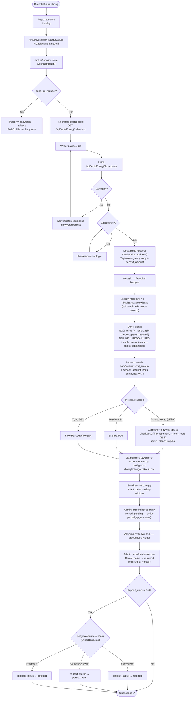

# Podróż klienta — Wypożyczenie (item_rental)

**Dla klientów:** jeśli Twoja firma wypożycza fizyczne przedmioty (sprzęt,
pojazdy, ekwipunek), klienci przeglądają katalog, wybierają zakres dat, dodają
do koszyka i płacą online przez Przelewy24 albo przy odbiorze — z opcjonalną zwrotną kaucją
pobieraną osobiście przy odbiorze, nigdy nie pobieraną online.

Dotyczy rekordów `Service` z `service_type = ServiceType::ItemRental`,
bramkowanych modułem `rentals`. To alternatywna ścieżka zakupu względem
[podróży rezerwacji](customer-journey-booking.md) — wypożyczenie tworzy
rekordy `Order` + `OrderItem` (bieżący przepływ), a nie rekordy `Appointment`.

## Publiczny katalog (bez wymaganej autoryzacji)

| URL | Kontroler | Cel |
|-----|-----------|-----|
| `GET /wypozyczalnia` | `RentalController::index()` | Siatka kategorii + do 6 wyróżnionych przedmiotów |
| `GET /wypozyczalnia/{category:slug}` | `RentalController::showCategory()` | Strona kategorii, siatka przedmiotów |
| `GET /uslugi/{service:slug}` | `ServiceController::show()` | Strona produktu: galeria, specyfikacja, przypięty pasek boczny z ceną, kalendarz dostępności Alpine.js |
| `GET /api/rental/{service:slug}/kalendarz` | — | Dane kalendarza miesięcznego (zablokowane daty), throttling 60/min |
| `GET /api/rental/{service:slug}/dostepnosc` | — | Sprawdzenie dostępności zakresu dat, throttling 60/min |

Gdy `price_on_request = true`, kalendarz i cena są całkowicie ukryte —
zobacz [Podróż klienta — Zapytanie](customer-journey-inquiry.md).

## Pełna podróż wypożyczenia

**Typy danych klienta przy finalizacji zamówienia:**
- **B2C** — adres; PESEL opcjonalny, wymagany tylko gdy `checkout.pesel_required = true` (domyślnie `false`, PR #213); podany jest zawsze walidowany sumą kontrolną
- **B2B** — NIP + REGON + opcjonalnie KRS + osoba upoważniona (osoba prawnie upoważniona do podpisu) + opcjonalnie osoba odbierająca

Pełne szczegóły pól B2C/B2B, maszyna stanów zamówienia oraz sekwencja
płatności P24 znajdują się w [Procesie zakupu](purchase-process.md) — ta strona
skupia się na cyklu życia specyficznym dla wypożyczeń (blokowanie dostępności,
odbiór/zwrot, kaucja).

## Kaucja (deposit) — cykl życia widoczny dla klienta

Wyświetlana jako osobna pozycja poniżej `total_amount` przy finalizacji
zamówienia. Jest poza sumą, nie podlega VAT i nigdy nie jest pobierana przez
Przelewy24 — jest pobierana fizycznie (gotówką lub kartą) przy odbiorze.

| `deposit_status` | Znaczenie |
|---|---|
| `not_required` | `deposit_amount == 0` |
| `pending` | `deposit_amount > 0`, jeszcze nie pobrana |
| `collected` | Admin oznaczył "Pobrano kaucję" przy odbiorze |
| `returned` | Admin oznaczył "Zwrócono kaucję" po zwrocie, pełny zwrot |
| `partial_return` | Admin oznaczył częściowy zwrot |
| `forfeited` | Admin oznaczył przepadek (przypadek uszkodzenia), nieodwracalne |

## Maszyna stanów wypożyczenia

Pod spodem istnieją dwa równoległe przepływy, które oba tworzą wiersze
`Rental` współdzielące tę samą maszynę stanów: **bieżący** (Koszyk → Zamówienie →
`OrderItem` blokuje dostępność) i **legacy** (`createHold()` → status `held` →
`confirmHold()`, wycofany w Sprincie 4, zachowany wyłącznie dla wstecznej
kompatybilności).

```mermaid
stateDiagram-v2
    [*] --> held : createHold() — przepływ legacy [wycofany]
    [*] --> pending : Koszyk → Zamówienie lub ręczne utworzenie przez admina

    held --> pending : confirmHold() [wycofane]
    held --> expired : upłynął held_until (TTL 15 min, automatycznie)
    held --> cancelled : Anulowanie przez admina

    pending --> confirmed : Potwierdzenie przez admina
    pending --> cancelled : Anulowanie przez admina

    confirmed --> active : Admin — przedmiot odebrany
    confirmed --> cancelled : Anulowanie przez admina

    active --> returned : Admin — przedmiot zwrócony
    active --> cancelled : Anulowanie przez admina

    returned --> [*]
    cancelled --> [*]
    expired --> [*]

    note right of held
        Blokuje dostępność
        held_until: znacznik czasu
    end note
    note right of pending
        Blokuje dostępność
    end note
    note right of confirmed
        Blokuje dostępność
        ustawione confirmed_at
    end note
    note right of active
        Blokuje dostępność
        ustawione picked_up_at
    end note
    note right of returned
        NIE blokuje dostępności
        ustawione returned_at
    end note
```

Dostępność ma dwa źródła: `getAvailableQuantity()` odejmuje zarówno z wierszy
legacy `Rental` (statusy blokujące), jak i z bieżących wierszy `OrderItem`
(`paid`/`confirmed`/`in_progress` blokują bezterminowo; `pending_payment`
blokuje tylko dopóki `expires_at > now()`).

**Powiadomienia klienta dla bieżącego przepływu `Order`** (wyzwalacze:
`app/Providers/AppServiceProvider.php`): `OrderAcceptedOfflineNotification` (zamówienie
płatne przy odbiorze), `OrderPaidNotification`, `OrderConfirmedNotification`,
`OrderHandedOverNotification` (wydanie, PR #176), `OrderReturnedNotification` (zwrot, PR #176),
`OrderCancelledNotification`, `RentalReturnDueSoonNotification` / `RentalReturnOverdueNotification`
(dzień przed końcem i po terminie, `ProcessRentalReturnRemindersJob` codziennie 9:00, PR #184),
`RentalExtensionApproved/RejectedNotification`. Właściciel: `OrderPaidNotification` (wariant
admin), `RentalExtensionRequestedNotification`. **Brak** e-maila do właściciela przy zamówieniu
offline w chwili złożenia.

Protokoły wydania i zwrotu (PDF, `OrderProtocolController`, PR #178) — do pobrania przez
klienta z `/moje-zamowienia` i przez admina z panelu; **nie** są załączane do e-maili.

Legacy model `Rental` (zasób `RentalResource`) nadal nie wysyła powiadomień przy swoich
przejściach statusu (`confirmed`, `active`, `returned`, `cancelled`) poza `RentalCancelledNotification`.

## Wypożyczenie vs Rezerwacja — szybkie porównanie

| Wymiar | Wypożyczenie (item_rental) | Rezerwacja (time_slot) |
|-----------|----------------------|----------------------|
| Model | `Rental` (+ `Order`/`OrderItem` w bieżącym przepływie) | `Appointment` |
| Co jest rezerwowane | Fizyczny stan magazynowy (ilość) | Slot czasowy pracownika |
| Granulacja daty | Zakres dat | Pojedyncza data + okno czasowe |
| Płatność | Przelewy24 lub przy odbiorze, przez Order (fake-pay tylko DEV) | Brak (tylko potwierdzenie) |
| Moduł | `rentals` | `bookings` |
| Zasób admina | `RentalResource` / `OrderResource` | `AppointmentResource` |

## Kluczowe pliki

`app/Http/Controllers/RentalController.php`, `app/Http/Controllers/ServiceController.php`,
`app/Services/Cart/CartService.php`, `app/Filament/Resources/RentalResource.php`,
`app/Enums/RentalStatus.php`.
