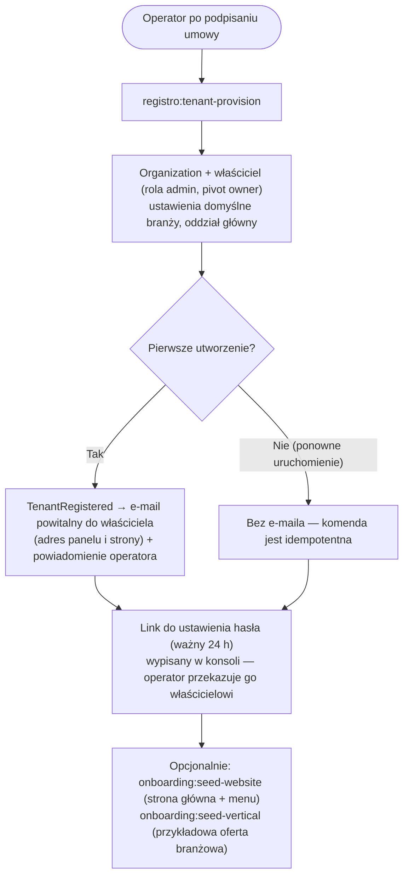

# Onboarding i rejestracja

Dwa różne przepływy: **założenie firmy** (nowy tenant) — robi to operator po podpisaniu
umowy — oraz **rejestracja klienta końcowego** na subdomenie konkretnej firmy.

Opis dla klienta (językiem oferty): [`docs/oferta/model-wspolpracy.md`](../../../docs/oferta/model-wspolpracy.md).

## Założenie firmy (operator, CLI)

**Nie ma publicznej rejestracji firm.** Trzystopniowy kreator `/register` na domenie głównej
(`BusinessRegisterController`) został usunięty 2026-08-08 w PR #159 — produkt sprzedaje się
na umowę, a obca osoba zakładająca organizację była jedną z dróg, którą na stack trafiała druga
organizacja. Zasada i historia: `.claude/rules/onboarding.md`.

```bash
php artisan registro:tenant-provision --slug=acme --name="Acme Sp. z o.o." \
    --industry=equipment_rental --owner-email=owner@acme.pl --owner-name="Jan Kowalski" [--no-email]
```



Ważne dla supportu:

- **E-mail powitalny nie zawiera linku do hasła** — link drukuje komenda. Nowy link:
  `registro:password-setup-link`.
- **Startowa strona i przykładowa oferta nie powstają same** — to osobne komendy
  uruchamiane przy wdrożeniu.
- Moduły domyślnie włączone zależą od branży (`Industry::defaultModules()`); dodatkowe
  (`staff`, `customers`, `communication`, `vehicles`, `service_area`) włącza super-admin
  w panelu Platform.

Mechanika (idempotencja, globalne seedery, blokada singletonu na dedykowanym stacku):
[`app/docs/features/tenant-stack-provisioning.md`](../features/tenant-stack-provisioning.md).

## Rejestracja klienta (tylko subdomena tenanta)

Trasa: `GET/POST /customer/register` — middleware `guest`, `ResolveTenant`,
`CheckRegistrationEnabled` (zależne od własnego ustawienia tenanta
`auth.registration_enabled` — tenant może całkowicie wyłączyć publiczną
rejestrację, np. firmy działające tylko na zaproszenia).

Pola: `first_name`, `last_name`, `email` (unikalny), `password` (min. 8,
potwierdzone). Po sukcesie: `assignRole('customer')`, pivot
`organization_user` z `role = 'customer'`, wywoływane jest zdarzenie
`UserRegistered` (email powitalny trafia do kolejki), przekierowanie na
stronę główną tenanta. **Weryfikacja e-mail nie jest wymagana** — patrz
niżej.

Kompatybilność wsteczna: `/get-started` → przekierowanie 301 do `/register`.

## Role

| Rola | Kto | Dostęp do panelu | Kluczowe uprawnienia |
|------|-----|---------------|---------------|
| `super-admin` | Operator Registro | `/platform` | Wszystko, we wszystkich tenantach |
| `admin` | Właściciel firmy | `/admin` na swojej subdomenie | Pełny panel Filament tenanta |
| `staff` | Pracownik dodany przez admina | `/admin` na subdomenie swojej organizacji | Zakres zależny od uprawnień modułów |
| `customer` | Klient końcowy | Brak (tylko frontend) | Rezerwacje, koszyk, zamówienia, `/moje-konto` |

Przekierowanie po zalogowaniu (`LoginController::authenticated()`):
`super-admin` → `/platform`; `admin`/`staff` na subdomenie tenanta →
`/admin`; `admin`/`staff` na domenie głównej → subdomena `/admin` ich
pierwszej organizacji; `customer` → `appointments.index`.

Wartość pivotu `organization_user.role` (`owner`/`customer`/`staff`) jest
niezależna od opisanego wyżej systemu ról Spatie.

## Model rozliczenia i pola billingowe

**Model biznesowy.** Registro nie jest sprzedawane jako abonament SaaS w
planach cenowych i nie ma triala przechodzącego w subskrypcję. Klient płaci:

- jednorazowo za **wdrożenie**,
- okresowo za **dostęp do usługi** — zwykle rocznie, opcjonalnie miesięcznie,
- osobno za **wsparcie / utrzymanie**.

Przed decyzją klient może dostać **dostęp do panelu demo na określoną liczbę
dni**, żeby zobaczyć jak działa panel. Kwoty ustalane są indywidualnie w
ofercie — repozytorium nie zawiera cennika.

**Stan w kodzie.** Nazwy kolumn pochodzą z wcześniejszego założenia SaaS i
nie odpowiadają już modelowi biznesowemu:

| Kolumna | Co robi kod | Znaczenie biznesowe |
|--------|-------------|---------------------|
| `trial_ends_at` | Ustawiane na `now()->addDays(14)` przy tworzeniu organizacji | Brak triala; pole technicznie istnieje, nie egzekwuje niczego |
| `subscription_status` | `trial` \| `active` \| `paused` \| `cancelled` — domyślnie `trial` | Status umowy na dostęp (`active` = opłacony dostęp) |
| `monthly_fee` | Nullable, wpisywane ręcznie | Opłata za dostęp w przeliczeniu na miesiąc (przy rozliczeniu rocznym: kwota roczna / 12) |
| `subscribed_at`, `subscription_expires_at` | Nullable, zarządzane ręcznie | Początek i koniec opłaconego okresu dostępu |

**Nie istnieje żadne automatyczne egzekwowanie.** Nic nie blokuje dostępu
po dacie `trial_ends_at` — statusy i płatności (`TenantPayment`) prowadzone
są ręcznie w panelu Platform. Nieaktywne organizacje są uzupełniane wstecznie
do `subscription_status = 'cancelled'`. Dostosowanie kodu do modelu
(usunięcie automatycznego triala, nazewnictwo w panelu Platform) to osobne
zadanie.

## Reset i ustawienie hasła

**Standardowy reset** (dowolny użytkownik): `GET /password/reset` → link
w e-mailu → `GET /password/reset/{token}` → `POST`, throttling 5/min.

**Ustawienie hasła dla użytkownika utworzonego przez admina** (i dla właściciela po
`registro:tenant-provision`): `User::initiatePasswordSetup()` generuje token ważny
`User::PASSWORD_SETUP_TTL_HOURS` (24 h, od PR #159; wcześniej 30 min) → e-mail z linkiem
konfiguracyjnym (przy provisioningu — link w konsoli)
→ `GET/POST /password/setup/{token}` (6/min) → ustawienie hasła,
przekierowanie do `/login`.

## Weryfikacja e-mail

**Właściciel firmy nie dostaje e-maila weryfikacyjnego.** `ProvisionTenantOrganization`
tworzy go z `password = null` i pustym `email_verified_at`; adres potwierdza de facto
ustawienie hasła z linku. (Auto-weryfikacja `email_verified_at = now()` należała do
usuniętego kreatora.)

**Rejestracja klienta nie wymusza weryfikacji** —
`MustVerifyEmail` jest zakomentowany w modelu `User`, więc bramka
weryfikacji nigdy nie jest uruchamiana także dla klientów, mimo że
`email_verified_at` pozostaje puste (null).

## Kluczowe pliki

`app/Console/Commands/ProvisionTenantCommand.php`,
`app/Actions/Onboarding/ProvisionTenantOrganization.php`,
`app/Actions/Onboarding/SeedOrganizationDefaults.php`,
`app/Actions/Onboarding/SeedTenantWebsite.php`,
`app/Http/Controllers/Auth/RegisterController.php` (rejestracja klienta),
`app/Enums/Industry.php`, `app/Models/User.php`.
