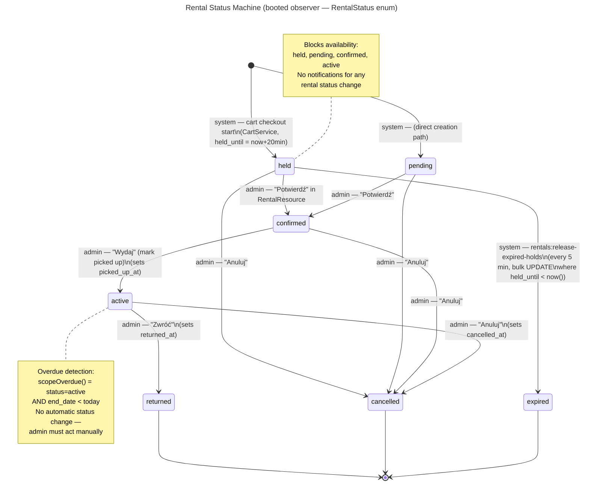

# Status Machines — All Entities

Quick reference for all status transitions in the system. Ported 2026-07 from
a deprecated repo-root `docs/architecture/status-machines.md` and corrected
against `app/StateMachines/OrderStatusStateMachine.php` (two missing order
transitions — see the Order Statuses section below). For the
customer/business-facing view of these same transitions, see
[Business → Purchase Process](../business/purchase-process.md) and
[Business → Cancellation](../business/customer-journey-cancellation.md).

---

## Order Statuses

**Column:** `orders.status` | **Implementation:** `OrderStatusStateMachine` (laravel-eloquent-state-machines) | **History recorded:** yes

**Values:** `pending_payment` | `paid` | `confirmed` | `in_progress` | `completed` | `cancelled` | `refunded`

**Default:** `pending_payment`

| Status | Triggered By | Notification Fired | Next Possible States |
|---|---|---|---|
| `pending_payment` | system — `CartService::convertToOrder()` at checkout submission | none | `paid`, `cancelled` |
| `paid` | system — P24 webhook verified in `Przelewy24Service::handleWebhook()` → `transitionTo('paid')` + `event(new OrderPaid)` | `OrderPaidNotification` → customer + org owner (ShouldQueue + ShouldBeUnique) | `confirmed`, `cancelled` |
| `confirmed` | admin — "Potwierdź" action in `OrderResource` / `EditOrder` page | `OrderConfirmedNotification` → customer (via `OrderConfirmed` event hook) | `in_progress`, `cancelled` |
| `in_progress` | system — scheduled job when `start_date` arrives | none | `completed`, `cancelled` |
| `completed` | admin — "Zakończ" action | none | `refunded` |
| `cancelled` | (a) system — `orders:cleanup-expired` artisan cmd every 5 min when `expires_at < now()` (TTL 20 min); (b) customer — `OrderController::cancel()` from `pending_payment` only; (c) admin — "Anuluj" action, UI exposes `pending_payment \| paid \| confirmed`, service layer (`OrderService::cancel()`) also accepts `in_progress` for exceptional forced-offboarding calls made directly against the service | `OrderCancelledNotification` → customer (via `OrderCancelled` event hook) | `paid` (reconciliation only, see below) |
| `refunded` | admin — declared in state machine; no UI action implemented yet | none | — (terminal) |

**Customer cancel guard:** `OrderController::cancel()` uses `abort_unless` —
only callable from `pending_payment`. `OrderService::cancel()` throws a
`LogicException` for any status other than `pending_payment`, `paid`,
`confirmed`, or `in_progress`.

**Reconciliation transition (`cancelled → paid`):** guarded by
`validatorForTransition()` in `OrderStatusStateMachine` — requires an
existing `Payment(status=success)` row before allowing it, enforced
regardless of caller. Exists because a genuine P24 success webhook can arrive
after `orders:cleanup-expired` has already cancelled the order (a slow
bank/BLIK confirmation racing the TTL cron); money was actually captured, so
the order must be recoverable rather than permanently orphaned.

```mermaid
---
title: Order Status Machine (OrderStatusStateMachine)
---
stateDiagram-v2
    [*] --> pending_payment : system — CartService::convertToOrder()

    pending_payment --> paid : system — P24 webhook verified\n(OrderPaidNotification → customer + owner)
    pending_payment --> cancelled : system — orders:cleanup-expired (TTL 20 min)\ncustomer — OrderController::cancel()\nadmin — OrderResource action\n(OrderCancelledNotification → customer)

    paid --> confirmed : admin — "Potwierdź" in OrderResource\n(OrderConfirmedNotification → customer)
    paid --> cancelled : admin — "Anuluj"\n(OrderCancelledNotification → customer)

    confirmed --> in_progress : system — scheduled job, start_date reached
    confirmed --> cancelled : admin — "Anuluj"\n(OrderCancelledNotification → customer)

    in_progress --> completed : admin — "Zakończ"
    in_progress --> cancelled : admin/system — forced offboarding (exceptional,\nnot exposed via standard OrderResource UI button)

    completed --> refunded : admin — (no UI yet; declared in state machine)

    cancelled --> paid : system — reconciliation ONLY\nrequires existing Payment(status=success) row\nenforced by validatorForTransition()

    cancelled --> [*]
    refunded --> [*]
    completed --> [*]
```

---

## Order Deposit Status

**Column:** `orders.deposit_status` | **Implementation:** plain string column, no state machine library

**Values:** `not_required` | `pending` | `collected` | `returned` | `partial_return` | `forfeited`

| Status | Triggered By | Next Possible States |
|---|---|---|
| `not_required` | system — `CartService::convertToOrder()` when `deposit_total == 0` | — (terminal) |
| `pending` | system — `CartService::convertToOrder()` when `deposit_total > 0` | `collected` |
| `collected` | admin — "Pobrano kaucję" row action in `OrderResource` / `EditOrder`; sets `deposit_collected_at` | `returned`, `partial_return`, `forfeited` |
| `returned` | admin — "Zwrócono kaucję" row action; sets `deposit_returned_at` | — (terminal) |
| `partial_return` | admin — manual | — |
| `forfeited` | admin — "Kaucja przepadła" row action | — (terminal) |

```mermaid
---
title: Order Deposit Status (plain column — no state machine)
---
stateDiagram-v2
    [*] --> not_required : system — deposit_total == 0\nat CartService::convertToOrder()
    [*] --> pending : system — deposit_total > 0\nat CartService::convertToOrder()

    pending --> collected : admin — "Pobrano kaucję"\n(sets deposit_collected_at)

    collected --> returned : admin — "Zwrócono kaucję"\n(sets deposit_returned_at)
    collected --> partial_return : admin — (manual)
    collected --> forfeited : admin — "Kaucja przepadła"

    returned --> [*]
    forfeited --> [*]
    not_required --> [*]
```

---

## Appointment Statuses

**Column:** `appointments.status` | **Implementation:** `booted()` observer on model; `AppointmentStatus` backed enum | **No state machine library.**

**Values:** `pending` | `confirmed` | `cancelled` | `completed`

**Default:** `pending` (set in `AppointmentController::store()`)

**Active statuses** (`isActive()`): `pending`, `confirmed` — both block slot availability.

| Status | Triggered By | Notification Fired | Next Possible States |
|---|---|---|---|
| `pending` | customer — `AppointmentController::store()` at booking; dispatches `AppointmentCreated` via `$dispatchesEvents` | `AppointmentCreatedNotification` → customer (email) + SMS if `send_booking_confirmation` setting enabled | `confirmed`, `cancelled`, `completed` |
| `confirmed` | admin — edit status field in `AppointmentResource` Filament form | SMS if `send_admin_confirmation` setting enabled (no email — `AppointmentConfirmedNotification` class does not exist) | `pending` (reversible), `cancelled`, `completed` |
| `cancelled` | (a) customer — `AppointmentController::cancel()` only if `can_be_cancelled` (appointment is future and before cancellation deadline from `cancellationHours()` setting); (b) admin — edit status in form | `AppointmentCancelledNotification` → customer (email) + SMS if `send_cancellation` setting enabled | — (terminal) |
| `completed` | admin — edit status in form; sets `completed_at` | none | — (terminal) |

**Reschedule (not a status):** when admin changes `appointment_date` /
`start_time` / `end_time` while status is not `cancelled`,
`AppointmentRescheduledNotification` is sent to customer (email + SMS if
`send_rescheduled` enabled). **Confirmed bug:** the `AppointmentRescheduled`
event is dispatched from `Appointment::booted()` with only the `Appointment`
argument, but its constructor requires
`(Appointment $appointment, Carbon $oldDate, Carbon $newDate)` — this throws
a `TypeError` at runtime. Still present as of 2026-07 (see the "Known bug — reschedule TypeError"
section on [Business → Customer Journey: Booking](../business/customer-journey-booking.md)).

**Cancellation deadline:** `appointment_datetime - cancellationHours()`
(configurable in admin settings). Past appointments cannot be cancelled by
customer.

```mermaid
---
title: Appointment Status Machine (booted observer — AppointmentStatus enum)
---
stateDiagram-v2
    [*] --> pending : customer — AppointmentController::store()\n(AppointmentCreatedNotification → customer\n+ SMS if send_booking_confirmation)

    pending --> confirmed : admin — edit status in AppointmentResource\n(SMS if send_admin_confirmation; no email)
    confirmed --> pending : admin — edit status back (reversible)

    pending --> cancelled : customer — AppointmentController::cancel()\n  (only if future + before cancellation deadline)\nadmin — edit status in form\n(AppointmentCancelledNotification → customer + SMS)
    confirmed --> cancelled : customer — cancel() if within deadline\nadmin — edit status in form\n(AppointmentCancelledNotification → customer + SMS)

    pending --> completed : admin — edit status in form\n(sets completed_at)
    confirmed --> completed : admin — edit status in form\n(sets completed_at)

    note right of pending
        Reschedule (not a status change):
        admin changes date/time while
        status ≠ cancelled →
        AppointmentRescheduledNotification
        → customer + SMS
        BUG: TypeError at runtime — oldDate/newDate
        args missing in booted()
    end note

    cancelled --> [*]
    completed --> [*]
```

---

## Rental Statuses

**Column:** `rentals.status` | **Implementation:** `booted()` observer on model; `RentalStatus` backed enum | **No state machine library.**

**Values:** `held` | `pending` | `confirmed` | `active` | `returned` | `cancelled` | `expired`

**Blocks availability:** `held`, `pending`, `confirmed`, `active`

**No notifications exist for any rental status change.**

| Status | Triggered By | Next Possible States |
|---|---|---|
| `held` | system — cart checkout start via `CartService`; `held_until = now() + 20 min` | `confirmed`, `cancelled`, `expired` |
| `pending` | system — direct creation path (non-cart) | `confirmed`, `cancelled` |
| `confirmed` | admin — "Potwierdź" action in `RentalResource` | `active`, `cancelled` |
| `active` | admin — "Wydaj" (mark as picked up); sets `picked_up_at` | `returned`, `cancelled` |
| `returned` | admin — "Zwróć"; sets `returned_at` | — (terminal) |
| `cancelled` | admin — "Anuluj" (visible when not in `[returned, cancelled, expired]`); sets `cancelled_at` | — (terminal) |
| `expired` | system — `rentals:release-expired-holds` artisan cmd every 5 min; bulk `UPDATE` where `status = held AND held_until < now()` | — (terminal) |

**Overdue detection:** `scopeOverdue()` = `status = active AND end_date < today`. No automatic status change — admin must act manually.

**Timestamps:** `confirmed_at`, `picked_up_at`, `returned_at`, `cancelled_at` are cast as datetimes. `pending_at` does not exist.



---

## Cart Statuses

**Column:** `carts.status` | **Implementation:** plain string column, no state machine

**Values:** `active` | `abandoned` | `converted`

| Status | Triggered By | Next Possible States |
|---|---|---|
| `active` | system — `CartService` creates cart at `status = 'active'` when customer first adds to cart | `abandoned`, `converted` |
| `abandoned` | system — `MarkCartsAbandonedJob` every 5 min: carts with `status = active AND updated_at < now() - 30 min`; sets `abandoned_at`; fires `cart.abandoned` analytics event | — (deleted after 7 days) |
| `converted` | system — `CartService::convertToOrder()` after Order created; guard: `status` must be `active` | — (terminal) |

**Cleanup:** `carts:cleanup-abandoned` artisan command runs daily at 02:00 — deletes abandoned carts older than 7 days.

```mermaid
---
title: Cart Status (plain string column)
---
stateDiagram-v2
    [*] --> active : system — CartService creates cart\n(customer adds to cart)

    active --> abandoned : system — MarkCartsAbandonedJob\n(every 5 min: updated_at < now()-30min)\n(sets abandoned_at; fires cart.abandoned analytics event)
    active --> converted : system — CartService::convertToOrder()\n(after Order created; guard: status must be active)

    abandoned --> [*] : system — carts:cleanup-abandoned\n(daily 02:00 — deletes if older than 7 days)
    converted --> [*]
```

---

## Payment Statuses

**Column:** `payments.status` | **Implementation:** plain string, immutable records

**Values:** `success` | `failed`

Payment records are immutable after creation. Each webhook attempt creates a new `Payment` row — there are no transitions between statuses.

| Status | Triggered By |
|---|---|
| `success` | system — P24 transaction verified successfully in `Przelewy24Service::handleWebhook()` |
| `failed` | system — `Przelewy24Exception` thrown during `verify()` in the same handler |

```mermaid
---
title: Payment Status (plain string — immutable records)
---
stateDiagram-v2
    [*] --> success : system — P24 webhook\nPrzelewy24Service::handleWebhook()\ntransaction verified OK

    [*] --> failed : system — P24 webhook\nPrzelewy24Exception thrown\nduring verify()

    note right of success
        Payment records are immutable.
        Each webhook attempt creates
        a new Payment row — no
        transitions between statuses.
    end note

    success --> [*]
    failed --> [*]
```

---

## Organization Subscription Status

**Column:** `organizations.subscription_status` | **Implementation:** plain string, no state machine

**Values:** `trial` | `active` | `paused` | `cancelled`

No code-enforced transitions. Managed manually by super-admin via Platform panel.

| Status | Used By |
|---|---|
| `trial` | `isOnTrial()` checks `subscription_status === 'trial'` |
| `active` | `isSubscribed()` checks `subscription_status === 'active'` |
| `paused` | no helper method; checked ad-hoc |
| `cancelled` | no helper method; checked ad-hoc |
