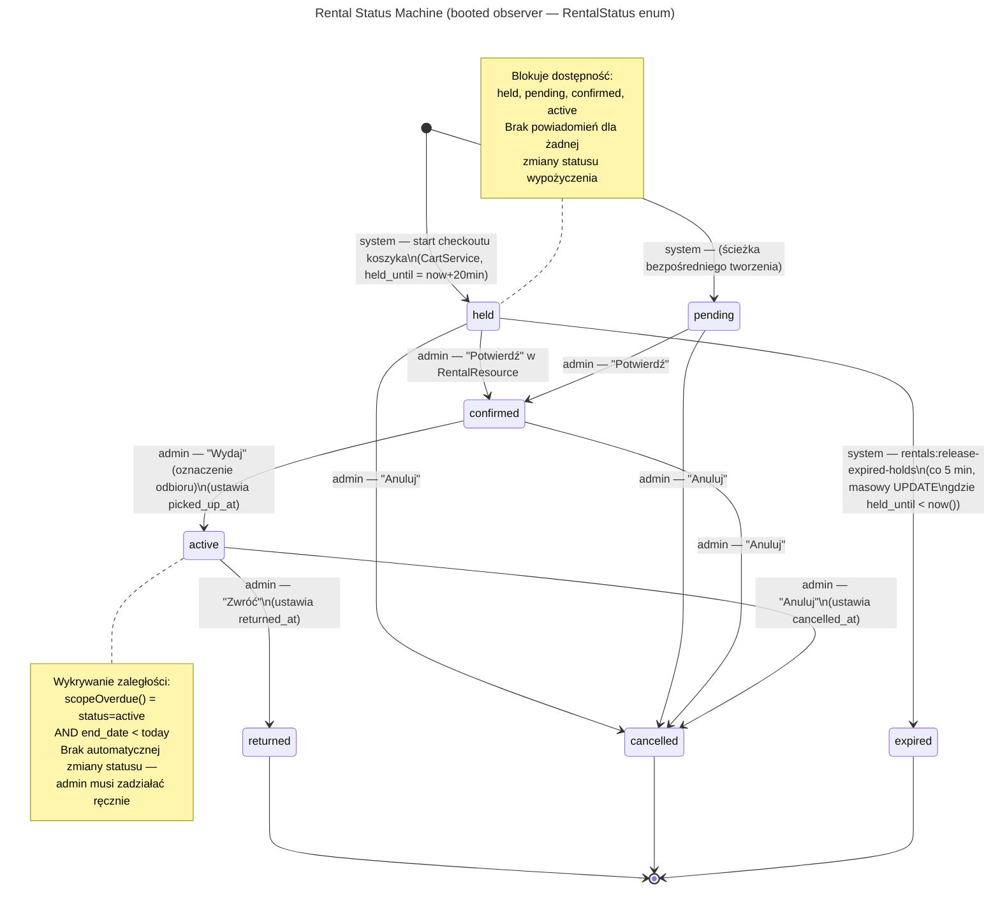

# Maszyny stanów — wszystkie encje

Szybki przegląd wszystkich przejść statusów w systemie. Przeniesione 2026-07 z
przestarzałego pliku `docs/architecture/status-machines.md` w katalogu głównym repo
i skorygowane względem `app/StateMachines/OrderStatusStateMachine.php` (dwa brakujące
przejścia statusu zamówienia — patrz sekcja Statusy zamówienia poniżej). Widok tych
samych przejść zorientowany na klienta/biznes znajduje się w
[Business → Purchase Process](../business/purchase-process.md) oraz
[Business → Cancellation](../business/customer-journey-cancellation.md).

---

## Statusy zamówienia

**Kolumna:** `orders.status` | **Implementacja:** `OrderStatusStateMachine` (laravel-eloquent-state-machines) | **Historia zapisywana:** tak

**Wartości:** `pending_payment` | `paid` | `confirmed` | `in_progress` | `completed` | `cancelled` | `refunded`

**Domyślny:** `pending_payment`

| Status | Wywoływany przez | Wysyłane powiadomienie | Możliwe kolejne stany |
|---|---|---|---|
| `pending_payment` | system — `CartService::convertToOrder()` przy złożeniu zamówienia (checkout) | brak | `paid`, `cancelled` |
| `paid` | system — webhook P24 zweryfikowany w `Przelewy24Service::handleWebhook()` → `transitionTo('paid')` + `event(new OrderPaid)` | `OrderPaidNotification` → klient + właściciel organizacji (ShouldQueue + ShouldBeUnique) | `confirmed`, `cancelled` |
| `confirmed` | admin — akcja "Potwierdź" w `OrderResource` / stronie `EditOrder` | `OrderConfirmedNotification` → klient (przez hook zdarzenia `OrderConfirmed`) | `in_progress`, `cancelled` |
| `in_progress` | system — zaplanowane zadanie (job) w momencie nadejścia `start_date` | brak | `completed`, `cancelled` |
| `completed` | admin — akcja "Zakończ" | brak | `refunded` |
| `cancelled` | (a) system — komenda artisan `orders:cleanup-expired` co 5 minut, gdy `expires_at < now()` (TTL 20 min); (b) klient — `OrderController::cancel()`, tylko ze statusu `pending_payment`; (c) admin — akcja "Anuluj", UI udostępnia `pending_payment \| paid \| confirmed`, warstwa serwisowa (`OrderService::cancel()`) dopuszcza też `in_progress` dla wyjątkowych, wymuszonych wywołań offboardingowych wykonywanych bezpośrednio na serwisie | `OrderCancelledNotification` → klient (przez hook zdarzenia `OrderCancelled`) | `paid` (tylko rekoncyliacja, patrz niżej) |
| `refunded` | admin — zadeklarowany w maszynie stanów; brak jeszcze zaimplementowanej akcji UI | brak | — (stan końcowy) |

**Zabezpieczenie anulowania przez klienta:** `OrderController::cancel()` używa
`abort_unless` — wywoływalne tylko ze statusu `pending_payment`. `OrderService::cancel()`
rzuca `LogicException` dla każdego statusu innego niż `pending_payment`, `paid`,
`confirmed` lub `in_progress`.

**Przejście rekoncyliacyjne (`cancelled → paid`):** zabezpieczone przez
`validatorForTransition()` w `OrderStatusStateMachine` — wymaga istnienia
wiersza `Payment(status=success)` zanim zostanie dopuszczone, egzekwowane
niezależnie od wywołującego. Istnieje, ponieważ prawdziwy udany webhook P24
może nadejść już po tym, jak `orders:cleanup-expired` anulowało zamówienie
(wolne potwierdzenie banku/BLIK ścigające się z cronem TTL); pieniądze zostały
faktycznie pobrane, więc zamówienie musi dać się odzyskać zamiast trwale
pozostać osierocone.

```mermaid
---
title: Order Status Machine (OrderStatusStateMachine)
---
stateDiagram-v2
    [*] --> pending_payment : system — CartService::convertToOrder()

    pending_payment --> paid : system — webhook P24 zweryfikowany\n(OrderPaidNotification → klient + właściciel)
    pending_payment --> cancelled : system — orders:cleanup-expired (TTL 20 min)\nklient — OrderController::cancel()\nadmin — akcja OrderResource\n(OrderCancelledNotification → klient)

    paid --> confirmed : admin — "Potwierdź" w OrderResource\n(OrderConfirmedNotification → klient)
    paid --> cancelled : admin — "Anuluj"\n(OrderCancelledNotification → klient)

    confirmed --> in_progress : system — zaplanowane zadanie, osiągnięto start_date
    confirmed --> cancelled : admin — "Anuluj"\n(OrderCancelledNotification → klient)

    in_progress --> completed : admin — "Zakończ"
    in_progress --> cancelled : admin/system — wymuszony offboarding (wyjątkowo,\nniedostępne przez standardowy przycisk UI OrderResource)

    completed --> refunded : admin — (brak jeszcze UI; zadeklarowane w maszynie stanów)

    cancelled --> paid : system — TYLKO rekoncyliacja\nwymaga istniejącego wiersza Payment(status=success)\negzekwowane przez validatorForTransition()

    cancelled --> [*]
    refunded --> [*]
    completed --> [*]
```

---

## Status kaucji zamówienia

**Kolumna:** `orders.deposit_status` | **Implementacja:** zwykła kolumna string, brak biblioteki maszyny stanów

**Wartości:** `not_required` | `pending` | `collected` | `returned` | `partial_return` | `forfeited`

| Status | Wywoływany przez | Możliwe kolejne stany |
|---|---|---|
| `not_required` | system — `CartService::convertToOrder()`, gdy `deposit_total == 0` | — (stan końcowy) |
| `pending` | system — `CartService::convertToOrder()`, gdy `deposit_total > 0` | `collected` |
| `collected` | admin — akcja wiersza "Pobrano kaucję" w `OrderResource` / `EditOrder`; ustawia `deposit_collected_at` | `returned`, `partial_return`, `forfeited` |
| `returned` | admin — akcja wiersza "Zwrócono kaucję"; ustawia `deposit_returned_at` | — (stan końcowy) |
| `partial_return` | admin — ręcznie | — |
| `forfeited` | admin — akcja wiersza "Kaucja przepadła" | — (stan końcowy) |

```mermaid
---
title: Order Deposit Status (plain column — no state machine)
---
stateDiagram-v2
    [*] --> not_required : system — deposit_total == 0\nprzy CartService::convertToOrder()
    [*] --> pending : system — deposit_total > 0\nprzy CartService::convertToOrder()

    pending --> collected : admin — "Pobrano kaucję"\n(ustawia deposit_collected_at)

    collected --> returned : admin — "Zwrócono kaucję"\n(ustawia deposit_returned_at)
    collected --> partial_return : admin — (ręcznie)
    collected --> forfeited : admin — "Kaucja przepadła"

    returned --> [*]
    forfeited --> [*]
    not_required --> [*]
```

---

## Statusy wizyty (Appointment)

**Kolumna:** `appointments.status` | **Implementacja:** obserwator `booted()` na modelu; enum `AppointmentStatus` oparty na wartościach | **Brak biblioteki maszyny stanów.**

**Wartości:** `pending` | `confirmed` | `cancelled` | `completed`

**Domyślny:** `pending` (ustawiany w `AppointmentController::store()`)

**Statusy aktywne** (`isActive()`): `pending`, `confirmed` — oba blokują dostępność terminu.

| Status | Wywoływany przez | Wysyłane powiadomienie | Możliwe kolejne stany |
|---|---|---|---|
| `pending` | klient — `AppointmentController::store()` przy rezerwacji; wysyła zdarzenie `AppointmentCreated` przez `$dispatchesEvents` | `AppointmentCreatedNotification` → klient (email) + SMS, jeśli włączone ustawienie `send_booking_confirmation` | `confirmed`, `cancelled`, `completed` |
| `confirmed` | admin — edycja pola statusu w formularzu Filament `AppointmentResource` | SMS, jeśli włączone ustawienie `send_admin_confirmation` (brak emaila — klasa `AppointmentConfirmedNotification` nie istnieje) | `pending` (odwracalne), `cancelled`, `completed` |
| `cancelled` | (a) klient — `AppointmentController::cancel()` tylko jeśli `can_be_cancelled` (wizyta jest w przyszłości i przed terminem granicznym anulowania z ustawienia `cancellationHours()`); (b) admin — edycja statusu w formularzu | `AppointmentCancelledNotification` → klient (email) + SMS, jeśli włączone ustawienie `send_cancellation` | — (stan końcowy) |
| `completed` | admin — edycja statusu w formularzu; ustawia `completed_at` | brak | — (stan końcowy) |

**Zmiana terminu (nie jest statusem):** gdy admin zmienia `appointment_date` /
`start_time` / `end_time`, podczas gdy status nie jest `cancelled`, wysyłane jest
`AppointmentRescheduledNotification` do klienta (email + SMS, jeśli włączone
`send_rescheduled`). **Potwierdzony błąd:** zdarzenie `AppointmentRescheduled` jest
wysyłane z `Appointment::booted()` tylko z argumentem `Appointment`, ale jego
konstruktor wymaga `(Appointment $appointment, Carbon $oldDate, Carbon $newDate)`
— powoduje to `TypeError` w czasie działania. Nadal obecne w 2026-07 (patrz sekcja
"Known bug — reschedule TypeError" na
[Business → Customer Journey: Booking](../business/customer-journey-booking.md)).

**Termin graniczny anulowania:** `appointment_datetime - cancellationHours()`
(konfigurowalne w ustawieniach admina). Wizyty z przeszłości nie mogą zostać
anulowane przez klienta.

```mermaid
---
title: Appointment Status Machine (booted observer — AppointmentStatus enum)
---
stateDiagram-v2
    [*] --> pending : klient — AppointmentController::store()\n(AppointmentCreatedNotification → klient\n+ SMS jeśli send_booking_confirmation)

    pending --> confirmed : admin — edycja statusu w AppointmentResource\n(SMS jeśli send_admin_confirmation; brak emaila)
    confirmed --> pending : admin — cofnięcie statusu (odwracalne)

    pending --> cancelled : klient — AppointmentController::cancel()\n  (tylko jeśli przyszłość + przed terminem granicznym anulowania)\nadmin — edycja statusu w formularzu\n(AppointmentCancelledNotification → klient + SMS)
    confirmed --> cancelled : klient — cancel() jeśli w granicach terminu\nadmin — edycja statusu w formularzu\n(AppointmentCancelledNotification → klient + SMS)

    pending --> completed : admin — edycja statusu w formularzu\n(ustawia completed_at)
    confirmed --> completed : admin — edycja statusu w formularzu\n(ustawia completed_at)

    note right of pending
        Zmiana terminu (nie jest zmianą statusu):
        admin zmienia datę/godzinę podczas gdy
        status ≠ cancelled →
        AppointmentRescheduledNotification
        → klient + SMS
        BŁĄD: TypeError w czasie działania — brak
        argumentów oldDate/newDate w booted()
    end note

    cancelled --> [*]
    completed --> [*]
```

---

## Statusy wypożyczenia (Rental)

**Kolumna:** `rentals.status` | **Implementacja:** obserwator `booted()` na modelu; enum `RentalStatus` oparty na wartościach | **Brak biblioteki maszyny stanów.**

**Wartości:** `held` | `pending` | `confirmed` | `active` | `returned` | `cancelled` | `expired`

**Blokuje dostępność:** `held`, `pending`, `confirmed`, `active`

**Dla żadnej zmiany statusu wypożyczenia nie istnieją powiadomienia.**

| Status | Wywoływany przez | Możliwe kolejne stany |
|---|---|---|
| `held` | system — start checkoutu koszyka przez `CartService`; `held_until = now() + 20 min` | `confirmed`, `cancelled`, `expired` |
| `pending` | system — ścieżka bezpośredniego tworzenia (poza koszykiem) | `confirmed`, `cancelled` |
| `confirmed` | admin — akcja "Potwierdź" w `RentalResource` | `active`, `cancelled` |
| `active` | admin — "Wydaj" (oznaczenie odbioru); ustawia `picked_up_at` | `returned`, `cancelled` |
| `returned` | admin — "Zwróć"; ustawia `returned_at` | — (stan końcowy) |
| `cancelled` | admin — "Anuluj" (widoczne, gdy status nie jest jednym z `[returned, cancelled, expired]`); ustawia `cancelled_at` | — (stan końcowy) |
| `expired` | system — komenda artisan `rentals:release-expired-holds` co 5 minut; masowy `UPDATE`, gdzie `status = held AND held_until < now()` | — (stan końcowy) |

**Wykrywanie zaległości:** `scopeOverdue()` = `status = active AND end_date < today`. Brak automatycznej zmiany statusu — admin musi zadziałać ręcznie.

**Znaczniki czasu:** `confirmed_at`, `picked_up_at`, `returned_at`, `cancelled_at` są rzutowane jako datetime. Kolumna `pending_at` nie istnieje.



---

## Statusy koszyka (Cart)

**Kolumna:** `carts.status` | **Implementacja:** zwykła kolumna string, brak maszyny stanów

**Wartości:** `active` | `abandoned` | `converted`

| Status | Wywoływany przez | Możliwe kolejne stany |
|---|---|---|
| `active` | system — `CartService` tworzy koszyk ze `status = 'active'`, gdy klient po raz pierwszy dodaje coś do koszyka | `abandoned`, `converted` |
| `abandoned` | system — `MarkCartsAbandonedJob` co 5 minut: koszyki ze `status = active AND updated_at < now() - 30 min`; ustawia `abandoned_at`; wysyła zdarzenie analityczne `cart.abandoned` | — (usuwany po 7 dniach) |
| `converted` | system — `CartService::convertToOrder()` po utworzeniu zamówienia; zabezpieczenie: `status` musi być `active` | — (stan końcowy) |

**Sprzątanie:** komenda artisan `carts:cleanup-abandoned` uruchamiana codziennie o 02:00 — usuwa porzucone koszyki starsze niż 7 dni.

```mermaid
---
title: Cart Status (plain string column)
---
stateDiagram-v2
    [*] --> active : system — CartService tworzy koszyk\n(klient dodaje do koszyka)

    active --> abandoned : system — MarkCartsAbandonedJob\n(co 5 min: updated_at < now()-30min)\n(ustawia abandoned_at; wysyła zdarzenie analityczne cart.abandoned)
    active --> converted : system — CartService::convertToOrder()\n(po utworzeniu zamówienia; zabezpieczenie: status musi być active)

    abandoned --> [*] : system — carts:cleanup-abandoned\n(codziennie 02:00 — usuwa jeśli starsze niż 7 dni)
    converted --> [*]
```

---

## Statusy płatności (Payment)

**Kolumna:** `payments.status` | **Implementacja:** zwykły string, rekordy niemutowalne

**Wartości:** `success` | `failed`

Rekordy płatności są niemutowalne po utworzeniu. Każda próba webhooka tworzy nowy wiersz `Payment` — nie ma przejść między statusami.

| Status | Wywoływany przez |
|---|---|
| `success` | system — transakcja P24 pomyślnie zweryfikowana w `Przelewy24Service::handleWebhook()` |
| `failed` | system — `Przelewy24Exception` rzucony podczas `verify()` w tym samym handlerze |

```mermaid
---
title: Payment Status (plain string — immutable records)
---
stateDiagram-v2
    [*] --> success : system — webhook P24\nPrzelewy24Service::handleWebhook()\ntransakcja zweryfikowana OK

    [*] --> failed : system — webhook P24\nrzucony Przelewy24Exception\npodczas verify()

    note right of success
        Rekordy płatności są niemutowalne.
        Każda próba webhooka tworzy
        nowy wiersz Payment — brak
        przejść między statusami.
    end note

    success --> [*]
    failed --> [*]
```

---

## Status subskrypcji organizacji

**Kolumna:** `organizations.subscription_status` | **Implementacja:** zwykły string, brak maszyny stanów

**Wartości:** `trial` | `active` | `paused` | `cancelled`

Brak przejść wymuszanych przez kod. Zarządzane ręcznie przez super-admina przez panel Platform.

| Status | Wykorzystywany przez |
|---|---|
| `trial` | `isOnTrial()` sprawdza `subscription_status === 'trial'` |
| `active` | `isSubscribed()` sprawdza `subscription_status === 'active'` |
| `paused` | brak metody pomocniczej; sprawdzane doraźnie |
| `cancelled` | brak metody pomocniczej; sprawdzane doraźnie |
