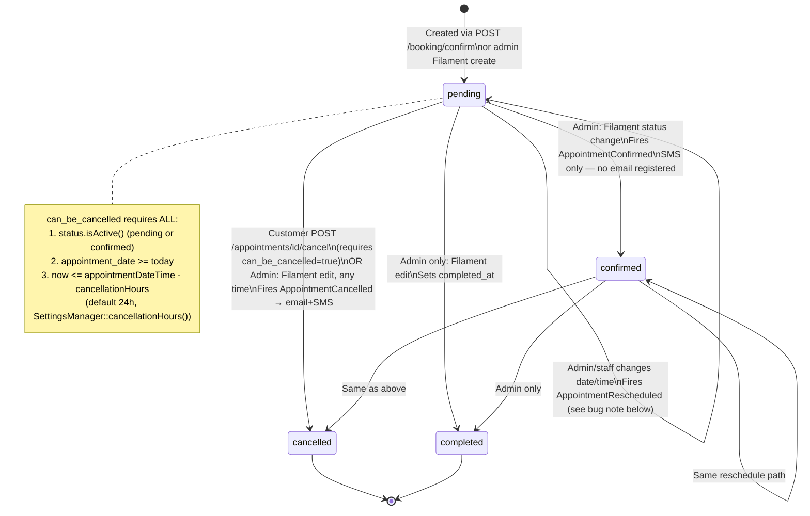

# Customer Journey — Booking (time_slot)

**For customers:** if your business sells appointments (a haircut, a car
detailing slot, a consultation), customers pick a service, a date and time,
fill in their details, and get an instant confirmation — no back-and-forth
required. Staff are assigned automatically based on who's free.

Applies to `Service` records with `service_type = ServiceType::TimeSlot`. This
is the alternative purchase path to the [rental journey](customer-journey-rental.md) —
booking produces an `Appointment` record, never an `Order`.

Gated by `CheckBookingEnabled` middleware: returns 403/redirect when
`SettingsManager::isBookingEnabled()` is false (the case for organizations
configured with `booking_type = item_rental`). Requires authentication — no
guest booking (see [Guest vs Authenticated](guest-vs-authenticated.md)).

## Wizard structure

The wizard has **4 steps** by default, **5 steps** when
`TenantFeature::active('vehicles') || TenantFeature::active('mobile_service')`
is on (a `vehicle-location` step is inserted between date/time and contact).
State lives in the PHP session under `booking.*` and is cleared after a
successful confirmation.

| # | Name | Route | Key action |
|---|------|-------|------------|
| 1 | Service selection | `GET /booking/step/1` | Lists active services by `sort_order`; auto-skips if arriving from `/services/{slug}/book` |
| 2 | Date & time | `GET /booking/step/2` | Flatpickr calendar + slot grid; slot must be ≥ `advanceBookingHours` (default 24h) in the future |
| 2b | Vehicle / location *(conditional)* | inserted between 2 and 3 | Vehicle lookup + Google Maps location capture; service-area check if `service_area` feature is active |
| 3 | Contact details | `GET /booking/step/3` | Pre-fills empty fields only from the authenticated user's profile |
| 4 | Review & confirm | `GET /booking/step/4` | Summary; submit via `POST /booking/confirm` |

## Full wizard flow

```mermaid
flowchart TD
    Start([Start: /booking]) --> Auth{Authenticated?}
    Auth -->|No| Login[Redirect to login]
    Login --> Start
    Auth -->|Yes| HasSvc{service_id\nin session?}

    HasSvc -->|Yes, from /services/:slug/book| Step2
    HasSvc -->|No| Step1

    Step1["Step 1 — Service Selection\nList active services ordered by sort_order"]
    Step1 --> S1W[session: booking.service_id]
    S1W --> Step2

    Step2["Step 2 — Date and Time\nFlatpickr calendar\nAJAX GET /booking/unavailable-dates (cached 15 min)\nAJAX GET /booking/available-slots"]
    Step2 --> S2V{"date valid\nslot >= advanceBookingHours\n(default 24h) from now?"}
    S2V -->|No| Step2
    S2V -->|Yes| S2W[session: booking.date, booking.time_slot]
    S2W --> FeatV{"TenantFeature:\nvehicles OR mobile_service?"}

    FeatV -->|No| Step4
    FeatV -->|Yes| Step3

    Step3["Step 3 — Vehicle and Location\nvehicle_type_id/brand/model/year/registration_number\nGoogle Places autocomplete for mobile_service"]
    Step3 --> AreaC{"service_area feature active?"}
    AreaC -->|Yes, fails| AreaE["JSON 422: nearest_area + show_waitlist=true"]
    AreaE --> Step3
    AreaC -->|Pass or N/A| S3W["session: vehicle + location fields\nbooking.service_area_valid = true"]
    S3W --> Step4

    Step4["Step 4 — Contact Details\nPre-fill from auth()->user() for empty fields only\nnotify_email, notify_sms, terms_accepted\nOptional invoice section (NIP validated)"]
    Step4 --> Step5

    Step5["Step 5 — Review (read-only)\nSummary: service, datetime, vehicle, location, contact"]
    Step5 --> Conf["POST /booking/confirm"]

    Conf --> IdemV{"Existing pending/confirmed\nfor same user+service+date+time?"}
    IdemV -->|Yes — reuse| Done
    IdemV -->|No| SlotR[Re-check availability across all staff]
    SlotR --> SlotV{Slot still available?}
    SlotV -->|No| Step2
    SlotV -->|Yes| StaffF["findBestAvailableStaff()\nfirst-available strategy, no workload balancing"]
    StaffF --> StaffV{Staff found?}
    StaffV -->|No| Step2
    StaffV -->|Yes| Txn["DB Transaction:\nCreate Appointment status=pending\nSnapshot price/name/duration\nUpdate user empty fields only\nRecord terms_accepted consent"]

    Txn --> EvtF["AppointmentCreated event\n→ AppointmentCreatedNotification (customer only)"]
    EvtF --> Done["session: booking_confirmed_id\nClear all booking.*"]
    Done --> CP["GET /booking/confirmation\nSingle-use — session pull\nCalendar links: Google / iCal / Outlook"]
    CP --> End([End])
```

## Staff assignment

Auto-assignment (`AppointmentService::findBestAvailableStaff()`), called from
`BookingController::confirm()`:

1. Queries users with role `staff` linked to the service via `service_staff` pivot
2. Iterates in DB order, checking each candidate's calendar (existing appointments, vacations, exceptions, base schedule) for conflicts
3. Returns the **first** staff member with no conflict — no workload balancing
4. If nobody is available: redirect back to the datetime step, no appointment created

Admin override in Filament (`AppointmentResource`): `staff_id` is a required
Select field, no availability re-check performed in the form itself.
`AppointmentObserver::creating()` still enforces the assigned user has the
`staff` role, regardless of creation path.

## Appointment status machine

See [Cancellation](customer-journey-cancellation.md) for the full customer vs
admin cancellation comparison.

## Known bug — reschedule TypeError (ported as-is, not fixed)

`Appointment::booted()` fires `event(new AppointmentRescheduled($appointment))`
when it detects a change to the date/time field. The `AppointmentRescheduled`
constructor requires `(Appointment $appointment, Carbon $oldDate, Carbon $newDate)`
— the two `Carbon` arguments are missing at the call site
(`app/Models/Appointment.php`, `booted()`). **Confirmed still present in
current code** (verified 2026-07). This throws a `TypeError` at runtime every
time an admin reschedules an appointment's date or time via Filament. Fixing
this is out of scope for this docs page — it is documented here so it isn't
lost, not silently patched.

## Notifications

| Trigger | Notification | Channel |
|---------|--------------|---------|
| Appointment created | `AppointmentCreatedNotification` | Email, customer only — no admin copy |
| Confirmed by admin | — | SMS (`APPOINTMENT_CONFIRMED`) only, no email registered |
| Cancelled (customer or admin) | `AppointmentCancelledNotification` | Email + SMS |
| Rescheduled by admin | `AppointmentRescheduledNotification` | Email + SMS (**subject to the bug above**) |
| Reminders (`ProcessRemindersJob`, hourly) | admin-configured `reminder_configs` | Email and/or SMS, before and after appointment |

## Key files

`app/Http/Controllers/BookingController.php` (wizard), `app/Http/Controllers/AppointmentController.php`
(legacy store + customer cancel), `app/Models/Appointment.php`, `app/Enums/AppointmentStatus.php`,
`app/Services/AppointmentService.php`, `app/Services/ServiceAreaValidator.php`,
`app/Jobs/Reminder/ProcessRemindersJob.php`, `app/Filament/Resources/AppointmentResource.php`.
