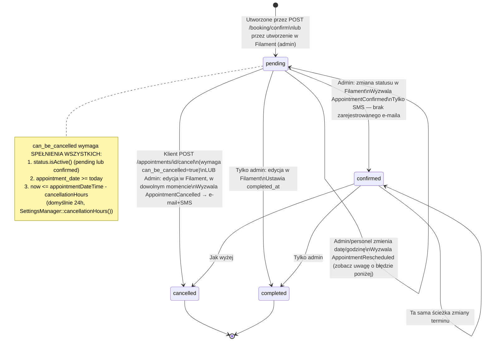

# Podróż klienta — Rezerwacja (time_slot)

**Dla klientów:** jeśli Twoja firma sprzedaje wizyty (strzyżenie, termin
detailingu samochodowego, konsultację), klienci wybierają usługę, datę i godzinę,
wypełniają swoje dane i otrzymują natychmiastowe potwierdzenie — bez zbędnej
korespondencji. Personel jest przydzielany automatycznie na podstawie dostępności.

Dotyczy rekordów `Service` z `service_type = ServiceType::TimeSlot`. Jest to
alternatywna ścieżka zakupowa względem [podróży wynajmu](customer-journey-rental.md) —
rezerwacja tworzy rekord `Appointment`, nigdy `Order`.

Zabezpieczone middleware `CheckBookingEnabled`: zwraca 403/przekierowanie, gdy
`SettingsManager::isBookingEnabled()` zwraca false (dotyczy organizacji
skonfigurowanych z `booking_type = item_rental`). Wymaga uwierzytelnienia — brak
rezerwacji dla gości (zobacz [Gość vs Uwierzytelniony](guest-vs-authenticated.md)).

## Struktura kreatora

Kreator ma domyślnie **4 kroki**, **5 kroków** gdy włączone jest
`TenantFeature::active('vehicles') || TenantFeature::active('mobile_service')`
(krok `vehicle-location` jest wstawiany pomiędzy datą/godziną a kontaktem).
Stan przechowywany jest w sesji PHP pod kluczem `booking.*` i jest czyszczony po
pomyślnym potwierdzeniu.

| # | Nazwa | Trasa | Kluczowa akcja |
|---|------|-------|------------|
| 1 | Wybór usługi | `GET /booking/step/1` | Wyświetla aktywne usługi wg `sort_order`; automatycznie pomijany przy wejściu z `/services/{slug}/book` |
| 2 | Data i godzina | `GET /booking/step/2` | Kalendarz Flatpickr + siatka terminów; termin musi być ≥ `advanceBookingHours` (domyślnie 24h) w przyszłości |
| 2b | Pojazd / lokalizacja *(warunkowy)* | wstawiany między krokiem 2 a 3 | Wyszukiwanie pojazdu + przechwytywanie lokalizacji Google Maps; sprawdzenie obszaru obsługi, jeśli aktywna jest funkcja `service_area` |
| 3 | Dane kontaktowe | `GET /booking/step/3` | Wypełnia wstępnie tylko puste pola danymi z profilu uwierzytelnionego użytkownika |
| 4 | Podsumowanie i potwierdzenie | `GET /booking/step/4` | Podsumowanie; wysyłka przez `POST /booking/confirm` |

## Pełny przebieg kreatora

```mermaid
flowchart TD
    Start([Start: /booking]) --> Auth{Uwierzytelniony?}
    Auth -->|Nie| Login[Przekierowanie do logowania]
    Login --> Start
    Auth -->|Tak| HasSvc{service_id\nw sesji?}

    HasSvc -->|Tak, z /services/:slug/book| Step2
    HasSvc -->|Nie| Step1

    Step1["Krok 1 — Wybór usługi\nLista aktywnych usług posortowana wg sort_order"]
    Step1 --> S1W[sesja: booking.service_id]
    S1W --> Step2

    Step2["Krok 2 — Data i godzina\nKalendarz Flatpickr\nAJAX GET /booking/unavailable-dates (cache 15 min)\nAJAX GET /booking/available-slots"]
    Step2 --> S2V{"data prawidłowa\ntermin >= advanceBookingHours\n(domyślnie 24h) od teraz?"}
    S2V -->|Nie| Step2
    S2V -->|Tak| S2W[sesja: booking.date, booking.time_slot]
    S2W --> FeatV{"TenantFeature:\nvehicles LUB mobile_service?"}

    FeatV -->|Nie| Step4
    FeatV -->|Tak| Step3

    Step3["Krok 3 — Pojazd i lokalizacja\nvehicle_type_id/brand/model/year/registration_number\nGoogle Places autocomplete dla mobile_service"]
    Step3 --> AreaC{"funkcja service_area aktywna?"}
    AreaC -->|Tak, nie przechodzi| AreaE["JSON 422: nearest_area + show_waitlist=true"]
    AreaE --> Step3
    AreaC -->|Przechodzi lub nie dotyczy| S3W["sesja: pola pojazdu + lokalizacji\nbooking.service_area_valid = true"]
    S3W --> Step4

    Step4["Krok 4 — Dane kontaktowe\nWstępne wypełnienie z auth()->user() tylko dla pustych pól\nnotify_email, notify_sms, terms_accepted\nOpcjonalna sekcja faktury (NIP walidowany)"]
    Step4 --> Step5

    Step5["Krok 5 — Podsumowanie (tylko do odczytu)\nPodsumowanie: usługa, data/godzina, pojazd, lokalizacja, kontakt"]
    Step5 --> Conf["POST /booking/confirm"]

    Conf --> IdemV{"Istniejący pending/confirmed\ndla tego samego user+service+date+time?"}
    IdemV -->|Tak — użyj ponownie| Done
    IdemV -->|Nie| SlotR[Ponowne sprawdzenie dostępności wśród całego personelu]
    SlotR --> SlotV{Termin nadal dostępny?}
    SlotV -->|Nie| Step2
    SlotV -->|Tak| StaffF["findBestAvailableStaff()\nstrategia pierwszego dostępnego, bez równoważenia obciążenia"]
    StaffF --> StaffV{Znaleziono personel?}
    StaffV -->|Nie| Step2
    StaffV -->|Tak| Txn["Transakcja DB:\nUtworzenie Appointment status=pending\nZrzut ceny/nazwy/czasu trwania\nAktualizacja tylko pustych pól użytkownika\nZapis zgody terms_accepted"]

    Txn --> EvtF["Zdarzenie AppointmentCreated\n→ AppointmentCreatedNotification (tylko klient)"]
    EvtF --> Done["sesja: booking_confirmed_id\nCzyszczenie wszystkich booking.*"]
    Done --> CP["GET /booking/confirmation\nJednorazowe użycie — pobranie z sesji\nLinki kalendarza: Google / iCal / Outlook"]
    CP --> End([Koniec])
```

## Przydzielanie personelu

Automatyczne przydzielanie (`AppointmentService::findBestAvailableStaff()`), wywoływane z
`BookingController::confirm()`:

1. Pobiera użytkowników z rolą `staff` powiązanych z usługą przez tabelę pośrednią `service_staff`
2. Iteruje w kolejności z bazy danych, sprawdzając kalendarz każdego kandydata (istniejące wizyty, urlopy, wyjątki, harmonogram bazowy) pod kątem konfliktów
3. Zwraca **pierwszego** pracownika bez konfliktu — bez równoważenia obciążenia
4. Jeśli nikt nie jest dostępny: przekierowanie z powrotem do kroku daty/godziny, żadna wizyta nie zostaje utworzona

Nadpisanie przez administratora w Filament (`AppointmentResource`): `staff_id` jest wymaganym
polem Select, sam formularz nie wykonuje ponownego sprawdzenia dostępności.
`AppointmentObserver::creating()` nadal wymusza, aby przypisany użytkownik posiadał
rolę `staff`, niezależnie od ścieżki utworzenia.

## Maszyna stanów wizyty (Appointment)

Zobacz [Anulowanie](customer-journey-cancellation.md) po pełne porównanie anulowania
przez klienta i administratora.

## Znany błąd — TypeError przy zmianie terminu (przeniesiony bez zmian, nienaprawiony)

`Appointment::booted()` wyzwala `event(new AppointmentRescheduled($appointment))`
gdy wykryje zmianę w polu daty/godziny. Konstruktor `AppointmentRescheduled`
wymaga `(Appointment $appointment, Carbon $oldDate, Carbon $newDate)`
— w miejscu wywołania brakuje dwóch argumentów `Carbon`
(`app/Models/Appointment.php`, `booted()`). **Potwierdzono, że nadal występuje w
aktualnym kodzie** (zweryfikowano 2026-07). Powoduje to `TypeError` w czasie
działania za każdym razem, gdy administrator zmienia datę lub godzinę wizyty
przez Filament. Naprawa tego wykracza poza zakres tej strony dokumentacji —
zostało to tu udokumentowane, aby nie zostało zapomniane, a nie żeby zostało po
cichu załatane.

## Powiadomienia

| Wyzwalacz | Powiadomienie | Kanał |
|---------|--------------|---------|
| Utworzenie wizyty | `AppointmentCreatedNotification` | E-mail, tylko klient — brak kopii dla administratora |
| Potwierdzone przez administratora | — | Tylko SMS (`APPOINTMENT_CONFIRMED`), brak zarejestrowanego e-maila |
| Anulowane (klient lub administrator) | `AppointmentCancelledNotification` | E-mail + SMS |
| Zmiana terminu przez administratora | `AppointmentRescheduledNotification` | E-mail + SMS (**z zastrzeżeniem błędu opisanego powyżej**) |
| Przypomnienia (`ProcessRemindersJob`, co godzinę) | skonfigurowane przez administratora `reminder_configs` | E-mail i/lub SMS, przed i po wizycie |

## Kluczowe pliki

`app/Http/Controllers/BookingController.php` (kreator), `app/Http/Controllers/AppointmentController.php`
(starszy store + anulowanie przez klienta), `app/Models/Appointment.php`, `app/Enums/AppointmentStatus.php`,
`app/Services/AppointmentService.php`, `app/Services/ServiceAreaValidator.php`,
`app/Jobs/Reminder/ProcessRemindersJob.php`, `app/Filament/Resources/AppointmentResource.php`.
