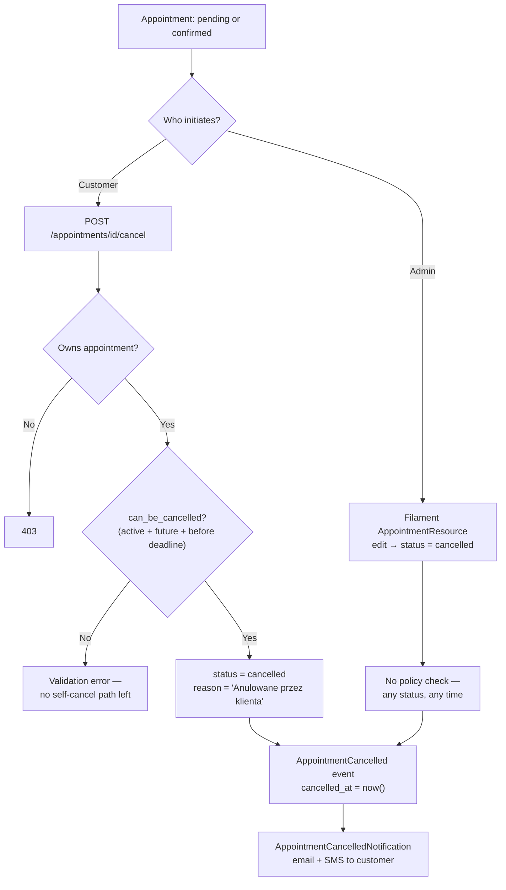

# Cancellation (customer + admin)

**For customers:** you can cancel your own appointment or order yourself, but
only up to a point — appointments have a cancellation deadline (default 24h
before the slot), and orders can only be self-cancelled while still awaiting
payment. After that, cancellation is an admin-only action.

Cancellation works differently for appointments (`time_slot`) and orders
(`item_rental`) — they are two separate models, two separate policies, and
two separate notification chains. This page covers both, and calls out where
customer-initiated and admin-initiated cancellation differ.

## Appointment cancellation

### Customer-initiated

Route: `POST /appointments/{appointment}/cancel` → `AppointmentController::cancel()`

1. Ownership check: `$appointment->customer_id !== Auth::id()` → `403`
2. `can_be_cancelled` accessor must return `true` — requires **all** of:
   - `status->isActive()` (`pending` or `confirmed`)
   - `appointment_date >= today`
   - now ≤ `appointmentDateTime - cancellationHours` (default 24h, configurable via `SettingsManager::cancellationHours()`)
3. On pass: `status = cancelled`, `cancellation_reason = 'Anulowane przez klienta'`
4. Model `booted()` detects the status change → fires `AppointmentCancelled` → sets `cancelled_at = now()`
5. Customer receives `AppointmentCancelledNotification` (email, queued, `ShouldBeUnique` 5 min) + SMS (`APPOINTMENT_CANCELLED` template)

If the deadline has passed, the customer gets a plain validation error — there
is no "request cancellation" fallback path; they must contact the business
directly.

### Admin-initiated

Via Filament `AppointmentResource` edit page. **No policy restriction** — an
admin/staff user can cancel any appointment, at any status, at any time
(including past appointments or ones inside the cancellation deadline). The
same `AppointmentCancelled` event fires, producing the identical customer
notification (email + SMS) as the self-service path.



## Order cancellation

Order cancellation is more layered — there are three different eligibility
lists depending on *who* is cancelling and *which layer* enforces it.

| Actor / layer | Allowed source statuses | Enforced by |
|---|---|---|
| Customer (`OrderController::cancel()`) | `pending_payment` only | `abort_unless($order->status === 'pending_payment', 403)` |
| Admin — Filament UI button (`OrderResource`) | `pending_payment`, `paid`, `confirmed` | `Action::make('cancel')->visible(...)` |
| Admin — service layer (`OrderService::cancel()`) | `pending_payment`, `paid`, `confirmed`, **`in_progress`** | `LogicException` guard inside `cancel()` |
| System — TTL expiry (`orders:cleanup-expired`, every 5 min) | `pending_payment` past `expires_at` (20 min TTL) | `Order::scopeExpired()` |

The service layer (`OrderService::cancel()`) accepts one more state
(`in_progress`) than the Filament UI currently exposes a button for — this is
intentional headroom for forced-cancellation paths (e.g. tenant offboarding)
that call the service directly rather than through the row action. See the
state machine's own transitions below.

### Customer-initiated

Route: `POST /moje-zamowienia/{order}/anuluj` (`orders.cancel`) →
`OrderController::cancel()`

```php
abort_unless($order->status === 'pending_payment', 403);
$this->orderService->cancel($order, 'Anulowane przez klienta');
```

Fires `OrderCancelled` → `OrderCancelledNotification` (email, queued) to the
customer. This is deliberately narrow: once an order is `paid`, the customer
can no longer self-cancel — kaucja/refund handling at that point needs a
human, so it becomes an admin action.

### Admin-initiated

Filament `OrderResource` — the "Anuluj" row/header action, visible when
`status` is `pending_payment`, `paid`, or `confirmed`. Requires a reason
(modal), calls `OrderService::cancel($record, $data['reason'])`. Same
`OrderCancelled` → `OrderCancelledNotification` chain fires.

### System-initiated (TTL expiry)

`orders:cleanup-expired` (scheduled every 5 min, `withoutOverlapping()`,
`onOneServer()`) finds all `pending_payment` orders past `expires_at` (20 min
after checkout) and cancels them with reason `'TTL expired'`. Same
notification fires to the customer.

### Corrected order status diagram (cancellation-relevant transitions)

The diagrams in the older checkout/payment docs this page was ported from
were missing two real transitions present in
`app/StateMachines/OrderStatusStateMachine.php` — both directly relevant to
cancellation:

- **`in_progress → cancelled`** — an exceptional path used for forced
  offboarding of a closing tenant (not reachable from the standard admin UI
  cancel button, which only shows for `pending_payment`/`paid`/`confirmed`,
  but is a legal transition at the state-machine level and reachable via
  `OrderService::cancel()` called directly).
- **`cancelled → paid`** (reconciliation only) — guarded by
  `validatorForTransition()`, which requires a `Payment(status=success)` row
  to already exist before allowing it. This exists because a genuine P24
  success webhook can arrive *after* `orders:cleanup-expired` has already
  cancelled the order (a slow bank/BLIK confirmation racing the TTL cron) —
  money was actually captured, so the order must be recoverable rather than
  permanently orphaned. Any caller attempting this transition without a
  verified payment is blocked with a `ValidationException`, "regardless of
  who calls it" (from the code's own docblock).

```mermaid
stateDiagram-v2
    direction LR

    [*] --> pending_payment : CartService::convertToOrder()

    pending_payment --> paid : Webhook P24 verify() OK
    pending_payment --> cancelled : Customer cancel / Admin cancel / TTL 20 min expiry

    paid --> confirmed : Admin confirms
    paid --> cancelled : Admin cancel

    confirmed --> in_progress : Scheduled job — start_date reached
    confirmed --> cancelled : Admin cancel

    in_progress --> completed : Admin — after item return
    in_progress --> cancelled : Forced offboarding (exceptional, not exposed in standard UI)

    completed --> refunded : Refund request

    cancelled --> paid : Reconciliation ONLY — requires existing\nPayment(status=success) row, enforced by\nvalidatorForTransition(), not just convention
    cancelled --> [*]
    refunded --> [*]
```

## Key files

`app/Http/Controllers/AppointmentController.php`, `app/Http/Controllers/OrderController.php`,
`app/Services/Order/OrderService.php`, `app/StateMachines/OrderStatusStateMachine.php`,
`app/Filament/Resources/OrderResource.php`, `app/Filament/Resources/AppointmentResource.php`,
`routes/console.php` (`orders:cleanup-expired` schedule).
