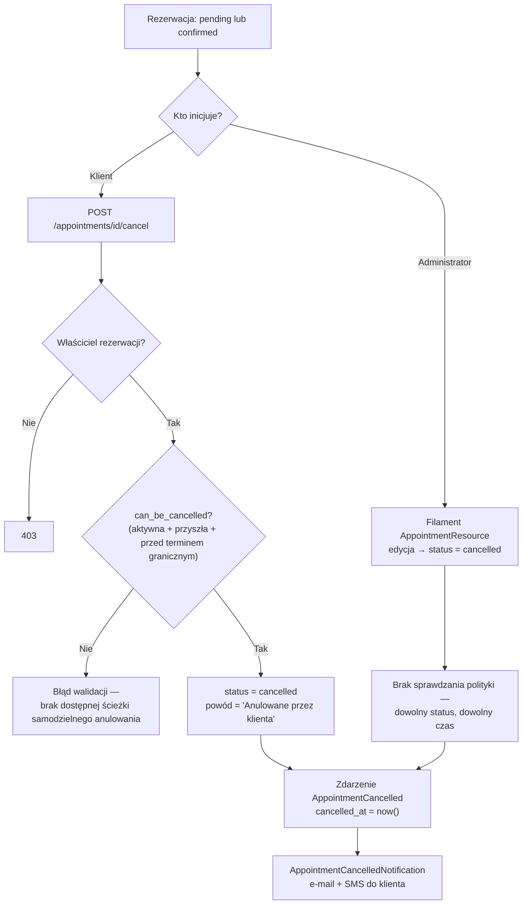

# Anulowanie (klient + administrator)

**Dla klientów:** możesz samodzielnie anulować własną rezerwację lub
zamówienie, ale tylko do pewnego momentu — rezerwacje mają termin graniczny
anulowania (domyślnie 24h przed terminem), a zamówienia można anulować
samodzielnie tylko w trakcie oczekiwania na płatność. Po tym momencie
anulowanie jest czynnością wyłącznie dla administratora.

Anulowanie działa inaczej dla rezerwacji (`time_slot`) i zamówień
(`item_rental`) — to dwa osobne modele, dwie osobne polityki i dwa osobne
łańcuchy powiadomień. Ta strona omawia oba przypadki i wskazuje, gdzie
anulowanie inicjowane przez klienta różni się od anulowania inicjowanego
przez administratora.

## Anulowanie rezerwacji

### Inicjowane przez klienta

Trasa: `POST /appointments/{appointment}/cancel` → `AppointmentController::cancel()`

1. Sprawdzenie własności: `$appointment->customer_id !== Auth::id()` → `403`
2. Accessor `can_be_cancelled` musi zwrócić `true` — wymaga **wszystkich** z poniższych:
   - `status->isActive()` (`pending` lub `confirmed`)
   - `appointment_date >= today`
   - teraz ≤ `appointmentDateTime - cancellationHours` (domyślnie 24h, konfigurowalne przez `SettingsManager::cancellationHours()`)
3. Po spełnieniu warunków: `status = cancelled`, `cancellation_reason = 'Anulowane przez klienta'`
4. Model `booted()` wykrywa zmianę statusu → wywołuje `AppointmentCancelled` → ustawia `cancelled_at = now()`
5. Klient otrzymuje `AppointmentCancelledNotification` (e-mail, kolejkowany, `ShouldBeUnique` 5 min) + SMS (szablon `APPOINTMENT_CANCELLED`)

Jeśli termin graniczny minął, klient otrzymuje zwykły błąd walidacji — nie ma
ścieżki awaryjnej „poproś o anulowanie”; musi skontaktować się bezpośrednio z
firmą.

### Inicjowane przez administratora

Poprzez stronę edycji `AppointmentResource` w Filamencie. **Brak ograniczeń
polityki** — użytkownik administrator/personel może anulować dowolną
rezerwację, w dowolnym statusie, w dowolnym momencie (w tym rezerwacje z
przeszłości lub te wewnątrz terminu granicznego anulowania). Wywoływane jest
to samo zdarzenie `AppointmentCancelled`, generujące identyczne powiadomienie
klienta (e-mail + SMS) jak w ścieżce samoobsługowej.



## Anulowanie zamówienia

Anulowanie zamówienia jest bardziej wielowarstwowe — istnieją trzy różne
listy dopuszczalnych statusów, w zależności od tego *kto* anuluje i *która
warstwa* to egzekwuje.

| Aktor / warstwa | Dozwolone statusy źródłowe | Egzekwowane przez |
|---|---|---|
| Klient (`OrderController::cancel()`) | tylko `pending_payment` | `abort_unless($order->status === 'pending_payment', 403)` |
| Administrator — przycisk w UI Filament (`OrderResource`) | `pending_payment`, `paid`, `confirmed` | `Action::make('cancel')->visible(...)` |
| Administrator — warstwa serwisowa (`OrderService::cancel()`) | `pending_payment`, `paid`, `confirmed`, **`in_progress`** | zabezpieczenie `LogicException` wewnątrz `cancel()` |
| System — wygaśnięcie TTL (`orders:cleanup-expired`, co 5 min) | `pending_payment` po upływie `expires_at` (TTL 20 min) | `Order::scopeExpired()` |

Warstwa serwisowa (`OrderService::cancel()`) dopuszcza o jeden stan więcej
(`in_progress`) niż obecnie udostępnia przycisk w UI Filament — jest to
celowy zapas na potrzeby ścieżek wymuszonego anulowania (np. offboarding
najemcy), które wywołują serwis bezpośrednio, a nie przez akcję wiersza. Zob.
poniżej własne przejścia maszyny stanów.

### Inicjowane przez klienta

Trasa: `POST /moje-zamowienia/{order}/anuluj` (`orders.cancel`) →
`OrderController::cancel()`

```php
abort_unless($order->status === 'pending_payment', 403);
$this->orderService->cancel($order, 'Anulowane przez klienta');
```

Wywołuje `OrderCancelled` → `OrderCancelledNotification` (e-mail,
kolejkowany) do klienta. Jest to celowo wąska ścieżka: gdy zamówienie ma już
status `paid`, klient nie może już samodzielnie anulować — obsługa
kaucji/zwrotu na tym etapie wymaga człowieka, więc staje się to czynnością
administratora.

### Inicjowane przez administratora

`OrderResource` w Filamencie — akcja wiersza/nagłówka „Anuluj”, widoczna gdy
`status` to `pending_payment`, `paid` lub `confirmed`. Wymaga podania powodu
(modal), wywołuje `OrderService::cancel($record, $data['reason'])`.
Wywoływany jest ten sam łańcuch `OrderCancelled` →
`OrderCancelledNotification`.

### Inicjowane przez system (wygaśnięcie TTL)

`orders:cleanup-expired` (uruchamiane co 5 min, `withoutOverlapping()`,
`onOneServer()`) znajduje wszystkie zamówienia w statusie `pending_payment`
po upływie `expires_at` (20 min po rozpoczęciu checkoutu) i anuluje je z
powodem `'TTL expired'`. Do klienta wysyłane jest to samo powiadomienie.

### Poprawiony diagram statusów zamówienia (przejścia istotne dla anulowania)

W diagramach w starszej dokumentacji checkoutu/płatności, z której
przeniesiono tę stronę, brakowało dwóch rzeczywistych przejść obecnych w
`app/StateMachines/OrderStatusStateMachine.php` — obu bezpośrednio istotnych
dla anulowania:

- **`in_progress → cancelled`** — wyjątkowa ścieżka używana przy wymuszonym
  offboardingu zamykanego najemcy (nieosiągalna ze standardowego przycisku
  anulowania w UI administratora, który pokazuje się tylko dla
  `pending_payment`/`paid`/`confirmed`, ale jest legalnym przejściem na
  poziomie maszyny stanów i osiągalna przez bezpośrednie wywołanie
  `OrderService::cancel()`).
- **`cancelled → paid`** (tylko rekoncyliacja) — zabezpieczone przez
  `validatorForTransition()`, które wymaga istnienia wiersza
  `Payment(status=success)`, zanim to przejście zostanie dopuszczone. Istnieje
  to dlatego, że rzeczywisty webhook sukcesu P24 może dotrzeć *po tym*, jak
  `orders:cleanup-expired` już anulowało zamówienie (wolne potwierdzenie
  banku/BLIK ścigające się z cronem TTL) — pieniądze zostały faktycznie
  pobrane, więc zamówienie musi być możliwe do odzyskania, a nie trwale
  osierocone. Każdy wywołujący próbujący tego przejścia bez zweryfikowanej
  płatności jest blokowany przez `ValidationException`, „niezależnie od tego,
  kto to wywołuje” (z własnego docbloka kodu).

```mermaid
stateDiagram-v2
    direction LR

    [*] --> pending_payment : CartService::convertToOrder()

    pending_payment --> paid : Webhook P24 verify() OK
    pending_payment --> cancelled : Anulowanie przez klienta / Anulowanie przez administratora / Wygaśnięcie TTL 20 min

    paid --> confirmed : Administrator potwierdza
    paid --> cancelled : Anulowanie przez administratora

    confirmed --> in_progress : Zaplanowane zadanie — nadszedł start_date
    confirmed --> cancelled : Anulowanie przez administratora

    in_progress --> completed : Administrator — po zwrocie przedmiotu
    in_progress --> cancelled : Wymuszony offboarding (wyjątkowe, niedostępne w standardowym UI)

    completed --> refunded : Wniosek o zwrot

    cancelled --> paid : Tylko rekoncyliacja — wymaga istniejącego\nwiersza Payment(status=success), egzekwowane przez\nvalidatorForTransition(), nie tylko konwencję
    cancelled --> [*]
    refunded --> [*]
```

## Anulowanie wypożyczenia (model `Rental`)

**Trzecia, osobna ścieżka** — nieopisana na tej stronie do 2026-08-23, mimo że istnieje w kodzie.
`Rental` to model odrębny od `Order`: zamówienie jest tym, co klient składa w koszyku, wypożyczenie
tym, co administrator prowadzi na wydanym sprzęcie. Anulowanie jednego nie anuluje drugiego.

Wyzwalacz nie jest akcją ani trasą, tylko **zmianą statusu**: hook `updated` na modelu wykrywa
przejście na `RentalStatus::Cancelled`, ustawia `cancelled_at` i rzuca `RentalCancelled`
(`app/Models/Rental.php`). Nasłuchujący `SendRentalCancelledNotification` wysyła klientowi
`RentalCancelledNotification` — mail z nazwą sprzętu, terminem i powodem.

Nie ma tu ścieżki samoobsługowej: klient nie anuluje wypożyczenia sam. Inicjuje wyłącznie
administrator.

> **Do 2026-08-23 ten mail nigdy nie doszedł.** Szablon `rental-cancelled` nie istniał w żadnym
> seederze ani migracji, a `EmailService::sendFromTemplate()` rzuca przy braku szablonu — więc
> każde anulowanie wypożyczenia kończyło się wyjątkiem i wierszem w `failed_jobs`, na każdym
> środowisku, także świeżym. Klient dowiadywał się o anulowaniu tylko wtedy, gdy ktoś zadzwonił.
> Naprawione wraz ze strażnikiem, który nie pozwoli powtórzyć tego przy kolejnym powiadomieniu —
> `tests/Feature/Notifications/EveryNotificationHasItsTemplateTest`.

## Kluczowe pliki

`app/Http/Controllers/AppointmentController.php`, `app/Http/Controllers/OrderController.php`,
`app/Services/Order/OrderService.php`, `app/StateMachines/OrderStatusStateMachine.php`,
`app/Filament/Resources/OrderResource.php`, `app/Filament/Resources/AppointmentResource.php`,
`app/Models/Rental.php` + `app/Listeners/SendRentalCancelledNotification.php` (ścieżka wypożyczenia),
`routes/console.php` (harmonogram `orders:cleanup-expired`).
