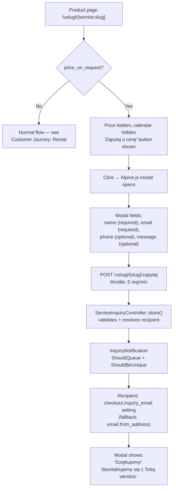

# Customer Journey — Inquiry (price_on_request)

**For customers:** some products don't have a fixed public price — instead of
a "Buy" button, customers see "Ask for a price" and submit a short form. The
business owner is notified by email and follows up manually; there's no
automated quote or payment in this path.

Applies to any `Service` with `price_on_request = true`. This flag can only
be set on `ServiceType::ItemRental` services —
`HasRentalBehavior::bootHasRentalBehavior()` forces `price_on_request = false`
on create/update for any service where `service_type !== ItemRental`.

## Flow

Route name: `service.inquiry`. Controller: `ServiceInquiryController::store`.
`InquiryNotification` is `ShouldQueue + ShouldBeUnique` (dedup by service +
notifiable), queue `emails`, standard `mail` channel (not the tenant's
`EmailService` channel used elsewhere).

In the catalogue, `<x-ios.service-card>` shows a "Zapytaj o cenę" badge
instead of a price for any inquiry-only item.

**No follow-up automation exists.** There is no confirmation email to the
customer, no CRM ticket, no SLA tracking — the tenant owner receives one
email and handles the rest manually outside the system.

## Key files

`app/Http/Controllers/ServiceInquiryController.php`, `app/Notifications/InquiryNotification.php`,
`app/Models/Service.php` (`HasRentalBehavior` trait).
