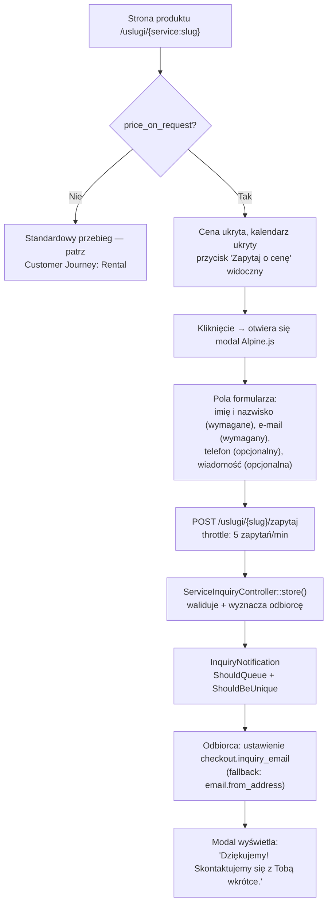

# Ścieżka klienta — Zapytanie ofertowe (price_on_request)

**Dla klientów:** niektóre produkty nie mają stałej, publicznej ceny — zamiast
przycisku „Kup", klient widzi „Zapytaj o cenę" i wysyła krótki formularz.
Właściciel firmy otrzymuje powiadomienie e-mail i kontaktuje się ręcznie; na
tej ścieżce nie ma automatycznej wyceny ani płatności.

Dotyczy każdej usługi `Service` z `price_on_request = true`. Ta flaga może
być ustawiona wyłącznie dla usług typu `ServiceType::ItemRental` —
`HasRentalBehavior::bootHasRentalBehavior()` wymusza `price_on_request = false`
przy tworzeniu/aktualizacji dla każdej usługi, gdzie `service_type !== ItemRental`.

## Przebieg

Nazwa trasy: `service.inquiry`. Kontroler: `ServiceInquiryController::store`.
`InquiryNotification` jest `ShouldQueue + ShouldBeUnique` (deduplikacja po usłudze +
adresacie), kolejka `emails`, standardowy kanał `mail` (nie kanał `EmailService`
danego najemcy, używany w innych miejscach).

W katalogu `<x-ios.service-card>` pokazuje etykietę „Zapytaj o cenę"
zamiast ceny dla każdego elementu dostępnego wyłącznie na zapytanie.

**Nie istnieje żadna automatyzacja dalszej obsługi.** Nie ma e-maila
potwierdzającego dla klienta, zgłoszenia w CRM ani śledzenia SLA — właściciel
najemcy otrzymuje jeden e-mail i resztę obsługuje ręcznie poza systemem.

## Kluczowe pliki

`app/Http/Controllers/ServiceInquiryController.php`, `app/Notifications/InquiryNotification.php`,
`app/Models/Service.php` (trait `HasRentalBehavior`).
