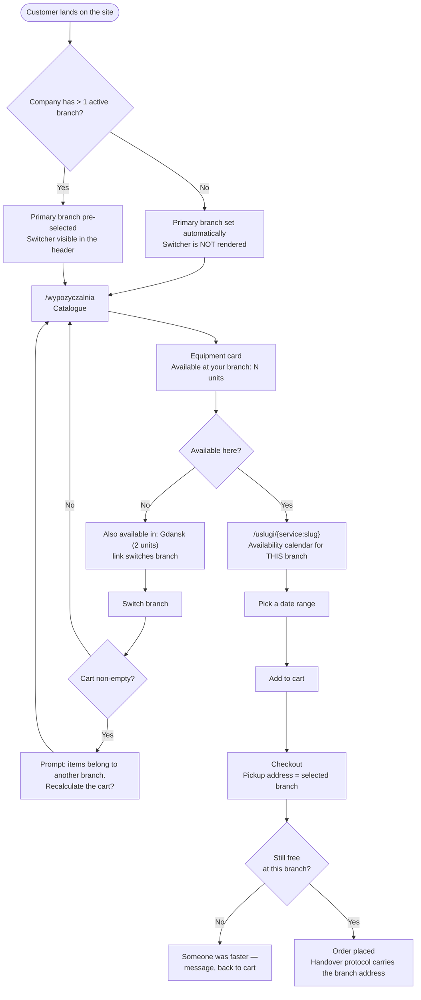

# Customer Journey — Choosing a Branch

> **Status: PARTIALLY IMPLEMENTED** (as of 2026-08-29).
> **Branches already exist** — as an entity with an address, opening hours, a photo and a
> gallery, manageable in the admin panel and **visible on the website** (phases 0-2, PR #227-#231).
> **Not yet built:** branch selection by the customer and per-branch availability — phases 5-6,
> **on hold** by the product owner's decision.
> The "What the customer sees today" section describes the actual state; the rest of this
> document describes the target state.
> Technical detail: [`app/docs/features/lokalizacje/`](../../app/docs/features/lokalizacje/README.md).

**For customers:** if your business has several branches, the customer picks one once — the way
you pick a store — and from then on the catalogue, availability and pickup all refer to that
location. If you have a single site, the customer sees no chooser at all and everything looks
exactly as it does today.

Applies to tenants with the `multi_location_stock` flag enabled. Extends the
[rental journey](customer-journey-rental.en.md); it does not replace it.

## Governing rule

**One order = one pickup branch.** A customer needing equipment from two sites places two orders.
This is enforced by the schema (`carts.location_id`), not by code discipline — it cannot be broken
by accident.

## Full path

## What the customer sees TODAY

Branches appear on the website as **cards in a "Content grid" block** on any CMS page.
Each card shows:

| Element | Source |
|---|---|
| Branch name | "Name" field |
| Short code as a badge next to the name | "Code" field (e.g. `MMZ`) |
| Address | street, building, postcode, city |
| Short description | "Description" field, truncated to 120 characters |
| Opening hours | "Opening hours" table |
| Premises photo | "Premises photo" field |
| A strip of up to 4 gallery thumbnails with a "+N" counter | "Gallery" field |
| Phone and e-mail, both clickable | "Phone", "E-mail" fields |
| "See on map" | picker coordinates, falling back to an address search |

**What is missing:** a branch has no page or URL of its own — it exists only as a card in a
grid. The customer does not choose a branch, and neither the catalogue nor availability is
split per location yet.

### Two traps worth knowing

**1. Adding a branch does NOT put it on the website.** The "Content grid" block holds a
manually picked list of items and has no "all of them" option. After adding a branch you must
open the CMS page and add it to the block. Nothing reminds you — the page simply looks
unchanged. ([`123k99ct3xt`](https://app.clickup.com/t/123k99ct3xt))

**2. Deactivating a branch does NOT remove it from the website.** Unticking "Active" removes
the branch from the picker in the admin panel, but if it was already added to a block it keeps
rendering. To hide it, remove it from the block.

Both look identical from the owner's side: "I set it up and the page shows something else."
For any such complaint, check the "Content grid" block first and the branch itself second.

---

## What the customer will see eventually (phases 5-6, on hold)

| Step | Change versus today |
|---|---|
| Landing | Primary branch pre-selected; header switcher (only when branches > 1) |
| Catalogue | Card shows availability **at the selected branch**, not the sum across all |
| Product page | Calendar and counter refer to the selected branch, plus "Also available in: Gdansk (2 units)" |
| Cart | Carries one pickup branch; switching with a non-empty cart is an **explicit prompt**, not an error |
| Checkout | Pickup address = branch address; validation rejects a branch outside the company |
| After purchase | Handover protocol and e-mails carry the branch address |

## Quantity: one unit per reservation

A **deliberate decision, not a technical limit**. The calendar exists so the customer picks a date
range every time; needing two units, they repeat the flow.

"2 units available" tells the customer **whether it is worth trying**, it is not a promise. The
decision is made when the order is placed — adding to the cart reserves nothing, so while the
customer deliberates someone may get ahead of them. **First to pay gets the equipment.**

## Returns

Equipment always goes back to **the branch that issued it**. The customer does not choose a return
point; the return address equals the pickup address and appears on the protocol.

## Deliberately out of scope

| Item | Why |
|---|---|
| Distance in kilometres ("Gdansk — 34 km") | The system does not know an anonymous visitor's position. Needs a separate decision (browser geolocation or a postcode field) |
| Returning to a different branch | Product owner's decision — keeps settlements and protocols simple |
| One order spanning two branches | One order = one handover protocol, one deposit, one pickup |
| Quantity selector | See above — the calendar is the repeatable-choice mechanism |
