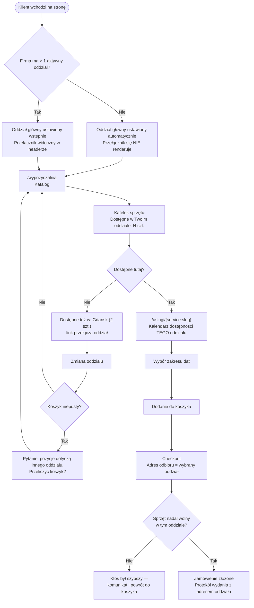

# Podróż klienta — Wybór oddziału

> **Status: PLANOWANE.** Ten dokument opisuje zachowanie **zaprojektowane, jeszcze niewdrożone**
> (plan zatwierdzony 2026-08-26). Dziś system nie zna pojęcia oddziału.
> Plan: [`docs/features/lokalizacje/`](../../app/docs/features/lokalizacje/README.md).

**Dla klientów:** jeśli Twoja firma ma kilka oddziałów, klient wybiera oddział raz — jak sklep
w Castoramie — a katalog, dostępność i odbiór dotyczą już tylko tego punktu. Jeśli masz jedną
siedzibę, klient nie zobaczy żadnego wyboru i wszystko wygląda tak jak dziś.

Dotyczy tenantów z włączoną flagą `multi_location_stock`. Rozszerza
[podróż wypożyczenia](customer-journey-rental.md) — nie zastępuje jej.

## Zasada nadrzędna

**Jedno zamówienie = jeden oddział odbioru.** Klient potrzebujący sprzętu z dwóch punktów składa
dwa zamówienia. Ta reguła jest wymuszona schematem (`carts.location_id`), a nie dyscypliną kodu —
nie da się jej obejść przypadkiem.

## Pełna ścieżka

## Co klient widzi na każdym etapie

| Etap | Co się zmienia względem dziś |
|---|---|
| Wejście na stronę | Oddział główny ustawiony wstępnie; przełącznik w headerze (tylko gdy oddziałów > 1) |
| Katalog | Kafelek pokazuje dostępność **w wybranym oddziale**, nie sumę ze wszystkich |
| Strona sprzętu | Kalendarz i licznik dotyczą wybranego oddziału. Dodatkowo: „Dostępne też w: Gdańsk (2 szt.)" |
| Koszyk | Niesie jeden oddział odbioru; zmiana oddziału z niepustym koszykiem to **jawne pytanie**, nie błąd |
| Checkout | Adres odbioru = adres oddziału; walidacja odrzuca oddział spoza firmy |
| Po zakupie | Protokół wydania i e-maile zawierają adres oddziału |

## Ilość: jedna sztuka na rezerwację

To **świadoma decyzja, nie ograniczenie techniczne**. Kalendarz istnieje po to, żeby klient za
każdym razem wybrał zakres dat; potrzebując dwóch sztuk, powtarza przejście.

Liczba „dostępne 2 szt." jest informacją **czy w ogóle jest sens**, a nie obietnicą. Rozstrzygnięcie
zapada dopiero przy składaniu zamówienia — dodanie do koszyka niczego nie rezerwuje, więc w czasie,
gdy klient się zastanawia, ktoś może go wyprzedzić. **Kto pierwszy zapłaci, ten ma sprzęt.**

## Zwrot

Sprzęt wraca **zawsze do oddziału, z którego został wydany**. Klient nie ma wyboru punktu zwrotu —
adres zwrotu jest ten sam co adres odbioru i widnieje na protokole.

## Czego świadomie nie ma

| Element | Dlaczego |
|---|---|
| Odległość w kilometrach („Gdańsk — 34 km") | System nie zna położenia anonimowego odwiedzającego. Wymaga osobnej decyzji (geolokalizacja przeglądarki albo pole kodu pocztowego) |
| Zwrot w innym oddziale | Decyzja właściciela produktu — utrzymuje prostotę rozliczeń i protokołów |
| Zamówienie z dwóch oddziałów naraz | Jedno zamówienie = jeden protokół wydania, jedna kaucja, jeden odbiór |
| Selektor ilości | Patrz wyżej — kalendarz jest mechanizmem powtarzalnego wyboru |
