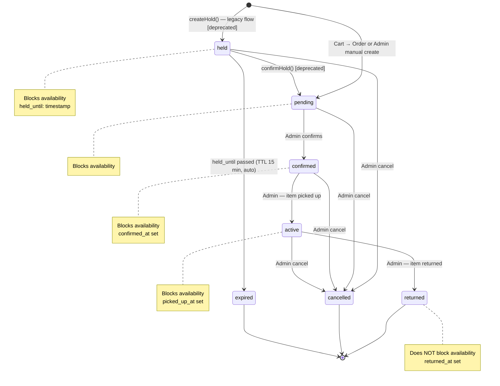

# Customer Journey — Rental (item_rental)

**For customers:** if your business rents out physical items (equipment,
vehicles, gear), customers browse a catalogue, pick a date range, add to
cart, and pay online via Przelewy24 — with an optional refundable deposit
(kaucja) collected in person at pickup, never charged online.

Applies to `Service` records with `service_type = ServiceType::ItemRental`,
gated by the `rentals` module. This is the alternative purchase path to the
[booking journey](customer-journey-booking.md) — renting produces `Order` +
`OrderItem` records (current flow), not `Appointment` records.

## Public catalogue (no auth required)

| URL | Controller | Purpose |
|-----|-----------|---------|
| `GET /wypozyczalnia` | `RentalController::index()` | Category grid + up to 6 featured items |
| `GET /wypozyczalnia/{category:slug}` | `RentalController::showCategory()` | Category page, item grid |
| `GET /uslugi/{service:slug}` | `ServiceController::show()` | Product page: gallery, specs, sticky pricing sidebar, Alpine.js availability calendar |
| `GET /api/rental/{service:slug}/kalendarz` | — | Monthly calendar data (blocked dates), throttled 60/min |
| `GET /api/rental/{service:slug}/dostepnosc` | — | Date-range availability check, throttled 60/min |

When `price_on_request = true` the calendar and price are hidden entirely —
see [Customer Journey — Inquiry](customer-journey-inquiry.md).

## Full rental journey

```mermaid
flowchart TD
    START(["Customer lands on site"])
    START --> CAT["/wypozyczalnia\nCatalogue"]
    CAT --> BROWSE["/wypozyczalnia/{category:slug}\nCategory browse"]
    BROWSE --> PRODUCT["/uslugi/{service:slug}\nProduct page"]

    PRODUCT --> PIR{price_on_request?}
    PIR -- Yes --> INQ["Inquiry flow — see\nCustomer Journey: Inquiry"]

    PIR -- No --> CAL["Availability calendar\nGET /api/rental/{slug}/kalendarz"]
    CAL --> DATES["Select date range"]
    DATES --> AV_CHECK["AJAX: /api/rental/{slug}/dostepnosc"]
    AV_CHECK --> AV_OK{Available?}
    AV_OK -- No --> AV_FAIL["Message: not available\nfor selected dates"]
    AV_FAIL --> DATES
    AV_OK -- Yes --> AUTH{Logged in?}
    AUTH -- No --> LOGIN["/login redirect"]
    LOGIN --> AUTH
    AUTH -- Yes --> ADD_CART["Add to cart\nCartService::addItem()\nSnapshots price + deposit_amount"]
    ADD_CART --> CART["/koszyk — Cart review"]
    CART --> CHECKOUT["/koszyk/zamowienie — Checkout\n(see Purchase Process for full detail)"]
    CHECKOUT --> CUST_DATA["Customer data\nB2C: PESEL + address\nB2B: NIP + REGON + KRS + signatory + pickup person"]
    CUST_DATA --> SUMMARY["Order summary: total_amount\n+ deposit_amount (off-total, no VAT)"]
    SUMMARY --> PAY{Payment method}
    PAY -- Przelewy24 --> P24["P24 gateway"]
    PAY -- DEV only --> FAKE["Fake Pay /dev/fake-pay"]
    P24 --> ORDER["Order created\nOrderItem blocks availability\nfor the selected date range"]
    FAKE --> ORDER
    ORDER --> EMAIL_CONF["Confirmation email\nCustomer waits for pickup date"]

    EMAIL_CONF --> PICKUP["Admin: item picked up\nRental: pending → active\npicked_up_at = now()"]
    PICKUP --> ACTIVE_USE["Active rental — item with customer"]
    ACTIVE_USE --> RETURN_ACT["Admin: item returned\nRental: active → returned\nreturned_at = now()"]
    RETURN_ACT --> DEP_Q{deposit_amount > 0?}
    DEP_Q -- No --> DONE(["Done ✓"])
    DEP_Q -- Yes --> DEP_DEC{"Admin deposit decision\n(OrderResource)"}
    DEP_DEC -- "Full return" --> DEP_RET["deposit_status → returned"]
    DEP_DEC -- "Partial return" --> DEP_PART["deposit_status → partial_return"]
    DEP_DEC -- "Forfeited" --> DEP_FORT["deposit_status → forfeited"]
    DEP_RET --> DONE
    DEP_PART --> DONE
    DEP_FORT --> DONE
```

**Checkout customer data types:**
- **B2C** — PESEL + address
- **B2B** — NIP + REGON + optional KRS + signatory (person legally authorized to sign) + optional pickup person

Full B2C/B2B field-level detail, order status machine, and the P24 payment
sequence live in [Purchase Process](purchase-process.md) — this page focuses
on the rental-specific lifecycle (availability blocking, pickup/return,
deposit).

## Kaucja (deposit) — customer-visible lifecycle

Shown as a separate line below `total_amount` at checkout. It is off-total,
not VAT-able, and never charged through Przelewy24 — collected physically
(cash or card) at pickup.

| `deposit_status` | Meaning |
|---|---|
| `not_required` | `deposit_amount == 0` |
| `pending` | `deposit_amount > 0`, not yet collected |
| `collected` | Admin marked "Pobrano kaucję" at pickup |
| `returned` | Admin marked "Zwrócono kaucję" after return, full refund |
| `partial_return` | Admin marked partial refund |
| `forfeited` | Admin marked forfeited (damage case), irreversible |

## Rental status machine

Two parallel flows exist under the hood and both produce `Rental` rows
sharing this same status machine: **current** (Cart → Order → `OrderItem`
blocks availability) and **legacy** (`createHold()` → `held` status →
`confirmHold()`, deprecated Sprint 4, kept for backward compatibility only).

Availability is dual-sourced: `getAvailableQuantity()` deducts from both
legacy `Rental` rows (blocking statuses) and current `OrderItem` rows
(`paid`/`confirmed`/`in_progress` block indefinitely; `pending_payment` blocks
only while `expires_at > now()`).

**No customer notifications exist for rental status transitions**
(`confirmed`, `active`, `returned`, `cancelled`) — the admin manages status
manually and any customer communication about pickup/return timing happens
outside the system. Only the order-level payment notifications
(`OrderPaidNotification`, etc. — see [Purchase Process](purchase-process.md))
reach the customer automatically.

## Rental vs Booking — quick comparison

| Dimension | Rental (item_rental) | Booking (time_slot) |
|-----------|----------------------|----------------------|
| Model | `Rental` (+ `Order`/`OrderItem` in current flow) | `Appointment` |
| What's reserved | Physical inventory (quantity) | Staff time slot |
| Date granularity | Date range | Single date + time window |
| Payment | Przelewy24 / fake-pay via Order | None (confirmation only) |
| Module | `rentals` | `bookings` |
| Admin Resource | `RentalResource` / `OrderResource` | `AppointmentResource` |

## Key files

`app/Http/Controllers/RentalController.php`, `app/Http/Controllers/ServiceController.php`,
`app/Services/Cart/CartService.php`, `app/Filament/Resources/RentalResource.php`,
`app/Enums/RentalStatus.php`.
