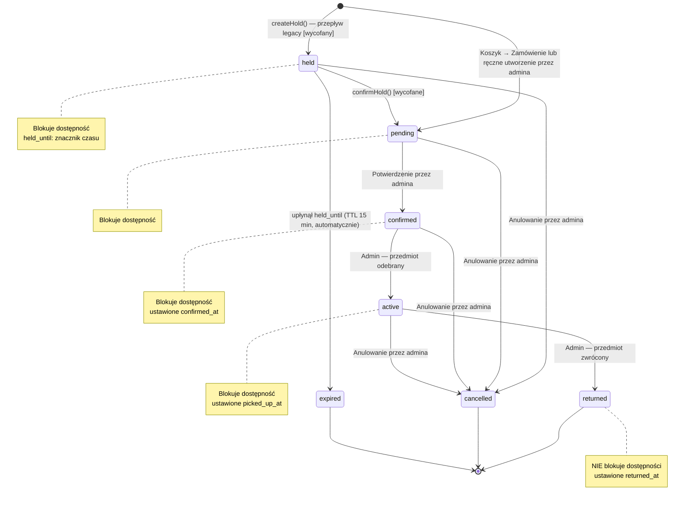

# Podróż klienta — Wypożyczenie (item_rental)

**Dla klientów:** jeśli Twoja firma wypożycza fizyczne przedmioty (sprzęt,
pojazdy, ekwipunek), klienci przeglądają katalog, wybierają zakres dat, dodają
do koszyka i płacą online przez Przelewy24 — z opcjonalną zwrotną kaucją
pobieraną osobiście przy odbiorze, nigdy nie pobieraną online.

Dotyczy rekordów `Service` z `service_type = ServiceType::ItemRental`,
bramkowanych modułem `rentals`. To alternatywna ścieżka zakupu względem
[podróży rezerwacji](customer-journey-booking.md) — wypożyczenie tworzy
rekordy `Order` + `OrderItem` (bieżący przepływ), a nie rekordy `Appointment`.

## Publiczny katalog (bez wymaganej autoryzacji)

| URL | Kontroler | Cel |
|-----|-----------|-----|
| `GET /wypozyczalnia` | `RentalController::index()` | Siatka kategorii + do 6 wyróżnionych przedmiotów |
| `GET /wypozyczalnia/{category:slug}` | `RentalController::showCategory()` | Strona kategorii, siatka przedmiotów |
| `GET /uslugi/{service:slug}` | `ServiceController::show()` | Strona produktu: galeria, specyfikacja, przypięty pasek boczny z ceną, kalendarz dostępności Alpine.js |
| `GET /api/rental/{service:slug}/kalendarz` | — | Dane kalendarza miesięcznego (zablokowane daty), throttling 60/min |
| `GET /api/rental/{service:slug}/dostepnosc` | — | Sprawdzenie dostępności zakresu dat, throttling 60/min |

Gdy `price_on_request = true`, kalendarz i cena są całkowicie ukryte —
zobacz [Podróż klienta — Zapytanie](customer-journey-inquiry.md).

## Pełna podróż wypożyczenia

```mermaid
flowchart TD
    START(["Klient trafia na stronę"])
    START --> CAT["/wypozyczalnia\nKatalog"]
    CAT --> BROWSE["/wypozyczalnia/{category:slug}\nPrzeglądanie kategorii"]
    BROWSE --> PRODUCT["/uslugi/{service:slug}\nStrona produktu"]

    PRODUCT --> PIR{price_on_request?}
    PIR -- Tak --> INQ["Przepływ zapytania — zobacz\nPodróż klienta: Zapytanie"]

    PIR -- Nie --> CAL["Kalendarz dostępności\nGET /api/rental/{slug}/kalendarz"]
    CAL --> DATES["Wybór zakresu dat"]
    DATES --> AV_CHECK["AJAX: /api/rental/{slug}/dostepnosc"]
    AV_CHECK --> AV_OK{Dostępne?}
    AV_OK -- Nie --> AV_FAIL["Komunikat: niedostępne\ndla wybranych dat"]
    AV_FAIL --> DATES
    AV_OK -- Tak --> AUTH{Zalogowany?}
    AUTH -- Nie --> LOGIN["Przekierowanie /login"]
    LOGIN --> AUTH
    AUTH -- Tak --> ADD_CART["Dodanie do koszyka\nCartService::addItem()\nZapisuje migawkę ceny + deposit_amount"]
    ADD_CART --> CART["/koszyk — Przegląd koszyka"]
    CART --> CHECKOUT["/koszyk/zamowienie — Finalizacja zamówienia\n(pełny opis w Procesie zakupu)"]
    CHECKOUT --> CUST_DATA["Dane klienta\nB2C: PESEL + adres\nB2B: NIP + REGON + KRS + osoba upoważniona + osoba odbierająca"]
    CUST_DATA --> SUMMARY["Podsumowanie zamówienia: total_amount\n+ deposit_amount (poza sumą, bez VAT)"]
    SUMMARY --> PAY{Metoda płatności}
    PAY -- Przelewy24 --> P24["Bramka P24"]
    PAY -- Tylko DEV --> FAKE["Fake Pay /dev/fake-pay"]
    P24 --> ORDER["Zamówienie utworzone\nOrderItem blokuje dostępność\ndla wybranego zakresu dat"]
    FAKE --> ORDER
    ORDER --> EMAIL_CONF["Email potwierdzający\nKlient czeka na datę odbioru"]

    EMAIL_CONF --> PICKUP["Admin: przedmiot odebrany\nRental: pending → active\npicked_up_at = now()"]
    PICKUP --> ACTIVE_USE["Aktywne wypożyczenie — przedmiot u klienta"]
    ACTIVE_USE --> RETURN_ACT["Admin: przedmiot zwrócony\nRental: active → returned\nreturned_at = now()"]
    RETURN_ACT --> DEP_Q{deposit_amount > 0?}
    DEP_Q -- Nie --> DONE(["Zakończono ✓"])
    DEP_Q -- Tak --> DEP_DEC{"Decyzja admina o kaucji\n(OrderResource)"}
    DEP_DEC -- "Pełny zwrot" --> DEP_RET["deposit_status → returned"]
    DEP_DEC -- "Częściowy zwrot" --> DEP_PART["deposit_status → partial_return"]
    DEP_DEC -- "Przepadek" --> DEP_FORT["deposit_status → forfeited"]
    DEP_RET --> DONE
    DEP_PART --> DONE
    DEP_FORT --> DONE
```

**Typy danych klienta przy finalizacji zamówienia:**
- **B2C** — PESEL + adres
- **B2B** — NIP + REGON + opcjonalnie KRS + osoba upoważniona (osoba prawnie upoważniona do podpisu) + opcjonalnie osoba odbierająca

Pełne szczegóły pól B2C/B2B, maszyna stanów zamówienia oraz sekwencja
płatności P24 znajdują się w [Procesie zakupu](purchase-process.md) — ta strona
skupia się na cyklu życia specyficznym dla wypożyczeń (blokowanie dostępności,
odbiór/zwrot, kaucja).

## Kaucja (deposit) — cykl życia widoczny dla klienta

Wyświetlana jako osobna pozycja poniżej `total_amount` przy finalizacji
zamówienia. Jest poza sumą, nie podlega VAT i nigdy nie jest pobierana przez
Przelewy24 — jest pobierana fizycznie (gotówką lub kartą) przy odbiorze.

| `deposit_status` | Znaczenie |
|---|---|
| `not_required` | `deposit_amount == 0` |
| `pending` | `deposit_amount > 0`, jeszcze nie pobrana |
| `collected` | Admin oznaczył "Pobrano kaucję" przy odbiorze |
| `returned` | Admin oznaczył "Zwrócono kaucję" po zwrocie, pełny zwrot |
| `partial_return` | Admin oznaczył częściowy zwrot |
| `forfeited` | Admin oznaczył przepadek (przypadek uszkodzenia), nieodwracalne |

## Maszyna stanów wypożyczenia

Pod spodem istnieją dwa równoległe przepływy, które oba tworzą wiersze
`Rental` współdzielące tę samą maszynę stanów: **bieżący** (Koszyk → Zamówienie →
`OrderItem` blokuje dostępność) i **legacy** (`createHold()` → status `held` →
`confirmHold()`, wycofany w Sprincie 4, zachowany wyłącznie dla wstecznej
kompatybilności).

Dostępność ma dwa źródła: `getAvailableQuantity()` odejmuje zarówno z wierszy
legacy `Rental` (statusy blokujące), jak i z bieżących wierszy `OrderItem`
(`paid`/`confirmed`/`in_progress` blokują bezterminowo; `pending_payment`
blokuje tylko dopóki `expires_at > now()`).

**Nie istnieją powiadomienia dla klienta przy przejściach statusu wypożyczenia**
(`confirmed`, `active`, `returned`, `cancelled`) — admin zarządza statusem
ręcznie, a jakakolwiek komunikacja z klientem dotycząca czasu odbioru/zwrotu
odbywa się poza systemem. Tylko powiadomienia na poziomie zamówienia dotyczące
płatności (`OrderPaidNotification` itd. — zobacz [Proces zakupu](purchase-process.md))
docierają do klienta automatycznie.

## Wypożyczenie vs Rezerwacja — szybkie porównanie

| Wymiar | Wypożyczenie (item_rental) | Rezerwacja (time_slot) |
|-----------|----------------------|----------------------|
| Model | `Rental` (+ `Order`/`OrderItem` w bieżącym przepływie) | `Appointment` |
| Co jest rezerwowane | Fizyczny stan magazynowy (ilość) | Slot czasowy pracownika |
| Granulacja daty | Zakres dat | Pojedyncza data + okno czasowe |
| Płatność | Przelewy24 / fake-pay przez Order | Brak (tylko potwierdzenie) |
| Moduł | `rentals` | `bookings` |
| Zasób admina | `RentalResource` / `OrderResource` | `AppointmentResource` |

## Kluczowe pliki

`app/Http/Controllers/RentalController.php`, `app/Http/Controllers/ServiceController.php`,
`app/Services/Cart/CartService.php`, `app/Filament/Resources/RentalResource.php`,
`app/Enums/RentalStatus.php`.
