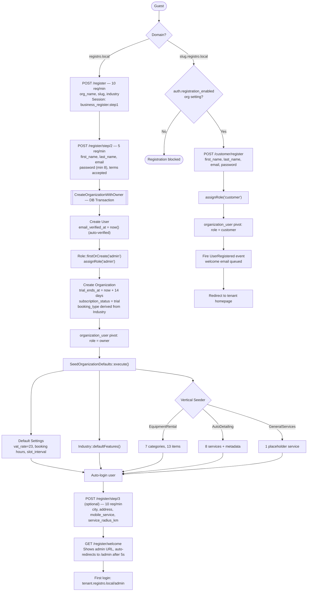

# Onboarding & Registration

**For customers:** there are two very different registration flows on
Registro — a new *business* signing up to run their own tenant (a 3-step
wizard on the root domain), and a *customer* creating an account on a
specific business's subdomain to book/order from them. This page covers both.

## Business registration (root domain, 3-step wizard)

Only available on the root domain (e.g. `registro.local`), never on a tenant
subdomain.

**Step 1** (`GET/POST /register`) — guest only; `org_name`, `slug`
(`ValidOrganizationSlug` + unique), `industry` enum. AJAX helpers:
`GET /register/check-slug`, `GET /register/generate-slug` (30/min each).

**Step 2** (`GET/POST /register/step/2`) — throttled 5/min. Executes
`CreateOrganizationWithOwner::execute()` in a DB transaction (see below).
Auto-logs in the new user.

**Step 3** (optional, auth required, throttle 10/min) — city, address,
mobile-service radius. Saved to org settings.

**Welcome** (`GET /register/welcome`) — shows the tenant's admin URL,
auto-redirects after 5 seconds.

### Onboarding wizard internals

`app/Actions/Onboarding/CreateOrganizationWithOwner.php` — all steps inside
one DB transaction:

1. User created, `email_verified_at = now()` (auto-verified — business owners
   never see an email-verification gate)
2. `Role::firstOrCreate(['name' => 'admin'])` then `assignRole('admin')`
3. Organization created: `booking_type` derived from `Industry::bookingType()`,
   `trial_ends_at = now()->addDays(14)`, `subscription_status = 'trial'`
4. `organization_user` pivot: `role = 'owner'`
5. `SeedOrganizationDefaults::execute($org)` — default settings, feature
   flags, and an industry-specific vertical seeder (equipment rental gets a
   starter catalogue of 7 categories/13 items; auto detailing gets 8 sample
   services; general services gets 1 placeholder)

Module resolution is automatic — no explicit module seeding needed;
`hasModule()` resolves from industry at runtime.

## Customer registration (tenant subdomain only)

Route: `GET/POST /customer/register` — middleware `guest`, `ResolveTenant`,
`CheckRegistrationEnabled` (gated by the tenant's own
`auth.registration_enabled` setting — a tenant can disable public
registration entirely, e.g. invite-only businesses).

Fields: `first_name`, `last_name`, `email` (unique), `password` (min 8,
confirmed). On success: `assignRole('customer')`, `organization_user` pivot
with `role = 'customer'`, fires `UserRegistered` (welcome email queued),
redirects to the tenant homepage. **No email verification required** — see
below.

Backwards-compat: `/get-started` → 301 redirect to `/register`.

## Roles

| Role | Who | Panel access | Key abilities |
|------|-----|---------------|---------------|
| `super-admin` | Registro operator | `/platform` | Everything across all tenants |
| `admin` | Business owner | `/admin` on their subdomain | Full tenant Filament panel |
| `staff` | Employee added by admin | `/admin` on their org's subdomain | Scope varies by module permissions |
| `customer` | End customer | None (frontend only) | Bookings, cart, orders, `/moje-konto` |

Post-login redirect (`LoginController::authenticated()`): `super-admin` →
`/platform`; `admin`/`staff` on tenant subdomain → `/admin`; `admin`/`staff`
on root domain → their first org's subdomain `/admin`; `customer` →
`appointments.index`.

The `organization_user.role` pivot value (`owner`/`customer`/`staff`) is
separate from the Spatie role system above.

## Trial & subscription

| Column | Notes |
|--------|-------|
| `trial_ends_at` | Set to `now()->addDays(14)` on org creation |
| `subscription_status` | `trial` \| `active` \| `paused` \| `cancelled` — default `trial` |
| `monthly_fee`, `subscribed_at`, `subscription_expires_at` | Nullable, managed manually |

**No automated enforcement exists yet.** Nothing blocks access after trial
expiry — subscription management is entirely manual via the Platform panel
(`TenantPayment` model). Inactive orgs are backfilled to
`subscription_status = 'cancelled'`.

## Password reset & setup

**Standard reset** (any user): `GET /password/reset` → email link →
`GET /password/reset/{token}` → `POST`, throttled 5/min.

**Admin-created staff setup**: admin creates a staff user in Filament →
`User::initiatePasswordSetup()` generates a 30-minute token → setup email
sent → `GET/POST /password/setup/{token}` (6/min) → password set, redirected
to `/login`.

## Email verification

**Business owners are auto-verified** (`email_verified_at = now()` at
creation) — no verification email is sent to them.

**Customer registration does not enforce verification** —
`MustVerifyEmail` is commented out on the `User` model, so the verification
gate is never triggered for customers either, even though `email_verified_at`
is left null.

## Key files

`app/Actions/Onboarding/CreateOrganizationWithOwner.php`,
`app/Actions/Onboarding/SeedOrganizationDefaults.php`,
`app/Http/Controllers/Auth/RegisterController.php`,
`app/Http/Controllers/Auth/CustomerRegisterController.php`,
`app/Enums/Industry.php`, `app/Models/User.php`.
