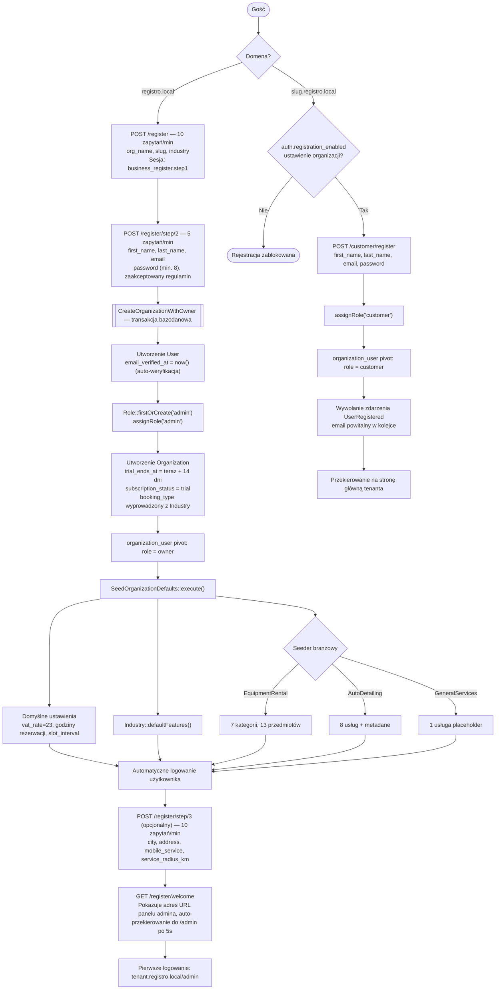

# Onboarding i rejestracja

**Dla klientów:** w Registro istnieją dwa zupełnie różne przepływy rejestracji —
nowa *firma* zakładająca własnego tenanta (3-etapowy kreator na domenie
głównej) oraz *klient* zakładający konto na subdomenie konkretnej firmy, aby
dokonywać rezerwacji/zamówień. Ta strona opisuje oba przypadki.

## Rejestracja firmy (domena główna, 3-etapowy kreator)

Dostępna wyłącznie na domenie głównej (np. `registro.local`), nigdy na
subdomenie tenanta.

**Etap 1** (`GET/POST /register`) — tylko dla gości; `org_name`, `slug`
(`ValidOrganizationSlug` + unikalność), enum `industry`. Pomocnicze AJAX-y:
`GET /register/check-slug`, `GET /register/generate-slug` (30/min każdy).

**Etap 2** (`GET/POST /register/step/2`) — throttling 5/min. Wykonuje
`CreateOrganizationWithOwner::execute()` w transakcji bazodanowej (patrz
niżej). Automatycznie loguje nowego użytkownika.

**Etap 3** (opcjonalny, wymaga zalogowania, throttling 10/min) — miasto,
adres, promień usługi mobilnej. Zapisywane w ustawieniach organizacji.

**Welcome** (`GET /register/welcome`) — pokazuje adres URL panelu admina
tenanta, auto-przekierowanie po 5 sekundach.

### Wewnętrzny mechanizm kreatora onboardingu

`app/Actions/Onboarding/CreateOrganizationWithOwner.php` — wszystkie kroki
wewnątrz jednej transakcji bazodanowej:

1. Tworzony jest User, `email_verified_at = now()` (auto-weryfikacja —
   właściciele firm nigdy nie widzą bramki weryfikacji e-mail)
2. `Role::firstOrCreate(['name' => 'admin'])`, następnie `assignRole('admin')`
3. Tworzona jest Organization: `booking_type` wyprowadzony z
   `Industry::bookingType()`, `trial_ends_at = now()->addDays(14)`,
   `subscription_status = 'trial'`
4. Pivot `organization_user`: `role = 'owner'`
5. `SeedOrganizationDefaults::execute($org)` — domyślne ustawienia, flagi
   funkcji oraz branżowy seeder (rental sprzętu otrzymuje startowy katalog
   7 kategorii/13 przedmiotów; auto detailing otrzymuje 8 przykładowych
   usług; usługi ogólne otrzymują 1 placeholder)

Rozwiązywanie modułów jest automatyczne — nie ma potrzeby jawnego seedowania
modułów; `hasModule()` rozwiązuje branżę w czasie działania (runtime).

## Rejestracja klienta (tylko subdomena tenanta)

Trasa: `GET/POST /customer/register` — middleware `guest`, `ResolveTenant`,
`CheckRegistrationEnabled` (zależne od własnego ustawienia tenanta
`auth.registration_enabled` — tenant może całkowicie wyłączyć publiczną
rejestrację, np. firmy działające tylko na zaproszenia).

Pola: `first_name`, `last_name`, `email` (unikalny), `password` (min. 8,
potwierdzone). Po sukcesie: `assignRole('customer')`, pivot
`organization_user` z `role = 'customer'`, wywoływane jest zdarzenie
`UserRegistered` (email powitalny trafia do kolejki), przekierowanie na
stronę główną tenanta. **Weryfikacja e-mail nie jest wymagana** — patrz
niżej.

Kompatybilność wsteczna: `/get-started` → przekierowanie 301 do `/register`.

## Role

| Rola | Kto | Dostęp do panelu | Kluczowe uprawnienia |
|------|-----|---------------|---------------|
| `super-admin` | Operator Registro | `/platform` | Wszystko, we wszystkich tenantach |
| `admin` | Właściciel firmy | `/admin` na swojej subdomenie | Pełny panel Filament tenanta |
| `staff` | Pracownik dodany przez admina | `/admin` na subdomenie swojej organizacji | Zakres zależny od uprawnień modułów |
| `customer` | Klient końcowy | Brak (tylko frontend) | Rezerwacje, koszyk, zamówienia, `/moje-konto` |

Przekierowanie po zalogowaniu (`LoginController::authenticated()`):
`super-admin` → `/platform`; `admin`/`staff` na subdomenie tenanta →
`/admin`; `admin`/`staff` na domenie głównej → subdomena `/admin` ich
pierwszej organizacji; `customer` → `appointments.index`.

Wartość pivotu `organization_user.role` (`owner`/`customer`/`staff`) jest
niezależna od opisanego wyżej systemu ról Spatie.

## Trial i subskrypcja

| Kolumna | Uwagi |
|--------|-------|
| `trial_ends_at` | Ustawiane na `now()->addDays(14)` przy tworzeniu organizacji |
| `subscription_status` | `trial` \| `active` \| `paused` \| `cancelled` — domyślnie `trial` |
| `monthly_fee`, `subscribed_at`, `subscription_expires_at` | Nullable, zarządzane ręcznie |

**Nie istnieje jeszcze żadne automatyczne egzekwowanie.** Nic nie blokuje
dostępu po wygaśnięciu triala — zarządzanie subskrypcją odbywa się w
całości ręcznie przez panel Platform (model `TenantPayment`). Nieaktywne
organizacje są uzupełniane wstecznie do `subscription_status = 'cancelled'`.

## Reset i ustawienie hasła

**Standardowy reset** (dowolny użytkownik): `GET /password/reset` → link
w e-mailu → `GET /password/reset/{token}` → `POST`, throttling 5/min.

**Ustawienie hasła dla pracownika utworzonego przez admina**: admin tworzy
użytkownika typu staff w Filament → `User::initiatePasswordSetup()`
generuje 30-minutowy token → wysyłany jest email z linkiem konfiguracyjnym
→ `GET/POST /password/setup/{token}` (6/min) → ustawienie hasła,
przekierowanie do `/login`.

## Weryfikacja e-mail

**Właściciele firm są auto-weryfikowani** (`email_verified_at = now()`
przy tworzeniu) — nie jest do nich wysyłany żaden email weryfikacyjny.

**Rejestracja klienta nie wymusza weryfikacji** —
`MustVerifyEmail` jest zakomentowany w modelu `User`, więc bramka
weryfikacji nigdy nie jest uruchamiana także dla klientów, mimo że
`email_verified_at` pozostaje puste (null).

## Kluczowe pliki

`app/Actions/Onboarding/CreateOrganizationWithOwner.php`,
`app/Actions/Onboarding/SeedOrganizationDefaults.php`,
`app/Http/Controllers/Auth/RegisterController.php`,
`app/Http/Controllers/Auth/CustomerRegisterController.php`,
`app/Enums/Industry.php`, `app/Models/User.php`.
