# Purchase Process (funnel view)

**For customers:** this is the complete path from landing on the site to
receiving a paid, confirmed order — homepage → catalogue → product page →
cart → checkout → Przelewy24 payment → confirmation email. This page is the
"sales funnel" view; for the deeper technical detail on B2C/B2B field
validation see [Customer Journey — Rental](customer-journey-rental.md), and
for cancellation see [Cancellation](customer-journey-cancellation.md).

Applies to `ServiceType::ItemRental` services only. `ServiceType::TimeSlot`
services go through the [booking wizard](customer-journey-booking.md) instead
and never touch cart/checkout/Order.

The entire purchase path sits behind authentication — see
[Guest vs Authenticated](guest-vs-authenticated.md).

## The funnel, step by step

| # | Route | Guard | Description |
|---|-------|-------|-------------|
| 1 | `GET /wypozyczalnia` or `GET /uslugi` | none | Catalogue (`RentalController`/`ServiceController`) |
| 2 | `GET /uslugi/{service:slug}` | none | Product page — availability calendar, "Add to cart" |
| 3 | `POST /koszyk/dodaj` (`cart.add`) | auth + tenant | Adds item + date range to cart |
| 4 | `GET /koszyk` (`cart.show`) | auth + tenant | Cart review; availability re-checked on every update |
| 5 | `GET /koszyk/zamowienie` (`checkout.show`) | auth + tenant | Single-page checkout form. First load stamps `checkout_started_at`, fires `checkout.started` analytics event, pre-fills from user profile |
| 6 | `POST /koszyk/zamowienie` (`checkout.submit`) | auth + tenant, throttle 6/min | `SubmitCheckoutRequest` validates → `CartService::convertToOrder()` (DB transaction, `lockForUpdate` on cart) → registers P24 transaction → fires `checkout.submitted` → redirects to P24 |
| 7 | P24 gateway | external | Customer completes payment on Przelewy24's page |
| 8 | `GET /koszyk/powrot` (`checkout.return`) | auth + tenant | Return page — looks up order by `p24_session_id`; shows success/pending/cancelled/not-found; **no payment action taken here** |
| 9 | `POST /webhooks/przelewy24` (async, server-to-server) | none (excluded from CSRF+auth) | Verifies P24 signature, calls `verify()`, creates `Payment`, transitions order to `paid`, fires `OrderPaid` |
| 10 | `GET /moje-zamowienia/{order}` (`orders.show`) | auth + tenant, ownership enforced | Order detail page |

## Full funnel diagram

```mermaid
flowchart LR
    CAT["/wypozyczalnia\nCatalogue"] --> SVC["Product page"]
    SVC --> AUTH{Logged in?}
    AUTH -- No --> LOGIN["Login / Register"]
    LOGIN --> SVC
    AUTH -- Yes --> ADD["Add to cart\nPOST cart.add"]
    ADD --> AVAIL{Available in stock?}
    AVAIL -- No --> ERR_AV["Error: not available\nredirect back"]
    ERR_AV --> SVC
    AVAIL -- OK --> CART_VIEW

    subgraph KOSZYK ["GET /koszyk — Cart"]
        CART_VIEW["Item list, prices, dates"]
        CART_UPD["Change quantity\n(re-check availability)"]
        CART_DEL["Remove item"]
        CART_VIEW --> CART_UPD & CART_DEL
        CART_UPD & CART_DEL --> CART_VIEW
    end

    CART_VIEW -- "Place order" --> CO_EMPTY{Cart empty?}
    CO_EMPTY -- Yes --> CART_VIEW
    CO_EMPTY -- No --> CHECKOUT_PAGE

    subgraph FORMULARZ ["GET /koszyk/zamowienie — Single-page checkout (Alpine.js)"]
        CHECKOUT_PAGE["Checkout form\nPre-filled from user profile"]
        CTYPE{Customer type toggle}
        B2C["Natural person (B2C)\nName, PESEL, address\nOptional: invoice + NIP"]
        B2B["Business (B2B)\nCompany name, NIP, REGON, KRS\nSignatory + optional pickup person"]
        CONSENTS["Required consents:\nTerms, RODO, withdrawal-right exclusion\nAll timestamps + IP recorded on order"]
        CHECKOUT_PAGE --> CTYPE
        CTYPE -- natural_person --> B2C
        CTYPE -- business --> B2B
        B2C & B2B --> CONSENTS
    end

    CONSENTS --> SUBMIT["POST /koszyk/zamowienie\nthrottle: 6/min"]
    SUBMIT --> VAL{SubmitCheckoutRequest valid?}
    VAL -- No --> CHECKOUT_PAGE
    VAL -- Yes --> CART_ACT{Cart still active?}
    CART_ACT -- No --> ERR_CART["Generic error, redirect back"]
    ERR_CART --> CHECKOUT_PAGE
    CART_ACT -- Yes --> CONVERT["CartService::convertToOrder()\nDB transaction, lockForUpdate\ncart status → converted"]
    CONVERT --> ORDER_CREATED["Order: pending_payment\nexpires_at = now + 20 min"]
    ORDER_CREATED --> P24_REG["Przelewy24Service::registerTransaction()"]
    P24_REG --> P24_OK{Registered OK?}
    P24_OK -- No --> ERR_P24["Error, redirect back"]
    ERR_P24 --> CHECKOUT_PAGE
    P24_OK -- Yes --> P24_GW["Redirect to Przelewy24 gateway"]

    P24_GW --> RETURN["GET /koszyk/powrot\n?sessionId=ORDER-{id}-{ts}"]
    RETURN --> RET_STATUS{Order status?}
    RET_STATUS -- "paid / confirmed" --> SUCCESS["Payment successful"]
    RET_STATUS -- pending_payment --> PENDING["Awaiting webhook\nauto-refresh every 5s"]
    RET_STATUS -- cancelled --> CANCEL_SCREEN["Order cancelled"]
    PENDING -.->|auto-refresh| RETURN
    SUCCESS --> ORDER_DETAIL["GET /moje-zamowienia/{order}"]

    subgraph WEBHOOK ["POST /webhooks/przelewy24 — async, no-auth, no-csrf"]
        WH_SIG{Signature valid?}
        WH_FIND["Find order by p24_session_id"]
        WH_IDEM{"order.status == paid?"}
        WH_SKIP["Idempotency skip\n(duplicate webhook)"]
        WH_VER["transactions()->verify()"]
        WH_PAY["Payment(status=success)\norder.status → paid, paid_at stamped"]
        WH_EVENT["event(new OrderPaid(order))"]
        WH_NC["OrderPaidNotification → customer"]
        WH_NA["OrderPaidNotification → admin"]

        WH_SIG -- Yes --> WH_FIND
        WH_FIND --> WH_IDEM
        WH_IDEM -- Yes --> WH_SKIP
        WH_IDEM -- No --> WH_VER
        WH_VER --> WH_PAY
        WH_PAY --> WH_EVENT
        WH_EVENT --> WH_NC & WH_NA
    end

    WH_PAY -.->|order.status = paid, DB| RET_STATUS
```



## Order status machine (corrected)

The order status diagrams in the source documents this page was synthesised
from (`checkout-order-flow.md`, `payment-flow.md`) were missing two real
transitions confirmed present in `app/StateMachines/OrderStatusStateMachine.php`.
Both are corrected here:

1. **`in_progress → cancelled`** (exceptional — forced offboarding of a
   closing tenant). Not exposed by the standard Filament "Anuluj" button
   (visible only for `pending_payment`/`paid`/`confirmed`), but a legal
   transition at the state-machine level, reachable via `OrderService::cancel()`
   called directly.
2. **`cancelled → paid`** (reconciliation only, guarded). A genuine P24
   success webhook can arrive after `orders:cleanup-expired` already
   cancelled the order (slow bank/BLIK confirmation racing the TTL cron).
   `validatorForTransition()` requires an existing `Payment(status=success)`
   row before allowing this transition — enforced regardless of caller, not
   just by convention.

```mermaid
stateDiagram-v2
    direction LR

    state "Awaiting payment" as pending_payment
    state "Paid" as paid
    state "Confirmed" as confirmed
    state "In progress" as in_progress
    state "Completed" as completed
    state "Refunded" as refunded
    state "Cancelled" as cancelled

    [*] --> pending_payment : CartService::convertToOrder() [customer]

    pending_payment --> paid : Webhook P24 verify() OK [system]
    pending_payment --> cancelled : Customer cancel / Admin cancel / TTL 20 min expiry [system]

    paid --> confirmed : Admin confirms in Filament [admin]
    paid --> cancelled : Admin cancels [admin]

    confirmed --> in_progress : Scheduled job — start_date reached [system]
    confirmed --> cancelled : Admin cancels [admin]

    in_progress --> completed : Admin — after item return [admin]
    in_progress --> cancelled : Forced offboarding (exceptional) [admin/system]

    completed --> refunded : Refund request [admin]

    cancelled --> paid : Reconciliation ONLY — requires verified\nPayment row, enforced by validatorForTransition() [system]
    cancelled --> [*]
    refunded --> [*]

    note right of pending_payment
        expires_at = now() + 20 min
        Blocks availability only while
        expires_at > now()
    end note

    note right of paid
        paid_at stamped
        Event: OrderPaid
        → OrderPaidNotification (customer, admin)
        Blocks availability indefinitely
    end note

    note right of cancelled
        cancelled_at stamped
        Event: OrderCancelled
        → OrderCancelledNotification (customer)
        Releases availability
    end note
```

## Notifications triggered

All queued (`ShouldQueue`) on the `emails` queue.

| Trigger | Notification | Recipients |
|---------|--------------|-----------|
| `OrderPaid` event | `OrderPaidNotification` | Customer + organisation owner (both `ShouldBeUnique`, 5 min window) |
| `OrderConfirmed` event | `OrderConfirmedNotification` | Customer |
| `OrderCancelled` event | `OrderCancelledNotification` | Customer |

## DEV mode

`FakePaymentController` (`POST /dev/fake-pay`, non-production only) bypasses
the real P24 flow entirely — auto-builds checkout data from the authenticated
user's profile and transitions the order directly to `paid` without firing
`OrderPaid` (no notifications sent in dev).

## Key files

`app/Http/Controllers/CartController.php`, `app/Http/Controllers/CheckoutController.php`,
`app/Http/Controllers/WebhookController.php`, `app/Services/Cart/CartService.php`,
`app/Services/Payment/Przelewy24Service.php`, `app/StateMachines/OrderStatusStateMachine.php`,
`app/Http/Requests/Checkout/SubmitCheckoutRequest.php`.
