# Proces zakupowy (widok lejka)

**Dla klientów:** to kompletna ścieżka od wejścia na stronę do otrzymania
opłaconego, potwierdzonego zamówienia — strona główna → katalog → strona
produktu → koszyk → checkout → płatność Przelewy24 → e-mail potwierdzający.
Ta strona przedstawia widok „lejka sprzedażowego"; dla głębszych szczegółów
technicznych walidacji pól B2C/B2B zobacz [Customer Journey — Rental](customer-journey-rental.md),
a dla anulowania zobacz [Cancellation](customer-journey-cancellation.md).

Dotyczy wyłącznie usług `ServiceType::ItemRental`. Usługi `ServiceType::TimeSlot`
przechodzą zamiast tego przez [kreator rezerwacji](customer-journey-booking.md)
i nigdy nie dotykają koszyka/checkoutu/Order.

Cała ścieżka zakupowa znajduje się za uwierzytelnieniem — zobacz
[Guest vs Authenticated](guest-vs-authenticated.md).

## Lejek krok po kroku

| # | Trasa | Zabezpieczenie | Opis |
|---|-------|-----------------|------|
| 1 | `GET /wypozyczalnia` lub `GET /uslugi` | brak | Katalog (`RentalController`/`ServiceController`) |
| 2 | `GET /uslugi/{service:slug}` | brak | Strona produktu — kalendarz dostępności, „Dodaj do koszyka" |
| 3 | `POST /koszyk/dodaj` (`cart.add`) | auth + tenant | Dodaje przedmiot + zakres dat do koszyka |
| 4 | `GET /koszyk` (`cart.show`) | auth + tenant | Przegląd koszyka; dostępność ponownie sprawdzana przy każdej aktualizacji |
| 5 | `GET /koszyk/zamowienie` (`checkout.show`) | auth + tenant | Jednostronicowy formularz checkoutu. Pierwsze wejście zapisuje `checkout_started_at`, wywołuje zdarzenie analityczne `checkout.started`, wypełnia dane z profilu użytkownika |
| 6 | `POST /koszyk/zamowienie` (`checkout.submit`) | auth + tenant, throttle 6/min | `SubmitCheckoutRequest` waliduje → `CartService::convertToOrder()` (transakcja DB, `lockForUpdate` na koszyku) → rejestruje transakcję P24 → wywołuje `checkout.submitted` → przekierowuje do P24 |
| 7 | Bramka P24 | zewnętrzne | Klient dokonuje płatności na stronie Przelewy24 |
| 8 | `GET /koszyk/powrot` (`checkout.return`) | auth + tenant | Strona powrotna — wyszukuje zamówienie po `p24_session_id`; pokazuje success/pending/cancelled/not-found; **żadna akcja płatnicza nie jest tu wykonywana** |
| 9 | `POST /webhooks/przelewy24` (async, server-to-server) | brak (wyłączone z CSRF+auth) | Weryfikuje podpis P24, wywołuje `verify()`, tworzy `Payment`, przechodzi zamówienie do `paid`, wywołuje `OrderPaid` |
| 10 | `GET /moje-zamowienia/{order}` (`orders.show`) | auth + tenant, wymuszone posiadanie | Strona szczegółów zamówienia |

## Pełny diagram lejka

```mermaid
flowchart LR
    CAT["/wypozyczalnia\nKatalog"] --> SVC["Strona produktu"]
    SVC --> AUTH{Zalogowany?}
    AUTH -- Nie --> LOGIN["Logowanie / Rejestracja"]
    LOGIN --> SVC
    AUTH -- Tak --> ADD["Dodaj do koszyka\nPOST cart.add"]
    ADD --> AVAIL{Dostępne na stanie?}
    AVAIL -- Nie --> ERR_AV["Błąd: niedostępne\nprzekierowanie z powrotem"]
    ERR_AV --> SVC
    AVAIL -- OK --> CART_VIEW

    subgraph KOSZYK ["GET /koszyk — Koszyk"]
        CART_VIEW["Lista pozycji, ceny, daty"]
        CART_UPD["Zmiana ilości\n(ponowne sprawdzenie dostępności)"]
        CART_DEL["Usuń pozycję"]
        CART_VIEW --> CART_UPD & CART_DEL
        CART_UPD & CART_DEL --> CART_VIEW
    end

    CART_VIEW -- "Złóż zamówienie" --> CO_EMPTY{Koszyk pusty?}
    CO_EMPTY -- Tak --> CART_VIEW
    CO_EMPTY -- Nie --> CHECKOUT_PAGE

    subgraph FORMULARZ ["GET /koszyk/zamowienie — Jednostronicowy checkout (Alpine.js)"]
        CHECKOUT_PAGE["Formularz checkoutu\nWypełniony z profilu użytkownika"]
        CTYPE{Przełącznik typu klienta}
        B2C["Osoba fizyczna (B2C)\nImię i nazwisko, PESEL, adres\nOpcjonalnie: faktura + NIP"]
        B2B["Firma (B2B)\nNazwa firmy, NIP, REGON, KRS\nOsoba reprezentująca + opcjonalna osoba odbierająca"]
        CONSENTS["Wymagane zgody:\nRegulamin, RODO, wyłączenie prawa odstąpienia\nWszystkie znaczniki czasu + IP zapisane w zamówieniu"]
        CHECKOUT_PAGE --> CTYPE
        CTYPE -- natural_person --> B2C
        CTYPE -- business --> B2B
        B2C & B2B --> CONSENTS
    end

    CONSENTS --> SUBMIT["POST /koszyk/zamowienie\nthrottle: 6/min"]
    SUBMIT --> VAL{SubmitCheckoutRequest poprawny?}
    VAL -- Nie --> CHECKOUT_PAGE
    VAL -- Tak --> CART_ACT{Koszyk nadal aktywny?}
    CART_ACT -- Nie --> ERR_CART["Ogólny błąd, przekierowanie z powrotem"]
    ERR_CART --> CHECKOUT_PAGE
    CART_ACT -- Tak --> CONVERT["CartService::convertToOrder()\ntransakcja DB, lockForUpdate\nstatus koszyka → converted"]
    CONVERT --> ORDER_CREATED["Order: pending_payment\nexpires_at = now + 20 min"]
    ORDER_CREATED --> P24_REG["Przelewy24Service::registerTransaction()"]
    P24_REG --> P24_OK{Zarejestrowano poprawnie?}
    P24_OK -- Nie --> ERR_P24["Błąd, przekierowanie z powrotem"]
    ERR_P24 --> CHECKOUT_PAGE
    P24_OK -- Tak --> P24_GW["Przekierowanie do bramki Przelewy24"]

    P24_GW --> RETURN["GET /koszyk/powrot\n?sessionId=ORDER-{id}-{ts}"]
    RETURN --> RET_STATUS{Status zamówienia?}
    RET_STATUS -- "paid / confirmed" --> SUCCESS["Płatność zakończona sukcesem"]
    RET_STATUS -- pending_payment --> PENDING["Oczekiwanie na webhook\nauto-odświeżanie co 5s"]
    RET_STATUS -- cancelled --> CANCEL_SCREEN["Zamówienie anulowane"]
    PENDING -.->|auto-odświeżanie| RETURN
    SUCCESS --> ORDER_DETAIL["GET /moje-zamowienia/{order}"]

    subgraph WEBHOOK ["POST /webhooks/przelewy24 — async, no-auth, no-csrf"]
        WH_SIG{Podpis poprawny?}
        WH_FIND["Znajdź zamówienie po p24_session_id"]
        WH_IDEM{"order.status == paid?"}
        WH_SKIP["Pominięcie idempotentne\n(zduplikowany webhook)"]
        WH_VER["transactions()->verify()"]
        WH_PAY["Payment(status=success)\norder.status → paid, zapisany paid_at"]
        WH_EVENT["event(new OrderPaid(order))"]
        WH_NC["OrderPaidNotification → klient"]
        WH_NA["OrderPaidNotification → admin"]

        WH_SIG -- Tak --> WH_FIND
        WH_FIND --> WH_IDEM
        WH_IDEM -- Tak --> WH_SKIP
        WH_IDEM -- Nie --> WH_VER
        WH_VER --> WH_PAY
        WH_PAY --> WH_EVENT
        WH_EVENT --> WH_NC & WH_NA
    end

    WH_PAY -.->|order.status = paid, DB| RET_STATUS
```



## Maszyna stanów zamówienia (skorygowana)

W diagramach statusów zamówienia w dokumentach źródłowych, z których ta strona
została zsyntetyzowana (`checkout-order-flow.md`, `payment-flow.md`), brakowało
dwóch rzeczywistych przejść potwierdzonych w
`app/StateMachines/OrderStatusStateMachine.php`. Obie zostały tu skorygowane:

1. **`in_progress → cancelled`** (wyjątkowe — wymuszony offboarding zamykanego
   tenanta). Nieudostępnione przez standardowy przycisk „Anuluj" w Filamencie
   (widoczny tylko dla `pending_payment`/`paid`/`confirmed`), ale prawidłowe
   przejście na poziomie maszyny stanów, osiągalne przez bezpośrednie
   wywołanie `OrderService::cancel()`.
2. **`cancelled → paid`** (wyłącznie rekoncyliacja, zabezpieczone). Prawdziwy
   webhook sukcesu P24 może dotrzeć już po tym, jak `orders:cleanup-expired`
   anulował zamówienie (wolne potwierdzenie banku/BLIK ścigające się z cronem
   TTL). `validatorForTransition()` wymaga istniejącego wiersza
   `Payment(status=success)` przed dopuszczeniem tego przejścia — wymuszane
   niezależnie od wywołującego, nie tylko przez konwencję.

```mermaid
stateDiagram-v2
    direction LR

    state "Oczekuje na płatność" as pending_payment
    state "Opłacone" as paid
    state "Potwierdzone" as confirmed
    state "W trakcie" as in_progress
    state "Zakończone" as completed
    state "Zwrócone" as refunded
    state "Anulowane" as cancelled

    [*] --> pending_payment : CartService::convertToOrder() [klient]

    pending_payment --> paid : Webhook P24 verify() OK [system]
    pending_payment --> cancelled : Anulowanie przez klienta / Anulowanie przez admina / wygaśnięcie TTL 20 min [system]

    paid --> confirmed : Admin potwierdza w Filamencie [admin]
    paid --> cancelled : Admin anuluje [admin]

    confirmed --> in_progress : Zaplanowane zadanie — osiągnięto start_date [system]
    confirmed --> cancelled : Admin anuluje [admin]

    in_progress --> completed : Admin — po zwrocie przedmiotu [admin]
    in_progress --> cancelled : Wymuszony offboarding (wyjątkowe) [admin/system]

    completed --> refunded : Wniosek o zwrot środków [admin]

    cancelled --> paid : WYŁĄCZNIE rekoncyliacja — wymaga zweryfikowanego\nwiersza Payment, wymuszane przez validatorForTransition() [system]
    cancelled --> [*]
    refunded --> [*]

    note right of pending_payment
        expires_at = now() + 20 min
        Blokuje dostępność tylko dopóki
        expires_at > now()
    end note

    note right of paid
        zapisany paid_at
        Zdarzenie: OrderPaid
        → OrderPaidNotification (klient, admin)
        Blokuje dostępność bezterminowo
    end note

    note right of cancelled
        zapisany cancelled_at
        Zdarzenie: OrderCancelled
        → OrderCancelledNotification (klient)
        Zwalnia dostępność
    end note
```

## Wywoływane powiadomienia

Wszystkie kolejkowane (`ShouldQueue`) na kolejce `emails`.

| Wyzwalacz | Powiadomienie | Odbiorcy |
|-----------|----------------|----------|
| zdarzenie `OrderPaid` | `OrderPaidNotification` | Klient + właściciel organizacji (oba `ShouldBeUnique`, okno 5 min) |
| zdarzenie `OrderConfirmed` | `OrderConfirmedNotification` | Klient |
| zdarzenie `OrderCancelled` | `OrderCancelledNotification` | Klient |

## Tryb DEV

`FakePaymentController` (`POST /dev/fake-pay`, tylko poza produkcją) całkowicie
omija rzeczywisty przepływ P24 — automatycznie buduje dane checkoutu z profilu
uwierzytelnionego użytkownika i przechodzi zamówienie bezpośrednio do `paid`
bez wywoływania `OrderPaid` (w trybie dev nie są wysyłane żadne powiadomienia).

## Kluczowe pliki

`app/Http/Controllers/CartController.php`, `app/Http/Controllers/CheckoutController.php`,
`app/Http/Controllers/WebhookController.php`, `app/Services/Cart/CartService.php`,
`app/Services/Payment/Przelewy24Service.php`, `app/StateMachines/OrderStatusStateMachine.php`,
`app/Http/Requests/Checkout/SubmitCheckoutRequest.php`.
