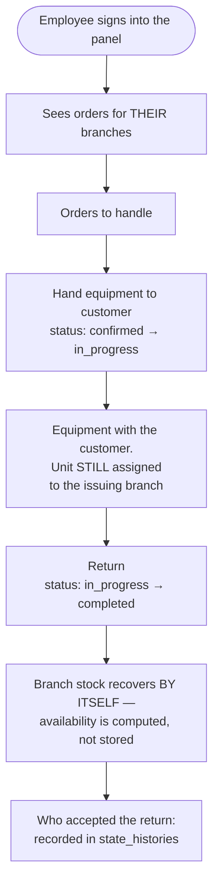

# Staff Journey — Working at a Branch

> **Status: PLANNED.** Designed, not yet implemented (plan approved 2026-08-26).
> Plan: [`docs/features/lokalizacje/`](../../app/docs/features/lokalizacje/README.md).

**For owners:** you assign each employee the branch they work at. From then on they only see
orders for their site in the panel, and when they mark a return the system already knows which
branch the equipment came back to — without asking them.

## Assigning a branch

An employee is a `User` with the `staff` role, managed through `EmployeeResource`. Branches are
assigned through the `location_user` pivot — an employee may serve **more than one** site, with
one marked primary.

**Why not a column on `users`:** the same table holds customers and super-admins, and a user may
belong to several organisations through the `organization_user` pivot. A `branch_id` column would
break both facts.

**Why not a "branch manager" role:** Spatie roles are global in this project
(`config/permission.php` → `'teams' => false`). Branch membership is an **assignment**, not a role.

## Day-to-day work

## Three things worth understanding

### 1. A return needs no stock action

Availability is **computed, not stored**. Equipment stops blocking the moment the order status
leaves the blocking set — nothing is decremented or incremented. The employee clicks "Equipment
returned" and that is all.

### 2. A rented unit changes neither branch nor status

Throughout the rental the unit stays "serviceable, assigned to branch X". This is not an
oversight — were it to change status, it would be subtracted from stock **twice**: once as an
unavailable unit, once as a reservation.

### 3. Who did what records itself

`state_histories.responsible_*` captures the actor of every status change automatically, from
`auth()->user()`. Nothing needs to be entered anywhere.

## Moving equipment between branches

A separate, **deliberate** admin operation — in a real rental business a machine sometimes moves
from Gdansk to Warsaw permanently.

| Step | What happens |
|---|---|
| 1 | Admin picks a unit (or a quantity) and a destination branch |
| 2 | **Coverage check** — will the source branch still serve its accepted future reservations without this unit |
| 3 | If not: **refused**, with the conflicting orders listed. If yes: an entry in the movement ledger |
| 4 | Status `in_transit` — equipment in transit is available at neither branch |
| 5 | Receipt confirmed at the destination branch |

Step 2 guards against the quietest failure this model allows: the only unit in Gdansk, a paid
order for next week, an admin moves it to Warsaw — and the paid reservation loses its coverage
**without a single message**.

## Servicing a single unit

Setting a unit's status to `maintenance` removes **one** unit from that branch's availability.

Today the only switch is `is_active` on the **entire** service — taking one broken hammer drill
out of service disables every hammer drill of that model across the whole company.
