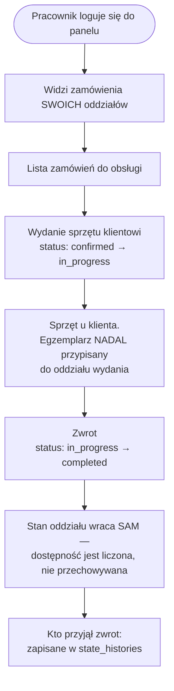

# Podróż pracownika — Praca w oddziale

> **Status: PLANOWANE.** Zachowanie zaprojektowane, jeszcze niewdrożone.
> **Oddział jako encja już istnieje** (fazy 0-2) i pracownik z rolą admina może nim zarządzać
> w panelu — ale **przypisanie pracownika do oddziału i zawężenie widoku to Faza 8**,
> wstrzymana decyzją właściciela produktu. Nic z opisanego niżej podziału pracy jeszcze
> nie działa. Plan: [`app/docs/features/lokalizacje/`](../../app/docs/features/lokalizacje/README.md).

**Dla właścicieli:** pracownikowi przypisujesz oddział, w którym pracuje. Od tego momentu widzi
w panelu tylko zamówienia swojego punktu, a gdy klika zwrot — system wie, do którego oddziału
sprzęt wrócił, bez pytania go o to.

## Przypisanie do oddziału

Pracownik to `User` z rolą `staff`, zarządzany przez `EmployeeResource`. Oddziały przypisuje się
przez pivot `location_user` — pracownik może obsługiwać **więcej niż jeden** punkt, jeden z nich
oznaczony jako podstawowy.

**Dlaczego nie kolumna na `users`:** ta sama tabela trzyma klientów i super-adminów, a użytkownik
może należeć do wielu organizacji przez pivot `organization_user`. Kolumna `branch_id` złamałaby
oba te fakty.

**Dlaczego nie rola „kierownik oddziału":** role Spatie są w tym projekcie globalne
(`config/permission.php` → `'teams' => false`). Przynależność do oddziału to **przypisanie**,
nie rola.

## Codzienna praca

## Trzy rzeczy, które warto rozumieć

### 1. Zwrot nie wymaga żadnej akcji magazynowej

Dostępność jest **liczona, a nie przechowywana**. Sprzęt przestaje blokować magazyn w chwili, gdy
status zamówienia wypada ze zbioru blokującego — nikt niczego nie dekrementuje ani nie
inkrementuje. Pracownik klika „Sprzęt zwrócony" i to wszystko.

### 2. Egzemplarz wypożyczony nie zmienia oddziału ani statusu

Przez cały czas wypożyczenia sztuka pozostaje „sprawna, przypisana do oddziału X". To nie jest
niedopatrzenie — gdyby zmieniała status, zostałaby odjęta od stanu **dwa razy**: raz jako
niedostępny egzemplarz, raz jako rezerwacja.

### 3. Kto co zrobił, zapisuje się samo

`state_histories.responsible_*` zapisuje wykonawcę każdej zmiany statusu automatycznie, z
`auth()->user()`. Nie trzeba tego nigdzie wpisywać.

## Przeniesienie sprzętu między oddziałami

Osobna, **świadoma** operacja admina — bo w realnej wypożyczalni maszyna czasem jedzie z Gdańska
do Warszawy na stałe.

| Krok | Co się dzieje |
|---|---|
| 1 | Admin wybiera egzemplarz (albo liczbę sztuk) i oddział docelowy |
| 2 | **Sprawdzenie pokrycia** — czy oddział źródłowy po zabraniu sztuki nadal obsłuży swoje przyjęte przyszłe rezerwacje |
| 3 | Jeśli nie: **odmowa** z listą kolidujących zamówień. Jeśli tak: wpis w księdze ruchu |
| 4 | Status `in_transit` — sprzęt w drodze nie jest dostępny w żadnym oddziale |
| 5 | Potwierdzenie przyjęcia w oddziale docelowym |

Krok 2 broni przed najcichszym błędem, jaki ten model dopuszcza: jedyna sztuka w Gdańsku,
opłacone zamówienie na przyszły tydzień, admin przenosi ją do Warszawy — i opłacona rezerwacja
traci pokrycie **bez jednego komunikatu**.

## Serwis pojedynczej sztuki

Ustawienie egzemplarzowi statusu `maintenance` zdejmuje **jedną** sztukę z dostępności oddziału.

Dziś jedynym wyłącznikiem jest `is_active` na **całej** usłudze — wyłączenie jednego uszkodzonego
młota wyłącza wszystkie młoty tego modelu w całej firmie.
