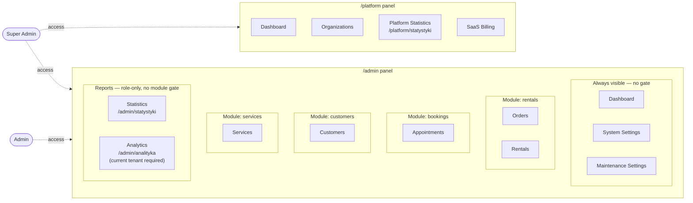
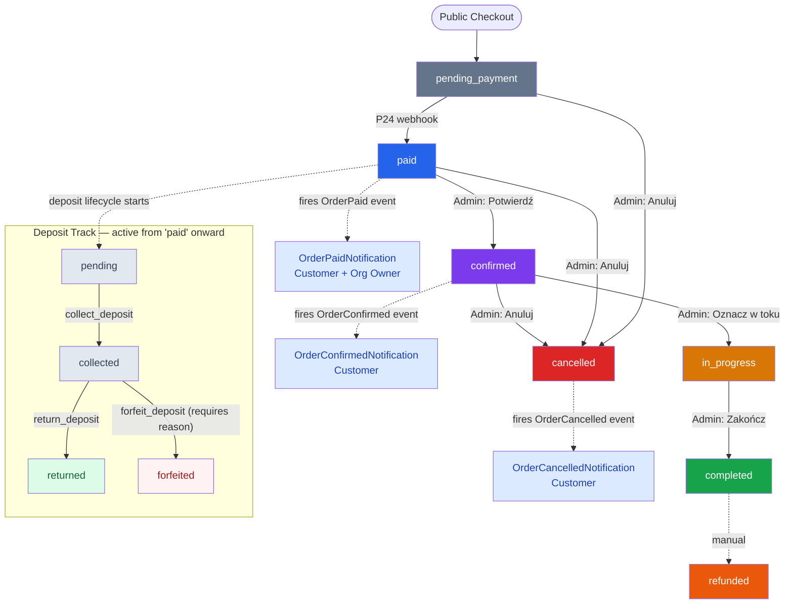
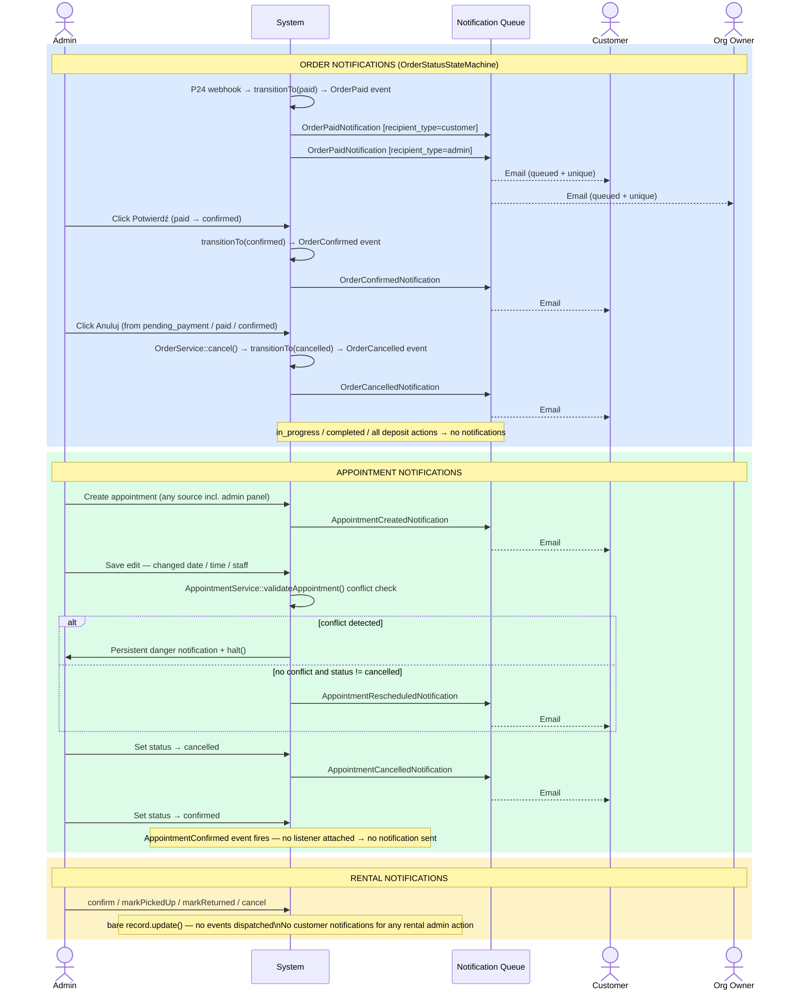

# Admin Panel Flows

## Panel Architecture (Platform vs Admin)

Two panels exist. `/platform` is super-admin only and manages cross-tenant concerns (organizations, SaaS billing, platform-wide statistics). `/admin` is the per-tenant panel; access is scoped to the authenticated organization via Filament's tenancy middleware.

---

## Module Gating System

Resources implement `BaseResource::shouldRegisterNavigation()`, which checks `Organization::hasModule($key)`. If the tenant lacks the module, the resource is invisible in the nav and all routes return 403.

| Module key | Resources gated | Default ON for |
|------------|----------------|----------------|
| `rentals` | OrderResource, RentalResource | EquipmentRental industry; booking_type: item_rental or both |
| `bookings` | AppointmentResource | AutoDetailing, GeneralServices; booking_type: time_slot or both |
| `customers` | CustomerResource | Requires explicit override or industry default |
| `services` | ServiceResource | All industries |
| (none — core) | Dashboard, SystemSettings, MaintenanceSettings | Always visible |

`Statistics` and `AnalyticsOverview` are `Page` subclasses, not `Resource` subclasses. They bypass `shouldRegisterNavigation()` entirely and rely solely on `canAccess()` role checks (admin + super-admin).

---

## Order Management Flow

### State Machine

The state machine is `OrderStatusStateMachine`. After-transition hooks fire Eloquent events:
- `confirmed` → `OrderConfirmed`
- `cancelled` → `OrderCancelled`

Transitions to `in_progress` and `completed` do not fire events and do not notify the customer.

### Resource: `OrderResource`

**Module**: `rentals`. **`canCreate`**: false — orders originate only from the public checkout. **`canDelete`**: false, always. **`canEdit`**: false for terminal states (completed, cancelled, refunded).

**Pages**: ListOrders, ViewOrder, EditOrder. EditOrder uses the `StaysOnPageAfterSave` trait.

**Relation managers**: `OrderItemsRelationManager`.

**Table record actions** (in an ActionGroup):

| Action | Visibility condition | Effect |
|--------|---------------------|--------|
| EditAction ("Zarządzaj") | Always | Opens edit page |
| confirm | `status == 'paid'` | State machine → `confirmed` |
| mark_in_progress | `status == 'confirmed'` | State machine → `in_progress` |
| complete | `status == 'in_progress'` | State machine → `completed` |
| collect_deposit | `deposit_status == 'pending'` | Sets `deposit_status = 'collected'`, records timestamp |
| return_deposit | `deposit_status == 'collected'` | Sets `deposit_status = 'returned'`, records timestamp |
| forfeit_deposit | `deposit_status == 'collected'` | Requires cancellation reason; sets `deposit_status = 'forfeited'`; irreversible |
| cancel | status in `[pending_payment, paid, confirmed]` | `OrderService::cancel()` → state machine → `cancelled` |

All status-change actions are mirrored as header actions on the EditOrder page with identical logic.

**Filters**: status, created_from date, created_until date, deposit_status.

**Bulk actions**: none (`toolbarActions([])` is empty).

---

## Appointment Management Flow

### Resource: `AppointmentResource`

**Module**: `bookings`. **Access**: admin, super-admin, and staff (staff can view the list).

**Pages**: ListAppointments, CreateAppointment, EditAppointment. No ViewAppointment page exists.

**Relation managers**: `AuditLogsRelationManager`.

**Table record actions**: ViewAction, EditAction, DeleteAction.

**Bulk actions**: DeleteBulkAction.

### CreateAppointment

Supports inline customer creation from within the form via `createOptionForm` on the customer select — captures name, email, and password without leaving the appointment form.

### EditAppointment

**Header actions**: DeleteAction only.

`mutateFormDataBeforeSave` runs before every save:
1. Validates the selected staff member has the `staff` role.
2. If `appointment_date`, `start_time`, or `end_time` changed, calls `AppointmentService::validateAppointment()` to check for scheduling conflicts.
3. On conflict: sends a persistent danger notification and calls `$this->halt()` — the save is blocked and the form stays open with the invalid data visible.

A cancellation reason textarea appears in the form when `status == 'cancelled'`.

### TenantFeature-gated form sections

These are field-level gates (not module-level); the resource itself is always visible when the `bookings` module is active.

| Section | Gate condition |
|---------|---------------|
| Lokalizacja | `TenantFeature::active('mobile_service') || TenantFeature::active('vehicles')` |
| Pojazd | `TenantFeature::active('vehicles')` |
| Vehicle column in table | `TenantFeature::active('vehicles')` |

---

## Rental Management Flow

### Resource: `RentalResource`

**Module**: `rentals`. **Access**: admin, super-admin.

**Pages**: ListRentals, CreateRental, EditRental.

**Relation managers**: none.

**Table record actions**:

| Action | Visibility condition | Effect |
|--------|---------------------|--------|
| confirm | status in `[Held, Pending]` | → `Confirmed` |
| markPickedUp | `status == Confirmed` | → `Active` |
| markReturned | `status == Active` | → `Returned` |
| cancel | not in `[Returned, Cancelled, Expired]` | Requires `cancellation_reason`; → `Cancelled` |
| EditAction | Always | Opens edit page |

**Bulk actions**: DeleteBulkAction.

All state updates are bare `$record->update()` calls. No events are dispatched, and no customer notifications are sent by any rental admin action.

---

## Customer Management

### Resource: `CustomerResource`

**Module**: `customers`. **Access**: admin, super-admin.

**Pages**: ListCustomers, CreateCustomer, EditCustomer.

**Relation managers**: VehiclesRelationManager, AddressesRelationManager.

**Table record actions**: EditAction, DeleteAction.

**Bulk actions**: DeleteBulkAction.

**Navigation badge**: live count of customers scoped to the current tenant.

**Scoping**: A user appears in the list only if they have at least one appointment, rental, or order under the current `organization_id`.

### Form behavior

- **Password**: dehydrated only when filled in — editing a customer preserves the existing password if the field is left blank.
- **Role**: forced to `customer` via a hidden field. No UI to change the role within this resource.
- **Limits**: `max_vehicles` and `max_addresses` are settable by the admin (range 1–10 each).
- **Read-only display fields** (hidden on create): marketing consents (email, SMS), account status (pending deletion, pending email change) — rendered as `Placeholder` components.

---

## Admin → Customer Notification Triggers

All notifications are queued (`ShouldQueue`), deduplicated (`ShouldBeUnique`), and delivered via `EmailServiceChannel`.

### Notification matrix

| Trigger | Recipient | Class |
|---------|-----------|-------|
| P24 webhook → order paid | Customer | `OrderPaidNotification` (recipient_type=customer) |
| P24 webhook → order paid | Org owner | `OrderPaidNotification` (recipient_type=admin) |
| Admin: Potwierdź | Customer | `OrderConfirmedNotification` |
| Admin: Anuluj (order) | Customer | `OrderCancelledNotification` |
| Appointment created (any source) | Customer | `AppointmentCreatedNotification` |
| Admin: edit — date/time/staff changed | Customer | `AppointmentRescheduledNotification` |
| Admin: status → cancelled (appointment) | Customer | `AppointmentCancelledNotification` |
| Admin: status → confirmed (appointment) | Nobody | Event fires, no listener |
| Any rental admin action | Nobody | No events dispatched |

---

## Bulk Actions

| Resource | Bulk actions |
|----------|-------------|
| OrderResource | None |
| AppointmentResource | DeleteBulkAction |
| RentalResource | DeleteBulkAction |
| CustomerResource | DeleteBulkAction |

Orders cannot be bulk-deleted or bulk-status-changed; all order mutations go through the state machine one record at a time.

---

## Statistics & Analytics Pages

Both pages are `Page` subclasses. They bypass `BaseResource::shouldRegisterNavigation()` and the module gating system — visibility is controlled by `canAccess()` role checks only.

### Statistics (`app/Filament/Pages/Statistics.php`)

**Route**: `/admin/statystyki`. **Nav group**: reports, sort=99. **Access**: admin, super-admin.

**Header actions** (the only write surface on this page):
- `exportCsv` — streams a CSV download via `StatisticsExportService::toCsv()`
- `exportPdf` — streams a PDF download via `StatisticsExportService::toPdf()`

**Data methods** (all read-only):

| Method | Source | Description |
|--------|--------|-------------|
| `getStatsData()` | `statistics_daily_snapshots`; live fallback for today if snapshot is >2h stale | Revenue + count for orders/appointments/rentals over selected period |
| `getTopServices()` | Live query on `order_items JOIN orders` (status=paid only) | Top 10 services by revenue |
| `getChartData()` | Same snapshots | Daily breakdown for ApexCharts multi-series area chart (3 series: orders / appointments / rentals) |

**Period options**: today, this_week, this_month, this_year, last_month, last_year. Synced via `#[Url]`. Period change dispatches Livewire event `chart-refresh`.

---

### AnalyticsOverview (`app/Filament/Pages/AnalyticsOverview.php`)

**Route**: `/admin/analityka`. **Nav group**: reports, sort=100. **Access**: admin, super-admin, AND `TenantFeature::currentTenant()` must be non-null (explicitly blocks platform panel access).

No write actions — entirely read-only.

**URL-synced state** (`#[Url]`):

| Property | URL param | Default |
|----------|-----------|---------|
| `$period` | `period` | `last_14_days` |
| `$dateFrom` | `from` | — |
| `$dateTo` | `to` | — |
| `$deviceParam` | `device` | — |
| `$utmSourceParam` | `utm` | — |

**Data surfaces**:

| Method | Description |
|--------|-------------|
| `getKpiData()` | page_views, unique_sessions, unique_users, avg_session_events — each with prior-period comparison values |
| `getPageTypeDistribution()` | Breakdown by `page_type` on `page_viewed` events |
| `getTopPages()` | Top 10 URLs: views, sessions, avg_time_seconds, avg_scroll_pct, bounce_rate (min 3 sessions required for bounce rate) |
| `getScrollDepth()` | Counts for scroll_25 / scroll_50 / scroll_75 / scroll_90 / scroll_100 events |
| `getChartData()` | Daily page view counts for bar chart; period change dispatches `analytics-chart-refresh` |
| `getDeviceBreakdown()` | Device type counts — ignores the device filter deliberately (always shows all devices) |
| `getFunnelData()` | 5-step conversion funnel: page_viewed → product_viewed → add_to_cart → cart_viewed → form_field_focused (unique sessions per step) |
| `getCartAbandonmentData()` | Total `form_abandoned` events, add_to_cart count, cart_viewed count, top 5 last form fields at abandonment (MySQL-only: JSON extraction) |
| `getTrafficSources()` | Top 8 utm_sources (NULL coalesced to "direct") |
| `getSessionQuality()` | Bounce rate, avg events per session, rage_click count, avg time on page (MySQL-only) |
