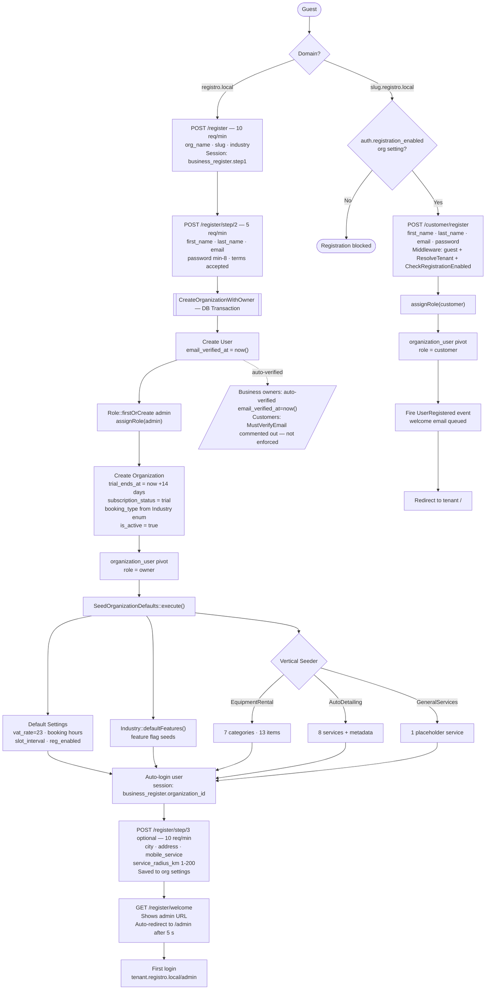
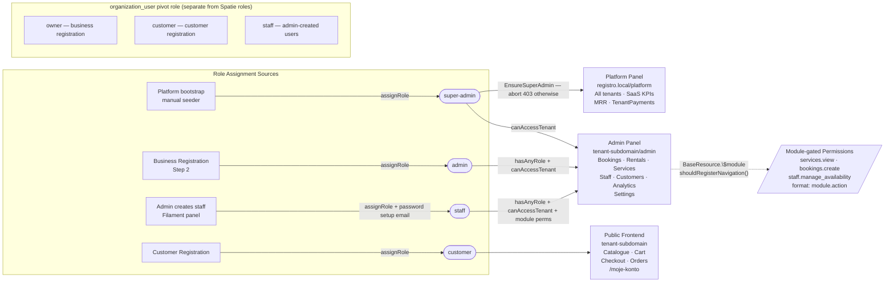
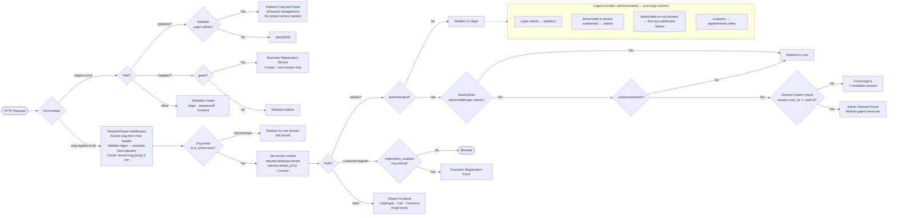

# Authentication & Onboarding Flow

## Registration Flow

### Business Registration (root domain only — 3-step wizard)

**Step 1** (`GET/POST /register`) — guest only; GET unrestricted, POST throttled at 10/min
- Fields: `org_name` (max 100), `slug` (ValidOrganizationSlug + unique), `industry` (Industry enum)
- Stored in session: `business_register.step1`
- AJAX helpers: `GET /register/check-slug` (30/min), `GET /register/generate-slug` (30/min)

**Step 2** (`GET/POST /register/step/2`) — guest only, POST throttled at 5/min
- Fields: `first_name`, `last_name`, `email` (unique), `password` (min 8, confirmed), `terms` (accepted)
- On POST: executes `CreateOrganizationWithOwner::execute()` in a DB transaction (see Onboarding Wizard below)
- Auto-logs in user, stores `business_register.organization_id` in session
- Redirects to Step 3

**Step 3** (`GET/POST /register/step/3`) — auth required, POST throttled at 10/min
- Optional fields: `city`, `address`, `mobile_service` (boolean), `service_radius_km` (1–200)
- Saves to `org->settings` (`location.*`, `features.*`)
- Redirects to welcome page

**Welcome** (`GET /register/welcome`) — auth required
- Shows admin URL, auto-redirects to `/admin` after 5 seconds
- Session key `business_register.organization_id` still active

### Customer Registration (tenant subdomain only)

Route: `GET/POST /customer/register`
- Middleware: `guest`, `ResolveTenant`, `CheckRegistrationEnabled` (org setting `auth.registration_enabled`)
- Fields: `first_name`, `last_name`, `email` (unique), `password` (min 8, confirmed)
- On registered: `$user->assignRole('customer')`, attaches to org via `organization_user` pivot with `role = 'customer'`
- Fires `UserRegistered` event (welcome email queued)
- No email verification required
- Redirects to `/` (tenant homepage)

Backwards compatibility: `/get-started` → 301 redirect to `/register`

---

## Onboarding Wizard (Organization Setup)

`app/Actions/Onboarding/CreateOrganizationWithOwner.php`

All steps execute inside a single DB transaction:

1. User created with `email_verified_at = now()` (auto-verified)
2. `Role::firstOrCreate(['name' => 'admin'])` then `$user->assignRole('admin')`
3. Organization created: `name`, `slug`, `booking_type` (derived from `Industry::bookingType()`), `industry`, `owner_id`, `is_active = true`, `trial_ends_at = now()->addDays(14)`, `subscription_status = 'trial'`
4. `organization_user` pivot inserted: `role = 'owner'`
5. `SeedOrganizationDefaults::execute($org)`:
   - Seeds default `Settings` records: booking hours, slot interval, `registration_enabled`, `vat_rate = 23`
   - Seeds industry feature flags via `Industry::defaultFeatures()`
   - Runs vertical seeder based on industry:
     - `EquipmentRental` → 7 categories + 13 items
     - `AutoDetailing` → 8 services with metadata
     - `GeneralServices` → 1 placeholder service

Module resolution is automatic — `hasModule()` resolves from industry at runtime, no explicit module seeding.

---

## Role Hierarchy

| Role | Who | Panel Access | Key Abilities |
|------|-----|-------------|---------------|
| `super-admin` | Platform operator (Registro team) | `/platform` (Filament) | Everything; `EnsureSuperAdmin` middleware; can access any tenant |
| `admin` | Business owner / org admin | `/admin` on their subdomain | Full tenant Filament panel; all module resources |
| `staff` | Employees added by admin | `/admin` on their org subdomain | Filament panel if added to org via `organization_user`; scope varies by module permissions |
| `customer` | End customers on tenant subdomains | None (frontend only) | Bookings, cart, orders, profile at `/moje-konto` |

**`User::canAccessPanel(Panel $panel)`:**
- `platform` panel: `hasRole('super-admin')` only
- `admin` panel: `hasAnyRole(['super-admin', 'admin', 'staff'])` + session fixation detection (session `user_id` vs `auth()->id()`)

**`LoginController::authenticated()` — post-login redirect logic:**
- `super-admin` → `/platform`
- `admin`/`staff` on tenant subdomain → `/admin` (checks `canAccessTenant`)
- `admin`/`staff` on root domain → first org's subdomain `/admin`
- `customer` → `appointments.index`

**Pivot role** (`organization_user.role`): `'owner'` (business registration), `'customer'` (customer registration). Staff members added via the admin panel receive their own pivot role. This is separate from Spatie roles.

**Module-gated permissions** (namespaced, Phase 6):
- Format: `module.action` — e.g. `services.view`, `bookings.create`, `staff.manage_availability`
- Resources self-gate via `BaseResource.$module` checked in `shouldRegisterNavigation()`

---

## Platform vs Admin Panel Routing

| URL Pattern | Panel | Who | Middleware |
|-------------|-------|-----|------------|
| `registro.local:8444` (root) | None (frontend) | Guests/customers | `ResolveTenant` (no tenant set) |
| `registro.local:8444/register` | — | Business registration wizard | `guest` |
| `registro.local:8444/platform` | Platform (Filament) | `super-admin` only | `Authenticate`, `EnsureSuperAdmin` |
| `{slug}.registro.local:8444/admin` | Admin (Filament) | `admin`, `staff` (must belong to tenant) | `Authenticate`, `AdminMaintenanceCheck`, `ResolveTenant` |
| `{slug}.registro.local:8444/customer/register` | — | Customer self-registration | `guest`, `ResolveTenant`, `CheckRegistrationEnabled` |

**`ResolveTenant` middleware:**
- Extracts subdomain from `Host` header
- Validates slug format via regex (prevents Host-header injection)
- Looks up active org with 5-min cache keyed `tenant:slug:{slug}`
- Unknown or inactive subdomain → redirect to root (fail-closed)
- Sets `request->attributes->set('tenant', $org)` + `session->put('tenant_id', $org->id)` (needed for Livewire)
- On `/admin*` routes (excluding login): admin/staff must pass `canAccessTenant()` or are redirected to root

**Platform panel:** `EnsureSuperAdmin` hard-gates with `abort(403)` for non-super-admin. No tenant resolution needed — platform operates across all tenants. Resources discovered from `app/Filament/Platform/Resources/`.

---

## Trial & Subscription Flow

Fields on `Organization`:

| Column | Type | Notes |
|--------|------|-------|
| `trial_ends_at` | datetime | Set to `now()->addDays(14)` on org creation |
| `subscription_status` | enum | `trial` \| `active` \| `paused` \| `cancelled` — default `trial` |
| `monthly_fee` | decimal | Nullable |
| `subscribed_at` | datetime | Nullable |
| `subscription_expires_at` | datetime | Nullable |

**Methods on `Organization`:**
- `onTrial()` → `trial_ends_at !== null && trial_ends_at->isFuture()`
- `trialExpired()` → `trial_ends_at !== null && trial_ends_at->isPast()`
- `isTrial()` → `subscription_status === 'trial'` (column-based)
- `isSubscribed()` → `subscription_status === 'active'`

**No automated enforcement exists.** The `subscription_status` column and model methods are in place, but no middleware blocks access after trial expiry. Subscription management is manual via the Platform panel (`TenantPayment` model). Inactive orgs (`is_active = false`) are backfilled to `subscription_status = 'cancelled'` via migration.

---

## Password Reset

### Standard Reset

Routes via `Auth::routes(...)` — grouped under `throttle:5,1` + `ResolveTenant`:
- `GET /password/reset` — show email form
- `POST /password/email` — send reset link
- `GET /password/reset/{token}` — show reset form
- `POST /password/reset` — process reset
- After reset: redirects to `/home`

Uses standard Laravel `SendsPasswordResetEmails` + `ResetsPasswords` traits with no customization.

### Password Setup (admin-created staff users)

`GET /password/setup/{token}` — `SetPasswordController::show()`
`POST /password/setup` — `SetPasswordController::store()` — 6/min throttle

Flow:
1. Admin creates a staff user in the Filament panel → `User::initiatePasswordSetup()` generates `password_setup_token` (64-char random, 30-min expiry)
2. Setup email sent with tokenized link
3. User opens link → token + expiry validated → form shown
4. `User::completePasswordSetup()` hashes and saves password, clears token fields
5. Redirects to `/login` with success flash

Expired or invalid token: renders `auth.passwords.token-expired` view.

---

## Email Verification

`VerificationController` uses standard Laravel `VerifiesEmails` trait:
- Middleware: `auth` + `signed` (on verify route) + `throttle:6,1`
- After verification: redirects to `/home`

**Business owners are auto-verified** — `email_verified_at = now()` is set in `CreateOrganizationWithOwner`. No verification email is sent.

**Customer registration does not enforce verification** — `MustVerifyEmail` is commented out on the `User` model (`// use Illuminate\Contracts\Auth\MustVerifyEmail;`), so even though `email_verified_at` is not set for customers, the verification gate is never triggered.

### Profile Email Change (separate flow)

- `POST /moje-konto/email/zmien` → `User::requestEmailChange()` — stores `pending_email`, `pending_email_token` (64-char), expires in 24h
- `GET /moje-konto/email/potwierdz/{token}` → `User::confirmEmailChange()` — validates token + expiry, swaps `email` with `pending_email`
