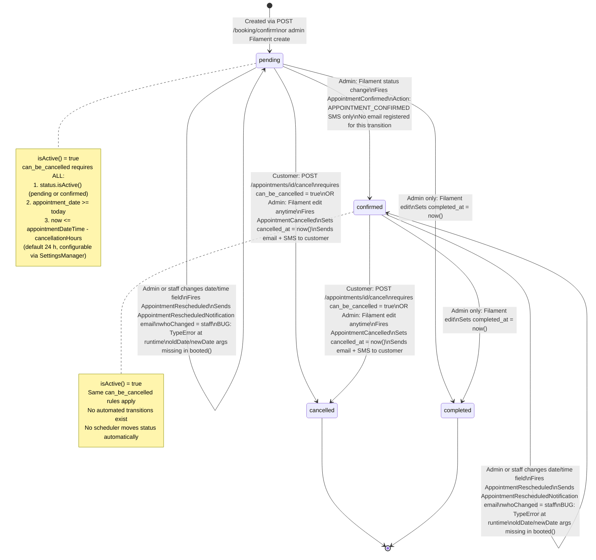
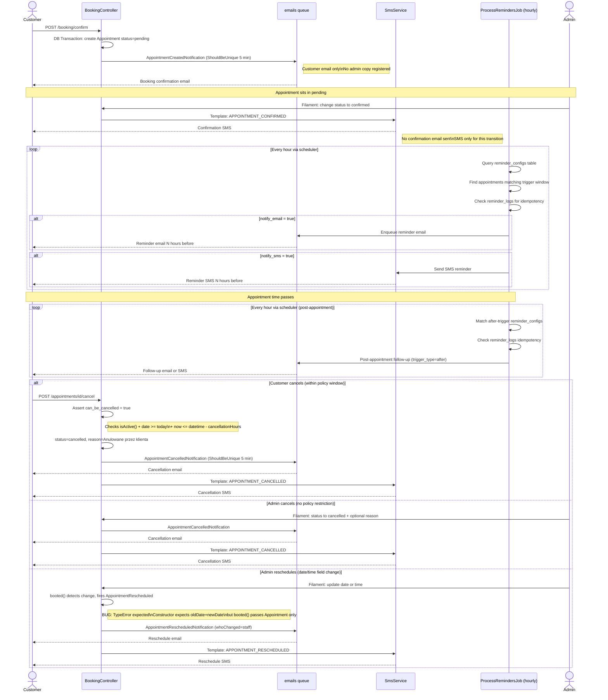

# Booking Wizard Flow

Last updated: 2026-06-22

## Overview

The booking system is a server-side multi-step Blade wizard handled by `BookingController`. It is available only to authenticated users and only for `ServiceType::TimeSlot` services. `ServiceType::ItemRental` services go through the cart/checkout flow (`CartController` → `CheckoutController`) and produce `Order` records, not `Appointment` records.

The wizard has **4 steps** by default and **5 steps** when vehicle/mobile-service tenant features are active. State is stored in the PHP session under the `booking.*` namespace and cleared after a successful confirmation.

Key files:

| File | Role |
|------|------|
| `app/Http/Controllers/BookingController.php` | Wizard controller (all steps + confirm) |
| `app/Http/Controllers/AppointmentController.php` | Legacy store endpoint + customer cancel |
| `app/Models/Appointment.php` | Status machine, events, accessors |
| `app/Enums/AppointmentStatus.php` | 4 statuses |
| `app/Services/AppointmentService.php` | Staff assignment, slot availability |
| `app/Services/ServiceAreaValidator.php` | Geo validation |
| `app/Jobs/Reminder/ProcessRemindersJob.php` | Hourly scheduled reminder dispatch |
| `app/Filament/Resources/AppointmentResource.php` | Admin panel (module: `bookings`) |
| `resources/views/booking-wizard/steps/` | Blade views for each step |

---

## Wizard Steps (detailed)

Step composition is resolved at runtime by `BookingController::getActiveSteps()`.

### Always-present steps

`service` → `datetime` → `contact` → `review`

### Conditional step

`vehicle-location` is inserted between `datetime` and `contact` when:

```php
TenantFeature::active('vehicles') || TenantFeature::active('mobile_service')
```

### Sequential access guard

Each step checks that all prerequisite session keys exist before rendering:

- Step > 1 without `booking.service_id` → redirect to step 1
- `vehicle-location` / `contact` / `review` without `booking.date` + `booking.time_slot` → redirect to datetime step
- `contact` / `review` without vehicle data (when vehicle-location step exists) → redirect to vehicle-location step
- `review` without `first_name` + `email` in session → redirect to contact step

---

### Step 1 — Service Selection (`/booking/step/1`)

View: `resources/views/booking-wizard/steps/service.blade.php`

- Lists all active services ordered by `sort_order`; shows total non-cancelled bookings count per service
- Validation: `service_id` required, must exist in `services` table
- Session write: `booking.service_id`
- Auto-skip: if `booking.service_id` is already set (e.g. navigated from `/services/{slug}/book`), the wizard skips directly to step 2

---

### Step 2 — Date and Time (`/booking/step/2`)

View: `resources/views/booking-wizard/steps/datetime.blade.php`

- Calendar rendered with Flatpickr
- Unavailable dates loaded via `GET /booking/unavailable-dates?service_id=X` — response cached 15 minutes per service per hour
- Available time slots loaded via `GET /booking/available-slots?service_id=X&date=Y`
- Validation:
  - `date`: `after_or_equal:today`, `date_format:Y-m-d`
  - `time_slot`: matches `HH:MM` regex
  - Business rule: selected slot must be at least `advanceBookingHours` in the future (default 24 h, configurable in settings)
- Session write: `booking.date`, `booking.time_slot`

---

### Step 3 — Vehicle and Location (`/booking/step/3`) — CONDITIONAL

View: `resources/views/booking-wizard/steps/vehicle-location.blade.php`

Only rendered when `TenantFeature::active('vehicles') || TenantFeature::active('mobile_service')`.

**Vehicle section** (when `vehicles` feature active):

| Field | Validation |
|-------|-----------|
| `vehicle_type_id` | required, exists in `vehicle_types` |
| `vehicle_brand` | required string |
| `vehicle_model` | required string |
| `vehicle_year` | required, 4-digit year |
| `registration_number` | regex `^[A-Z]{2,3}[\s-]?[A-Z0-9]{4,5}$` |

**Location section** (when `mobile_service` feature active):

- Google Maps Places Autocomplete captures: `address`, `location_latitude`, `location_longitude`, `location_place_id`, address components, optional `service_location_type`
- If `service_area` feature is also active, service area validation fires here (see [Service Area Validation](#service-area-validation))

Session write: all vehicle fields + location fields + `booking.service_area_valid = true` on success.

---

### Step 4 — Contact Details (`/booking/step/4` or `step/3`)

View: `resources/views/booking-wizard/steps/contact.blade.php`

- Pre-fills fields from `auth()->user()` (first_name, last_name, email, phone) for any empty values only — does not overwrite customer edits
- Fields: `first_name`, `last_name`, `email`, `phone` (+48 format or 9-digit), `notify_email` (bool), `notify_sms` (bool), `terms_accepted` (required|accepted)
- Optional invoice section: toggled by `invoice_requested`; fields: `company_name`, `nip` (validated by `ValidPolishNIP` rule), `street`, `street_number`, `postal_code`, `city`
- The step renders a summary of configured reminder schedules (from `reminder_configs`) so the customer knows what notifications to expect
- Session write: all contact fields, invoice fields, `booking.notify_email`, `booking.notify_sms`

---

### Step 5 — Review (`/booking/step/5` or `step/4`)

View: `resources/views/booking-wizard/steps/review.blade.php`

- Read-only summary of all collected data: service (name/price/duration), datetime, vehicle (when feature active), location (when feature active), contact details, invoice info
- "Change service" link clears `booking.service_id` and redirects to step 1
- Submitting the form sends `POST /booking/confirm`

---

## Service Area Validation

Applies when **both** conditions are true:
1. `TenantFeature::active('service_area')` is enabled
2. The `vehicle-location` step is in the active step list (i.e. `mobile_service` is also active)

### First check — step 3 submission

`BookingController::storeVehicleLocationStep()` calls `ServiceAreaValidator::validate(lat, lng)`.

The validator queries `service_areas` (active areas, result cached as `service_areas:active`) and performs a radius-based point-in-area check (radius in meters per area definition).

On failure the controller returns a 422 JSON response:

```json
{
  "success": false,
  "error": "<human-readable message>",
  "nearest_area": { ... },
  "show_waitlist": true
}
```

On success: `booking.service_area_valid = true` is written to session.

### Second check — confirmation

`BookingController::confirm()` re-validates `location_latitude` / `location_longitude` from session against `ServiceAreaValidator::validate()` before creating the appointment. This guards against session tampering or direct POST to `/booking/confirm`. Failure redirects to the vehicle-location step with an error.

---

## Guest vs Authenticated Flow

The booking wizard is **authentication-required**. The `auth` middleware is applied to all `/booking/*` routes. Unauthenticated visitors are redirected to the login page and returned to `/booking` after authentication.

There is no guest checkout path for appointments. Customers must register or log in before entering the wizard. The contact step pre-fills known data from the authenticated user's profile but does not force any field values — the customer may edit them.

---

## Staff Assignment Logic

### Auto-assignment (wizard flow)

Called from `BookingController::confirm()` via `AppointmentService::findBestAvailableStaff(serviceId, dateTime, durationMinutes)`:

1. Queries users with role `staff` that are linked to the service via the `service_staff` pivot table (`whereHas('services', ...)`)
2. Iterates staff in DB order
3. For each candidate, checks their calendar for conflicts:
   - Existing appointments that overlap the requested slot
   - Staff schedule: vacation periods, date exceptions, and base weekly schedule
4. Returns the first staff member with no conflict — **"first available" strategy, no workload balancing**
5. If no staff is available: redirects back to the datetime step with an error; no appointment is created

### Manual assignment (legacy `AppointmentController::store()`)

- `staff_id` is optional in the request
- If omitted: same `findFirstAvailableStaff()` logic runs
- If provided: `validateAppointment()` checks availability for that specific staff member

### Admin override (Filament `AppointmentResource`)

- `staff_id` is a required Select field; admin picks from all users with role `staff`
- No availability re-check is performed in the Filament form — admin can assign any staff to any slot

### Observer enforcement

`AppointmentObserver::creating()` enforces that the assigned `staff_id` belongs to a user with role `staff`. This fires for all creation paths (wizard, legacy, Filament).

---

## Appointment Status Machine

Enum: `App\Enums\AppointmentStatus` (backed string)

| Value | Label | Filament color |
|-------|-------|---------------|
| `pending` | Oczekująca | warning (amber) |
| `confirmed` | Potwierdzona | success (green) |
| `cancelled` | Anulowana | danger (red) |
| `completed` | Zakończona | info (indigo) |

`isActive()` returns `true` for `pending` and `confirmed`. Used by `can_be_cancelled` and `scopeUpcoming`.

**No automated status transitions exist.** No scheduler or job moves appointments between statuses automatically.

### Transitions

| From | To | Actor | Side effects |
|------|----|-------|-------------|
| — | `pending` | System (wizard confirm or admin create) | `AppointmentCreated` event |
| `pending` | `confirmed` | Admin (Filament) | `AppointmentConfirmed` event → confirmation SMS only (no email registered) |
| `pending` / `confirmed` | `cancelled` | Customer (cancel endpoint, policy-gated) or Admin (Filament, unrestricted) | `AppointmentCancelled` event → sets `cancelled_at = now()` → cancellation email + SMS to customer |
| `pending` / `confirmed` | `completed` | Admin only (Filament) | Sets `completed_at = now()` |
| `pending` / `confirmed` | `pending` / `confirmed` | Admin (date/time field change) | `AppointmentRescheduled` event → reschedule email + SMS (**see bug note below**) |

> **Known bug — TypeError on reschedule:** `AppointmentRescheduled` event constructor expects `(Appointment $appointment, Carbon $oldDate, Carbon $newDate)` but `Appointment::booted()` fires it as `event(new AppointmentRescheduled($appointment))` — missing the two `Carbon` arguments. This will throw a `TypeError` at runtime whenever an admin changes an appointment's date or time field. Reference: `app/Models/Appointment.php` `booted()` method.

### Mermaid — Status State Machine



### Mermaid — Wizard Flow

```mermaid
flowchart TD
    Start([Start: /booking]) --> Auth{Authenticated?}
    Auth -->|No| Login[Redirect to login]
    Login --> Start
    Auth -->|Yes| HasSvc{service_id\nin session?}

    HasSvc -->|Yes, from /services/:slug/book| Step2
    HasSvc -->|No| Step1

    Step1["Step 1 — Service Selection\nList active services ordered by sort_order\nValidate: service_id required + exists in services"]
    Step1 --> S1V{Valid?}
    S1V -->|No| Step1
    S1V -->|Yes| S1W[session: booking.service_id]
    S1W --> Step2

    Step2["Step 2 — Date and Time\nFlatpickr calendar\nAJAX GET /booking/unavailable-dates cached 15 min/service/hour\nAJAX GET /booking/available-slots"]
    Step2 --> S2V{"date valid\nslot >= advanceBookingHours\ndefault 24 h from now?"}
    S2V -->|No| Step2
    S2V -->|Yes| S2W[session: booking.date, booking.time_slot]
    S2W --> FeatV{"TenantFeature:\nvehicles OR mobile_service?"}

    FeatV -->|No| Step4
    FeatV -->|Yes| Step3

    Step3[Step 3 — Vehicle and Location\nConditional step]
    Step3 --> VehV{vehicles\nfeature active?}
    VehV -->|Yes| VehF["Vehicle: type, brand, model, year\nregistration_number regex validated"]
    VehV -->|No| MobV
    VehF --> MobV{mobile_service\nfeature active?}
    MobV -->|No| S3W
    MobV -->|Yes| LocF["Google Maps Places Autocomplete\naddress + lat/lng + place_id + components\noptional: service_location_type"]
    LocF --> AreaV{service_area\nfeature active?}
    AreaV -->|No| S3W
    AreaV -->|Yes| AreaC["ServiceAreaValidator::validate\nradius check vs service_areas table\ncached: service_areas:active"]
    AreaC -->|Pass| S3W
    AreaC -->|"Fail 422"| AreaE["JSON: success=false\nerror message + nearest_area\nshow_waitlist=true"]
    AreaE --> Step3
    S3W["session: vehicle fields + location fields\nbooking.service_area_valid = true"] --> Step4

    Step4["Step 4 — Contact Details\nPre-fill from auth()->user() for empty fields only\nfirst_name, last_name, email, phone +48\nnotify_email, notify_sms, terms_accepted\nShows configured reminder schedule"]
    Step4 --> InvV{invoice\nrequested?}
    InvV -->|Yes| InvF["company_name, NIP (ValidPolishNIP rule)\nstreet, street_number, postal_code, city"]
    InvV -->|No| S4V
    InvF --> S4V{"All fields valid\nterms_accepted = true?"}
    S4V -->|No| Step4
    S4V -->|Yes| S4W["session: contact + invoice fields\nnotify_email, notify_sms"]
    S4W --> Step5

    Step5["Step 5 — Review (read-only)\nSummary: service, datetime, vehicle,\nlocation, contact, invoice"]
    Step5 --> ChgV{Change\nservice?}
    ChgV -->|Yes| ClearS[Clear booking.service_id]
    ClearS --> Step1
    ChgV -->|No| Conf

    Conf["POST /booking/confirm"]
    Conf --> IdemV{"Existing pending or confirmed\nfor same user + service + date + time?"}
    IdemV -->|"Yes — reuse existing"| Done
    IdemV -->|No| A2V{service_area\nfeature active?}
    A2V -->|Yes| A2C["Server-side re-validate lat/lng from session\nguards against session tampering"]
    A2C -->|Fail| Step3
    A2C -->|Pass| SlotR
    A2V -->|No| SlotR
    SlotR[Re-check: getAvailableSlotsAcrossAllStaff]
    SlotR --> SlotV{Slot still\navailable?}
    SlotV -->|No| Step2
    SlotV -->|Yes| StaffF["findBestAvailableStaff\nservice_staff pivot\nfirst-available strategy, no workload balancing"]
    StaffF --> StaffV{Staff\nfound?}
    StaffV -->|No| Step2
    StaffV -->|Yes| Txn

    Txn["DB Transaction\n- Create Appointment, status = pending\n- Snapshot: service price, name, duration at booking time\n- Update user: empty fields only (first_name, last_name, phone_e164)\n- UserConsent::recordConsent terms_accepted = granted\n- grantSmsConsent() if notify_sms and not already consented"]
    Txn --> EvtF["AppointmentCreated event dispatched\nAppointmentCreatedNotification to emails queue\nShouldBeUnique 5 min, customer only"]
    EvtF --> Done["session: booking_confirmed_id\nClear all booking.*"]
    Done --> CP["GET /booking/confirmation\nSingle-use: session()->pull(booking_confirmed_id)\nOwnership check: customer_id === auth()->id()\nCalendar links: Google / iCal /booking/ical/:id / Outlook"]
    CP --> End([End])
```



---

## Cancellation Flow

### Customer cancellation

Route: `POST /appointments/{appointment}/cancel` → `AppointmentController::cancel()`

1. Auth check: `$appointment->customer_id !== Auth::id()` → 403
2. `can_be_cancelled` accessor must return `true` — requires **all** of:
   - `status->isActive()` (pending or confirmed)
   - `appointment_date >= today`
   - Current time ≤ `appointmentDateTime - cancellationHours` (default 24 h, configurable via `SettingsManager::cancellationHours()`)
3. Sets `status = cancelled`, `cancellation_reason = 'Anulowane przez klienta'`
4. Model `booted()` detects status change → fires `AppointmentCancelled` event → sets `cancelled_at = now()`
5. Customer receives `AppointmentCancelledNotification` (queued, `emails` queue, ShouldBeUnique 5 min)
6. Customer receives cancellation SMS via `SmsService` template `APPOINTMENT_CANCELLED`

### Admin cancellation

Via Filament `AppointmentResource` edit page. No cancellation policy applies — admin can cancel any appointment at any status, any time. The `cancellation_reason` Textarea is displayed when status is set to `Cancelled`. Same event chain fires, producing the same customer notification.

---

## Reminder and Notification Timeline

### Transactional notifications (event-driven, immediate queue)

| Event | Trigger | Channels |
|-------|---------|---------|
| `AppointmentCreated` | Wizard confirm or legacy store | Email to customer (queue: `emails`, ShouldBeUnique 5 min). **No admin copy registered.** |
| `AppointmentConfirmed` | Admin changes status to confirmed in Filament | SMS via `APPOINTMENT_CONFIRMED` template only. **No email registered for this transition.** |
| `AppointmentCancelled` | Customer cancel or admin cancel | Email (`AppointmentCancelledNotification`) + SMS (`APPOINTMENT_CANCELLED`) to customer |
| `AppointmentRescheduled` | Admin changes date or time field | Email (`AppointmentRescheduledNotification`, `whoChanged='staff'`) + SMS (`APPOINTMENT_RESCHEDULED`) to customer — **see TypeError bug in status machine section** |

### Scheduled reminders (`ProcessRemindersJob`, runs hourly)

1. Reads the `reminder_configs` table (admin-configurable): channel (email/sms), trigger_type (before/after), trigger_hours + trigger_minutes
2. For each config, queries appointments whose scheduled time falls within `now + trigger_hours:trigger_minutes` window
3. Checks `reminder_logs` table for idempotency — will not send the same reminder twice
4. Checks email/SMS suppressions per customer before dispatching
5. Supports both pre-appointment reminders (`trigger_type = before`) and post-appointment follow-ups (`trigger_type = after`)

**Customer opt-in:** At the contact step the customer selects `notify_email` and/or `notify_sms`. GDPR: if `notify_sms` is selected, `grantSmsConsent()` is called on confirm (if consent not already recorded). The contact step displays the currently configured reminder schedule so customers can make an informed choice.

### Mermaid — Notification Sequence



---

## Admin Appointment Management

Access: `/admin/appointments` — Filament resource `AppointmentResource`, module-gated to `bookings`.

**List view:**
- Columns: customer name, service, date/time, status (badge), staff name, created_at
- Filters: status, date range, service, staff member
- Scopes: upcoming (`scopeUpcoming`), today, by status

**Create/Edit form:**
- `staff_id`: required Select from users with role `staff` — no availability check in the form itself
- `status`: Select with all 4 values — changing to `confirmed` triggers SMS; changing to `cancelled` triggers email + SMS
- `cancellation_reason`: Textarea, visible only when status = `cancelled`
- Date/time fields: changing either triggers `AppointmentRescheduled` event (see TypeError bug)
- `notify_email` / `notify_sms`: visible and editable

**Admin has no cancellation policy restriction** — can cancel appointments regardless of timing.

---

## Edge Cases

### Idempotent confirmation

`BookingController::confirm()` queries for an existing `pending` or `confirmed` appointment for the same customer + service + date + time before creating a new one. If found, it reuses that appointment ID and skips creation. This prevents duplicate bookings from double-submits or browser back-button replays.

### Single-use confirmation page

`GET /booking/confirmation` uses `session()->pull('booking_confirmed_id')` — the session key is consumed on first read. Refreshing the confirmation page or navigating back after the session key is consumed will not find the appointment (no redirect to appointment details is implemented — behavior is a blank/error state).

### Service snapshots at booking time

The `Appointment` model stores `service_price`, `service_name`, and `service_duration_minutes` at the time of booking. Subsequent changes to the `Service` record do not retroactively affect existing appointments.

### AppointmentRescheduled TypeError (known bug)

`Appointment::booted()` fires `event(new AppointmentRescheduled($appointment))` when it detects a change to the date or time field on update. However, the `AppointmentRescheduled` constructor signature expects `(Appointment $appointment, Carbon $oldDate, Carbon $newDate)`. The missing `Carbon` arguments will throw a `TypeError` at runtime every time an admin reschedules an appointment via Filament. This path is currently broken in production.

Fix required: capture `$originalDate` / `$originalTime` in the `updating` or `retrieved` observer hook and pass them to the event constructor.

### No AppointmentConfirmed email

When an admin changes status to `confirmed`, only an SMS notification is sent via `APPOINTMENT_CONFIRMED` template. No email notification is registered for this event in `AppServiceProvider`. Customers who opted in to email reminders will receive scheduled reminders but no immediate "your appointment is confirmed" email.

### No admin copy on AppointmentCreated

`AppointmentCreatedNotification` sends only to the customer. No admin/staff email is dispatched when a new booking is made. Staff must check the Filament appointment list or rely on push notifications if configured separately.

### `CheckBookingEnabled` middleware

Applied to all `/booking/*` routes. Returns 403/redirect when `SettingsManager::isBookingEnabled()` is false — which is the case for organizations configured with `booking_type = item_rental`. This is the only gate preventing ItemRental-only tenants from accessing the wizard.

### User profile update on confirm

The DB transaction in `confirm()` updates the authenticated user's `first_name`, `last_name`, and `phone_e164` — but only for fields that are currently empty on the user record. It never overwrites existing profile data. This allows first-time users to have their profile populated from the booking flow.

### GDPR consent recording

Two consent records are written on confirmation:
1. `UserConsent::recordConsent($user, 'terms_accepted', 'granted')` — always
2. `grantSmsConsent()` — only if `notify_sms = true` and no prior SMS consent exists

Consent data is stored in the `user_consents` table and is not deleted if the appointment is later cancelled.
