# Checkout & Order Flow

## Overview

Registro implements a single-page checkout (not a multi-step wizard). The flow is gated behind authentication — there is no guest checkout. All cart, checkout, and order routes sit inside the `auth` middleware group.

The purchase path moves through:
1. Catalogue → service page → add to cart
2. Cart review (`/koszyk`)
3. Single-page checkout form (`/koszyk/zamowienie`) with B2C/B2B Alpine.js toggle
4. Przelewy24 external payment gateway
5. Return page with status polling
6. Async P24 webhook updating the order to `paid`

---

## Customer Journey (step by step)

| # | Route | Method | Guard | Description |
|---|-------|--------|-------|-------------|
| 1 | `GET /koszyk` (`cart.show`) | GET | auth+tenant | View cart items. Add/remove/update quantity. Availability is re-checked on every update. |
| 2 | `GET /koszyk/zamowienie` (`checkout.show`) | GET | auth+tenant | Single-page checkout form. Empty cart redirects to `cart.show`. On first load: stamps `checkout_started_at` on the cart and fires a `checkout.started` analytics event. Pre-fills all fields from the user's saved profile. |
| 3 | `POST /koszyk/zamowienie` (`checkout.submit`) | POST | auth+tenant | Validates via `SubmitCheckoutRequest` (throttle 6 req/min). Calls `CartService::convertToOrder()` inside a DB transaction with `lockForUpdate` on the cart. Registers the P24 transaction. Fires `checkout.submitted` analytics event. Redirects browser to P24 gateway URL. |
| 4 | P24 gateway | — | none (external) | External Przelewy24 payment page. On completion returns to `checkout.return` with `?sessionId=ORDER-{id}-{timestamp}`. |
| 5 | `GET /koszyk/powrot` (`checkout.return`) | GET | auth+tenant | Looks up order by `p24_session_id` + `org_id` + `user_id`. Shows one of four states: **success** (paid/confirmed), **pending** (auto-refresh every 5 s via `<meta http-equiv="refresh" content="5">`), **cancelled**, or **not found**. |
| 6 | `GET /moje-zamowienia/{order}` (`orders.show`) | GET | auth+tenant | Full order detail. Enforces `user_id === auth()->id()` + `org_id` ownership. |
| 7 | `POST /webhooks/przelewy24` (`webhooks.p24`) | POST | none (no auth, no CSRF) | Server-to-server async webhook. Verifies P24 signature, calls `transactions()->verify()`, creates a `Payment` record, transitions order to `paid`, fires `OrderPaid` event. Excluded from CSRF middleware in `bootstrap/app.php`. |

### Full customer flow diagram

```mermaid
flowchart LR
    CAT["/wypozyczalnia<br/>Katalog usług"] --> SVC["Strona usługi / produktu"]
    SVC --> AUTH{"Zalogowany?"}
    AUTH -- Nie --> LOGIN["Logowanie / Rejestracja"]
    LOGIN --> SVC
    AUTH -- Tak --> ADD["Dodaj do koszyka<br/>POST cart.add"]
    ADD --> AVAIL{"Dostępny<br/>w magazynie?"}
    AVAIL -- "RentalUnavailableException" --> ERR_AV["Błąd: brak dostępności<br/>redirect back"]
    ERR_AV --> SVC
    AVAIL -- OK --> CART_VIEW

    subgraph KOSZYK ["GET /koszyk — Koszyk"]
        CART_VIEW["Lista produktów<br/>z cenami i terminami"]
        CART_UPD["Zmień ilość<br/>(re-check dostępności)"]
        CART_DEL["Usuń produkt"]
        CART_VIEW --> CART_UPD & CART_DEL
        CART_UPD & CART_DEL --> CART_VIEW
    end

    CART_VIEW -- "Złóż zamówienie" --> CO_EMPTY{"Koszyk<br/>pusty?"}
    CO_EMPTY -- Tak --> CART_VIEW
    CO_EMPTY -- Nie --> CHECKOUT_PAGE

    subgraph FORMULARZ ["GET /koszyk/zamowienie — Formularz zamówienia (single-page · Alpine.js)"]
        CHECKOUT_PAGE["Formularz zamówienia<br/>Pre-filled z danych profilu użytkownika"]
        STAMP["checkout_started_at stamped<br/>analytics_event: checkout.started"]
        CTYPE{"Typ klienta<br/>(Alpine.js toggle)"}
        B2C["Osoba fizyczna (B2C)<br/>Imię · Nazwisko · PESEL<br/>Adres zamieszkania<br/>Opcjonalnie: faktura + NIP"]
        B2B["Firma (B2B)<br/>Nazwa · NIP · REGON · KRS<br/>Osoba upoważniona + PESEL/dowód<br/>Opcjonalnie: osoba odbierająca sprzęt"]
        CONSENTS["Zgody obowiązkowe<br/>Regulamin · RODO · wykluczenie prawa odstąpienia<br/>rodo_accepted_at/ip · terms_accepted_at zapisane na zamówieniu"]
        CHECKOUT_PAGE -.->|"pierwsze wejście"| STAMP
        CHECKOUT_PAGE --> CTYPE
        CTYPE -- "natural_person" --> B2C
        CTYPE -- "business" --> B2B
        B2C & B2B --> CONSENTS
    end

    CONSENTS --> SUBMIT["POST /koszyk/zamowienie<br/>throttle: 6 req/min"]
    SUBMIT --> VAL{"Walidacja<br/>SubmitCheckoutRequest"}
    VAL -- "422 Błędy walidacji" --> CHECKOUT_PAGE
    VAL -- OK --> CART_ACT{"Koszyk<br/>aktywny?"}
    CART_ACT -- "CartNotActiveException" --> ERR_CART["Błąd ogólny<br/>Log::error · redirect back"]
    ERR_CART --> CHECKOUT_PAGE
    CART_ACT -- Tak --> CONVERT["CartService::convertToOrder()<br/>DB transaction · lockForUpdate na koszyku<br/>Koszyk status → converted<br/>save_to_profile: saveProfileData()"]
    CONVERT --> ORDER_CREATED["Zamówienie: pending_payment<br/>expires_at: now() + 20 min<br/>p24_session_id · p24_token · p24_amount<br/>analytics_event: checkout.submitted"]
    ORDER_CREATED --> P24_REG["Przelewy24Service<br/>registerTransaction()"]
    P24_REG --> P24_OK{"P24<br/>zarejestrowano?"}
    P24_OK -- "Przelewy24Exception" --> ERR_P24["Log::error<br/>błąd ogólny · redirect back"]
    ERR_P24 --> CHECKOUT_PAGE
    P24_OK -- OK --> P24_GW["Przekierowanie do<br/>bramki Przelewy24<br/>(serwis zewnętrzny)"]

    P24_GW --> RETURN

    RETURN["GET /koszyk/powrot<br/>?sessionId=ORDER-{id}-{timestamp}"]
    RETURN --> RET_LOOKUP["Szukaj zamówienia<br/>po p24_session_id + org_id + user_id"]
    RET_LOOKUP --> RET_STATUS{"Status<br/>zamówienia"}
    RET_STATUS -- "paid / confirmed" --> SUCCESS["Płatność zakończona sukcesem"]
    RET_STATUS -- "pending_payment" --> PENDING["Oczekiwanie na potwierdzenie<br/>meta http-equiv=refresh co 5s"]
    RET_STATUS -- "cancelled" --> CANCEL_SCREEN["Zamówienie anulowane"]
    RET_STATUS -- "brak wyniku" --> NOT_FOUND["Błąd: zamówienie nie znalezione"]
    PENDING -.->|"auto-refresh co 5s"| RETURN
    SUCCESS --> ORDER_DETAIL["GET /moje-zamowienia/{order}<br/>Szczegóły zamówienia"]
    ORDER_DETAIL -- "Anuluj<br/>(tylko: pending_payment)" --> USER_CANCEL["orders.cancel<br/>status → cancelled · cancelled_at stamped<br/>Event: OrderCancelled"]
    USER_CANCEL --> ORDER_DETAIL

    subgraph WEBHOOK ["POST /webhooks/przelewy24 — Server-to-server · asynchroniczny · no-auth · no-csrf"]
        WH_IN["Webhook od Przelewy24"]
        WH_SIG{"Sygnatura P24<br/>isSignValid()?"}
        WH_WARN["Log::warning · skip"]
        WH_FIND["Szukaj zamówienia<br/>po p24_session_id"]
        WH_EX{"Znalezione?"}
        WH_WARN2["Log::warning · skip"]
        WH_IDEM{"order.status<br/>== paid?"}
        WH_SKIP["Idempotencja · skip<br/>(zduplikowany webhook)"]
        WH_VER["transactions()->verify()<br/>sessionId · orderId · amount"]
        WH_VRES{"verify() OK?"}
        WH_FAIL["Payment(status=failed)<br/>Log::error<br/>zamówienie pozostaje: pending_payment"]
        WH_PAY["Payment(status=success)<br/>order.status → paid · paid_at stamped"]
        WH_EVENT["event(new OrderPaid(order))"]
        WH_NC["OrderPaidNotification → klient<br/>queue:emails · ShouldBeUnique 5min"]
        WH_NA["OrderPaidNotification → admin organizacji<br/>queue:emails"]
        WH_ANA["RecordAnalyticsOnOrderPaid listener"]

        WH_IN --> WH_SIG
        WH_SIG -- Nie --> WH_WARN
        WH_SIG -- Tak --> WH_FIND
        WH_FIND --> WH_EX
        WH_EX -- Nie --> WH_WARN2
        WH_EX -- Tak --> WH_IDEM
        WH_IDEM -- Tak --> WH_SKIP
        WH_IDEM -- Nie --> WH_VER
        WH_VER --> WH_VRES
        WH_VRES -- "Przelewy24Exception" --> WH_FAIL
        WH_VRES -- OK --> WH_PAY
        WH_PAY --> WH_EVENT
        WH_EVENT --> WH_NC & WH_NA & WH_ANA
    end

    WH_PAY -.->|"order.status = paid (DB)"| RET_STATUS
```



---

## B2C vs B2B Checkout

The checkout form toggles between two modes via an Alpine.js switch on `customer_type`. The backend validates each mode separately in `SubmitCheckoutRequest`.

### B2C — `customer_type = 'natural_person'`

Required fields:
- `customer_first_name`, `customer_last_name`
- `customer_email`, `customer_phone`
- `customer_pesel` — validated by `ValidPolishPESEL` rule
- `customer_street`, `customer_building`, `customer_city`, `customer_postal_code`

Optional:
- `customer_apartment`
- `invoice_requested` checkbox — if checked, only `invoice_nip` is additionally required (no full company data)
- `save_to_profile` — writes back to `User` model via `CartService::saveProfileData()`

### B2B — `customer_type = 'business'`

Required fields:
- `invoice_company_name`
- `invoice_nip` — validated by `ValidPolishNIP` rule
- `company_regon` — validated by `ValidPolishREGON` rule
- `company_contact_name` — signatory (person legally authorized to sign the contract)
- `signatory_id_number` — PESEL or ID card number of the signatory
- `invoice_street`, `invoice_street_number`, `invoice_postal_code`, `invoice_city` (billing address)
- `customer_email`, `customer_phone`

Optional:
- `company_krs`
- `pickup_person_name` + `pickup_person_id_number` — required together (`required_with` each other); used when equipment is collected by someone other than the signatory

Forced behaviour: `invoice_requested` is always set to `true` in `CartService::convertToOrder()` — B2B orders always generate an invoice. There is no personal PESEL on the order itself; the PESEL/ID lives on `signatory_id_number`.

### Shared fields (both modes)

- `terms_accepted`, `rodo_accepted`, `withdrawal_exclusion_accepted` — all must equal `true`
- RODO timestamps and IP are written to the order at creation: `rodo_accepted_at`, `rodo_accepted_ip`, `terms_accepted_at`, `withdrawal_exclusion_accepted_at`
- `save_to_profile` — optional; only rendered for authenticated users in the Blade view

### Profile pre-fill

`checkout.show` reads these user profile fields and passes them as `$profileData` to the view: `first_name`, `last_name`, `email`, `phone`, `pesel`, `street_name`, `street_number`, `city`, `postal_code`, `company_name`, `nip`, `regon`, `krs`, `billing_street`, `billing_building_number`, `billing_postal_code`, `billing_city`.

---

## Cart Management

### Cart statuses

| Status | Set by | Meaning |
|--------|--------|---------|
| `active` | `getOrCreateCart()` | Default; the customer's live cart |
| `abandoned` | Analytics/cron job | Cart left without checkout |
| `converted` | `CartService::convertToOrder()` | Order successfully created from this cart |

`getOrCreateCart()` always returns an `active` cart. A cart can only be submitted through checkout while `active`; attempting to submit a `converted` or `abandoned` cart throws `CartNotActiveException`.

### Availability blocking

`OrderItem::scopeBlockingAvailability` determines which orders consume stock:
- `paid`, `confirmed`, `in_progress` — block availability indefinitely
- `pending_payment` — blocks availability only while `expires_at > now()`; stock is automatically released when the 20-minute TTL expires

---

## Order Status Machine

Implemented in `OrderStatusStateMachine`. States are string literals stored directly on the `orders.status` column.

### Status reference

| Status | Entry point | Description |
|--------|------------|-------------|
| `pending_payment` | `CartService::convertToOrder()` | Created at checkout submit. `expires_at = now() + 20 min`. Default. |
| `paid` | P24 webhook `verify()` success | `paid_at` stamped. Fires `OrderPaid` event. |
| `confirmed` | Admin action (Filament) | Fires `OrderConfirmed` event. |
| `in_progress` | Scheduled job when `start_date` arrives | Automatically triggered from `confirmed`. |
| `completed` | Admin action after equipment return | |
| `refunded` | Admin/refund request path from `completed` | |
| `cancelled` | User cancel, admin cancel, or TTL expiry | Terminal. `cancelled_at` stamped. Fires `OrderCancelled`. |

Terminal states: `cancelled` and `refunded` — no outgoing transitions.

### Transition map

```
pending_payment  ──[P24 webhook success]──────────────► paid
pending_payment  ──[user cancel / admin / TTL]─────────► cancelled (terminal)

paid             ──[admin confirms in Filament]─────────► confirmed
paid             ──[admin cancels]──────────────────────► cancelled (terminal)

confirmed        ──[scheduled job, start_date reached]──► in_progress
confirmed        ──[admin cancels]──────────────────────► cancelled (terminal)

in_progress      ──[admin, equipment returned]──────────► completed

completed        ──[refund request]──────────────────────► refunded (terminal)
```

### State machine diagram

```mermaid
stateDiagram-v2
    direction LR

    state "Oczekuje na płatność" as pending_payment
    state "Opłacone" as paid
    state "Potwierdzone" as confirmed
    state "W realizacji" as in_progress
    state "Zakończone" as completed
    state "Zwrot środków" as refunded
    state "Anulowane" as cancelled

    [*] --> pending_payment : CartService::convertToOrder() [klient]

    pending_payment --> paid : Webhook P24 verify() OK [system]
    pending_payment --> cancelled : Klient anuluje / Admin anuluje / TTL 20 min wygasa [system]

    paid --> confirmed : Admin zatwierdza w Filament [admin]
    paid --> cancelled : Admin anuluje [admin]

    confirmed --> in_progress : Job systemowy — start_date osiągnięty [system]
    confirmed --> cancelled : Admin anuluje [admin]

    in_progress --> completed : Admin po zwrocie sprzętu [admin]

    completed --> refunded : Żądanie zwrotu [admin]

    cancelled --> [*]
    refunded --> [*]

    note right of pending_payment
        expires_at = now() + 20 min
        Blokuje dostępność produktów
        tylko dopóki expires_at > now()
        (po wygaśnięciu dostępność zwalniana)
    end note

    note right of paid
        paid_at stamped
        Event: OrderPaid
        → OrderPaidNotification (klient, queue:emails, ShouldBeUnique 5min)
        → OrderPaidNotification (admin org, queue:emails)
        → RecordAnalyticsOnOrderPaid
        Blokuje dostępność bezterminowo
    end note

    note right of confirmed
        Event: OrderConfirmed
        → OrderConfirmedNotification (klient, queue:emails)
        Blokuje dostępność bezterminowo
    end note

    note right of cancelled
        cancelled_at stamped
        Event: OrderCancelled
        → OrderCancelledNotification (klient, queue:emails)
        Zwalnia blokadę dostępności
    end note
```

### Deposit statuses (`Order.deposit_status`)

| Value | Meaning |
|-------|---------|
| `not_required` | `deposit_amount == 0` |
| `pending` | `deposit_amount > 0`, not yet collected |
| `collected` | Admin action; `deposit_collected_at` stamped |
| `returned` | Admin action; `deposit_returned_at` stamped |
| `partial_return` | Admin action |
| `forfeited` | Admin action (damage case) |

---

## Payment Integration

See `app/Services/Payment/Przelewy24Service.php` for full implementation.

### Transaction lifecycle

1. **Register** (`registerTransaction()`) — called synchronously during `checkout.submit`. Sets `p24_session_id`, `p24_token`, `p24_amount` on the order. Order status is `pending_payment`. User is redirected to the P24 gateway URL.

2. **Webhook** (`POST /webhooks/przelewy24`) — server-to-server, asynchronous. No authentication, no CSRF (excluded in `bootstrap/app.php`). Full processing flow:
   - `isSignValid()` — verify P24 signature; skip with `Log::warning` if invalid
   - Look up `Order` by `p24_session_id`; skip if not found
   - **Idempotency guard**: `if ($order->status === 'paid') return;` — prevents double-processing on duplicate webhooks
   - `transactions()->verify($sessionId, $orderId, $amount)` — second-phase P24 verification
   - On success: `Payment::create(status='success')` → `order->status()->transitionTo('paid')` → `order->update(['paid_at' => now()])` → `event(new OrderPaid($order))`
   - On `Przelewy24Exception`: `Payment::create(status='failed')`, `Log::error`, order stays at `pending_payment`

3. **Payment model statuses**

   | Value | Meaning |
   |-------|---------|
   | `success` | `verify()` passed; order transitioned to `paid` |
   | `failed` | `verify()` threw `Przelewy24Exception`; order stays `pending_payment` |

### DEV mode

`FakePaymentController` is available in local/development environments. It auto-builds checkout data from `auth()->user()` profile, bypassing the real P24 flow.

---

## Notifications Triggered

All notifications are queued (`ShouldQueue`) on the `emails` queue. They are dispatched via event listeners registered in `AppServiceProvider:250`.

| Trigger | Notification | Recipients | Notes |
|---------|-------------|-----------|-------|
| `OrderPaid` event | `OrderPaidNotification` | Customer | `ShouldBeUnique` with 5 min uniqueness window |
| `OrderPaid` event | `OrderPaidNotification` | Organisation owner (admin) | `ShouldBeUnique` with 5 min uniqueness window |
| `OrderPaid` event | `RecordAnalyticsOnOrderPaid` listener | — | Analytics recording, not a notification |
| `OrderConfirmed` event | `OrderConfirmedNotification` | Customer | Fired from state machine `afterTransitionHooks` on `paid → confirmed` |
| `OrderCancelled` event | `OrderCancelledNotification` | Customer | Includes cancellation reason; fired from state machine hooks on any `→ cancelled` transition |

---

## Admin Order Management

Admins manage orders from the Filament `OrderResource` panel at `/admin`.

Available admin actions by current status:

| Current status | Admin actions |
|----------------|--------------|
| `pending_payment` | Cancel order |
| `paid` | Confirm order → `confirmed`; Cancel order → `cancelled` |
| `confirmed` | (system transitions to `in_progress`); Cancel order → `cancelled` |
| `in_progress` | Mark completed → `completed` |
| `completed` | Process refund → `refunded` |
| `cancelled` | No further actions (terminal) |
| `refunded` | No further actions (terminal) |

Deposit management (all admin actions on `deposit_status`): collect → `collected`; return → `returned`; partial return → `partial_return`; forfeit → `forfeited`.

---

## Edge Cases & Error Handling

| Scenario | Behaviour |
|----------|-----------|
| Empty cart at `checkout.show` | Redirect to `cart.show` with error "Twój koszyk jest pusty." |
| `RentalUnavailableException` at `cart.add` / `cart.update` | Redirect back with `errors['availability']` (stock exceeded) |
| `CartNotActiveException` at `checkout.submit` (cart already `converted` or `abandoned`) | Caught by generic `\Exception` handler; `Log::error('Checkout failed')`; redirect back with `errors['general']` = "Nie udało się przetworzyć płatności. Spróbuj ponownie." |
| P24 `registerTransaction()` throws `Przelewy24Exception` | Same generic catch handler; redirect back with general error message |
| P24 webhook — invalid signature | `Log::warning`; return immediately; no `Payment` record created; order stays `pending_payment` |
| P24 webhook — order not found by `p24_session_id` | `Log::warning`; return immediately |
| P24 webhook — duplicate (order already `paid`) | Idempotency guard returns early; no double-processing |
| P24 webhook — `verify()` throws `Przelewy24Exception` | `Payment::create(status='failed')`; `Log::error`; order stays `pending_payment`; no event fired |
| Order TTL expiry (`pending_payment` + `expires_at < now()`) | `Order::scopeExpired()` scope targets these rows. A scheduler/job transitions them to `cancelled`. Stock is released automatically when `expires_at` passes (availability scope checks `expires_at > now()`). |
| User cancel at `orders.cancel` | Only permitted when `status === 'pending_payment'`; `abort(403)` for any other status. Transitions to `cancelled`, stamps `cancelled_at`, fires `OrderCancelled`. |
| `CartItemOwnershipException` (removing/updating an item not belonging to cart) | `abort(403)` |
| `SubmitCheckoutRequest` validation failure | Returns 422 with field-level errors back to the checkout form |

---

## Key Files

| File | Purpose |
|------|---------|
| `app/StateMachines/OrderStatusStateMachine.php` | All status transitions and `afterTransitionHooks` (event dispatch) |
| `app/Services/Cart/CartService.php` | `convertToOrder()` DB transaction (lines 94–194), `saveProfileData()` |
| `app/Services/Payment/Przelewy24Service.php` | `registerTransaction()`, `handleWebhook()`, `transactions()->verify()` |
| `app/Http/Requests/Checkout/SubmitCheckoutRequest.php` | Full B2C/B2B validation rules |
| `app/Providers/AppServiceProvider.php:250` | Event → notification listener bindings |
| `app/Notifications/OrderPaidNotification.php` | Dual-recipient (customer + admin), `queue:emails`, `ShouldBeUnique` 5 min |
| `resources/views/checkout/show.blade.php` | Single-page Alpine.js form with B2C/B2B toggle and profile pre-fill |
| `resources/views/checkout/return.blade.php` | Four-state return page (success / pending / cancelled / not found) |
