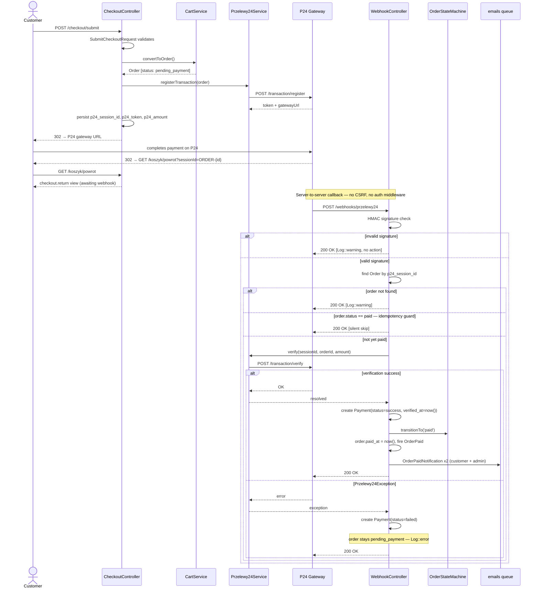
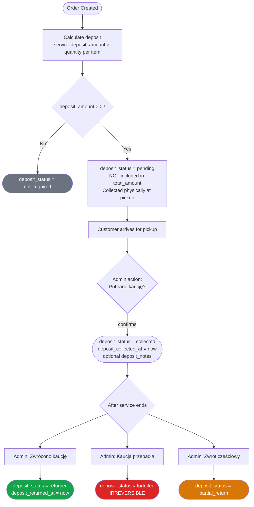

# Payment Flow

## Overview (P24 + Kaucja)

Registro uses **Przelewy24 (P24)** as its sole online payment provider. The flow follows the industry-standard double-verification pattern: (1) register a transaction server-side to get a gateway URL, (2) redirect the customer to P24, (3) receive a server-to-server webhook callback, (4) verify the payment with a second API call before marking the order paid.

**Kaucja (security deposit)** is a separate, physically-collected charge that runs in parallel to the P24 flow and is managed entirely through the admin panel. It is never sent through P24.

**Key files:**

| File | Role |
|---|---|
| `app/Services/Payment/Przelewy24Service.php` | P24 client wrapper — register + webhook verify |
| `app/Http/Controllers/CheckoutController.php` | Initiation (`submit`) + return handler |
| `app/Http/Controllers/WebhookController.php` | Webhook entry point |
| `app/Http/Controllers/Dev/FakePaymentController.php` | Dev bypass (non-production only) |
| `app/StateMachines/OrderStatusStateMachine.php` | All valid order status transitions |
| `app/Services/Order/OrderService.php` | Cancel + TTL cleanup |
| `app/Models/Order.php` | Full field inventory including deposit + P24 fields |
| `app/Models/Payment.php` | Per-webhook payment record |
| `app/Notifications/OrderPaidNotification.php` | Customer + admin emails post-payment |
| `app/Providers/AppServiceProvider.php:250–293` | Event → notification wiring |
| `routes/console.php:104–110` | `orders:cleanup-expired` every 5 minutes |

---

## P24 Integration Flow

### Initiation (`CheckoutController::submit`)

1. `SubmitCheckoutRequest` validates the checkout form.
2. `CartService::convertToOrder()` materialises the cart into an `Order` with `status = pending_payment`.
3. `Przelewy24Service::registerTransaction()` calls `$p24->transactions()->register()` with:
   - `sessionId` = `"ORDER-{$order->id}-{time()}"` — unique per attempt
   - `amount` = `total_amount * 100` (integer grosz)
   - `urlReturn` = `checkout.return` route (customer redirect after payment)
   - `urlStatus` = `webhooks.p24` route (server-to-server callback)
4. The response `token` and `gatewayUrl` are persisted to `orders.p24_token` and `orders.p24_session_id`.
5. Customer is redirected to the P24 gateway URL.

### Return redirect (`CheckoutController::return`)

- P24 redirects the customer to `GET /koszyk/powrot?sessionId=ORDER-{id}`.
- Controller looks up the order by `p24_session_id`, scoped to the current organisation and authenticated user.
- Renders `checkout.return` view. **No payment action is taken here** — payment confirmation happens exclusively via webhook.

### Webhook verification (`WebhookController::przelewy24` → `Przelewy24Service::handleWebhook`)

P24 POSTs to `/webhooks/przelewy24` server-to-server. This route is excluded from CSRF and auth middleware in `bootstrap/app.php`.

Steps:
1. `$notification->isSignValid(sessionId, amount, originAmount, orderId, methodId, statement)` — HMAC signature check.
2. Invalid signature → `Log::warning` + early return (always `200 OK` to P24).
3. Order looked up by `p24_session_id`.
4. Idempotency guard: if `$order->status === 'paid'` → silent skip.
5. `$p24->transactions()->verify($sessionId, $orderId, $amount)` — second server-to-server call to P24 API.

**On success:**
- `Payment` record created: `status = success`, `verified_at = now()`, full `webhook_payload` stored as JSON.
- `$order->status()->transitionTo('paid')` via state machine.
- `$order->update(['paid_at' => now()])`.
- `event(new OrderPaid($order))` fires two listeners:
  - **Notifications** (wired in `AppServiceProvider:250`):
    - Customer receives `OrderPaidNotification('customer')` → `ORDER_PAID` email template with item list, deposit note, pickup address.
    - Organisation owner receives `OrderPaidNotification('admin')` → `ADMIN_NEW_ORDER` email template.
    - Both notifications: `ShouldQueue` + `ShouldBeUnique` (dedup window: 5 min), queue: `emails`.
  - **`RecordAnalyticsOnOrderPaid`** listener: async analytics tracking.

**On failure (`Przelewy24Exception`):**
- `Payment` record created: `status = failed`, `verified_at = null`, full payload stored.
- Order status remains `pending_payment` — no state transition.
- `Log::error` with session ID, order ID, and exception message.

The webhook handler always returns `HTTP 200 OK` to P24, even on errors, to prevent P24 from retrying indefinitely.

### Sequence diagram



---

## Payment Statuses

### `payments.status` (on `Payment` model)

| Status | Meaning |
|---|---|
| `success` | Webhook received and `verify()` call passed |
| `failed` | `Przelewy24Exception` thrown during `verify()` |

Each webhook call creates one `Payment` record, so multiple failed attempts produce multiple `failed` records before a successful one.

### `orders.status` (state machine — `OrderStatusStateMachine`)

```mermaid
stateDiagram-v2
    [*] --> pending_payment : CartService::convertToOrder()

    pending_payment --> pending_payment : webhook failed\n(Payment.status = failed)
    pending_payment --> paid : webhook verified\n(Payment.status = success)
    pending_payment --> cancelled : TTL expired (every 5 min)\nOR admin cancel

    paid --> confirmed : admin confirms
    paid --> cancelled : admin cancel

    confirmed --> in_progress : scheduled job\n(start_date reached)
    in_progress --> completed : admin — item returned
    completed --> refunded : admin refund

    cancelled --> [*]
    refunded --> [*]
```

| Status | Meaning |
|---|---|
| `pending_payment` | Default; order created, awaiting P24 webhook |
| `paid` | Webhook verified successfully |
| `confirmed` | Admin manually confirmed after reviewing a paid order |
| `in_progress` | Scheduled job transitions when `start_date` arrives |
| `completed` | Admin marks after item returned |
| `cancelled` | TTL expired OR admin cancel (from `pending_payment` or `paid`) |
| `refunded` | Terminal; reachable from `completed` only |

The state machine is backed by `laravel-eloquent-state-machines` and records full transition history on the order.

---

## Kaucja (Deposit) Handling

### Calculation (`CartService::convertToOrder`, `CartService.php:112,156`)

- Per line item: `service->deposit_amount × quantity`
- Order total deposit: sum of all line-item deposit amounts
- `deposit_amount > 0` → `deposit_status = 'pending'`
- `deposit_amount == 0` → `deposit_status = 'not_required'`
- `deposit_amount` is **not** included in `total_amount` — it is a returnable security deposit and is not VAT-able.

**Deposit is collected physically (cash or card at pickup), never via P24.**

### Lifecycle (admin panel — `OrderResource/Pages/EditOrder.php`)

| Admin action | Required state | Result |
|---|---|---|
| "Pobrano kaucję" | `pending` | `→ collected`, `deposit_collected_at = now()` |
| "Zwrócono kaucję" | `collected` | `→ returned`, `deposit_returned_at = now()` |
| "Kaucja przepadła" | `collected` | `→ forfeited` (irreversible) |
| Partial return | `collected` | `→ partial_return` |

All transitions optionally accept `deposit_notes` via a confirmation modal.

**Deposit statuses:** `not_required` | `pending` | `collected` | `returned` | `partial_return` | `forfeited`

### Flowchart



---

## Webhook Handling

### Route security

- Route: `POST /webhooks/przelewy24`
- Excluded from CSRF middleware in `bootstrap/app.php`
- No authentication middleware — P24 authenticates via HMAC signature
- Signature components: `sessionId`, `amount`, `originAmount`, `orderId`, `methodId`, `statement`

### P24 `Notification` wrapper fields

| Field | Used for |
|---|---|
| `sessionId()` | Matches `orders.p24_session_id` |
| `orderId()` | P24's internal order ID; stored as `payments.p24_order_id` |
| `amount()` | Amount in grosz; compared against `orders.p24_amount` during verify |
| `originAmount()` | Included in HMAC signature validation |
| `methodId()` | Included in HMAC signature validation |
| `statement()` | Included in HMAC signature validation |

### Idempotency

If P24 retries a webhook for an already-paid order, the handler detects `$order->status === 'paid'` and exits silently with `200 OK`. No duplicate `Payment` records are created.

### Response contract

The handler **always** returns `HTTP 200 OK` to P24, regardless of outcome. Returning non-200 causes P24 to retry the webhook repeatedly. All failures are logged internally.

---

## Dev/Mock Payment (local testing)

**Route:** `POST /dev/fake-pay` — registered only when `! app()->isProduction()` in `routes/web.php`.

**Controller:** `app/Http/Controllers/Dev/FakePaymentController.php`

Defence-in-depth: the controller calls `abort_if(app()->isProduction(), 404)` independently of the route guard.

**What the fake payment does differently from real P24:**

| Step | Real P24 | Fake payment |
|---|---|---|
| Form validation | `SubmitCheckoutRequest` | Skipped — uses auth user profile directly |
| Phone fallback | From form | `+48000000000` |
| Invoice | From form | `invoice_requested = false` |
| P24 registration | `Przelewy24Service::registerTransaction()` | Skipped |
| Session ID | `"ORDER-{id}-{time()}"` | `"fake-{$order->id}"` |
| Status transition | Via webhook + verify | Direct `transitionTo('paid')` |
| `OrderPaid` event | Fired | **Not fired** — no notifications sent in dev |
| Redirect | `checkout.return?sessionId=ORDER-{id}` | `checkout.return?sessionId=fake-{id}` |

**P24 config** (`config/przelewy24.php`): `P24_LIVE=false` by default → sandbox mode. Credentials from env vars `P24_MERCHANT_ID`, `P24_REPORTS_KEY`, `P24_CRC`, `P24_POS_ID`.

---

## Error & Failure Handling

### Checkout initiation failure

If `Przelewy24Service::registerTransaction()` throws after `CartService::convertToOrder()` has already saved the order, the order will exist with `status = pending_payment` but no `p24_session_id`. `CheckoutController::submit` catches any `\Exception`, logs it, and redirects back with a generic error message. These orphaned orders are cleaned up by the TTL expiry job.

### Webhook signature invalid

- `Log::warning` with context
- No `Payment` record created
- `200 OK` returned to P24

### Order not found for session ID

- `Log::warning` with session ID
- `200 OK` returned to P24

### P24 verify call fails (`Przelewy24Exception`)

- `Payment` record created with `status = failed`
- Order stays at `pending_payment`
- `Log::error` with session ID, order ID, exception message
- `200 OK` returned to P24

P24 will retry the webhook. On subsequent retries the idempotency guard only activates if a previous attempt already succeeded; failed attempts allow retries through.

### TTL expiry

**Command:** `orders:cleanup-expired` (Artisan)
**Schedule:** every 5 minutes, `withoutOverlapping()`, `onOneServer()`
**Location:** `routes/console.php:104–110`

`OrderService::cleanupExpired()` fetches all `pending_payment` orders where `expires_at < now()` and transitions each to `cancelled` with reason `'TTL expired'`. `OrderCancelled` event fires → `OrderCancelledNotification` is queued to the customer on the `emails` queue.

### Admin cancellation

`OrderService::cancel()` allows manual cancellation from `pending_payment` or `paid` status. Fires `OrderCancelled` event → queued customer notification.

---

## Refund Flow

Refunds follow a manual admin process — there is no automated P24 refund API call.

**Eligible orders:** only those with `status = completed`

**Admin action:** transitions order to `refunded` via the state machine in `OrderResource`.

The `refunded` status is **terminal** — no further transitions are possible from it.

Deposit refunds (kaucja) are handled separately via the `deposit_status` field (see [Kaucja section](#kaucja-deposit-handling)) and are independent of the order's payment refund status.
