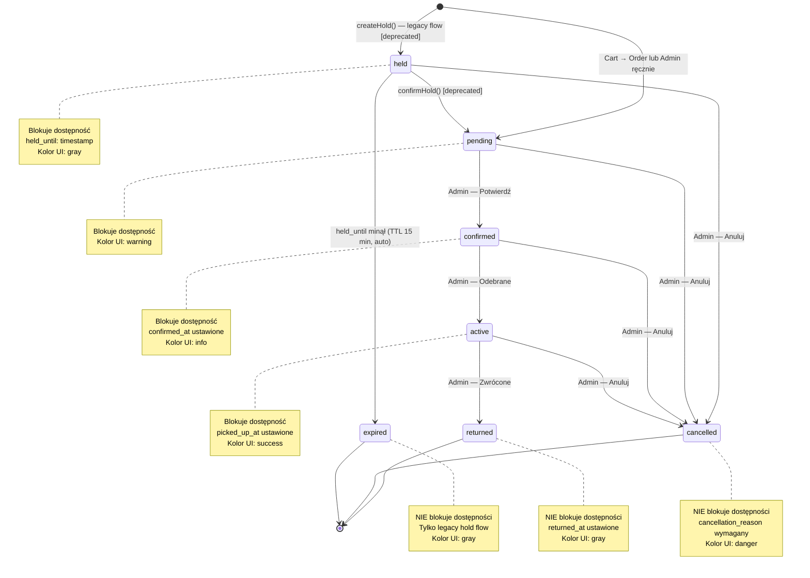

# Rental System Flow (Wypożyczalnia)

## Overview

The rental system (`wypożyczalnia`) handles physical item loans with date-range reservations, quantity-based availability, optional deposit (kaucja), and a full admin lifecycle. It operates on `ServiceType::ItemRental` services and is gated by the `rentals` module flag.

Two parallel flows exist:
- **Current (Sprint 2+):** Cart → Order → `OrderItem` blocks availability
- **Legacy (Sprint 4, deprecated):** `createHold()` → `Rental` row with `held` status → `confirmHold()` → pipeline

Both flows ultimately produce `Rental` rows that share the same status machine and admin interface.

Routes are protected by `ResolveTenant` + `throttle:60,1`. Cart actions additionally require auth + `CheckRentalEnabled` middleware.

---

## Public Catalogue Flow

**Entry points:**

| URL | Controller method | Purpose |
|-----|-------------------|---------|
| `/wypozyczalnia` | `RentalController::index()` | Category grid + up to 6 featured items |
| `/wypozyczalnia/{category:slug}` | `RentalController::showCategory()` | Category page with item grid |
| `/uslugi/{service:slug}` | `ServiceController::show()` | Individual product page |

**Catalogue page (`/wypozyczalnia`):**
- Shows category grid
- Featured items: `Service::rentable()->active()->ordered()->limit(6)`

**Category page (`/wypozyczalnia/{category:slug}`):**
- Sidebar nav: sticky on desktop, horizontal pills on mobile
- Item grid via `<x-ios.service-card>` component
- When `price_on_request = true`: card shows "Zapytaj o cenę" badge instead of price

**Product page (`/uslugi/{service:slug}`):**
- 3-column layout for `ItemRental` services:
  - Left: product image, description, specifications
  - Right: sticky sidebar with pricing + Alpine.js availability calendar
- Calendar fetches monthly data from `GET /api/rental/{service:slug}/kalendarz`
- On date range selection: AJAX to `GET /api/rental/{service:slug}/dostepnosc?start_date=&end_date=` confirms available quantity
- If `price_on_request = true`: calendar and pricing are hidden; "Zapytaj o cenę" button shown instead

---

## Rental Journey (Customer Perspective)

```mermaid
flowchart TD
    START(["Klient wchodzi na stronę"])
    START --> CAT["/wypozyczalnia<br/>Katalog wypożyczalni"]
    CAT --> BROWSE["/wypozyczalnia/{category:slug}<br/>Przeglądanie kategorii"]
    BROWSE --> PRODUCT["/uslugi/{service:slug}<br/>Strona produktu"]

    PRODUCT --> PIR{price_on_request?}

    PIR -- TAK --> INQ_BTN["Przycisk: Zapytaj o cenę<br/>Kalendarz i cena ukryte"]
    INQ_BTN --> INQ_MODAL["Modał Alpine.js<br/>Imię, email, telefon, wiadomość"]
    INQ_MODAL --> INQ_POST["POST /uslugi/{slug}/zapytaj<br/>throttle: 5 req/min"]
    INQ_POST --> INQ_NOTIF["InquiryNotification → email właściciela<br/>ShouldQueue + ShouldBeUnique"]
    INQ_NOTIF --> INQ_DONE(["Dziękujemy!<br/>Skontaktujemy się wkrótce"])

    PIR -- NIE --> CAL["Kalendarz dostępności — Alpine.js<br/>GET /api/rental/{slug}/kalendarz"]
    CAL --> DATES["Wybór zakresu dat<br/>start_date / end_date"]
    DATES --> AV_CHECK["AJAX: /api/rental/{slug}/dostepnosc<br/>Sprawdzenie dostępnej ilości"]
    AV_CHECK --> AV_OK{Dostępne?}
    AV_OK -- NIE --> AV_FAIL["Komunikat: brak dostępności<br/>w wybranym terminie"]
    AV_FAIL --> DATES
    AV_OK -- TAK --> AUTH{Zalogowany?}
    AUTH -- NIE --> LOGIN["/login — Przekierowanie"]
    LOGIN --> AUTH
    AUTH -- TAK --> ADD_CART["Dodaj do koszyka<br/>CartService::addItem()<br/>Snapshot ceny + deposit_amount"]
    ADD_CART --> CART["/koszyk — Podgląd koszyka"]
    CART --> CHECKOUT["/koszyk/zamowienie — Checkout"]
    CHECKOUT --> CUST_DATA["Dane klienta<br/>B2C: PESEL + adres<br/>B2B: NIP + REGON + KRS + pełnomocnik + osoba odbioru"]
    CUST_DATA --> SUMMARY["Podsumowanie zamówienia<br/>total_amount<br/>+ deposit_amount (kaucja — off-total, bez VAT)"]
    SUMMARY --> PAY_METHOD{Metoda płatności}
    PAY_METHOD -- Przelewy24 --> P24["Brama płatności Przelewy24"]
    PAY_METHOD -- DEV --> FAKE["Fake Pay<br/>/dev/fake-pay"]
    P24 --> ORDER["Order created<br/>OrderItem blokuje dostępność<br/>na wybrany zakres dat"]
    FAKE --> ORDER
    ORDER --> EMAIL_CONF["Email potwierdzenia<br/>Klient czeka na termin odbioru"]

    EMAIL_CONF --> PICKUP["Admin: Odebrane<br/>Rental: pending → active<br/>picked_up_at = now()"]
    PICKUP --> ACTIVE_USE["Aktywne wypożyczenie<br/>Sprzęt u klienta"]
    ACTIVE_USE --> RETURN_ACT["Admin: Zwrócone<br/>Rental: active → returned<br/>returned_at = now()"]
    RETURN_ACT --> DEP_Q{deposit_amount > 0?}
    DEP_Q -- NIE --> DONE(["Zakończone ✓"])
    DEP_Q -- TAK --> DEP_DEC{"Decyzja o kaucji<br/>OrderResource"}
    DEP_DEC -- "Pełny zwrot" --> DEP_RET["deposit_status → returned<br/>Kaucja zwrócona klientowi"]
    DEP_DEC -- "Zwrot częściowy" --> DEP_PART["deposit_status → partial_return"]
    DEP_DEC -- "Przepadła" --> DEP_FORT["deposit_status → forfeited"]
    DEP_RET --> DONE
    DEP_PART --> DONE
    DEP_FORT --> DONE
```

**Checkout customer data types:**
- **B2C:** PESEL + address
- **B2B:** NIP + REGON + KRS + signatory (pełnomocnik) + pickup person (osoba odbioru)

**Deposit (kaucja) in checkout:** shown as a separate line below `total_amount`. It is off-total, not VAT-able, not included on the invoice. Appears only as a separate deposit document/acknowledgement.

---

## price_on_request Path

When `Service.price_on_request = true`:

**Guard:** `HasRentalBehavior::bootHasRentalBehavior()` forces `price_on_request = false` on creating/updating for any service where `service_type !== ItemRental`. Only `ItemRental` services can carry this flag.

**Product page behaviour:**
- Pricing grid hidden (no day/hour/week price boxes)
- Availability calendar not rendered (`@if(!$service->price_on_request)` wraps the calendar block)
- "Dodaj do koszyka" replaced by "Zapytaj o cenę" button + optional phone CTA
- Button dispatches Alpine event `open-inquiry-modal`

**Inquiry modal flow:**
1. Modal collects: name (required), email (required), phone (optional), message (optional)
2. Submits via `fetch()` to `POST /uslugi/{service:slug}/zapytaj` (route: `service.inquiry`)
3. Throttle: 5 requests/minute
4. `ServiceInquiryController::store()` validates, resolves recipient from `checkout.inquiry_email` setting (fallback: `email.from_address`)
5. Fires `InquiryNotification` (ShouldQueue + ShouldBeUnique) via `Notification::route('mail', $recipient)`
6. On success: modal shows "Dziękujemy! Skontaktujemy się z Tobą wkrótce."

**In service cards** (`<x-ios.service-card>`): when `price_on_request`, shows "Zapytaj o cenę" badge instead of price.

---

## Kaucja (Deposit) Handling

Two separate deposit systems exist in parallel depending on which flow created the rental.

### A. Rental model deposit (legacy flow)

- `Rental.deposit_amount` — decimal, snapshot of `Service.deposit_amount` at booking time
- Set in `RentalAvailabilityService::createHold()`: `'deposit_amount' => $service->deposit_amount`
- No explicit deposit lifecycle fields on the `Rental` model — no `deposit_status`, no `deposit_collected_at`/`deposit_returned_at`
- Managed implicitly; admin can view and edit deposit amount on the rental edit form

### B. Order deposit (Cart → Order flow, current)

Source: `OrderResource.php:273+`, migration `2026_03_28_000002`

- `Order.deposit_amount` — `DECIMAL(10,2)`, sum of `order_items.deposit_amount`
  - Each item deposit: `service.deposit_amount * quantity`, calculated in `CartService::convertToOrder()`
- `Order.deposit_status` — string ENUM:

| Value | Label (PL) | Color |
|-------|------------|-------|
| `not_required` | Nie wymagana | gray |
| `pending` | Oczekująca | warning |
| `collected` | Pobrana | success |
| `returned` | Zwrócona | gray |
| `partial_return` | Zwrot częściowy | info |
| `forfeited` | Przepadła | danger |

- Default: `not_required` (when `deposit_amount = 0`)
- Admin action "Pobrano kaucję" → `pending` → `collected`, sets `deposit_collected_at = now()`
- Further transitions to `returned`, `partial_return`, or `forfeited` via `OrderResource` row actions

**Critical rule:** Deposit is off-total. It does not appear on the invoice — only as a separate deposit document/acknowledgement. Never add it to `total_amount`.

---

## Rental Status Machine

### Status Values

Source: `app/Enums/RentalStatus.php`

| Enum Case | Value | Label (PL) | Color | Blocks Availability |
|-----------|-------|------------|-------|---------------------|
| `Held` | `held` | Zarezerwowane tymczasowo | gray | YES |
| `Pending` | `pending` | Oczekujące | warning | YES |
| `Confirmed` | `confirmed` | Potwierdzone | info | YES |
| `Active` | `active` | Aktywne | success | YES |
| `Returned` | `returned` | Zwrócone | gray | no |
| `Cancelled` | `cancelled` | Anulowane | danger | no |
| `Expired` | `expired` | Wygasłe | gray | no |

`held`, `pending`, `confirmed`, `active` all consume inventory capacity.

**Availability is dual-source:** `getAvailableQuantity()` deducts both legacy `Rental` rows with blocking statuses AND `OrderItem` rows with blocking payment statuses.

### Timestamps (set automatically in `Rental::booted()` `updating` hook)

| Transition to | Timestamp set |
|---------------|---------------|
| `Confirmed` | `confirmed_at = now()` |
| `Active` | `picked_up_at = now()` |
| `Returned` | `returned_at = now()` |
| `Cancelled` | `cancelled_at = now()` |

### State Diagram

---

## Admin Rental Management

Source: `app/Filament/Resources/RentalResource.php`

- Module: `rentals`
- Roles: `admin`, `super-admin` only
- Navigation group: `rentals`, sort: 3
- Pages: `ListRentals`, `CreateRental`, `EditRental`

### Admin Flow Diagram

```mermaid
flowchart LR
    NEW["Nowe wypożyczenie"] --> SRC{Źródło}
    SRC -- "Cart → Order" --> PEND_CART["pending<br/>OrderItem blokuje zakres dat"]
    SRC -- "Admin: Utwórz ręcznie" --> PEND_MAN["pending<br/>Domyślna cena: daily"]
    SRC -- "Legacy createHold ⚠️ deprecated" --> HELD["held<br/>held_until TTL 15 min"]

    PEND_CART --> LIST["RentalResource<br/>Lista wypożyczeń"]
    PEND_MAN --> LIST
    HELD --> LIST

    HELD -- "held_until minął (auto)" --> EXPIRED["expired ✗<br/>Stan terminalny"]

    LIST --> FILT["Filtry: status / service_id"]
    FILT --> STATUS{Aktualny status}

    STATUS -- "held lub pending" --> CONFIRM_ACT["Akcja: Potwierdź"]
    CONFIRM_ACT --> CONFIRMED["confirmed<br/>confirmed_at = now()"]

    STATUS -- "confirmed" --> PICKUP_ACT["Akcja: Odebrane"]
    PICKUP_ACT --> ACTIVE["active<br/>picked_up_at = now()"]

    STATUS -- "active" --> RETURN_ACT["Akcja: Zwrócone"]
    RETURN_ACT --> RETURNED["returned<br/>returned_at = now()"]

    STATUS -- "dowolny nieterminalny" --> CANCEL_ACT["Akcja: Anuluj"]
    CANCEL_ACT --> CANCEL_MOD["Modal potwierdzenia<br/>cancellation_reason (wymagany)"]
    CANCEL_MOD --> CANCELLED["cancelled ✗<br/>cancellation_reason zapisany"]

    RETURNED --> DEP_CHECK{deposit_amount > 0?}
    DEP_CHECK -- NIE --> DONE["Zakończone ✓"]
    DEP_CHECK -- TAK --> DEP_MGMT["OrderResource<br/>Zarządzanie kaucją"]
    DEP_MGMT --> DEP_COLL["Akcja: Pobrano kaucję<br/>deposit_status: pending → collected<br/>deposit_collected_at = now()"]
    DEP_COLL --> DEP_DEC{Decyzja o zwrocie kaucji}
    DEP_DEC -- "Pełny zwrot" --> DEP_RET["deposit_status → returned"]
    DEP_DEC -- "Zwrot częściowy" --> DEP_PART["deposit_status → partial_return"]
    DEP_DEC -- "Przepadła" --> DEP_FORT["deposit_status → forfeited"]
    DEP_RET --> DONE
    DEP_PART --> DONE
    DEP_FORT --> DONE
```

### Table Row Actions

| Action | Label | Visible when status | Resulting status |
|--------|-------|---------------------|-----------------|
| `confirm` | Potwierdź | `held` or `pending` | `confirmed` |
| `markPickedUp` | Odebrane | `confirmed` | `active` |
| `markReturned` | Zwrócone | `active` | `returned` |
| `cancel` | Anuluj | any non-terminal | `cancelled` |

Cancel opens a confirmation modal with a required `cancellation_reason` textarea. The reason is stored on `Rental.cancellation_reason`.

### Filters

- `status` dropdown
- `service_id` dropdown

### Manual creation

Admin can create rentals manually via the create page. Defaults: `status = pending`, pricing unit = `daily`.

---

## Rental vs Booking/Appointment Differences

| Dimension | Rental (ItemRental) | Booking (TimeSlot/Appointment) |
|-----------|---------------------|-------------------------------|
| **Model** | `Rental` | `Appointment` |
| **Service type** | `ServiceType::ItemRental` | `ServiceType::TimeSlot` |
| **What is reserved** | Physical inventory (quantity) | Staff time slot |
| **Date granularity** | Date range (`start_date`, `end_date` — DATE columns) | Single date + time window (`appointment_date` + `start_time`/`end_time`) |
| **Availability model** | Quantity-based: `quantity_total - SUM(reserved)` | Slot-based: staff schedule, vacation, exceptions |
| **Status enum** | `RentalStatus` (7 values, includes `held`, `expired`) | `AppointmentStatus` (4 values: pending, confirmed, cancelled, completed) |
| **Key lifecycle events** | `picked_up_at`, `returned_at`, `held_until` | `completed_at`, `cancelled_at` |
| **Deposit (kaucja)** | `Rental.deposit_amount` (legacy) or `Order.deposit_amount` (current) | Not applicable |
| **Hold mechanism** | `held` status + `held_until` timestamp (15 min TTL) | None |
| **Staff assignment** | None | `staff_id` FK |
| **Pricing** | `price_per_day` / `price_per_hour` / `price_per_week` / tiered | Fixed `price` or `price_from` |
| **Cart integration** | Yes (Cart → Order flow) | No (separate booking wizard) |
| **Payment gateway** | Przelewy24 / fake-pay (via Order) | None (confirmation only) |
| **Module gating** | `rentals` module | `bookings` module |
| **Admin Resource** | `RentalResource` | `AppointmentResource` |
| **Events dispatched** | None (status set directly on model) | `AppointmentCreated`, `AppointmentConfirmed`, `AppointmentCancelled`, `AppointmentRescheduled` |

---

## Notifications & Reminders

### Customer-facing notifications

| Trigger | Channel | Class |
|---------|---------|-------|
| Order placed (payment success) | Email | Order confirmation email (standard order flow) |
| Inquiry sent (`price_on_request`) | — | No confirmation email to customer; only owner notified |

### Owner/admin notifications

| Trigger | Channel | Class | Notes |
|---------|---------|-------|-------|
| `price_on_request` inquiry submitted | Email | `InquiryNotification` | ShouldQueue + ShouldBeUnique; recipient from `checkout.inquiry_email` setting or `email.from_address` |

### Status transition notifications

There are no automated email notifications on rental status transitions (`confirmed`, `active`, `returned`, `cancelled`). Admin manages status manually via `RentalResource` row actions, and customer communication is handled outside the system.

### Rental extension reminders

The rental extension feature (`feature/rental-extension` branch) is not merged. No extension notifications or reminder jobs exist in the current working tree.

---

## Known Limitations & WIP

- **Rental extension:** `feature/rental-extension` branch exists but is not merged to develop. `SettingsManager::isRentalExtensionEnabled()` exists as a flag stub. No extension controllers, models, routes, or notifications in the main codebase.
- **Legacy hold flow:** `RentalAvailabilityService::createHold()` and `confirmHold()` are marked `@deprecated Sprint 4`. They remain in the codebase for backward compatibility but no new code should use them.
- **Dual availability sources:** `getAvailableQuantity()` must deduct from both `Rental` rows (legacy) and `OrderItem` rows (current). Any query touching availability must account for both sources.
- **Deposit lifecycle on legacy Rental:** No `deposit_status` or deposit timestamp columns on the `Rental` model — deposit management for legacy-created rentals is informal (admin edits the amount directly).
