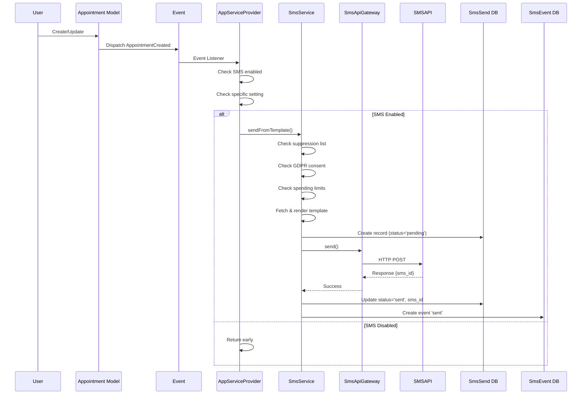
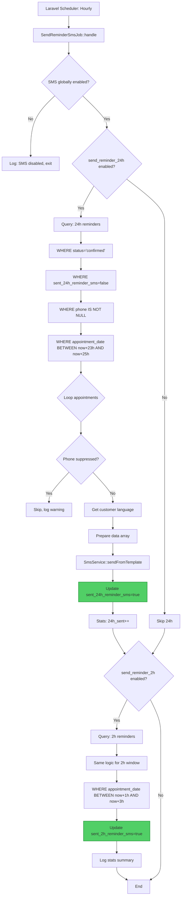
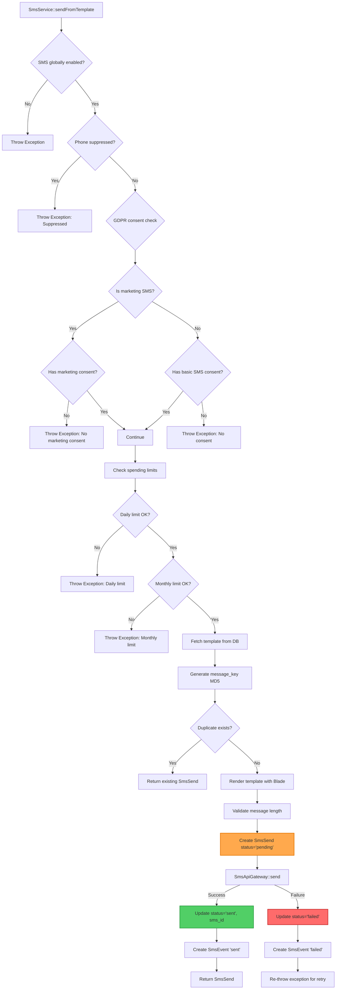
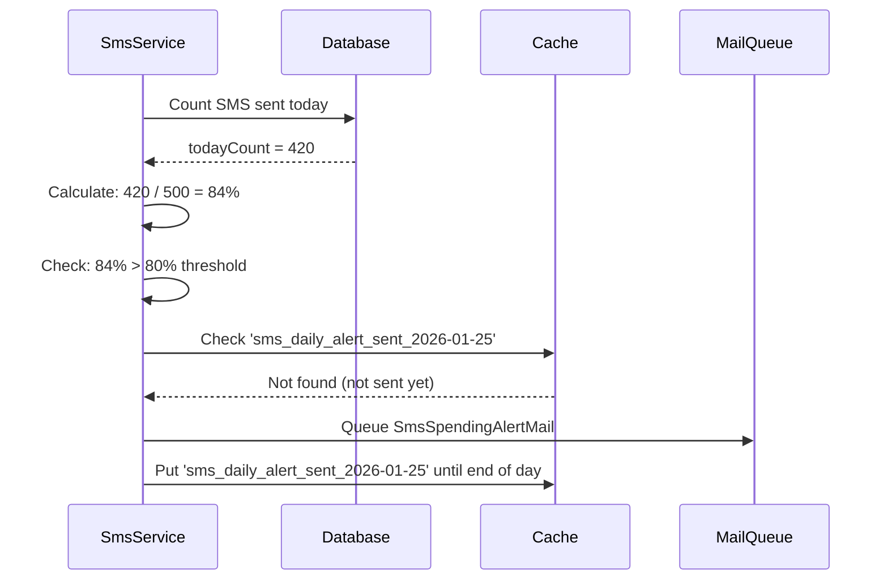
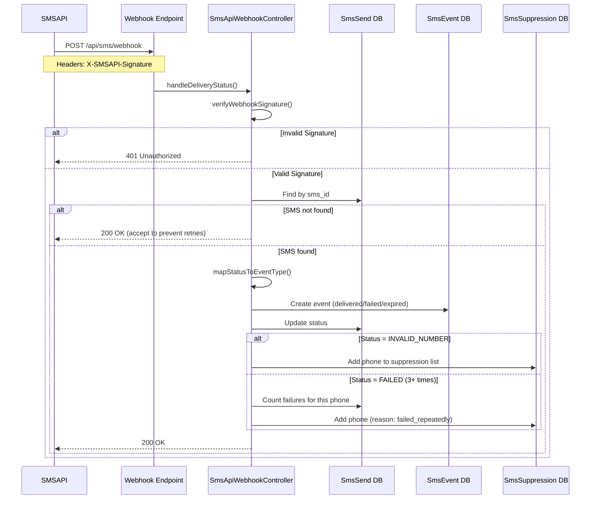
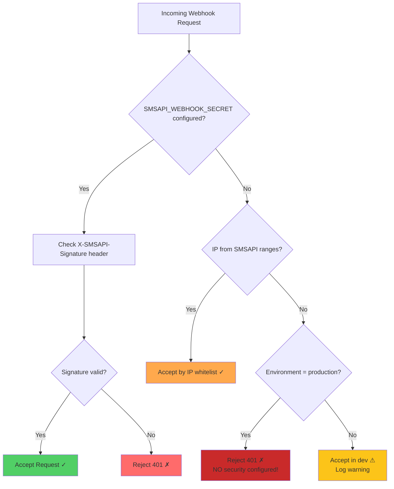

# SMS System Architecture - Registro

**Status:** Production
**Data aktualizacji:** 2026-01-25
**Autor:** System Documentation

---

## Overview

System SMS w Registro zapewnia automatyczną komunikację z klientami poprzez wiadomości SMS. Wykorzystuje SMSAPI.pl jako bramkę SMS i składa się z dwóch głównych mechanizmów:

1. **Event-Driven SMS** - wysyłka natychmiastowa w odpowiedzi na eventy (utworzenie wizyty, potwierdzenie, anulowanie)
2. **Scheduled SMS** - wysyłka zaplanowana przez Laravel Scheduler (przypomnienia 24h/2h przed wizytą, follow-up)

---

## Architecture Diagram

```mermaid
gaph TB
    srubgraph "Event-Driven SMS Flow"
        A1[User Action] --> B1[AppointmentCreated Event]
        A2[Admin Action] --> B2[AppointmentConfirmed Event]
        A3[Cancellation] --> B3[AppointmentCancelled Event]
        A4[Rescheduling] --> B4[AppointmentRescheduled Event]

        B1 --> C1[AppServiceProvider Listener]
        B2 --> C1
        B3 --> C1
        B4 --> C1

        C1 --> D1{SMS Enabled?}
        D1 -->|Yes| E1[SmsService::sendFromTemplate]
        D1 -->|No| F1[Skip]
    end

    subgraph "Scheduled SMS Flow"
        G1[Laravel Scheduler Hourly] --> H1[SendReminderSmsJob]
        G1 --> H2[SendFollowUpSmsJob]

        H1 --> I1{Query Database}
        H2 --> I2{Query Database}

        I1 --> J1[Appointments 23-25h ahead]
        I1 --> J2[Appointments 1-3h ahead]
        I2 --> J3[Completed 23-25h ago]

        J1 --> K1[Loop: Check sent_24h_reminder_sms]
        J2 --> K2[Loop: Check sent_2h_reminder_sms]
        J3 --> K3[Loop: Check sent_followup_sms]

        K1 -->|Not sent| E1
        K2 -->|Not sent| E1
        K3 -->|Not sent| E1
    end

    subgraph "SMS Service Core"
        E1 --> L1{Suppression List?}
        L1 -->|Blocked| M1[Throw Exception]
        L1 -->|OK| N1{GDPR Consent?}

        N1 -->|No| M2[Throw Exception]
        N1 -->|Yes| O1{Spending Limits OK?}

        O1 -->|Exceeded| M3[Throw Exception]
        O1 -->|OK| P1[Fetch Template]

        P1 --> Q1[Render with Blade]
        Q1 --> R1[Create SmsSend Record]
        R1 --> S1[SmsApiGateway::send]

        S1 -->|Success| T1[Mark as 'sent']
        S1 -->|Failure| T2[Mark as 'failed']

        T1 --> U1[Create SmsEvent 'sent']
        T2 --> U2[Create SmsEvent 'failed']

        T1 --> V1{Is Reminder?}
        V1 -->|Yes| W1[Update sent_*_reminder_sms flag]
    end

    subgraph "Webhook Flow"
        X1[SMSAPI Webhook POST] --> Y1{Verify Signature}
        Y1 -->|Invalid| Z1[Reject 401]
        Y1 -->|Valid| AA1[Find SmsSend by sms_id]

        AA1 -->|Not found| AB1[Return 200 OK]
        AA1 -->|Found| AC1[Map status to event_type]

        AC1 --> AD1[Create SmsEvent]
        AD1 --> AE1[Update SmsSend status]
        AE1 --> AF1{Is invalid_number?}

        AF1 -->|Yes| AG1[Add to Suppression List]
        AF1 -->|No| AH1{Failed 3+ times?}

        AH1 -->|Yes| AG1
        AH1 -->|No| AI1[End]
        AG1 --> AI1
    end

    style E1 fill:#0AB1EA,stroke:#00323B,stroke-width:3px,color:#fff
    style S1 fill:#FF6B6B,stroke:#C92A2A,stroke-width:2px,color:#fff
    style W1 fill:#51CF66,stroke:#2F9E44,stroke-width:2px,color:#fff
```

---

## Event-Driven SMS

### Triggery i Eventy

| Event | Trigger | Template Key | Setting Key |
|-------|---------|--------------|-------------|
| `AppointmentCreated` | Klient tworzy wizytę | `appointment-created` | `send_booking_confirmation` |
| `AppointmentConfirmed` | Admin potwierdza wizytę | `appointment-confirmed` | `send_admin_confirmation` |
| `AppointmentCancelled` | Wizyta anulowana | `appointment-cancelled` | `send_cancellation` |
| `AppointmentRescheduled` | Wizyta przeniesiona | `appointment-rescheduled` | `send_rescheduled` |

### Flow wysyłki event-driven



### Kod źródłowy

```php
// app/Providers/AppServiceProvider.php

Event::listen(AppointmentCreated::class, function (AppointmentCreated $event) {
    $this->sendSmsNotification(
        'appointment-created',
        $event->appointment,
        'send_booking_confirmation'
    );
});
```

**Kluczowe mechanizmy:**
- **Automatic dispatch:** `Appointment` model ma `$dispatchesEvents` dla `created` event
- **Status change detection:** `booted()` method w modelu wykrywa zmiany statusu i dispatchuje `AppointmentConfirmed`, `AppointmentCancelled`
- **Non-blocking:** Jeśli SMS zawiedzie, application flow kontynuuje (exception tylko logowany)

---

## Scheduled SMS (Reminders & Follow-ups)

### Scheduler Configuration

```php
// routes/console.php

// Przypomnienia 24h i 2h przed wizytą
Schedule::job(new SendReminderSmsJob)
    ->hourly()
    ->withoutOverlapping()
    ->name('sms:send-reminders')
    ->onOneServer();

// Follow-up 24h po zakończeniu wizyty
Schedule::job(new SendFollowUpSmsJob)
    ->hourly()
    ->withoutOverlapping()
    ->name('sms:send-followups')
    ->onOneServer();
```

### Reminder Job Flow (24h & 2h)



### Database Query Breakdown

**24-hour reminder query:**
```php
$appointments = Appointment::query()
    ->with(['customer', 'service'])
    ->where('status', 'confirmed')              // Tylko potwierdzone
    ->where('sent_24h_reminder_sms', false)     // NIE wysłano wcześniej
    ->whereNotNull('phone')                     // Ma numer telefonu
    ->whereBetween('appointment_date', [
        Carbon::now()->addHours(23),            // Za 23h
        Carbon::now()->addHours(25),            // Za 25h (2h okno)
    ])
    ->get();
```

**Dlaczego 2-godzinne okno?**
- Job działa co godzinę
- Okno `23h-25h` zapewnia że każda wizyta zostanie złapana DOKŁADNIE RAZ
- Jeśli job opóźni się o 30 min, wizyta nadal będzie w oknie
- Flaga `sent_24h_reminder_sms` zapobiega duplikatom

**Follow-up query (analogicznie):**
```php
// Completed appointments from 23-25 hours AGO
->where('status', 'completed')
->where('sent_followup_sms', false)
->whereNotNull('phone')
->whereBetween('appointment_date', [
    Carbon::now()->subHours(25),  // 25h temu
    Carbon::now()->subHours(23),  // 23h temu
])
```

### Duplicate Prevention

| Mechanizm | Działanie |
|-----------|-----------|
| **Database flags** | `sent_24h_reminder_sms`, `sent_2h_reminder_sms`, `sent_followup_sms` |
| **Query filtering** | `WHERE sent_*_sms = false` |
| **ShouldBeUnique** | Job interface zapobiega równoległym uruchomieniom |
| **uniqueId()** | Job ID: `send-reminder-sms:Y-m-d-H` (jeden job na godzinę) |
| **withoutOverlapping()** | Scheduler config zapobiega nakładaniu |
| **Message key** | MD5 hash `template:phone:metadata` w `SmsSend` tabeli |

---

## SMS Service Core

### SmsService::sendFromTemplate() - Main Entry Point



### Security & GDPR Layers

```mermaid
graph LR
    A[SMS Request] --> B[Layer 1: Global Enable]
    B --> C[Layer 2: Suppression List]
    C --> D[Layer 3: GDPR Consent]
    D --> E[Layer 4: Spending Limits]
    E --> F[Layer 5: Template Exists]
    F --> G[Layer 6: Idempotency Check]
    G --> H[Send via Gateway]

    style B fill:#FF6B6B
    style C fill:#FF922B
    style D fill:#FCC419
    style E fill:#51CF66
    style F fill:#339AF0
    style G fill:#9775FA
    style H fill:#0AB1EA
```



**GDPR Consent Levels:**
- **Transactional SMS** (reminders, confirmations): Requires `sms_consent = true`
- **Marketing SMS** (promotions, offers): Requires `sms_marketing_consent = true`

**Marketing template detection:**
```php
// Templates starting with these prefixes = marketing:
'promotion-', 'marketing-', 'offer-', 'discount-', 'newsletter-', 'campaign-'
```

### Spending Limits & Alerts

```php
// Default limits (overridable in settings)
$dailyLimit = 500;
$monthlyLimit = 10000;
$alertThreshold = 80%; // When to send alert email

// Alert triggers:
// - Daily: when 80% of daily limit reached (once per day)
// - Monthly: when 80% of monthly limit reached (once per month)
```

**Alert email flow:**


---

## Webhook Flow (Delivery Status)

### SMSAPI → Registro Webhook



### Webhook Security Layers



**SMSAPI IP Ranges (whitelist fallback):**
```php
'195.201.229.*',  // SMSAPI EU servers
'195.201.230.*',
'195.201.231.*',
'78.133.254.*',   // SMSAPI PL servers
'78.133.255.*',
```

### Status Mapping

| SMSAPI Status | Event Type | SmsSend Status | Action |
|---------------|------------|----------------|--------|
| `SENT`, `QUEUE` | `sent` | `sent` | - |
| `DELIVERED`, `ACCEPTED` | `delivered` | `delivered` | Final success |
| `FAILED`, `REJECTED`, `ERROR` | `failed` | `failed` | Check failure count |
| `INVALID`, `INVALID_NUMBER` | `invalid_number` | `invalid_number` | Add to suppression |
| `EXPIRED`, `NOT_DELIVERED` | `expired` | `expired` | Final failure |

**Status priority (prevents downgrades):**
```
pending (0) < sent (1) < delivered (2)
pending (0) < sent (1) < failed (2)
```

Webhook aktualizuje status tylko jeśli `newPriority > currentPriority`.


---

## Settings Reference

### SMS Settings Group (`settings` table, group='sms')

| Key | Type | Default | Description |
|-----|------|---------|-------------|
| `enabled` | boolean | `true` | Global SMS enable/disable |
| `send_booking_confirmation` | boolean | `true` | Auto-SMS when customer creates appointment |
| `send_admin_confirmation` | boolean | `true` | Auto-SMS when admin confirms appointment |
| `send_cancellation` | boolean | `true` | Auto-SMS when appointment cancelled |
| `send_rescheduled` | boolean | `true` | Auto-SMS when appointment rescheduled |
| `send_reminder_24h` | boolean | `true` | Enable 24h reminder job |
| `send_reminder_2h` | boolean | `true` | Enable 2h reminder job |
| `send_follow_up` | boolean | `true` | Enable follow-up job |
| `daily_limit` | integer | `500` | Max SMS per day |
| `monthly_limit` | integer | `10000` | Max SMS per month |
| `alert_threshold` | integer | `80` | Alert when X% of limit reached |
| `alert_email` | string | `null` | Email for spending alerts |

**Managed by:** Filament Settings Pages (`SmsSettingsPage.php`)

### SMSAPI Configuration (`config/services.php`)

```php
'smsapi' => [
    'api_token' => env('SMSAPI_API_TOKEN'),
    'sender_name' => env('SMSAPI_SENDER_NAME', 'Registro'),
    'test_mode' => env('SMSAPI_TEST_MODE', false),
    'webhook_secret' => env('SMSAPI_WEBHOOK_SECRET'),
    'daily_limit' => env('SMSAPI_DAILY_LIMIT', 500),
    'monthly_limit' => env('SMSAPI_MONTHLY_LIMIT', 10000),
    'alert_threshold' => env('SMSAPI_ALERT_THRESHOLD', 80),
    'alert_email' => env('SMSAPI_ALERT_EMAIL'),
],
```

**Environment Variables (.env):**
```bash
SMSAPI_API_TOKEN=your_token_here
SMSAPI_SENDER_NAME=Registro
SMSAPI_TEST_MODE=false
SMSAPI_WEBHOOK_SECRET=your_webhook_secret
SMSAPI_DAILY_LIMIT=500
SMSAPI_MONTHLY_LIMIT=10000
SMSAPI_ALERT_THRESHOLD=80
SMSAPI_ALERT_EMAIL=admin@registro.local
```

---

## Database Schema

### Tables

```mermaid
erDiagram
    SMS_TEMPLATES ||--o{ SMS_SENDS : "template_key"
    SMS_SENDS ||--o{ SMS_EVENTS : "sms_send_id"
    APPOINTMENTS ||--o{ SMS_SENDS : "metadata.appointment_id"

    SMS_TEMPLATES {
        bigint id PK
        string key UK
        string language UK
        text body
        int max_length
        boolean active
        timestamps
    }

    SMS_SENDS {
        bigint id PK
        string template_key FK
        string language
        string phone_to
        text message_body
        enum status
        string sms_id UK
        string message_key UK
        int message_length
        int message_parts
        json metadata
        string error_message
        timestamp sent_at
        timestamps
    }

    SMS_EVENTS {
        bigint id PK
        bigint sms_send_id FK
        enum event_type
        timestamp occurred_at
        json event_data
        timestamps
    }

    SMS_SUPPRESSIONS {
        bigint id PK
        string phone UK
        enum reason
        timestamp suppressed_at
        timestamps
    }

    APPOINTMENTS {
        bigint id PK
        string phone
        boolean sent_24h_reminder_sms
        boolean sent_2h_reminder_sms
        boolean sent_followup_sms
    }
```

### SMS Send Status Flow

```
pending → sent → delivered (success)
pending → sent → failed (error)
pending → failed (immediate error)
pending → invalid_number (phone invalid)
pending → expired (delivery timeout)
```

### Event Types

| Event Type | Description | Source |
|------------|-------------|--------|
| `sent` | SMS successfully sent to gateway | SmsService, Webhook |
| `delivered` | SMS delivered to recipient | Webhook |
| `failed` | Delivery failed | SmsService, Webhook |
| `invalid_number` | Invalid phone number | Webhook |
| `expired` | Delivery timeout | Webhook |

---

## Template System

### Template Storage

Templates stored in `sms_templates` table with:
- `key`: Template identifier (e.g., `appointment-reminder-24h`)
- `language`: ISO code (`pl`, `en`)
- `body`: Template text with `{{variable}}` placeholders
- `max_length`: Max characters (SMS limit)
- `active`: Enable/disable template

### Template Rendering

**Syntax conversion:**
```
{{variable}} → {{ $variable }}
```

**Rendering engine:** Laravel Blade

**Example template:**
```
Dzień dobry {{customer_name}},

Przypominamy o wizycie {{appointment_date}} o {{appointment_time}}.

Usługa: {{service_name}}
Lokalizacja: {{location_address}}

{{app_name}}
```

**After rendering:**
```
Dzień dobry Jan Kowalski,

Przypominamy o wizycie 2026-01-26 o 14:00.

Usługa: Detailing Full
Lokalizacja: ul. Kwiatowa 10, Warszawa

Registro
```

### Template Variables

| Variable | Source | Description |
|----------|--------|-------------|
| `customer_name` | Appointment | `first_name + last_name` |
| `service_name` | Service | Service name |
| `appointment_date` | Appointment | `Y-m-d` format |
| `appointment_time` | Appointment | `H:i` format |
| `location_address` | Appointment | Full address |
| `app_name` | Config | `config('app.name')` |
| `contact_phone` | Settings | Admin contact phone |

### Seeded Templates

Templates created by `SmsTemplateSeeder`:
- `appointment-created` (pl/en)
- `appointment-confirmed` (pl/en)
- `appointment-cancelled` (pl/en)
- `appointment-rescheduled` (pl/en)
- `appointment-reminder-24h` (pl/en)
- `appointment-reminder-2h` (pl/en)
- `appointment-followup` (pl/en)

---

## Queue Configuration

### Queue Names

| Job | Queue | Priority |
|-----|-------|----------|
| `SendReminderSmsJob` | `reminders` | High |
| `SendFollowUpSmsJob` | `sms` | Normal |
| `CleanupOldSmsLogsJob` | `default` | Low |

### Job Configuration

```php
public int $tries = 3;          // Max retry attempts
public int $timeout = 300;      // 5 minutes max execution
public function uniqueId()      // Prevents duplicate jobs
```

### Queue Worker (Production)

```bash
# Start queue worker with separate queue priorities
php artisan queue:work --queue=reminders,sms,default --tries=3 --timeout=300
```

**Supervisor configuration recommended** for production to auto-restart workers.

---

## Monitoring & Logging

### Key Log Events

| Event | Log Level | Location |
|-------|-----------|----------|
| SMS sent successfully | `INFO` | `[SmsService]`, `[SendReminderSmsJob]` |
| SMS failed | `ERROR` | `[SmsService]` |
| Phone suppressed | `WARNING` | `[SmsService]`, `[SendReminderSmsJob]` |
| No consent | `WARNING` | `[SmsService]` |
| Spending limit reached | `ERROR` | `[SmsService]` |
| Spending alert sent | `WARNING` | `[SmsService]` |
| Webhook received | `INFO` | `[SmsApiWebhookController]` |
| Webhook invalid signature | `WARNING` | `[SmsApiWebhookController]` |
| Phone added to suppression | `INFO` | `[SmsApiWebhookController]` |

### Filament Admin Panels

**SMS Management:**
- `SmsTemplateResource` - Manage templates
- `SmsSendResource` - View sent SMS logs
- `SmsEventResource` - View delivery events
- `SmsSuppressionResource` - Manage suppression list

**Statistics available:**
- Total SMS sent (daily/monthly/all-time)
- Success rate (delivered / total)
- Failure rate by type
- Suppression list size
- Spending vs. limits

---

## Testing Strategy

### Unit Tests

```php
// SmsServiceTest.php
test('sends SMS from template successfully')
test('throws exception when phone suppressed')
test('throws exception when no consent')
test('throws exception when spending limit exceeded')
test('returns existing SMS send for duplicate')
```

### Integration Tests

```php
// SendReminderSmsJobTest.php
test('sends 24h reminders to appointments in time window')
test('skips appointments already sent')
test('skips appointments with suppressed phone')
test('marks appointments as sent after success')
```

### Webhook Tests

```php
// SmsApiWebhookControllerTest.php
test('accepts webhook with valid signature')
test('rejects webhook with invalid signature')
test('updates SMS status from webhook')
test('adds invalid numbers to suppression list')
```

### Test Mode

```bash
SMSAPI_TEST_MODE=true  # Enables test mode (no actual SMS sent)
```

**In test mode:** Gateway returns fake `sms_id` but doesn't call SMSAPI API.

---

## Troubleshooting

### Common Issues

#### SMS not sending

**Check:**
1. `settings.sms.enabled = true`
2. `settings.sms.send_*` for specific type = true
3. Phone not in suppression list
4. User has SMS consent
5. Spending limits not exceeded
6. Template exists and is active
7. Queue worker running

**Debug:**
```bash
# Check job queue
php artisan queue:failed

# Monitor logs
tail -f storage/logs/laravel.log | grep SMS

# Check database
SELECT * FROM sms_sends WHERE phone_to = '+48501234567' ORDER BY created_at DESC LIMIT 5;
```

#### Reminders not working

**Check:**
1. Scheduler running: `php artisan schedule:work`
2. Job scheduled: `php artisan schedule:list`
3. Appointment flags: `sent_24h_reminder_sms`, `sent_2h_reminder_sms`
4. Appointment status: Must be `confirmed`
5. Phone number: Must be NOT NULL

**Reset reminder flags (for testing):**
```sql
UPDATE appointments
SET sent_24h_reminder_sms = false, sent_2h_reminder_sms = false
WHERE id = 123;
```

#### Webhook not updating status

**Check:**
1. Webhook URL configured in SMSAPI dashboard
2. Webhook secret matches: `.env` vs SMSAPI dashboard
3. Server firewall allows SMSAPI IPs
4. Check logs for webhook rejections

**Test webhook locally:**
```bash
curl -X POST http://localhost:8000/api/sms/webhook \
  -H "Content-Type: application/json" \
  -H "X-SMSAPI-Signature: test_signature" \
  -d '{
    "id": "test_sms_id",
    "status": "DELIVERED",
    "to": "+48501234567"
  }'
```

#### Spending limit false positives

**Check:**
```sql
-- Count SMS sent today
SELECT COUNT(*) FROM sms_sends WHERE DATE(created_at) = CURDATE();

-- Count SMS sent this month
SELECT COUNT(*) FROM sms_sends WHERE YEAR(created_at) = YEAR(NOW()) AND MONTH(created_at) = MONTH(NOW());
```

**Reset cache if alert stuck:**
```bash
php artisan cache:forget sms_daily_alert_sent_2026-01-25
php artisan cache:forget sms_monthly_alert_sent_2026-01
```

---

## Security Considerations

### GDPR Compliance

1. **Consent tracking:** `users.sms_consent`, `users.sms_marketing_consent`
2. **Data retention:** Old SMS logs cleaned up after 90 days (`CleanupOldSmsLogsJob`)
3. **Privacy:** Phone numbers masked in logs (`PrivacyHelper::maskPhone()`)
4. **Suppression list:** Users can opt-out permanently

### Webhook Security

1. **HMAC signature verification** (primary)
2. **IP whitelist fallback** (if no secret)
3. **Production enforcement** (reject unsecured in prod)

### Rate Limiting

1. **Daily limit** (prevent abuse)
2. **Monthly limit** (cost control)
3. **Alert threshold** (early warning)

### Suppression List

Automatically populated with:
- Invalid phone numbers
- Phones with 3+ consecutive failures
- Manual admin additions

**Users cannot be removed from suppression list automatically** - requires admin action.

---

## Performance Optimization

### Database Indexes

```sql
-- Appointment indexes for scheduler queries
CREATE INDEX idx_appointments_reminders ON appointments(status, appointment_date, sent_24h_reminder_sms, sent_2h_reminder_sms);
CREATE INDEX idx_appointments_followup ON appointments(status, appointment_date, sent_followup_sms);

-- SMS Send indexes
CREATE INDEX idx_sms_sends_date ON sms_sends(created_at);
CREATE INDEX idx_sms_sends_phone ON sms_sends(phone_to);
CREATE INDEX idx_sms_sends_status ON sms_sends(status);
```

### Cache Strategy

- **Spending alerts:** Cached per day/month to prevent duplicate emails
- **Suppression list:** Consider caching if list grows large (future optimization)

### Job Optimization

- **`onOneServer()`:** Prevents duplicate job execution in multi-server setup
- **`withoutOverlapping()`:** Prevents job overlap if previous run still active
- **`ShouldBeUnique`:** Ensures only one instance per hour

---

## Future Improvements

### Potential Enhancements

1. **SMS Templates in Filament:** Allow editing templates via admin panel (currently DB only)
2. **Two-way SMS:** Handle incoming SMS responses (requires webhook handling)
3. **SMS Analytics Dashboard:** Filament widget with charts
4. **A/B Testing:** Test different template variants
5. **Scheduled SMS:** Allow admins to schedule custom SMS campaigns
6. **Bulk SMS:** Send SMS to multiple recipients at once
7. **SMS Personalization:** More dynamic template variables
8. **Retry Logic:** Intelligent retry for failed SMS (exponential backoff)
9. **Multi-gateway:** Support for alternative SMS providers (failover)

---

## Related Documentation

- [Email System Architecture](../email-system/architecture.md)
- [GDPR Compliance](../../guides/gdpr-compliance.md)
- [Queue Configuration](../../deployment/queue-configuration.md)
- [Scheduler Setup](../../deployment/scheduler-setup.md)

---

## Changelog

| Date | Version | Changes |
|------|---------|---------|
| 2026-01-25 | 1.0.0 | Initial comprehensive documentation with Mermaid diagrams |
