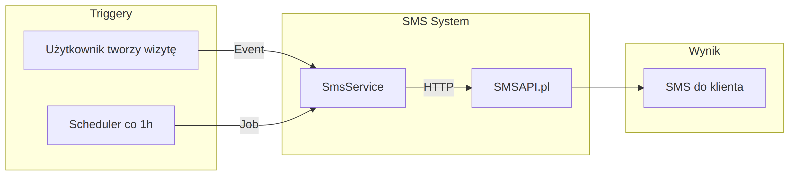
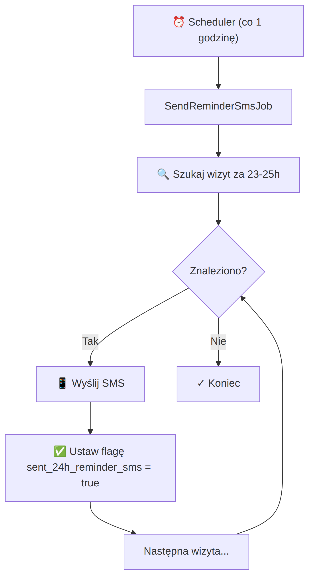
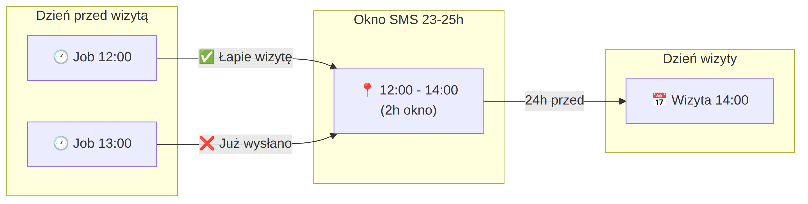
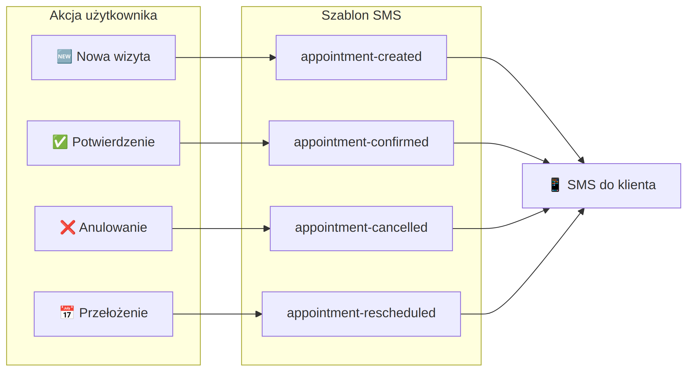
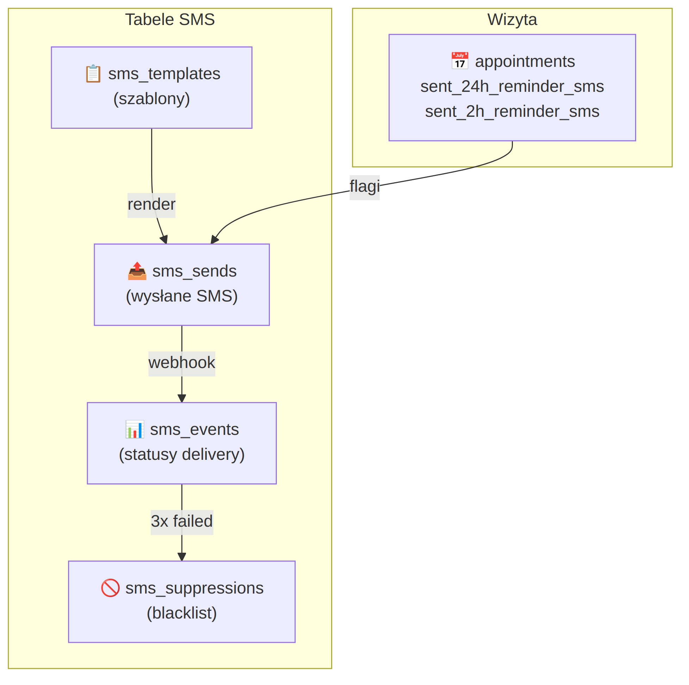

# SMS System - Diagramy

## 1. Przegląd systemu



**Dwa sposoby wysyłki SMS:**
- **Event** - natychmiast po akcji użytkownika (nowa wizyta, potwierdzenie, anulowanie)
- **Job** - scheduler co 1h sprawdza wizyty do przypomnienia

---

## 2. Jak działają przypomnienia 24h



**Kluczowe:**
- Scheduler uruchamia job **co 1 godzinę**
- Query szuka wizyt w oknie **23-25h od teraz**
- Po wysłaniu ustawia flagę `sent_24h_reminder_sms = true`
- Flaga zapobiega duplikatom

---

## 3. Okno czasowe - dlaczego 23-25h?



**Przykład:**
- Wizyta: **jutro 14:00**
- Okno SMS: **dziś 12:00 - 14:00** (2h okno)
- Job o 12:00: **łapie wizytę, wysyła SMS**
- Job o 13:00: **wizyta już ma flagę = true, pomija**

**Dlaczego 2h okno?**
- Job może się opóźnić o kilka minut
- Każda wizyta łapana **dokładnie raz**

---

## 4. Event-driven SMS



| Akcja | Template | Kiedy |
|-------|----------|-------|
| Nowa wizyta | `appointment-created` | Klient tworzy wizytę |
| Potwierdzenie | `appointment-confirmed` | Admin potwierdza |
| Anulowanie | `appointment-cancelled` | Wizyta anulowana |
| Przełożenie | `appointment-rescheduled` | Zmiana daty/godziny |

---

## 5. Tabele w bazie danych



| Tabela | Rola |
|--------|------|
| `sms_templates` | Szablony SMS (treść, zmienne) |
| `sms_sends` | Historia wysłanych SMS |
| `sms_events` | Statusy delivery (webhook) |
| `sms_suppressions` | Blacklist numerów |
| `appointments` | Flagi `sent_*_reminder_sms` |

---

## Quick Reference

### Query dla przypomnienia 24h:

```sql
SELECT * FROM appointments
WHERE status = 'confirmed'
  AND sent_24h_reminder_sms = false
  AND phone IS NOT NULL
  AND appointment_date BETWEEN NOW() + INTERVAL 23 HOUR
                           AND NOW() + INTERVAL 25 HOUR
```

### Scheduler (routes/console.php):

```php
Schedule::job(new SendReminderSmsJob)->hourly();
Schedule::job(new SendFollowUpSmsJob)->hourly();
```

### Settings (sms.*):

| Klucz | Opis |
|-------|------|
| `enabled` | SMS globalnie włączony |
| `test_mode` | Tryb testowy (nie wysyła) |
| `send_reminder_24h` | Włącz przypomnienia 24h |
| `send_reminder_2h` | Włącz przypomnienia 2h |
| `daily_limit` | Limit dzienny (default: 500) |

---

*Wygenerowano: 2026-01-25*
