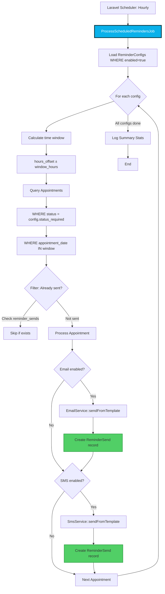
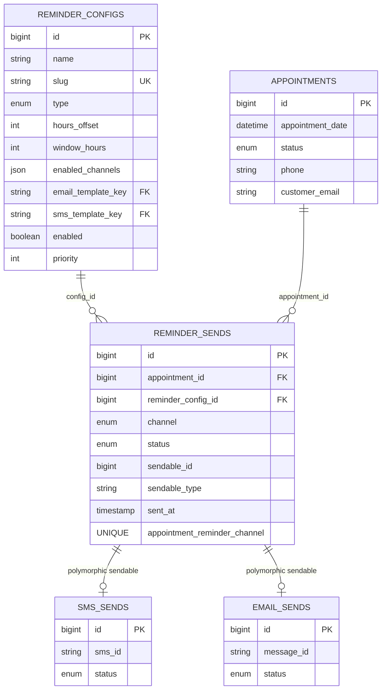

# Current State Analysis - Reminder System
**Data:** 2026-01-25
**Autor:** Claude (Laravel Senior Architect)
**Cel:** Dogłębna analiza obecnego systemu reminderów przed refaktorem

---

## Executive Summary

System reminderów w Registro działa na dwóch równoległych torach:
- **Email reminders** (3 typy: 24h, 2h, follow-up)
- **SMS reminders** (3 typy: 24h, 2h, follow-up)

**Główne problemy:**
1. **Hardcoded timing:** 24h i 2h są zakodowane na stałe w jobsach
2. **Duplikacja logiki:** Identyczna logika w 4 jobsach (2x Email, 2x SMS)
3. **Brak flexibility:** Niemożliwość dodania nowego typu reminderu bez migracji DB
4. **Settings split:** Część ustawień w DB (`settings`), część w kodzie
5. **Flagi w appointments:** 6 flag boolean dla 3 typów reminderów (email + SMS)

---

## 1. Mapa Obecnego Stanu

### 1.1 Jobs Structure

```
app/Jobs/
├── Email/
│   ├── SendReminderEmailsJob.php    → 24h + 2h (w jednym job)
│   └── SendFollowUpEmailsJob.php    → follow-up (osobny job)
└── Sms/
    ├── SendReminderSmsJob.php       → 24h + 2h (w jednym job)
    └── SendFollowUpSmsJob.php       → follow-up (osobny job)
```

**Scheduler (routes/console.php):**
```php
// Email - co godzinę
Schedule::job(new SendReminderEmailsJob)->hourly()
Schedule::job(new SendFollowUpEmailsJob)->hourly()

// SMS - co godzinę
Schedule::job(new SendReminderSmsJob)->hourly()
Schedule::job(new SendFollowUpSmsJob)->hourly()
```

### 1.2 Hardcoded Values

#### 24h Reminder (w 2 jobsach)
```php
// SendReminderSmsJob.php line 114-117
->whereBetween('appointment_date', [
    Carbon::now()->addHours(23),  // ← HARDCODED
    Carbon::now()->addHours(25),  // ← HARDCODED
])

// SendReminderEmailsJob.php line 99-102 - IDENTYCZNY KOD
->whereBetween('appointment_date', [
    Carbon::now()->addHours(23),
    Carbon::now()->addHours(25),
])
```

#### 2h Reminder (w 2 jobsach)
```php
// SendReminderSmsJob.php line 196-199
->whereBetween('appointment_date', [
    Carbon::now()->addHours(1),   // ← HARDCODED
    Carbon::now()->addHours(3),   // ← HARDCODED
])

// SendReminderEmailsJob.php line 181-184 - IDENTYCZNY KOD
->whereBetween('appointment_date', [
    Carbon::now()->addHours(1),
    Carbon::now()->addHours(3),
])
```

#### Follow-up (w 2 jobsach)
```php
// SendFollowUpSmsJob.php line 101-104
->whereBetween('appointment_date', [
    Carbon::now()->subHours(25),  // ← HARDCODED
    Carbon::now()->subHours(23),  // ← HARDCODED
])

// SendFollowUpEmailsJob.php line 83-86 - IDENTYCZNY KOD
->whereBetween('appointment_date', [
    Carbon::now()->subHours(25),
    Carbon::now()->subHours(23),
])
```

**Wzór 2h okna (buffer):**
- 24h reminder → faktyczne okno: 23h-25h (2h buffer)
- 2h reminder → faktyczne okno: 1h-3h (2h buffer)
- Follow-up → faktyczne okno: 23h-25h ago (2h buffer)

### 1.3 Settings w DB (tabela `settings`)

**Grupa: `sms`** (SystemSettings.php line 193-210)
```php
'sms' => [
    'enabled' => ['nullable', 'boolean'],
    'send_booking_confirmation' => ['nullable', 'boolean'],
    'send_admin_confirmation' => ['nullable', 'boolean'],
    'send_reminder_24h' => ['nullable', 'boolean'],  // ← TOGGLE ON/OFF
    'send_reminder_2h' => ['nullable', 'boolean'],   // ← TOGGLE ON/OFF
    'send_follow_up' => ['nullable', 'boolean'],     // ← TOGGLE ON/OFF
    // ... (cost control, limits)
]
```

**Grupa: `email`** (SystemSettings.php line 175-192)
```php
'email' => [
    'reminder_24h_enabled' => ['nullable', 'boolean'],  // ← TOGGLE ON/OFF
    'reminder_2h_enabled' => ['nullable', 'boolean'],   // ← TOGGLE ON/OFF
    'followup_enabled' => ['nullable', 'boolean'],      // ← TOGGLE ON/OFF
    // ... (SMTP config)
]
```

**Problem:** Settings pozwalają tylko włączyć/wyłączyć reminder, NIE zmienić timing (24h → 48h).

### 1.4 Flagi w `appointments` table

**Email flags (migration 2025_11_09_100000):**
```php
$table->boolean('sent_24h_reminder')->default(false)->index();
$table->boolean('sent_2h_reminder')->default(false)->index();
$table->boolean('sent_followup')->default(false)->index();
```

**SMS flags (migration 2025_11_12_000826):**
```php
$table->boolean('sent_24h_reminder_sms')->default(false)->index();
$table->boolean('sent_2h_reminder_sms')->default(false)->index();
$table->boolean('sent_followup_sms')->default(false)->index();
```

**Total: 6 boolean columns** dla 3 typów reminderów × 2 kanały.

**Problem:** Każdy nowy reminder type wymaga:
1. Nowej migracji DB (dodać kolumnę)
2. Zmiany w modelu (`$fillable`)
3. Zmiany w job (query + update flag)
4. Zmiany w settings (nowy toggle)

### 1.5 Duplikacja Logiki

**Identyczny kod w 4 miejscach:**

```php
// 1. SendReminderSmsJob::send24HourReminders() - line 107-184
// 2. SendReminderSmsJob::send2HourReminders() - line 189-266
// 3. SendReminderEmailsJob::send24HourReminders() - line 93-170
// 4. SendReminderEmailsJob::send2HourReminders() - line 175-252

// Wspólna logika:
foreach ($appointments as $appointment) {
    try {
        // 1. Check suppression (SMS) lub suppression (Email)
        // 2. Get customer language
        // 3. Prepare data array
        // 4. Send via service
        // 5. Mark as sent (UPDATE flag)
        // 6. Log success
    } catch (\Exception $e) {
        // Log error
        // Don't mark as sent (retry next hour)
    }
}
```

**Różnice między jobami:**
- SMS: `SmsSuppression::isSuppressed($appointment->phone)`
- Email: `EmailSuppression::isSuppressed($appointment->customer_email)`
- SMS: `SmsService::sendFromTemplate()`
- Email: `EmailService::sendFromTemplate()`
- Inne template keys, inne flagi

**Copy-paste risk:** Bug fix w jednym job nie trafia do pozostałych.

---

## 2. Pain Points - Szczegółowa Analiza

### 2.1 Timing Change = Migration Hell

**Scenariusz:** Klient chce zmienić 24h reminder na 48h.

**Obecny proces:**
1. ❌ Nie można zmienić w panelu admin (brak takiej opcji)
2. ❌ Trzeba zmienić kod w 2 jobsach (`SendReminderSmsJob`, `SendReminderEmailsJob`)
3. ❌ Zmienić flagi w `appointments` table:
   ```sql
   ALTER TABLE appointments RENAME COLUMN sent_24h_reminder TO sent_48h_reminder;
   ALTER TABLE appointments RENAME COLUMN sent_24h_reminder_sms TO sent_48h_reminder_sms;
   ```
4. ❌ Zmienić template keys w DB (`appointment-reminder-24h` → `appointment-reminder-48h`)
5. ❌ Zmienić settings keys (`send_reminder_24h` → `send_reminder_48h`)
6. ❌ Deploy z downtime (migracja DB)

**Ryzyko:** Breaking change dla wszystkich appointmentów w trakcie (flagi zostają puste).

### 2.2 Brak Możliwości Konfiguracji z Panelu

**Co można zmienić w SystemSettings:**
- ✅ Włączyć/wyłączyć reminder
- ✅ SMTP settings
- ✅ SMS gateway settings
- ✅ Spending limits

**Czego NIE można zmienić:**
- ❌ Kiedy wysłać reminder (24h → 48h)
- ❌ Okno tolerancji (23h-25h → 47h-49h)
- ❌ Kolejność reminderów (dodać 3 reminder między 24h a 2h)
- ❌ Warunki wysyłki (np. "tylko jeśli wartość wizyty > 500 PLN")

### 2.3 Dodanie Nowego Typu Reminderu

**Scenariusz:** Klient chce reminder 7 dni przed wizytą (long-term reminder).

**Obecny proces:**
1. **Migration:** Dodać flagę `sent_7d_reminder` + `sent_7d_reminder_sms`
2. **Model:** Dodać do `$fillable` w `Appointment`
3. **Job:** Dodać metodę `send7DayReminders()` w obu jobsach
4. **Settings:** Dodać `send_reminder_7d` w `SystemSettings.php`
5. **Scheduler:** Dodać logikę do `routes/console.php` (lub nie, jeśli w tym samym job)
6. **Templates:** Dodać `appointment-reminder-7d` w DB

**Total effort:** ~6 plików zmienionych, 1 migracja, deploy z testem.

**Ryzyko:** Copy-paste errors między jobami.

### 2.4 Query Performance - N+1 Problem?

**Obecne query w jobsach:**
```php
$appointments = Appointment::query()
    ->with(['customer', 'service'])  // ← Eager loading OK
    ->where('status', 'confirmed')
    ->where('sent_24h_reminder_sms', false)
    ->whereNotNull('phone')
    ->whereBetween('appointment_date', [now()->addHours(23), now()->addHours(25)])
    ->get();
```

**Performance OK** - eager loading zapobiega N+1.

**Problem:** Brak compound index na `(status, sent_24h_reminder_sms, appointment_date)`.

### 2.5 Event System NIE jest Używany dla Reminderów

**Istniejące eventy:**
- `AppointmentReminder24h` (exists but NOT USED by jobs)
- `AppointmentReminder2h` (exists but NOT USED by jobs)
- `AppointmentFollowUp` (exists but NOT USED by jobs)

**AppServiceProvider line 181-199:**
```php
// Event listeners for EMAIL notifications (NOT called by jobs!)
Event::listen(AppointmentReminder24h::class, function ($event) {
    $event->appointment->customer->notify(
        new AppointmentReminder24hNotification($event->appointment)
    );
});
```

**Problem:** Jobs NIE dispatchują eventów, bezpośrednio wywołują service:
```php
// SendReminderSmsJob.php line 152-161
$smsService->sendFromTemplate(
    'appointment-reminder-24h',
    $language,
    $appointment->phone,
    $data
);
```

**Eventy są LEGACY** - prawdopodobnie z poprzedniej implementacji.

---

## 3. Database Structure

### 3.1 Appointments Flags (6 columns)

```sql
-- Email flags
sent_24h_reminder       BOOLEAN DEFAULT false INDEX  -- Created: 2025-11-09
sent_2h_reminder        BOOLEAN DEFAULT false INDEX
sent_followup           BOOLEAN DEFAULT false INDEX

-- SMS flags
sent_24h_reminder_sms   BOOLEAN DEFAULT false INDEX  -- Created: 2025-11-12
sent_2h_reminder_sms    BOOLEAN DEFAULT false INDEX
sent_followup_sms       BOOLEAN DEFAULT false INDEX
```

**Index coverage:**
- ✅ Each flag has index
- ❌ No compound index for scheduler queries (status + flag + date)

**Suggested compound index:**
```sql
CREATE INDEX idx_appointments_24h_reminders
ON appointments(status, sent_24h_reminder, sent_24h_reminder_sms, appointment_date);

CREATE INDEX idx_appointments_2h_reminders
ON appointments(status, sent_2h_reminder, sent_2h_reminder_sms, appointment_date);

CREATE INDEX idx_appointments_followup
ON appointments(status, sent_followup, sent_followup_sms, appointment_date);
```

### 3.2 Settings Table

**Structure:**
```sql
CREATE TABLE settings (
    id BIGINT PRIMARY KEY AUTO_INCREMENT,
    group VARCHAR(255) NOT NULL,
    key VARCHAR(255) NOT NULL,
    value JSON,
    created_at TIMESTAMP,
    updated_at TIMESTAMP,
    UNIQUE KEY unique_group_key (group, key)
);
```

**Example row:**
```json
{
  "group": "sms",
  "key": "send_reminder_24h",
  "value": [true]
}
```

**Problem z rozszerzalnością:**
- Można dodać nowe settings bez migracji (✅)
- Ale logic w jobsach jest hardcoded, więc nowe settings są ignorowane (❌)

### 3.3 SMS/Email Logs

**Tables:**
- `sms_sends` - Logi wysłanych SMS
- `sms_events` - Delivery events (webhook updates)
- `email_sends` - Logi wysłanych emaili (assumed)

**Metadata w sms_sends:**
```json
{
  "appointment_id": 123,
  "reminder_type": "24h"  // lub "2h", "follow-up"
}
```

**Queries możliwe:**
- Ile SMS/Email wysłano dla danego typu reminderu
- Success rate per reminder type
- Cost per reminder type

**Brak:** Direct relacja `appointments` → `sms_sends` (tylko przez metadata JSON).

---

## 4. Settings Management

### 4.1 SettingsManager Service

**Singleton zarejestrowany w AppServiceProvider.php line 59:**
```php
$this->app->singleton(SettingsManager::class);
```

**API:**
```php
$settings = app(SettingsManager::class);

// Get single value
$enabled = $settings->get('sms.enabled', true);

// Get group
$smsSettings = $settings->group('sms');
// ['enabled' => true, 'send_reminder_24h' => true, ...]

// Update single
$settings->set('sms.enabled', false);

// Bulk update
$settings->updateGroups([
    'sms' => ['enabled' => true, 'send_reminder_24h' => false]
]);
```

**Cache:** TTL 1 hour (line 22: `CACHE_TTL = 3600`)

**Problem:** Cache może być stale przy zmianach settings przez admin.

### 4.2 SystemSettings.php (Filament Page)

**Tabs:**
1. Booking
2. Booking Wizard
3. Map
4. Contact
5. Appearance
6. Marketing
7. **Email** (line 715-823) - reminders toggles
8. **SMS** (line 829-948) - reminders toggles
9. CMS
10. Integrations

**SMS Tab - Notification Settings (line 866-889):**
```php
Toggle::make('sms.send_booking_confirmation')
Toggle::make('sms.send_admin_confirmation')
Toggle::make('sms.send_reminder_24h')      // ← NIE MA TIMING CONFIG
Toggle::make('sms.send_reminder_2h')       // ← NIE MA TIMING CONFIG
Toggle::make('sms.send_follow_up')         // ← NIE MA TIMING CONFIG
```

**Missing:**
- TextInput dla timing (hours before appointment)
- TextInput dla window buffer (tolerance)
- Select dla reminder conditions

### 4.3 HasGroupedSettings Trait

**Filament Trait (line 40):**
```php
use HasGroupedSettings;
```

**Metody:**
```php
protected function saveSettingsGroup(string $group): void
{
    // 1. Validate using rules from getSettingsGroups()
    // 2. Extract data for this group
    // 3. Call SettingsManager::updateGroups()
    // 4. Show success notification
}
```

**Per-tab save buttons (line 310-316):**
```php
\Filament\Actions\Action::make('saveBooking')
    ->label('Zapisz ustawienia')
    ->action('saveBookingSettings')
```

---

## 5. Propozycja Refactoru

### 5.1 Nowa Architektura - High Level

```
┌─────────────────────────────────────────────────────────────┐
│                    Reminder Configuration                    │
│                  (DB Table: reminder_configs)                │
│  ┌───────────────────────────────────────────────────────┐  │
│  │ name: "24h Before", timing: 24h, window: 2h           │  │
│  │ name: "2h Before", timing: 2h, window: 2h             │  │
│  │ name: "7d Before", timing: 168h, window: 2h           │  │
│  │ enabled_channels: ["email", "sms"]                    │  │
│  └───────────────────────────────────────────────────────┘  │
└─────────────────────────────────────────────────────────────┘
                              ↓
┌─────────────────────────────────────────────────────────────┐
│              Unified Reminder Job (1 job for all)            │
│  1. Load all reminder_configs WHERE enabled=true            │
│  2. For each config:                                        │
│     - Query appointments in time window                     │
│     - Loop appointments:                                    │
│       - Check if already sent (reminder_sends table)        │
│       - Send via enabled channels (email, sms)              │
│       - Create reminder_send record                         │
└─────────────────────────────────────────────────────────────┘
                              ↓
┌─────────────────────────────────────────────────────────────┐
│                    Reminder Sends Log                        │
│                  (DB Table: reminder_sends)                  │
│  ┌───────────────────────────────────────────────────────┐  │
│  │ appointment_id, reminder_config_id, channel,          │  │
│  │ sent_at, status                                       │  │
│  └───────────────────────────────────────────────────────┘  │
└─────────────────────────────────────────────────────────────┘
```

### 5.2 Tabele do Utworzenia

#### A) `reminder_configs` - Konfiguracja reminderów

```php
Schema::create('reminder_configs', function (Blueprint $table) {
    $table->id();
    $table->string('name');  // "24h Before Appointment"
    $table->string('slug')->unique();  // "24h-before"
    $table->enum('type', ['reminder', 'follow_up']);

    // Timing
    $table->integer('hours_offset');  // 24, 2, -24 (negative = after)
    $table->integer('window_hours')->default(2);  // Tolerance window

    // Channels
    $table->json('enabled_channels');  // ["email", "sms"]

    // Templates
    $table->string('email_template_key')->nullable();
    $table->string('sms_template_key')->nullable();

    // Conditions
    $table->enum('status_required', ['pending', 'confirmed', 'completed'])->default('confirmed');
    $table->decimal('min_appointment_value', 10, 2)->nullable();  // Future: conditional reminders

    // Control
    $table->boolean('enabled')->default(true);
    $table->integer('priority')->default(0);  // Order of execution

    $table->timestamps();
});
```

**Seeded data (replacements):**
```php
[
    ['name' => '24h Before', 'slug' => '24h-before', 'type' => 'reminder',
     'hours_offset' => 24, 'window_hours' => 2,
     'enabled_channels' => ['email', 'sms'],
     'email_template_key' => 'appointment-reminder-24h',
     'sms_template_key' => 'appointment-reminder-24h'],

    ['name' => '2h Before', 'slug' => '2h-before', 'type' => 'reminder',
     'hours_offset' => 2, 'window_hours' => 2,
     'enabled_channels' => ['email', 'sms'],
     'email_template_key' => 'appointment-reminder-2h',
     'sms_template_key' => 'appointment-reminder-2h'],

    ['name' => 'Follow-up 24h After', 'slug' => 'followup-24h', 'type' => 'follow_up',
     'hours_offset' => -24, 'window_hours' => 2,
     'enabled_channels' => ['email', 'sms'],
     'status_required' => 'completed',
     'email_template_key' => 'appointment-followup',
     'sms_template_key' => 'appointment-followup'],
]
```

#### B) `reminder_sends` - Log wysłanych reminderów

```php
Schema::create('reminder_sends', function (Blueprint $table) {
    $table->id();
    $table->foreignId('appointment_id')->constrained()->onDelete('cascade');
    $table->foreignId('reminder_config_id')->constrained()->onDelete('cascade');

    $table->enum('channel', ['email', 'sms']);
    $table->enum('status', ['sent', 'failed', 'skipped']);

    // Polymorphic relation to actual send (SmsSend or EmailSend)
    $table->morphs('sendable');  // sendable_id, sendable_type

    $table->string('skip_reason')->nullable();  // "suppressed", "no_consent", etc.
    $table->timestamp('sent_at')->nullable();

    $table->timestamps();

    // Prevent duplicates
    $table->unique(['appointment_id', 'reminder_config_id', 'channel'], 'unique_reminder_send');

    // Performance indexes
    $table->index(['appointment_id', 'status']);
    $table->index(['reminder_config_id', 'sent_at']);
});
```

**Benefits:**
- Polymorphic: `sendable_type = 'App\Models\SmsSend'` links to `sms_sends.id`
- Unique constraint: Prevents duplicate sends
- Audit: Full history of all reminder attempts

#### C) Drop Old Flags z `appointments`

```php
Schema::table('appointments', function (Blueprint $table) {
    $table->dropColumn([
        'sent_24h_reminder',
        'sent_2h_reminder',
        'sent_followup',
        'sent_24h_reminder_sms',
        'sent_2h_reminder_sms',
        'sent_followup_sms',
    ]);
});
```

**Replacement:** Query `reminder_sends` table instead of flags.

### 5.3 Unified Reminder Job

**Nowy job: `app/Jobs/Reminders/ProcessScheduledRemindersJob.php`**

```php
class ProcessScheduledRemindersJob implements ShouldQueue, ShouldBeUnique
{
    public function handle(
        SmsService $smsService,
        EmailService $emailService,
        SettingsManager $settings
    ): void {
        Log::info('[ProcessScheduledReminders] Starting');

        // 1. Load all active reminder configs
        $configs = ReminderConfig::where('enabled', true)
            ->orderBy('priority')
            ->get();

        foreach ($configs as $config) {
            $this->processReminderConfig($config, $smsService, $emailService);
        }

        Log::info('[ProcessScheduledReminders] Completed');
    }

    private function processReminderConfig(
        ReminderConfig $config,
        SmsService $smsService,
        EmailService $emailService
    ): void {
        // 2. Calculate time window
        $start = now()->addHours($config->hours_offset - $config->window_hours);
        $end = now()->addHours($config->hours_offset + $config->window_hours);

        // 3. Query appointments in window
        $appointments = Appointment::query()
            ->with(['customer', 'service'])
            ->where('status', $config->status_required)
            ->whereBetween('appointment_date', [$start, $end])
            ->get();

        // 4. Filter already sent (via reminder_sends)
        $appointments = $appointments->reject(function ($appointment) use ($config) {
            return ReminderSend::where('appointment_id', $appointment->id)
                ->where('reminder_config_id', $config->id)
                ->exists();
        });

        // 5. Send via enabled channels
        foreach ($appointments as $appointment) {
            if (in_array('email', $config->enabled_channels)) {
                $this->sendEmail($appointment, $config, $emailService);
            }

            if (in_array('sms', $config->enabled_channels)) {
                $this->sendSms($appointment, $config, $smsService);
            }
        }
    }

    private function sendEmail(...) { /* deleguj do EmailService */ }
    private function sendSms(...) { /* deleguj do SmsService */ }
}
```

**Scheduler:**
```php
// routes/console.php
Schedule::job(new ProcessScheduledRemindersJob)
    ->hourly()
    ->withoutOverlapping()
    ->onOneServer();
```

**Efekt:** 1 job zamiast 4, automatyczne wsparcie dla nowych typów reminderów.

### 5.4 Filament Resource: ReminderConfigResource

**Admin może:**
- ✅ Dodać nowy reminder (np. "7 days before")
- ✅ Zmienić timing (24h → 48h) BEZ migracji
- ✅ Włączyć/wyłączyć kanał (tylko SMS, tylko Email)
- ✅ Zmienić template dla reminderu
- ✅ Zmienić priority (kolejność execution)

**Form:**
```php
TextInput::make('name')->required()
TextInput::make('slug')->required()->unique()
Select::make('type')->options(['reminder' => 'Before Appointment', 'follow_up' => 'After Appointment'])

TextInput::make('hours_offset')
    ->label('Hours Before/After Appointment')
    ->numeric()
    ->required()
    ->helperText('Positive = before, Negative = after (e.g., -24 for follow-up)')

TextInput::make('window_hours')
    ->label('Tolerance Window (hours)')
    ->numeric()
    ->default(2)
    ->helperText('Scheduler will catch appointments in ±window')

CheckboxList::make('enabled_channels')
    ->options(['email' => 'Email', 'sms' => 'SMS'])

Select::make('email_template_key')->options(EmailTemplate::pluck('name', 'key'))
Select::make('sms_template_key')->options(SmsTemplate::pluck('name', 'key'))

Toggle::make('enabled')
```

**Table:**
```php
TextColumn::make('name')
TextColumn::make('hours_offset')->label('Timing')->suffix('h')
BadgeColumn::make('enabled_channels')
BooleanColumn::make('enabled')
```

### 5.5 Migration Path (Backwards Compatibility)

**Krok 1: Dodaj nowe tabele** (NIE usuwaj starych flag)
```php
// 2026_01_25_000001_create_reminder_configs_table.php
// 2026_01_25_000002_create_reminder_sends_table.php
```

**Krok 2: Seed `reminder_configs`** z obecnymi wartościami (24h, 2h, follow-up)

**Krok 3: Deploy nowego job** (stare joby nadal działają równolegle)

**Krok 4: Migracja danych** - create `reminder_sends` z istniejących flag
```php
// Script:
Appointment::chunk(1000, function ($appointments) {
    foreach ($appointments as $appointment) {
        if ($appointment->sent_24h_reminder) {
            ReminderSend::create([
                'appointment_id' => $appointment->id,
                'reminder_config_id' => 1, // 24h config
                'channel' => 'email',
                'status' => 'sent',
                'sent_at' => $appointment->updated_at, // best guess
            ]);
        }
        // repeat for all 6 flags
    }
});
```

**Krok 5: Wyłącz stare joby** w scheduler (comment out)

**Krok 6: Po 2 tygodniach:** Drop stare kolumny (`sent_*_reminder*`)

---

## 6. Diagram Proponowanej Architektury

### 6.1 Flow Chart



### 6.2 Database Relations



### 6.3 Filament Admin UI - Reminder Config

```
┌────────────────────────────────────────────────────────────┐
│ Reminders Configuration                    [+ Create New]   │
├────────────────────────────────────────────────────────────┤
│ Name              │ Timing │ Channels    │ Enabled │ Edit │
├───────────────────┼────────┼─────────────┼─────────┼──────┤
│ 24h Before        │ 24h    │ Email, SMS  │ ✓       │ ✏️   │
│ 2h Before         │ 2h     │ Email, SMS  │ ✓       │ ✏️   │
│ Follow-up 24h     │ -24h   │ Email, SMS  │ ✓       │ ✏️   │
│ 7d Early Reminder │ 168h   │ Email       │ ✗       │ ✏️   │
└────────────────────────────────────────────────────────────┘

[Edit Form]
┌────────────────────────────────────────────────────────────┐
│ Reminder Configuration: 24h Before                          │
├────────────────────────────────────────────────────────────┤
│ Name:              [24h Before Appointment            ]     │
│ Slug:              [24h-before                        ]     │
│ Type:              [ Reminder ▼ ]                           │
│ Hours Offset:      [24]  (positive = before)               │
│ Window Hours:      [2]   (tolerance buffer)                │
│                                                             │
│ Enabled Channels:  [✓] Email   [✓] SMS                     │
│                                                             │
│ Email Template:    [appointment-reminder-24h ▼]            │
│ SMS Template:      [appointment-reminder-24h ▼]            │
│                                                             │
│ Status Required:   [confirmed ▼]                           │
│ Priority:          [0]                                      │
│                                                             │
│ Enabled:           [✓] Active                              │
│                                                             │
│                    [Save]  [Cancel]                         │
└────────────────────────────────────────────────────────────┘
```

---

## 7. Benefits Podsumowanie

### 7.1 Rozwiązane Problemy

| Problem | Obecny Stan | Po Refactorze |
|---------|-------------|---------------|
| **Hardcoded timing** | 24h/2h w kodzie | Konfigurowalne w DB |
| **Duplikacja logiki** | 4 joby × 200 linii | 1 job × ~150 linii |
| **Dodanie reminderu** | 6 plików + migracja | Formularz w Filament |
| **Zmiana timing** | Deploy + migracja | Edycja w panelu |
| **Flagi w appointments** | 6 kolumn boolean | 0 kolumn (uses joins) |
| **Brak audytu** | Tylko flaga sent=true | Full log w reminder_sends |
| **Settings split** | DB + kod | Wszystko w DB |

### 7.2 Metryki

**Przed:**
- 4 joby
- 6 flag w appointments
- ~800 linii kodu (4 × ~200)
- Zmiana timing = deployment + migracja

**Po:**
- 1 job
- 0 flag w appointments (replaced by joins)
- ~150 linii kodu w job + ~100 w service
- Zmiana timing = click w panelu

**Code reduction:** ~75%

### 7.3 Flexibility Gains

**Nowe możliwości bez zmiany kodu:**
1. ✅ Reminder 7 dni przed (early bird)
2. ✅ Reminder 12h przed (mid-point)
3. ✅ Follow-up 3 dni po (delayed)
4. ✅ Conditional reminders (tylko SMS dla wysokich wartości)
5. ✅ A/B testing różnych timingów
6. ✅ Temporary disable reminderu bez zmiany kodu

---

## 8. Migration Checklist

### Phase 1: Foundation (Week 1)
- [ ] Create `reminder_configs` migration
- [ ] Create `reminder_sends` migration
- [ ] Create `ReminderConfig` model + factory + seeder
- [ ] Create `ReminderSend` model
- [ ] Seed default configs (24h, 2h, follow-up)
- [ ] Unit tests dla modeli

### Phase 2: Job Refactor (Week 2)
- [ ] Create `ProcessScheduledRemindersJob`
- [ ] Implement unified logic
- [ ] Add to scheduler (parallel z starymi jobami)
- [ ] Integration tests
- [ ] Compare output (stary job vs nowy job)

### Phase 3: Filament Admin (Week 2)
- [ ] Create `ReminderConfigResource`
- [ ] Create `ReminderSendResource` (read-only logs)
- [ ] Add validation rules
- [ ] Add help text / tooltips
- [ ] Admin tests (Pest Filament)

### Phase 4: Data Migration (Week 3)
- [ ] Script: migrate flags → reminder_sends
- [ ] Dry-run na staging
- [ ] Verify no data loss
- [ ] Deploy to staging
- [ ] Monitor for 1 week

### Phase 5: Deprecation (Week 4)
- [ ] Disable old jobs in scheduler
- [ ] Monitor logs for errors
- [ ] After 2 weeks: drop old flags
- [ ] Update documentation
- [ ] Release notes

---

## 9. Risks & Mitigation

### Risk 1: Zmiana Query Performance

**Concern:** Join z `reminder_sends` może być wolniejszy niż flaga boolean.

**Mitigation:**
- Add compound indexes na `reminder_sends(appointment_id, reminder_config_id, channel)`
- Use `whereNotExists()` subquery zamiast left join
- Benchmark: 1000 appointments × 3 reminders = 3000 rows w reminder_sends
- Expected: <100ms query time

### Risk 2: Backwards Compatibility

**Concern:** Stary kod może polegać na flagach `sent_24h_reminder`.

**Mitigation:**
- Keep flags na produkcji przez 2 tygodnie po deploy
- Add deprecation notice w modelu
- Search codebase: `grep -r "sent_24h_reminder" app/`
- Add migration script który backfills flagi z reminder_sends (fallback)

### Risk 3: Admin UX Complexity

**Concern:** Reminder config może być za trudne dla nie-technicznego admina.

**Mitigation:**
- Add tooltips/helperText w Filament
- Add validation (prevent negative window_hours)
- Add presets: "Daily Reminder", "Week Before", etc.
- Add dry-run button "Preview affected appointments"

### Risk 4: Scheduler Missed Run

**Concern:** Jeśli scheduler skip hour, reminders nie zostaną wysłane.

**Mitigation:**
- Window buffer (2h) daje 2 szanse na catch
- Add monitoring: alert jeśli job nie run przez >2h
- Add manual trigger button w Filament
- Consider: queue job instead of schedule (more resilient)

---

## 10. Next Steps

1. **Przegląd z zespołem:** Zaakceptować architekturę
2. **Ticket breakdown:** Create JIRA/ClickUp tasks
3. **Prototype:** Build ReminderConfig model + seeder
4. **Test deploy na staging:** Parallel run old + new jobs
5. **Metrics:** Compare SMS/Email sent counts old vs new
6. **Full rollout:** Production deployment
7. **Documentation:** Update architecture.md

---

## Appendix A: Code Examples

### A.1 Unified Job - Full Code

```php
<?php

declare(strict_types=1);

namespace App\Jobs\Reminders;

use App\Models\Appointment;
use App\Models\ReminderConfig;
use App\Models\ReminderSend;
use App\Services\Email\EmailService;
use App\Services\Sms\SmsService;
use App\Support\Settings\SettingsManager;
use Illuminate\Bus\Queueable;
use Illuminate\Contracts\Queue\ShouldBeUnique;
use Illuminate\Contracts\Queue\ShouldQueue;
use Illuminate\Foundation\Bus\Dispatchable;
use Illuminate\Queue\InteractsWithQueue;
use Illuminate\Queue\SerializesModels;
use Illuminate\Support\Facades\Log;

class ProcessScheduledRemindersJob implements ShouldQueue, ShouldBeUnique
{
    use Dispatchable, InteractsWithQueue, Queueable, SerializesModels;

    public int $tries = 3;
    public int $timeout = 600; // 10 minutes

    public function __construct()
    {
        $this->onQueue('reminders');
    }

    public function uniqueId(): string
    {
        return 'process-scheduled-reminders:'.now()->format('Y-m-d-H');
    }

    public function handle(
        SmsService $smsService,
        EmailService $emailService,
        SettingsManager $settings
    ): void {
        Log::info('[ProcessScheduledReminders] Starting');

        $configs = ReminderConfig::where('enabled', true)
            ->orderBy('priority')
            ->get();

        $stats = [];

        foreach ($configs as $config) {
            $configStats = $this->processReminderConfig($config, $smsService, $emailService);
            $stats[$config->slug] = $configStats;
        }

        Log::info('[ProcessScheduledReminders] Completed', $stats);
    }

    private function processReminderConfig(
        ReminderConfig $config,
        SmsService $smsService,
        EmailService $emailService
    ): array {
        $stats = ['email_sent' => 0, 'sms_sent' => 0, 'skipped' => 0, 'failed' => 0];

        // Calculate time window
        $start = $config->hours_offset > 0
            ? now()->addHours($config->hours_offset - $config->window_hours)
            : now()->subHours(abs($config->hours_offset) + $config->window_hours);

        $end = $config->hours_offset > 0
            ? now()->addHours($config->hours_offset + $config->window_hours)
            : now()->subHours(abs($config->hours_offset) - $config->window_hours);

        // Query appointments in window
        $appointments = Appointment::query()
            ->with(['customer', 'service'])
            ->where('status', $config->status_required)
            ->whereBetween('appointment_date', [$start, $end])
            ->whereDoesntHave('reminderSends', function ($query) use ($config) {
                $query->where('reminder_config_id', $config->id);
            })
            ->get();

        Log::info("[ProcessScheduledReminders] Config: {$config->slug}, Found: {$appointments->count()}");

        foreach ($appointments as $appointment) {
            // Email channel
            if (in_array('email', $config->enabled_channels)) {
                try {
                    $this->sendEmail($appointment, $config, $emailService);
                    $stats['email_sent']++;
                } catch (\Exception $e) {
                    $stats['failed']++;
                    Log::error("[ProcessScheduledReminders] Email failed", [
                        'appointment_id' => $appointment->id,
                        'config' => $config->slug,
                        'error' => $e->getMessage(),
                    ]);
                }
            }

            // SMS channel
            if (in_array('sms', $config->enabled_channels)) {
                try {
                    $this->sendSms($appointment, $config, $smsService);
                    $stats['sms_sent']++;
                } catch (\Exception $e) {
                    $stats['failed']++;
                    Log::error("[ProcessScheduledReminders] SMS failed", [
                        'appointment_id' => $appointment->id,
                        'config' => $config->slug,
                        'error' => $e->getMessage(),
                    ]);
                }
            }
        }

        return $stats;
    }

    private function sendEmail(
        Appointment $appointment,
        ReminderConfig $config,
        EmailService $emailService
    ): void {
        $language = $appointment->customer?->preferred_language ?? 'pl';

        $data = [
            'customer_name' => $appointment->customer_name,
            'appointment_date' => $appointment->appointment_date->format('Y-m-d'),
            'appointment_time' => $appointment->start_time->format('H:i'),
            'service_name' => $appointment->service?->name ?? 'N/A',
            'location_address' => $appointment->formatted_location,
            'app_name' => config('app.name'),
        ];

        $emailSend = $emailService->sendFromTemplate(
            $config->email_template_key,
            $language,
            $appointment->customer_email,
            $data,
            ['appointment_id' => $appointment->id, 'reminder_type' => $config->slug]
        );

        ReminderSend::create([
            'appointment_id' => $appointment->id,
            'reminder_config_id' => $config->id,
            'channel' => 'email',
            'status' => 'sent',
            'sendable_id' => $emailSend->id,
            'sendable_type' => get_class($emailSend),
            'sent_at' => now(),
        ]);
    }

    private function sendSms(
        Appointment $appointment,
        ReminderConfig $config,
        SmsService $smsService
    ): void {
        $language = $appointment->customer?->preferred_language ?? 'pl';

        $data = [
            'customer_name' => trim($appointment->first_name.' '.$appointment->last_name),
            'appointment_date' => $appointment->appointment_date->format('Y-m-d'),
            'appointment_time' => $appointment->start_time->format('H:i'),
            'service_name' => $appointment->service?->name ?? 'N/A',
            'location_address' => $appointment->formatted_location ?? '',
            'app_name' => config('app.name'),
        ];

        $smsSend = $smsService->sendFromTemplate(
            $config->sms_template_key,
            $language,
            $appointment->phone,
            $data,
            ['appointment_id' => $appointment->id, 'reminder_type' => $config->slug]
        );

        ReminderSend::create([
            'appointment_id' => $appointment->id,
            'reminder_config_id' => $config->id,
            'channel' => 'sms',
            'status' => 'sent',
            'sendable_id' => $smsSend->id,
            'sendable_type' => get_class($smsSend),
            'sent_at' => now(),
        ]);
    }
}
```

---

**Koniec analizy. Ten dokument jest podstawą do zaplanowania refactoru.**
